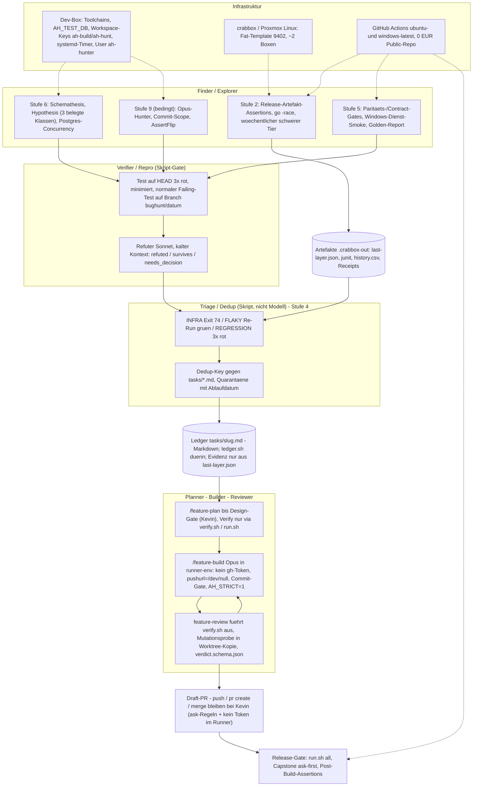

# Autonomes Testen und Bug-Hunting — Roadmap in zehn Stufen

Stand 2026-09-07. Ergebnis einer Analyse des bestehenden Autonomie-Systems
(`AUTONOMOUS.md`, Skills, Ledger, Lanes, `run.sh`, crabbox-Skripte), einer Web-Recherche
(Claude-Code-Plattform, Agent-Harnesses, Testtechniken je Stack, GUI-Automation für
Tauri/Windows, autonome Bug-Hunting-Systeme, Kosten und Guardrails) und eines Entwurfs,
der durch vier Architekten-Linsen, drei Richter, drei Skeptiker (65 Einwände, davon 7
Blocker) und einen Vollständigkeits-Check gelaufen ist. Rückgrat ist die Linse „Ökonomie
und Sicherheit zuerst", ergänzt um Bug-Ausbeute (Paritäts-Invarianten, Beweis-Konvention,
Wochentakt), Autonomie (Runner, Exit 74, Triage-Regeln, Draft-PR-Cap) und Plattform-Realität
(windows-latest-Jobs, MSI-Silent-Install, Golden-Report). Alle Pfade und Zeilen wurden im
Checkout geprüft; Neues ist als **(neu)** markiert; was in der Recherche nicht belegt ist,
heißt **unverifiziert**. Abschnitt 12 listet jeden Kritikpunkt mit Reaktion.

**Das ist ein Plan, kein Ledger.** Es entsteht kein Code und kein Branch. Jede Stufe wird
bei Freigabe über `/feature-plan` zu Spec + Ledger (`tasks/<slug>.md`) und läuft dann durch
den bestehenden `/feature-build`-Zyklus. Die Stufen sind so geschnitten, dass sie einzeln
messbar sind und Stufe 1 in zwei Tagen steht.

## Kurzfassung

Drei Wiederholungstäter-Klassen (stiller Erfolg, Kopie driftet, getestetes Artefakt ≠
ausgeliefertes) und die sechs release-blockierenden Defekte des 0.43.x/0.44.0-Fensters
wurden alle durch **Ausführung** gefunden, keiner durch statische LLM-Review. Deshalb
kommt Ausführung zuerst (Stufen 1–2, 0 € laufend), dann die Gates, die einen autonomen
Lauf technisch ehrlich machen (3–4), dann kostenlose Orakel (5–6), erst danach ein Reviewer,
der selbst ausführt (7), ein Headless-Runner (8) und — bedingt, mit Cap — der LLM-Hunter,
ein Ideen-Modus und ein GUI-Explorer (9). Windows läuft über GitHub `windows-latest`
(Go-Agent ab Stufe 1, Dienst ab 5b, WebView2-GUI ab 10); die Proxmox-Windows-VM bleibt
zurückgestellt, bis windows-latest eine Cross-Host-Lücke belegt.

| Stufe | Inhalt | Liefert | Bau | Laufend/Monat |
|---|---|---|---|---|
| 1 | Grün heißt Beweis: SKIP-Härtung (`AH_STRICT`), `verify.sh`, erster Windows-Go-Lauf, Doku-Drift | Guardrails · Plattform | 2 Tage | 0 € |
| 2 | Ausführung zuerst: Release-Artefakt-Assertionen, Versions-Check, `-race`, wöchentlicher schwerer Tier mit allen 25 Desktop-Specs und Upgrade-Pfad | Bugs · Plattform | 3–4 Tage | 0 €, 12–15 VM-h |
| 3 | Deterministische Gates: Credential-Scoping, `ask`-Regeln, Commit-Gate mit Evidenz-Artefakt, Harness-Schutz, Kill-Switch | Guardrails | 2–3 Tage | 0 € |
| 4 | Verdikte: JUnit nur mit Konsument, Beweis-Konvention, FLAKY/REGRESSION-Klassifikation, Quarantäne, Playwright live | Autonomie · Guardrails | 2–3 Tage | 0 € |
| 5 | Kostenlose CI-Gates: Paritäts-/Contract-Tests, OpenAPI-Snapshot, IPC-Inventar, Windows-Dienst-Smoke, Golden-Report | Bugs · Plattform | 4–5 Tage | 0 € |
| 6 | Generatoren mit Ausführungs-Orakel: Schemathesis, Hypothesis (3 belegte Klassen), Postgres-Concurrency, pytest-alembic | Bugs | 3 Tage | 0 € |
| 7 | Reviewer, der ausführt: JSON-Verdict, Worktree-Mutationsprobe, `harness_eval` | Guardrails · Autonomie | 4–5 Tage | 60–120 $ |
| 8 | Headless-Runner-Basis: `ledger-loop.sh`, Budget-/Stall-/Wall-Clock-Caps, Boundary-Regel | Autonomie | 1–2 Tage | 5–6 $/Task |
| 9 | Bug-Hunt-Pilot, Ideen-Modus, GUI-Explorer — bedingt, Cap 3 Funde/Nacht | Bugs · Ideen | 3 Tage | 150–300 $ |
| 10 | Windows-GUI-Smoke auf windows-latest, Release-Gate-Härtung | Plattform · Guardrails | 3–4 Tage | 0 € |

Kalender: mindestens drei Monate bis Stufe 10, weil Kevin der Serialisierungspunkt ist
(Design-Gate, PR-Review, Triage) — Abschnitt 6.
---

## 1. Ausgangslage

1. Der Ledger-Loop existiert und liefert: `AUTONOMOUS.md`, `.claude/skills/{feature-plan,feature-build,feature-review,test}/SKILL.md`, `tasks/*.md` (5 Ledger durch, 7 PRs gemergt, kein Revert), `scripts/dev/lane.sh` (Worktree + Pond), `scripts/tests/run.sh` (dep-gated, Exit 75 = SKIP), `scripts/tests/crabbox_{warm,iter,reap,multibox}.sh` (Warm-Loop ~3,5 min/Iteration).
2. Grün lügt still — an vier Stellen, präzise: (a) alle 7 `scripts/tests/desktop_e2e_*.sh` beenden mit `exit 0`, **aber nur** wenn `e2e_require` (lib_e2e_stack.sh:44–52, exitet selbst korrekt mit 75) erfüllt ist und danach `cargo tauri` fehlt (`desktop_e2e_live.sh:33–34`); der Fall ist auf crabbox real, weil `crabbox_bootstrap.sh:122–123` `cargo install tauri-cli … || true` schreibt; (b) `scripts/tests/agent_install_test.sh:28–36` exit 0; (c) `run.sh:108` findet `ruff` nur im PATH (Ledger `tasks/code-review-fixes.md` T6, fremde Session) und `run.sh:142` kennt `AH_TEST_DB` nicht; (d) pytest-interne `skipif` (`apps/server/tests/test_stream_redis.py:30`, `apps/monitoring/tests/test_migrations_smoke.py:21`, `apps/ca-issuer/tests/test_db_token_store.py:100`) laufen als „passed" durch — genau die Tests für Redis-Fan-out, Migrationskette und Nebenläufigkeit, die im 0.44.0-Fenster fehlten. `crabbox_multibox.sh:250` kennt kein `skipped`.
3. Kein maschinenlesbares Verdikt: 0 JUnit-Produzenten (`apps/desktop/e2e/wdio.conf.js:67` `reporters: ['spec']`), `crabbox results/receipt` damit ungenutzt; `tasks/test-infra-capstone-release.md` A4/A6 behaupten JUnit als `[x]`.
4. Keine deterministischen Gates: `.claude/settings.json` hat nur `permissions` (`ask`/`deny` leer), `Bash(git checkout:*)` (Z. 37) und `Bash(git stash:*)` (Z. 43) sind allowlisted, `feature-build/SKILL.md:66` empfiehlt `git checkout -- <datei>` (dreimal verlorener Fix, Memory `revert-check-never-git-checkout`). Schwerer: jeder autonome Lauf erbt Kevins gh-Keyring-Token (Scopes repo+workflow) und die https-Remote — jeder Subprozess eines allowlisteten `pytest`/`go test`/`npm run` kann pushen und PRs anlegen; kein Hook sieht das. Die heutige Verify-Konvention (`source .devenv.sh && cd … && .venv/bin/python -m pytest`) matcht unter Compound-Command-Matching ([Q63]: jede Teil-Kommando muss einzeln einer Regel entsprechen) keine Allow-Regel.
5. Bug-Entdeckung ist ein Einmal-Ereignis: `audit.yml` war 9× in Folge rot ohne Konsumenten (2026-07-13 bis 08-31; nach dem Dependency-Refresh am 03.09. einmal grün, am 07.09. wieder rot), 2 von 8 Merkern wurden Release-Defekte (`docs/features/merker-cleanup.md`), der End-Review findet pro Build 9–15 Funde, die der Task-Review durchließ.
6. Alle 6 release-blockierenden Defekte im 0.43.x/0.44.0-Fenster (zstd `c7506ed`, glibc `4120005`→`a2dd823`, restore-Rechte `56d7cbf`, SSRF-ping `f7c1ee1`→`8c82b55`, HOOK_EVENTS `eef3844`, Doku-Modell) kamen aus Ausführung oder Merkern, keiner aus statischer Review. 4 davon hätte der schwere Tier gefangen, 3 die Artefakt-Assertionen — beides braucht weder Hooks noch JUnit noch Ledger-Skripte.
7. Drei Wiederholungstäter-Klassen: „stiller Erfolg" (≥8×), „Kopie driftet" (≥12×), „getestetes Artefakt ≠ ausgeliefertes" (3×). Prototypen existieren: `apps/server/tests/test_event_whitelist.py`, `test_route_auth_gate.py` (Nicht-Leer-Guard Z. 139), CI-Job `frp-consistency`.
8. Generatoren fehlen komplett (0 Vorkommen hypothesis/schemathesis/proptest/fast-check/`func Fuzz`); kein `go test -race` in `.github/workflows/ci.yml`. Historisch belegte Bug-Klassen mit Property-Eignung sind genau drei: FRP-TOML-Injection, Line-Protocol-Escaping, SSRF-URL-Klassifikation.
9. Windows: `rust-windows` fährt `cargo test --locked` auf windows-latest; der Go-Agent wird nur `GOOS=windows go vet` (`ci.yml:190`) + cross-compiled (`ci.yml:199`); `services_windows_test.go` (ein Regex-Test) wird nie ausgeführt; `apply_test.go:76–80` und `enroll_test.go:133` assertieren `0o600/0o644`-Perms, die Go unter Windows nie liefert; `release.yml:159` baut das MSI `continue-on-error`. Doku-Drift: `docs/developer/cicd.html` DE+EN „cargo check auf Windows", `DEVELOPMENT.md:389` nennt einen CI-Job `desktop-e2e`, den es nicht gibt. windows-latest-Runner laufen laut GitHub-Doku als Administrator mit deaktiviertem UAC [Q65] — Dienst-Installation ist also möglich.
10. Infrastruktur: Dev-Box ohne Docker/Display (`.devenv.sh` exportiert `AH_TEST_DB`); crabbox 0.50.0 Provider proxmox = `targets: linux`, Fat-Template 9402, ~2 beast-Boxen; Stand 07.09. 15:40 laufen zwei Boxen (`ah-srv` VMID 101, `ah-desktop-70c1` VMID 102, beide `keep=true`, Template 9402) — sie gehören der parallel laufenden Session zu PR #8 (`feature/dependency-refresh`, `Status: blockiert`, E2E-Gate rot) und wurden nicht angefasst; der Haupt-Checkout stand während dieser Analyse auf `feature/dependency-refresh`, nicht auf `main`. Zuordnung wird **bei Start jeder Stufe** per `crabbox list` geprüft; `crabbox_warm.sh` hat TTL/Idle fest verdrahtet (8h/4h); GitHub Actions ubuntu-/windows-latest kostenlos (Public-Repo).

---

## 2. Leitprinzipien

1. **Fund = fehlschlagender Test auf HEAD.** Ein Kandidat ohne Test, der auf HEAD dreimal identisch rot ist, wird nie Ledger-Task — nur Quarantäne oder `[?]`. Der Beweis ist ein **normal fehlschlagender Test auf einem nie zu mergenden Branch** `bughunt/<datum>`; die Fix-Task verifiziert per `git cherry-pick <sha>` → Test grün. Keine Marker-Gymnastik (xfail/`t.Skipf`/`#[ignore]`) — die kollidiert mit den Skip-Gates und liefert in Go/Rust kein XPASS-Signal. Mutanten-Überlebende und Lint-Funde sind eine eigene Kategorie „Testlücke" (`[?]`, Dedup-Präfix `gap:`), keine Bug-Tasks (Refute-or-Promote [Q22], curl-Bounty [Q23]).
2. **SKIP ≠ grün — auch innerhalb von pytest.** Im autonomen Pfad (`AH_STRICT=1`) ist ein nicht ausführbarer Pflicht-Schritt **und** ein übersprungener Pflicht-Test ein FAIL; jede Stufe endet mit einer Summary-Zeile als Evidenz, nie mit einer Behauptung.
3. **Gates sind Credentials und Artefakte, nicht String-Matches.** Push/PR/Bake bleiben bei Kevin, weil der Runner **kein Token** hat (eigenes HOME ohne gh-Login, `pushurl=/dev/null`) und weil `permissions.ask`-Regeln dokumentiert subcommand-, subshell- und substitutionsbewusst sind [Q63]; ein `[x]` existiert nur mit einem von `run.sh` geschriebenen Ergebnis-Artefakt, dessen Tree-Hash zum aktuellen Stand passt. PostToolUse-Hooks blocken nichts (Hooks-Doku [Q3]) und zählen deshalb nicht als Gate.
4. **Ausführung vor Guardrail-Tooling, kostenlose Orakel vor Tokens.** Die Release-Assertionen und der wöchentliche schwere Tier (Stufe 2) laufen, bevor Hooks/JUnit/Ledger-Skripte gebaut werden — sie sind das, was die 0.44.0-Defekte gefangen hätte. Paritäts-Tests, `-race`, Schemathesis, Hypothesis laufen für 0 € mit eingebautem Minimal-Repro; der LLM-Hunter kommt zuletzt und nur gegen eine gemessene Lücke (Buttercup 90 % Präzision ohne Reasoning-Modell [Q26]).
5. **Kevin nur am Design-Gate und am Merge — mit ehrlicher Stundenzahl.** Kein Auto-Publish, kein Auto-Fix, kein Gate-Skip; Cap 3 Funde/Nacht (2 Nächte/Woche) und Draft-PR-Cap 5 als harte Stop-Bedingung auch für den Bauprozess selbst, weil Fix-Kapazität der Engpass ist (Glasswing [Q25], AIxCC-SoK 45,6 % falsche Auto-Patches [Q24]). Realistisch 5–8 h/Woche in Bauwochen, 3–5 h danach (Abschnitt 6).
6. **Budget-Kill-Switch zweistufig, Automation nie auf dem Max-Plan.** `--max-budget-usd`/`--max-turns` pro Lauf und je ein Console-Workspace („ah-build", „ah-hunt") mit Spend-Limit (harter 400/429-Stopp [Q13]); `total_cost_usd` ins Ledger nur aus API-Key-Läufen. Kein OTel-Collector im Produkt-Stack. Kein API-Key auf ephemeren VMs, kein Homelab-Token beim Hunter.
7. **Kein neues Signal ohne Konsumenten am Tag 1.** Jede neue Prüfung ist Gate (mit Ausnahmeliste ≤ 5) oder schreibt Ledger-Tasks; Report-only ohne definierten Leser wiederholt den `audit.yml`-Fehler (9× rot).
8. **Erweitern, nicht ersetzen — YAGNI.** Markdown-Ledger bleibt handeditierbar (kein JSON-Renderer, kein Lock), Skills/Lanes/run.sh/Warm-Loop bleiben die Basis; jede Stufe ist einzeln messbar; Stufen nach 10 nur mit Nachweis aus den Metriken.

---

## 3. Ziel-Architektur

**Rollen.** *Finder/Explorer* erzeugen Kandidaten: Release-Artefakt-Assertionen und der wöchentliche schwere Tier (Stufe 2, klassifiziert ab Stufe 4), Paritäts-/Contract-Gates und Windows-Laufzeit (Stufe 5), deterministische Generatoren (Stufe 6) und — bedingt, zuletzt — der Opus-Hunter mit Commit-Scope (Stufe 9). *Verifier/Repro* ist ein Skript-Gate: nur ein auf HEAD reproduzierbar roter Test passiert; bei LLM-Kandidaten prüft zusätzlich ein kalter Sonnet-Refuter. *Triage/Dedup* ist Skript: Exit 74 = INFRA, Re-Run grün = FLAKY (Quarantäne mit Ablaufdatum), 3× rot = REGRESSION; Dedup-Key gegen alle `tasks/*.md`. Das *Ledger* (`tasks/<slug>.md`) bleibt handeditierbares Markdown; ein dünnes `scripts/dev/ledger.sh` (grep/sed) setzt `[x]` nur gegen das Ergebnis-Artefakt `last-<layer>.json` und schreibt den Marker der aktiven Task. *Planner* = `/feature-plan` bis zum Design-Gate (Kevin), Verify-Zeilen nur in Wrapper-Form. *Builder* = `/feature-build` auf Opus in einer credential-gescopten Runner-Umgebung, unter Commit-Gate und `AH_STRICT=1`; headless optional über einen dünnen `ledger-loop.sh`. *Reviewer* = `feature-review` als Subagent, der das `Verify:` selbst ausführt, die Mutationsprobe in einer Worktree-Kopie fährt und ein JSON-Verdict liefert; Qualität gemessen mit `harness_eval` (4 Logik-Seeds). *Release-Gate* = `run.sh all` + Capstone (ask-first) + Post-Build-Artefakt-Assertionen; Kevin taggt und publiziert.

**Datenflüsse.** `run.sh` schreibt pro Lauf `$AH_OUT_DIR/last-<layer>.json` (HEAD, Tree-Hash, Zeit, Schritt-Ergebnisse, strict); JUnit nur dort, wo die Klassifikation es braucht (pytest, Playwright, wdio); `history.csv` + Receipts nach `.crabbox-out/` (lokal, nie als Roh-Log ins Public-Repo); Funde als Markdown-Task mit `Beweis:`-Zeile; Kosten als `total_cost_usd` ins Ledger (nur API-Key-Läufe).

**Infrastruktur.** Dev-Box (Toolchains, `AH_TEST_DB`, Workspace-Keys, systemd-Timer, eigener Unix-User für den Hunter), crabbox/Proxmox nur Linux (Fat-Template 9402, warme Boxen, wöchentlicher schwerer Tier), GitHub Actions ubuntu-/windows-latest für alles ohne Homelab (Windows-Agent, MSI, WebView2-Smoke, Report), Cloud-Routines höchstens für Triage/Report ([Q10] — erreichen Proxmox nicht).

---

## 4. Die 10 Stufen

**Ausführungsreihenfolge = Nummerierung.** Abhängigkeiten stehen je Stufe; Stufe 2 startet den Wochenlauf früh, damit die Klassifikation (Stufe 4) und die pass^5-Statistik im Hintergrund reifen, während 3–7 gebaut werden.

**Vorab (Stufe 0, kein Build):**
- T6 in `tasks/code-review-fixes.md` (ruff-Venv-Fallback + `apps/ca-issuer` im Lint-Scope) gehört der anderen Session. **Stufe 1 ist formal von deren Merge abhängig** (beide berühren `layer_lint`); alle Stufen lassen `run.sh:106–111` unangetastet und werden nach dem Merge rebased.
- `crabbox list` **bei Start jeder Stufe** prüfen; `keep=true`-Leases (heute `ah-srv` und `ah-desktop-70c1` aus dem PR-#8-Lauf) ordnet Kevin zu; `crabbox stop` löscht die VM (Frage 2). Die Slug-Allowlist für den Leak-Sweep wird aus `.crabbox/warm.env` der aktiven Lanes abgeleitet, nicht aus einem Snapshot.
- Haupt-Checkout zurück auf `main` (er stand am 07.09. auf `feature/dependency-refresh` — Regel aus AUTONOMOUS.md: gebaut wird in Lanes, der Haupt-Checkout plant und merged) und PR #8 entscheiden (mergen, schließen oder als Lane weiterführen). Solange läuft keine Stufe in diesem Checkout.
- Console-Workspaces „ah-build" und „ah-hunt" mit eigenem API-Key und Spend-Limit anlegen, Build-Tier beantragen — vor Stufe 3 (Frage 3).
- Verify-Konvention beschließen: Ledger-`Verify:`-Zeilen künftig **nur** als `bash scripts/dev/verify.sh <komponente> [args]` oder `AH_ONLY=… bash scripts/tests/run.sh <layer>` (Frage 18).

### Stufe 1 — Grün heißt Beweis: SKIP-Härtung, Verify-Wrapper, erster Windows-Lauf, Doku-Drift
**Liefert:** Guardrails · Plattform

**Ziel.** Kein Lauf kann ohne reale Ausführung grün sein — auch nicht durch pytest-interne Skips; Verify-Zeilen werden allowlist-tauglich; die Go-Suite läuft erstmals unter Windows (Portabilität + Build + version-Smoke; Laufzeit-Ertrag ist gering und wird so benannt); falsche Doku-Aussagen sind weg. Kein crabbox, keine Modell-Änderungen.

**Deliverables.**
- `scripts/tests/run.sh`: Env `AH_STRICT=1` mit Required-Steps-Liste im Skript-Kopf (ruff, pytest ×3, go test, cargo test, vitest ×2); SKIP eines Required-Steps oder einer per `AH_ONLY` angeforderten Komponente ⇒ FAIL, Exit ≠ 0, Zeile `strict-failed: <step> (SKIP)`. Zusätzlich (Zeilen 141–144, kollisionsfrei mit T6): `AH_TEST_DB` als `DATABASE_URL`-Fallback **nur** für den Server-Schritt. pytest unter `AH_STRICT` mit `-rs`; Required-Tests je verfügbarer Vorbedingung (Postgres via `AH_TEST_DB`/`DATABASE_URL` ⇒ `test_migrations_smoke`, `test_db_token_store`; Redis erreichbar ⇒ `test_stream_redis`): wird ein solcher Test als SKIPPED gemeldet ⇒ `strict-failed: <test> (test-skip)`; Summary-Zeile (`run.sh:265`) um `K test-skips` erweitert. Die fünf hermetischen Shell-Tests (`install_test`, `init-secrets_test`, `uninstall_test`, `restore_guard_test`, `gateway_mtls_test`) kommen mit `update_test`/`agent_install_test`/`diagnostics_test` in **einen** Block unter dem bestehenden `AH_ONLY`-Key `scripts` im unit-Layer (laufen ohne Docker; einmal entschieden, nicht verteilt).
- `scripts/dev/verify.sh <komponente> [args]` **(neu)**: sourct `.devenv.sh`, löst Venv-Pfade und `AH_TEST_DB→DATABASE_URL` auf, ruft die schnelle Suite der Komponente (delegiert an `run.sh` mit `AH_ONLY`, optional gezielte pytest-Args). Wird die einzige Verify-Form, die `feature-plan` schreibt, und die einzige, die allowlisted ist (`Bash(bash scripts/dev/verify.sh *)`, `Bash(bash scripts/tests/run.sh *)`); Grund: Compound-Commands mit `source`/`cd`/`.venv/bin/python` matchen keine Allow-Regel [Q63].
- `scripts/tests/desktop_e2e_{live,crud,connect,connect_tunnel,monitoring,sse_push,tunnel}.sh`: `exit 0` → `exit 75` im tauri-cli-Zweig (Z. 33–34); `scripts/tests/agent_install_test.sh`: `exit 0` → `exit 75`; `update_test.sh` + `install_test.sh`: fehlendes `minisign` → `exit 75` statt WARN; Ursache mitfixen: `crabbox_bootstrap.sh:122–123` `|| true` → harter Abbruch. Hermetischer Test `scripts/tests/desktop_e2e_skip_test.sh` **(neu)**: PATH-Shims für docker/xvfb-run/WebKitWebDriver/tauri-driver/dbus-run-session/gnome-keyring-daemon/node + maskiertes `cargo tauri` → Skript muss 75 liefern (im CI-Job `ops-scripts`).
- `scripts/tests/crabbox_multibox.sh:250`: Summary um `K skipped`; der debian:9-Image-Skip (`:151`) als Marker `MB_DEB_OLDDPKG_SKIPPED`, unter `AH_STRICT` als failed gezählt.
- `.github/workflows/ci.yml`: **(neu)** Job `agent-windows` (`runs-on: windows-latest`, setup-go wie Job `agent`, `timeout-minutes: 15`, zusätzlich `workflow_dispatch`): `go test -v ./...`, `go build -o adminhelper-agent.exe ./cmd/adminhelper-agent`, Smoke `.\adminhelper-agent.exe version`. Portabilität im selben PR: Perm-Assertions in `apply_test.go:76–80` und `enroll_test.go:133` per `runtime.GOOS != "windows"`-Guard bzw. `//go:build !windows`-Split; weitere Brüche werden im ersten Lauf erwartet — deshalb **Probelauf per `gh workflow run --ref <branch>`** vor dem Merge, Job wird hart (kein `continue-on-error`) sobald die Probe grün ist. `-race` unter Windows erst nach cgo/gcc-Prüfung im Image (unverifiziert).
- `.claude/skills/feature-build/SKILL.md`: Schritt 3 ruft die Schnellsuite über `AH_STRICT=1 bash scripts/tests/run.sh quick` (mit `AH_ONLY`) statt Direktbefehle — sonst wirkt `AH_STRICT` gar nicht; Z. 66 Verwerf-Kommando `git checkout -- <datei>` → `git restore --source=HEAD --staged --worktree -- <datei>` (Index **und** Working Tree, [Q64]); Revert-Check (Fix raus, Test rot, Fix rein) wird explizit als eigener Flow beschrieben, der **nie** im Builder-Tree stattfindet (Worktree-Kopie, Stufe 7). Allowlist bleibt unverändert — `git restore` ist für ungestagte Arbeit genauso destruktiv wie `git checkout`, die Regel muss präzise sein, nicht die Allowlist (Frage 12).
- Doku-Drift: `docs/developer/cicd.html` + `docs/en/developer/cicd.html` „cargo check auf Windows" → `cargo test --locked`, neuer Job, `AH_STRICT`/Exit-75-/test-skip-Semantik, Verify-Konvention; `DEVELOPMENT.md:389` toter CI-Job `desktop-e2e` entfernen, `verify.sh` dokumentieren; `tasks/test-infra-capstone-release.md` A4/A6 auf Ist-Stand; tote `fabelreport.md`-Verweise (`AUTONOMOUS.md:85`, `feature-build/SKILL.md:76`, `feature-plan/SKILL.md:66`, `feature-review/SKILL.md:19`, `tasks/README.md:40`) auf „Spec-Feld des Ledger-Kopfs"; `tasks/README.md` „Aktueller Stand"; Memory-Notiz „crabbox list leer" korrigieren. `CHANGELOG.md` Unreleased.
- Bewusst gestrichen: Nicht-Leer-Assertion in `test_route_auth_gate.py` (existiert, Z. 139); `test_event_whitelist.py` prüft bereits `"connection.created" in fired`.

**Verify.** Dev-Box nach `source .devenv.sh`, nach T6-Merge: `AH_STRICT=1 bash scripts/tests/run.sh quick` → Exit ≠ 0 mit `strict-failed:`-Zeilen **ausschließlich** für die auf der Dev-Box real fehlenden Schritte (Liste im PR dokumentiert); `bash scripts/tests/run.sh quick` ohne STRICT → Exit 0 mit `… K skipped, J test-skips`; Server-pytest läuft ohne manuell gesetztes `DATABASE_URL`. Warme crabbox-Box: `AH_STRICT=1 bash scripts/tests/crabbox_iter.sh quick` → Exit 0, `0 test-skips` für die dort verfügbaren Required-Tests. `bash scripts/tests/desktop_e2e_skip_test.sh` grün (Shim-Fall liefert 75). `bash scripts/dev/verify.sh server tests/test_migrations_smoke.py` → läuft ohne `source`/`cd` im Aufruf. PR-CI: `agent-windows` grün und hart, `go test -v`-Log zeigt `TestReWinServiceName`-PASS und die Perm-Tests als SKIP/guarded. `git grep fabelreport` → 0; `git grep -n 'exit 0' scripts/tests/desktop_e2e_*.sh` → 0 Treffer im SKIP-Zweig; `ops-scripts` grün.

**Aufwand.** 2 Tage + Wartezeit auf T6-Merge (ein Ledger, 10–12 kleine Tasks). **Kosten/Monat.** 0 €; einmalig ≈ 60 $ Tokens. **Risiken.** Weitere Windows-Portabilitätsbrüche (Pfade, `/etc`) → Probelauf; `AH_STRICT` bleibt env-gated, damit interaktive Arbeit auf der Dev-Box nicht rot wird. **Abhängigkeiten.** 0 (T6-Merge).

### Stufe 2 — Ausführung zuerst: Release-Artefakt-Assertionen, Versions-Check, `-race`, wöchentlicher schwerer Tier, Upgrade-Pfad
**Liefert:** Bugs finden · Plattform

**Ziel.** Die zwei Dinge, die 6 von 6 Release-Defekten gefangen hätten, laufen unbeaufsichtigt — ohne Hooks, JUnit oder Ledger-Tooling. Klassifikation, Quarantäne und JUnit kommen erst in Stufe 4.

**Deliverables.**
- **2a Release-/CI-Assertionen (½–1 Tag).** `.github/workflows/release.yml` nach dem Build: `file bin/adminhelper-agent | grep 'statically linked'` **und** `objdump -T bin/adminhelper-agent | grep -o 'GLIBC_[0-9.]*' | sort -V | tail -1` gegen eine gepinnte Obergrenze (fängt auch den Fall „static schlägt still fehl"); `ar t *.deb` ohne `.zst`-Member (Guard aus `apps/agent/build-deb.sh` spiegeln); `minisign -V` gegen `MINISIGN_PUBKEY` direkt nach dem Signieren; **kein** `docker run debian:9` im Release-Job (externe Abhängigkeit als Release-Blocker; der debian:9-Lauf bleibt im schweren Tier, `crabbox_serverbox.sh:158`, dort unter `AH_STRICT` als FAIL statt Notiz). Job `agent-windows` auf Release-Tags: `adminhelper-agent.exe version` == Tag. Job `desktop-windows`: `msiexec /i <msi> /qn /l*v msi.log`, Installationspfad-Assert, `msiexec /x … /qn`; bleibt `continue-on-error` bis Stufe 10. `ci.yml` Job `agent`: `go test -race -cover ./...` (Linux; Goroutinen in `run.go`, `run_windows.go`, `smart.go` [Q35]). **Release-Handarbeit absichern:** `scripts/release/check-versions.sh` **(neu)** prüft vor dem Tag die synchron zu bumpenden Stellen (`apps/desktop/src-tauri/tauri.conf.json`, `Cargo.toml`/`Cargo.lock`, `CHANGELOG.md`-Abschnitt, Doku-Badges unter `docs/`, die vier `FRP_VERSION`-Pins) und läuft zusätzlich als Gate in `release.yml`; die Stellen-Liste wandert aus der gitignorten Agent-Memory nach `.claude/rules/release.md` **(neu, paths-scoped)** — ein frischer oder headless Kontext sieht sie heute nicht (0.39.0 brauchte einen Re-Tag, 0.40/0.41 vergaßen die Badges).
- **2b Schwerer Tier minimal (1–2 Tage).** `scripts/dev/heavy.sh` **(neu)** + systemd-Unit-Vorlagen `scripts/dev/systemd/ah-heavy.{service,timer}` **(neu)** (Samstag 02:00; Env aus `~/.config/adminhelper/heavy.env`, nie im Repo): Kapazitäts-Check vor dem Lease (`crabbox list` zählt ≥ 2 Boxen → Exit 74 `capacity`, kein Lease) → eigener Worktree auf `main` (eigener Pond via `cbx_lane`) → `crabbox_warm.sh desktop` mit Env-Override `AH_WARM_TTL=3h AH_WARM_IDLE=3h` **(neu in `crabbox_warm.sh`/`crabbox_lib.sh`)** — Idle = Laufdauer, kein Heartbeat-Loop → `AH_ALLOW_REAL=1 AH_STRICT=1 AH_CAPTURE=1 crabbox_iter.sh all` (inklusive `scripts/tests/desktop_e2e_misc.sh` **(neu)** für die fünf heute verwaisten Specs login-error, logout, monitoring-alerts, connection-editor, theme-toggle — ~30 Zeilen nach Vorbild `desktop_e2e_crud.sh`, damit der Wochenlauf ab Tag 1 alle 25 Specs fährt) → `report.md` aus der Summary-Zeile (PASS / FAIL mit `failed:`-Liste / `UNVERIFIED (<grund>)`) nach `.crabbox-out/heavy/<date>/` → Benachrichtigung per Webhook (`AH_NOTIFY_URL`, ntfy/Mail — `PushNotification` ist ein Claude-Code-Tool, kein Shell-Befehl) → `crabbox_reap.sh` → `crabbox list` Leak-Sweep mit Slug-Allowlist aus den `warm.env` aktiver Lanes (Exit ≠ 0 bei fremdem Lease) → `AH_HEAVY_MAX_H=4` als VM-Stunden-Deckel pro Lauf. **Kein** Issue-Posting (Public-Repo; Logs enthalten IPs/Hostnamen).
- **2c Upgrade-Pfad im Wochenlauf (½ Tag).** `scripts/tests/upgrade_path_test.sh` **(neu)** im integration-Layer: Stack mit den `ghcr.io/admincave/*`-Images des letzten Release-Tags booten (`lib_e2e_stack.sh` mit Image-Override), Daten seeden (Server, Verbindung, Tunnel, Check, Alert-Regel, Enrollment-Token via `e2e_api.py`), dann auf die aus dem Checkout gebauten Images wechseln → `alembic upgrade head` beider Dienste läuft durch, die geseedeten Datensätze sind unverändert, ein Agent-Push landet weiterhin; anschließend `scripts/update.sh` **real** gegen diesen Stack (heute nur gegen den docker-Stub in `update_test.sh`). Trifft die Klasse „Migration/Backfill mit Bestandsdaten" — vier Daten-Backfills, keiner mit Release-N-1-Daten getestet. Dep-gated (ghcr-Pull), SKIP mit Grund, unter `AH_STRICT` Required.
- `scripts/tests/crabbox_lib.sh`: Exit-Code 74 für Provisionierungsfehler (Lease-Timeout, API-Abriss — PR-#8-Fall); genau ein Retry, dann `UNVERIFIED (infra)` statt rot/grün. Bevor ein Feature-Ledger wegen roter schwerer Suite auf `blockiert` geht, fährt `heavy.sh`/`crabbox_iter.sh` denselben Schritt einmal mit `AH_BASE=main` (Worktree auf `main`): rot auch dort = Fundament, nicht der Branch — PR #8 hängt seit 03.09. genau an dieser fehlenden Gegenprobe.
- `.github/workflows/audit.yml`: bei failure Kommentar auf ein Dauer-Issue **und** Zeile im wöchentlichen `report.md` — Konsument ist der Wochenreport, den Kevin liest (20 min/Woche).
- `crabbox_multibox.sh` ohne `-no-hydrate`: **nicht ändern**, bevor ein Lauf mit Verbose-Log gezeigt hat, ob eine Actions-Hydration versucht wird (unverifiziert).
- Doku: `docs/developer/cicd.html` DE+EN „Release-Assertionen" + „Schwerer Tier", `.claude/skills/test/SKILL.md` (Leak-Regel, Timer).

**Verify.** Release-Dry-Run per `workflow_dispatch` mit `CGO_ENABLED=1` bzw. `dpkg-deb -Zzstd` → rot an der jeweiligen Assertion; `msi.log` zeigt „Installation success or error status: 0"; `go test -race` findet ein eingebautes Data-Race auf einem Wegwerf-Branch. Zwei Wochenläufe in Folge liefern `report.md` mit `run.sh[all]: N passed, 0 failed, K skipped, J test-skips` (K/J nur Nicht-Required) oder benannten FAILs; simulierter Lease-Fehler (falsche Template-ID) endet als `UNVERIFIED (infra)` mit Exit 74; zwei belegte Boxen vor dem Start → Exit 74 `capacity` ohne Lease; `crabbox list` nach dem Lauf leer außer Allowlist; simulierter `audit.yml`-Fail erscheint im Report.

**Aufwand.** 3–4 Tage. **Kosten/Monat.** 0 € Tokens; jeder Wochenlauf ist ein Kaltstart (Klon ~11 min + Tauri-Build ~20 min + `run.sh all` ~50 min + Desktop-Specs) ≈ 2–3 VM-h Untergrenze ⇒ 12–15 VM-h/Monat. **Risiken.** Timer-Host muss always-on sein und crabbox-Token halten (Frage 6); Kapazitätskollision mit warmen Lane-Boxen → Kapazitäts-Check; ask-first-Aufhebung nur für `crabbox_warm.sh` in `heavy.sh` (Frage 7); Desktop-Kette flakt → ohne Stufe 4 ist der Report anfangs verrauscht, deshalb `report.md` nur PASS/FAIL/UNVERIFIED ohne Bewertung. **Abhängigkeiten.** 1.

### Stufe 3 — Deterministische Gates: Credential-Scoping, ask-Regeln, Commit-Gate mit Evidenz-Artefakt, Harness-Schutz, Kill-Switch
**Liefert:** Guardrails

**Ziel.** Prompt-Pflicht und Definition of Done gelten technisch — auf Credential-Ebene, für jeden Subprozess, auch in `-p`/auto-Läufen; ein `[x]` ist nur mit Artefakt möglich; der Lauf kann seinen eigenen Harness nicht entschärfen.

**Deliverables.**
- **(a) Credential-Scoping** `scripts/dev/runner-env.sh` **(neu)**, Pflicht für jeden autonomen Lauf (Stufen 8/9, optional interaktiv): eigenes `HOME`/`GH_CONFIG_DIR` ohne gh-Login und ohne Keyring, `GH_TOKEN` unset, im Worktree `git config remote.origin.pushurl /dev/null` (Alternative: read-only Deploy-Key); `lane.sh new --no-secrets` kopiert `.claude/settings.local.json` (crabbox-Token) nicht in autonome Worktrees. Damit ist der beobachtete Vektor „allowlisteter `pytest`/`npm run` ruft `git push`/`gh api` mit Kevins Keyring-Token" geschlossen.
- **(b) `permissions.ask`** in `.claude/settings.json`: `Bash(git push *)`, `Bash(gh pr create *)`, `Bash(gh pr merge *)`, `Bash(crabbox bake *)`, `Bash(crabbox prewarm *)`, `Bash(crabbox job *)` — dokumentiert subcommand-, subshell- und substitutionsbewusst [Q63]; interaktiv Prompt (Kevins Ein-Gate bleibt), headless mit `--permission-prompts none` automatisch deny + Eintrag in `permission_denials`. Der frühere Deny-Hook mit `if`-Filter entfällt (undokumentierte Compound-Semantik, mehr Code). Für den autonomen Modus zusätzlich `permissions.deny` in `~/.claude/settings.json` des Runner-HOME (außerhalb des Repos): `Bash(git stash *)`, `Bash(git push --force*)`, direktes `Bash(crabbox warmup *)`/`Bash(crabbox run *)` (nur die Wrapper `crabbox_warm.sh`/`crabbox_iter.sh` mit Slug aus dem Ledger-Kopf bleiben erlaubt).
- **(c) Commit-Gate mit Evidenz-Artefakt.** `run.sh` schreibt pro Lauf `$AH_OUT_DIR/last-<layer>.json` {HEAD, Tree-Hash = sha256 von `git diff HEAD` + sortierter Untracked-Liste, Zeitstempel, Ergebnis je Schritt, `strict`, JUnit-Pfade ab Stufe 4} — eine Zeile neben `run.sh:265`. `scripts/dev/hooks/commit-gate.sh` **(neu)** als PreToolUse mit `if: "Bash(git commit *)"`: `permissionDecision: deny`, wenn Artefakt fehlt, Tree-Hash ≠ aktueller Stand, Alter > 15 min, failed > 0 oder (strict) Required-SKIP/test-skip > 0; Diff-Scan des Staged-Diffs auf `pytest.mark.skip|xfail`, `t.Skip(`, `it.skip|describe.skip|test.skip`, `#[ignore]`, `|| true`, `--no-verify` ⇒ deny; Scope-Check: Staged-Dateien ⊆ `Dateien:` der aktiven Task (Marker `.crabbox/active-task` aus `ledger.sh start`, sonst Vereinigung aller offenen Tasks) ∪ `docs/` ∪ `CHANGELOG.md` ∪ `tasks/<slug>.md` ⇒ sonst deny mit Liste (interaktiv ohne `AH_AUTONOMOUS=1`: nur Warnung). Ein PostToolUse-Hinweis auf `run.sh`-Aufrufe bleibt optional und zählt **nicht** als Gate.
- **(d) Harness-Schutz.** PreToolUse-Deny auf Edit/Write von `.claude/**`, `scripts/dev/hooks/**`, `CLAUDE.md`, `.claude/rules/**` bei `AH_AUTONOMOUS=1` — im Runner-HOME-Settings, nicht im Repo (kann per Repo-Edit nicht entfernt werden); Runner (Stufe 8/9) brechen vor jeder Iteration ab, wenn `git diff --quiet HEAD -- .claude scripts/dev/hooks CLAUDE.md` nicht leer ist; Preflight liest `system/init` (Hooks geladen, `feature-build` in `slash_commands`), sonst Exit 74 — deckt auch einen künftigen `--bare`-Default ab; Claude-Code-Version gepinnt (≥ 2.1.128, Prompt-Injection-Fix [Q17]); Bash-Sandbox `denyWrite` auf diese Pfade, wo bubblewrap verfügbar (Ubuntu-24.04-AppArmor — unverifiziert auf der Dev-Box).
- **(e) `protect-tests.sh`** als PreToolUse auf `Edit|Write`: **nur Warnung** in beiden Modi (per `sed -i`/Heredoc umgehbar, also kein Gate); das Gate ist (c). **(f)** PostToolUse auf `Edit|Write` → vorhandenes `scripts/dev/format-file.sh` (Lint beim Edit, SWE-agent +3 pp [Q31]).
- **(g) `scripts/dev/ledger.sh`** **(neu, dünn, grep/sed)**: `start <id>` (schreibt `.crabbox/active-task` mit ID + `Dateien:`), `mark-done <id>` (liest `last-<layer>.json`, verweigert ohne gültiges Artefakt, hängt `Evidenz: run.sh[quick]: … @<HEAD-kurz> <ts>` an — **kein** freier `--evidence`-String), `mark-skip <id> --reason`, `mark-question <id>`, `status`; Lint: `Merker:`/„bei Gelegenheit" ohne eigene Task → Warnung. Kein JSON-Schema, kein Renderer, kein Lock. Regel: `tasks/<slug>.md` wird in jeden Task-Commit gestaged (alert-sent-state F10).
- **(h0) Kill-Switch für den Harness selbst.** Alle Hooks sind ohne `AH_AUTONOMOUS=1` Warnungen, nie Denys — ein fehlerhaftes Commit-Gate darf Kevins Handarbeit nicht blockieren. `scripts/dev/harness.sh off|on|status` **(neu)** schaltet die Hook-Einträge in `.claude/settings.json` per Marker aus und wieder ein (dokumentierter Rückweg); jeder Runner endet mit einem Leak-Sweep (`crabbox list` ≠ Allowlist ⇒ Exit ≠ 0) — heute steht die Regel nur in CLAUDE.md, kein Skript erzwingt sie.
- **(h) `scripts/tests/hooks_test.sh`** **(neu)**, hermetisch (Fake-stdin-JSON → erwarteter Exit/Decision), im CI-Job `ops-scripts`. Live-Probe nur in einem Klon mit lokalem Bare-Remote — nie mit externer Wirkung bei Fehlschlag.
- **(i)** `CLAUDE.md`: Abschnitt `# Compact instructions` (immer erhalten: Ledger-Pfad, aktuelle Task-ID, geänderte Dateien, letzte run.sh-Summary, offene `[?]`) [Q9]; Verschiebung der crabbox-Details in `.claude/skills/test/SKILL.md` als eigene kleine Task. **(j)** GitHub Ruleset auf `main` (Kevin klickt, Doku DE+EN): PR-Pflicht, Status-Checks, Force-Push-Block, kein Bypass-Akteur [Q18].

**Verify.** `bash scripts/tests/hooks_test.sh` grün. In `runner-env`: `gh auth status` → Exit ≠ 0, `git push` → scheitert (pushurl). Wegwerf-Klon mit lokalem Bare-Remote: `claude -p 'push den Branch' --permission-mode acceptEdits --permission-prompts none --output-format json` → `permission_denials` enthält die ask-Regel, Bare-Repo unverändert. Commit mit veraltetem Artefakt (Datei nach `run.sh` geändert) → deny; Commit mit `@pytest.mark.skip` im Diff → deny; Edit an `.claude/settings.json` unter `AH_AUTONOMOUS=1` → deny; `ledger.sh mark-done T1` ohne Artefakt → Abbruch; `harness.sh off` → derselbe Commit geht durch, `harness.sh on` → wieder deny; `git push --force origin main` scheitert am Ruleset.

**Aufwand.** 2–3 Tage. **Kosten/Monat.** 0 €; Format-Hook ~1 s pro Edit. **Risiken.** Hook-Bugs blockieren legitime Commits (deshalb `hooks_test.sh` Pflicht und Warn-Modus interaktiv); Deny-/Ask-Regeln müssen dem Wildcard-Muster der Doku folgen (`*` nach dem Subcommand [Q63]). **Abhängigkeiten.** 1.

### Stufe 4 — Verdikte, Beweis-Konvention, Klassifikation, Playwright live
**Liefert:** Autonomie · Guardrails

**Ziel.** JUnit nur dort, wo ein Konsument existiert (Per-Test-Klassifikation von E2E/Integration im Wochenlauf); die Beweis-Konvention steht, bevor der erste Generator läuft; der schwere Tier klassifiziert FLAKY/REGRESSION auf Schritt-/Spec-Ebene.

**Deliverables.**
- JUnit nur als Flag, wo Stufe 2b es braucht: pytest `--junitxml` (server/monitoring/ca-issuer), Playwright `['list','html',['junit',{outputFile}]]` in `apps/web/playwright.config.ts`, wdio `@wdio/junit-reporter` in `apps/desktop/e2e/wdio.conf.js:67` + `package.json` (Version/Flags per `npm view` und offizieller Doku verifizieren — nicht belegt). **Gestrichen** bis ein Konsument existiert: gotestsum/go-junit-report, cargo-nextest/cargo2junit, vitest-junit, `lib_junit.sh` (Unit-Suiten haben 0 Retries; die Summary-Zeile reicht).
- `scripts/tests/crabbox_iter.sh`: Run-ID aus der `crabbox run`-Ausgabe erfassen → `.crabbox-out/run-id`; `-junit '.crabbox-out/junit/*.xml' -results-auto`; `-attest`/`-attest-key ~/.config/adminhelper/attest.key` (Ed25519, außerhalb des Repos, Fingerprint für `crabbox verify -expected-signer`). Ob `crabbox results <run-id>`/`receipt` auf proxmox (`coordinator: never`) ohne Broker funktionieren, wird **einmal real auf einer Warm-Box geprüft**; wenn nicht, entfallen Receipts ohne Ersatz (kein Blocker — JUnit-Dateien in `.crabbox-out` bleiben).
- Klassifikation in `heavy.sh` (aus Stufe 2b): rot → sofortiger Re-Run auf derselben Box (`AH_NO_SYNC=1`) auf **Schritt-Ebene** (`run.sh` bekommt `AH_STEP=<name>`) bzw. **Spec-Ebene** (`desktop_e2e_*.sh` respektieren `AH_SPEC`); grün = FLAKY → `tasks/quarantine.md` **(neu)** mit Zähler + Ablaufdatum; 3× identisch rot = REGRESSION → `heavy.sh` schreibt aus einer festen Markdown-Vorlage einen Ledger-Kandidaten; `.crabbox-out/heavy/history.csv` (commit, step/spec, result, dauer) → pass^5 je Spec/Plattform. Retry-Policy festgeschrieben: Unit 0 Retries; Integration/E2E 1 Rerun nur bei Timeout/Connection (`pytest --reruns 1 --only-rerun 'Timeout|Connection'` [Q44], Playwright `retries: 1` statt 2, Frage 14).
- `desktop_e2e_misc.sh` (seit Stufe 2b) zusätzlich in die Default-Spec-Liste von `crabbox_desktopbox.sh` aufnehmen, damit auch `multibox --desktop` mehr als zwei Specs fährt.
- Playwright-Projekt `live` **(neu)** in `apps/web/playwright.config.ts`: dieselben Specs smoke/login/crud ohne `mocks.ts` gegen den `lib_e2e_stack.sh`-Stack im integration-Layer des Wochenlaufs (nicht im PR-CI). Heute läuft kein einziger Web-Flow gegen den echten Server; die Mock-Drift war der HOOK_EVENTS-Defekt in 0.44.0 (`eef3844`).
- Monitoring-Migrations-Smoke, `test_stream_redis`, ca-issuer-TOCTOU laufen im **integration-Layer** gegen Postgres/Redis des ohnehin laufenden Compose-Stacks (`lib_e2e_stack`), nicht per Container-Lifecycle im unit-Layer (`quick` bleibt hostunabhängig); auf crabbox sind sie unter `AH_STRICT` Required-Tests (Mechanik aus Stufe 1).
- Beweis-Konvention in `tasks/README.md` + `docs/developer/cicd.html` DE+EN: Fund zählt nur mit Test, der auf HEAD 3× identisch rot ist, ≤ ~40 Zeilen bzw. minimierter Input, Assertion nennt erwartet/beobachtet; Ablage als **normal fehlschlagender Test** auf Branch `bughunt/<datum>` (nie gemergt, kein Push ohne Kevin); Ledger-Felder `Beweis:` (Branch + SHA + `verify.sh`-Aufruf), `Orakel:` (crash|contract|property|differential|mutation|coverage), `Refuter:`, `Dedup-Key:` (`<orakel>:<komponente>:<symbol>:<top-3-frames ohne Zeilennummern>`), `Kosten:` (optional bis Stufe 8); Fix-Task-`Verify: git cherry-pick <sha> && bash scripts/dev/verify.sh <komp>` → grün. Kategorie „Testlücke" (`[?]`, Präfix `gap:`) für Mutanten/Lint. Kein JSON-Renderer — Kandidaten werden aus einer Vorlage als Markdown geschrieben.
- Kosten: OTel→VictoriaMetrics **gestrichen**; `total_cost_usd` ins Ledger kommt mit Stufe 8.

**Verify.** Absichtlich roter Test in `apps/monitoring` auf Wegwerf-Branch → `bash scripts/tests/crabbox_iter.sh unit` → JUnit in `.crabbox-out/junit/` zeigt genau diesen Fall (und `crabbox results <run-id> --failed-only --json`, falls verfügbar); `heavy.sh` mit einem bewusst zufällig failenden Test → Eintrag in `quarantine.md`, kein Ledger-Kandidat; 3× identisch rot → Kandidaten-Datei gerendert; nach fünf Wochenläufen liegt die pass^5-Tabelle für alle 25 `*.live.js` vor; die drei Integration-Required-Tests erscheinen erstmals als PASS im JUnit des Wochenlaufs.

**Aufwand.** 2–3 Tage (+ 1 Desktop-E2E-Lauf auf warmer Box für den wdio-Reporter); Kalibrierung 5 Wochenläufe im Hintergrund. **Kosten/Monat.** 0 € Tokens; +0,5 VM-h/Woche. **Risiken.** Reporter-Flags unverifiziert; `results`/`receipt` auf proxmox unverifiziert (deshalb Probe vor Einbau). **Abhängigkeiten.** 1, 2, 3.

### Stufe 5 — Kostenlose CI-Gates: Parität/Contract und Windows-Laufzeit (zwei Ledger)
**Liefert:** Bugs finden · Plattform

**Ziel.** „Kopie driftet" und „ignorierter Fehler" bekommen Gates für Sekunden Laufzeit, 0 €, ohne VM; der Windows-Agent läuft erstmals als Dienst. Regel aus Leitprinzip 7: jede neue Prüfung ist am ersten Tag Gate (Ausnahmeliste ≤ 5, mit Begründung je Eintrag) oder schreibt Ledger-Tasks.

**5a — Parität/Contract (Ledger 1, 3 Tage).**
- Paritäts-Tests nach Muster `test_event_whitelist.py` **(neu)**: `test_monitoring_proxy_allowlist.py` (`_ALLOWED_PATH_PREFIXES` ⊇ alle `apps/monitoring/app/routers/*`), `test_identity_header_contract.py` (`apps/gateway/nginx.conf`/`identity-headers.conf` ↔ `apps/server/app/core/identity.py`), `test_enrollment_hash_lockstep.py` (`enrollment/service.py` ↔ `apps/ca-issuer/app/tokens.py`), Architektur-Test „`next_fail_count`/Transition-Log nur in `check_engine.py`" gegen `routers/agent.py` (B3); `test_env_parity.py` (docker-compose.yml ↔ .env.example ↔ `apps/*/app/core/config.py`) **nur, wenn die Ausnahmeliste beim Erstlauf leer ist** — sonst werden die Drifts erst als `[?]`-Ledger triagiert (Ausnahmelisten sind der Ort, an dem solche Tests verrotten). Jeder Struktur-Guard mit Nicht-Leer-Assertion.
- Tauri-IPC-Inventar-Test **(neu)** `apps/desktop/ui/src/lib/bridge/ipc.inventory.test.ts`: liest die 33 `#[tauri::command]`-Namen aus `apps/desktop/src-tauri/src/commands.rs` und vergleicht sie in beide Richtungen mit den `invoke('…')`-Strings der UI (toter Command — Verdacht `enroll_device` — und unbekannter Aufruf werden rot); dazu ein Serde-Roundtrip-Fixture `models.rs` ↔ `bridge/types.ts` (Verdacht `sync_url` ↔ `url`, unverifiziert). Playwright-Mock-Contract **(neu)**: die Antworten aus `apps/web/tests/e2e/mocks.ts` werden in einem vitest gegen `apps/server/tests/openapi.snapshot.json` validiert, damit die gemockten Specs nicht still driften.
- i18n-Keyset DE/EN als vitest in web und desktop-ui; `apps/desktop/ui/scripts/sync-from-web.sh --check` **(neu — existiert heute nicht, nur Default-Diff und `--apply`)** als CI-Step; Svelte-Mount-Smoke mit **Komponenten-Allowlist** (Start 10 Komponenten, `effect_update_depth_exceeded` = Fehler, 3× in der Historie), Ausweitung je Task.
- OpenAPI-Snapshots `apps/server/tests/openapi.snapshot.json`, `apps/monitoring/tests/openapi.snapshot.json` via inline-snapshot [Q42] + `oasdiff breaking` gegen main [Q41] — **sofort Gate** (Snapshot-Update im selben Commit; Frage 9), nicht report-only.
- `scripts/dev/doc-smoke.py` **(neu)**: Pfade/Env-Namen/URL-Pfade aus `docs/**/*.html` gegen Repo, `config.py`, `nginx.conf` — als Gate im Job `ops-scripts` mit Ausnahmeliste ≤ 5; liefert der Erstlauf mehr, wird er erst nach einem Ledger-Triage-Durchgang scharf (hätte HOCH 8.1 und 0.44.0-`warn_threshold` gefunden).

**5b — Windows-Laufzeit (Ledger 2, 1–2 Tage).**
- Einmaliger `workflow_dispatch`-Probe-Job `agent-windows-probe`: `whoami /groups` (S-1-5-32-544), `sc query`-Ausgabe (Lokalisierung), Go-Toolchain — Admin-Rechte sind laut Runner-Doku belegt („configured to run as administrators with UAC disabled" [Q65]), die Probe liefert den Beleg im Log.
- `scripts/tests/agent_service_windows_test.ps1` **(neu)** in einem **Nightly-/Dispatch-Job** `agent-windows-service` (nicht im PR-Job): Admin-Preflight mit benanntem Abbruch, `service install` → `sc query`/`sc qc` (start= auto, obj= LocalSystem) → `icacls` auf ProgramData zeigt nur SYSTEM + Administrators → uninstall; SMART als gemeldeter SKIP.
- Golden-Report **auf Linux erzeugt**: `apps/agent/internal/monitor/report_golden_test.go` **(neu, plattformneutral)** baut `BuildReport` mit gestubbten Collectors (`pluginCollectors`, `serviceHealthCollector` sind injizierbar) + `parseScQuery`-Fixture-String für den Services-Block → `testdata/report_windows.json`; der Windows-Job prüft nur `go test` + `git diff --exit-code`; `apps/monitoring/tests/fixtures/agent_report_windows.json` + `test_agent_report_windows_fixture.py` **(neu)** lesen dieselbe Datei (Agent→Monitoring-Contract).

**5c — Linter-Welle:** verschoben nach „Danach" (Trigger: Stufe-9-Metriken oder ein Triage-Tag, den Kevin einplant).

**Verify.** Jeder Paritätstest wird bei einer Einzelmutation rot (Header in `nginx.conf` umbenennen; Router-Präfix aus der Allowlist entfernen; Hash-Funktion im ca-issuer ändern; Feld in `types.ts` umbenennen); `oasdiff` rot bei entferntem Response-Feld; `doc-smoke` rot bei umbenanntem Pfad; `sync-from-web.sh --check` rot bei Drift; Mount-Smoke rot bei eingebauter `$effect`-Selbstabhängigkeit. Probe-Job-Log zeigt `whoami /groups` mit S-1-5-32-544; Service-Job zeigt `sc query` STATE RUNNING und `icacls` mit genau zwei ACEs oder den benannten Abbruch; Golden-Diff auf Windows leer.

**Aufwand.** 5a 3 Tage, 5b 1–2 Tage. **Kosten/Monat.** 0 € (+5–8 min CI pro PR; ~10 min windows-latest nightly). **Risiken.** Env-Parität meldet bewusste Asymmetrien → Ledger statt Ausnahmeliste; lokalisierte `sc`-Ausgabe; Mount-Smoke braucht Mocks pro Komponente → Allowlist. **Abhängigkeiten.** 1 (5b zusätzlich 2).

### Stufe 6 — Generatoren mit Ausführungs-Orakel (gekürzt auf belegte Klassen)
**Liefert:** Bugs finden

**Ziel.** Bug-Funde ohne LLM für die drei Klassen mit Bug-Historie plus Schema-Contract — mit automatischer Minimierung und committbarer Regression; der Verifier, den Stufe 9 braucht. Alles ohne Historie wartet.

**Deliverables.**
- Schemathesis 4.x [Q32] via `schemathesis.openapi.from_asgi()` in `apps/server/tests/test_schemathesis.py`, `apps/monitoring/tests/test_schemathesis.py`, `apps/ca-issuer/tests/test_schemathesis.py` **(neu)** als **eigener dep-gated `run.sh`-Schritt** `schemathesis` mit eigenem JUnit (nicht Teil der pytest-Unit-Suite): Auth-Varianten (Admin-JWT, read/rw-API-Key, server-gebundener Key mit fremdem `server_id`, `X-Internal-Key`), Checks `not_a_server_error`, `response_schema_conformance`, `negative_data_rejection`, `ignored_auth`, `use_after_free`, `ensure_resource_availability`; Fixture ruft `rate_limit.reset_backend_for_tests()` pro Beispiel; **Ausschlussliste als Datei** `apps/server/tests/schemathesis_exclude.toml` mit Begründung je Eintrag: `/api/auth/bootstrap`, Blacklist-Cleanup, `provision/activate`, **Hook create/trigger/run** (Hook-Runner ist bewusst ohne Sandbox — im Test per Fixture auf No-op-Executor gestubbt), **FRP-Status-/Docker-Endpunkte** (500er-Rauschen ohne Docker); `max_examples=5` in `quick`, 20 im PR-CI, 100–200 im Wochenlauf; stateful braucht Location-Header/Links — unverifiziert, ggf. manuelle OpenAPI-`links` (Frage 4).
- Hypothesis 6.167 [Q33] — genau drei Ziele: FRP-TOML-Round-Trip (`apps/server/app/modules/frp/config_generator.py` → `tomllib`, jeder Input genau einmal, Injection via Quote/Newline/Unicode-Escape); `apps/monitoring/app/core/victoria.py` `format_line`-Round-Trip durch Referenz-Parser; `ssrf.is_private_url`-Klassifikation mit **injiziertem Resolver** (monkeypatch `getaddrinfo` → Hostname→IP-Tabelle; keine echte DNS-Auflösung im unit-Layer) und URL-Parser-Differential (`http://1.1.1.1@127.0.0.1`, `0177.0.0.1`, `[::ffff:7f00:1]`, Zone-IDs). `@example`-Pins committen; `.hypothesis/` in `.gitignore`; `deadline=None`.
- Postgres-Concurrency-Test `apps/monitoring/tests/test_check_engine_concurrency.py` **(neu)**: zwei `execute_check` + ein `agent_report` gleichzeitig mit Thread-Barrier gegen `AH_TEST_DB` (lokal) bzw. den Compose-Postgres (integration-Layer); Erwartung: `fail_count` monoton, genau ein Alert — der einzige Test, der den `with_for_update()`-Mutanten tötet (auf sqlite ist der Lock ein No-op, `check_engine.py:180`).
- pytest-alembic `--test-alembic` mit `insert_into`-Seeds für die vier Daten-Backfills [Q43] (klein, ergänzt den Downgrade-Walk fürs Monitoring).
- **Zurückgestellt nach „Danach"** (Trigger: eine reale Bug-Klasse dort oder eine von Stufe 9 gezeigte Lücke): Go-Native-Fuzz (`parseATAHealth`/`parseNVMeHealth` in `smart.go`, `parseDockerPS`/`parseZpoolList` in `plugins.go`, `parseScQuery`; nicht `rewrite.go` — `bytes.ReplaceAll` hat keinen Fehlerraum), pgregory.net/rapid, proptest (`validation.rs`, `tofu.rs::pin_identity`, `frpc.rs::validate_visitor_toml`, `terminal.rs::windows_quote`), fast-check, `contracts/`-Fixtures über den Windows-Golden hinaus, Hypothesis-`RuleBasedStateMachine` über den Alert-Pfad.
- Doku `docs/developer/cicd.html` DE+EN + `DEVELOPMENT.md`; feature-build-Regel: neue reine Logik bekommt eine Property, Regressionen (`@example`) werden committet.

**Verify.** Alle neuen Tests grün auf HEAD; Laufzeit wird **nach** dem ersten Lauf gemessen und dann als Budget festgeschrieben (kein Vorab-„< 60 s"). Seeded-Mutant-Gegenprobe: `_reject_toml_breakers` in `frp/schemas.py` deaktivieren → Hypothesis rot; eine Escaping-Zeile in `_esc_tag` entfernen → Property rot; Auth-Dependency einer Route entfernen → `ignored_auth` rot; `with_for_update()` in `check_engine.py` entfernen → Concurrency-Test rot. Ein Lauf ohne installiertes schemathesis endet unter `AH_STRICT` als `strict-failed: schemathesis (SKIP)`, nie als „0 Funde".

**Aufwand.** 3 Tage. **Kosten/Monat.** 0 € Tokens; +10–20 min VM pro Wochenlauf. **Risiken.** Erst-Läufe erzeugen Rauschen (500er vs. Schema-Fehler) → Funde in `tasks/generators-findings.md` **(neu)**, Task nur mit Beweis; Properties, die nur Exception-Freiheit prüfen, finden nichts — Round-Trip-/Referenz-Parser-Orakel Pflicht. **Abhängigkeiten.** 1, 4.

### Stufe 7 — Reviewer, der ausführt: JSON-Verdict, Worktree-Mutationsprobe, Harness-Eval
**Liefert:** Guardrails · Autonomie

**Ziel.** Der per-Task-Review glaubt dem Builder nicht mehr, erkennt Reward-Hacking und Konstruktionsfehler, liefert ein maschinenlesbares Urteil — ohne den Builder-Tree anzufassen — und wird mit Logik-Seeds kalibriert. Ziel: End-Review-Funde < 5 pro Build (heute 9–15).

**Deliverables.**
- `.claude/agents/feature-review.md` (Sonnet) und `.claude/agents/feature-review-xhigh.md` (Opus, `effort: xhigh`) **(neu; Verzeichnis existiert nicht)** [Q8] — Effort ist im Frontmatter statisch, deshalb zwei Dateien; der Builder wählt nach Pfadliste (`apps/*/alembic/`, `schemas.py`, `frp/config_generator.py`, `models.rs`/`bridge/types.ts`, `identity.py`, `alerter.py`, `check_engine.py`, `notifications/stream*.py`; der T1-Konstruktionsfehler `6b3a542` wurde erst bei xhigh gefunden, `e5d8563`). `tools: Read, Grep, Bash`; Bash-Einschränkung über `hooks:` im Frontmatter (PreToolUse deny außerhalb `bash scripts/dev/verify.sh`, `bash scripts/tests/run.sh`, `git diff`, `git log`, `git worktree`); `disallowedTools: Write, Edit`; `memory: project`; `maxTurns: 40`.
- Pflicht: `Verify:` selbst ausführen (`verify.sh`) und Tail zitieren; bei Bugfix-Tasks **Mutationsprobe in einer Worktree-Kopie** (`isolation: worktree` bzw. `git worktree add --detach`): `git diff HEAD -- <nicht-test-dateien> > p.diff && git apply -R p.diff` dort → Test muss rot sein → Worktree entfernen; **nie `git stash` im Builder-Tree** (Footgun-Klasse aus der Memory). Diff-Scan auf Skip-/`|| true`-/gelockerte-Assertion-Muster ⇒ `blocker` (zweite Schicht hinter dem Commit-Gate); Findings außerhalb der Task-Dateien nur als `[?]`-Vorschlag.
- `.claude/skills/feature-review/verdict.schema.json` **(neu)**: `{verdict: approve|request_changes, verify_executed: bool, verify_output_tail, blockers:[{file,line,what,why}], important:[], nits:[]}` — feature-build liest nur das JSON; `blocker` ⇒ nie committen (keine Grauzone „2 Runden, dann das Saubere committen").
- feature-build: Iterationszähler + Stall-Abbruch (2 Iterationen ohne neues `[x]` ⇒ STOPP mit Klasse); Metrik „Anteil Review-Fix-Commits" im Ledger-Kopf (heute ~25 %, Ziel < 15 %).
- `scripts/tests/harness_eval/` **(neu)**: **vier Logik-Seeds** als Reverse-Diffs echter Fixes, die ein Diff-Review plausibel sehen kann (`e5d8563` mono_age-Guard, alert-sent-state T8 claim-then-dispatch, `8c82b55` SSRF-ping-Semantik, `a0c2aad` Session-TZ) — keine Build-/Paketier-Defekte (zstd/glibc sind statisch nicht sichtbar, Seeds dafür wären Goodhart). `harness_eval.sh`: Patch anwenden → Reviewer → `blocker` erwartet; Default pass^1 auf Sonnet (≈ 10–15 $/Lauf), pass^3 mit Opus xhigh (≈ 50–100 $/Lauf) nur vor dem Merge eines Skill-/Agent-PRs; `--max-budget-usd` im Skript; läuft nicht im PR-CI. Gebaut erst, nachdem die billigen Änderungen (Verify ausführen, JSON-Verdict) einen Build lang gemessen sind; Baseline dokumentieren (T1-Fall wird vom heutigen Task-Review nachweislich nicht gefunden).
- **Gestrichen:** `scripts/dev/mutants.sh` (mutmut/cargo-mutants/gremlins/Stryker) — vier Dev-Dependencies für die niedrigstwertige Task-Klasse am Engpass; die manuelle Mutationsprobe erreicht „Test beweist den Fix" ohne Tool.
- `AUTONOMOUS.md` + `docs/developer/cicd.html` DE+EN aktualisiert.

**Verify.** `bash scripts/tests/harness_eval/harness_eval.sh` → 4/4 `blocker` in 3 aufeinanderfolgenden pass^1-Läufen (pass^3 vor Merge). Ein Diff, der einen Test per `@pytest.mark.skip` stilllegt, wird vom Commit-Gate geblockt **und** vom Reviewer als `blocker` gemeldet. Nächster Feature-Build: Verdict-JSON enthält `verify_executed: true` mit Ausgabe-Tail; `git status` des Builder-Trees vor/nach der Mutationsprobe identisch; Review-Fix-Commit-Anteil < 15 %.

**Aufwand.** 4–5 Tage. **Kosten/Monat.** Review pro Task Sonnet ≈ 1–1,5 $ (führt Suiten aus → mehr Tool-Tokens), Opus xhigh auf Contract-Pfaden ≈ 3–4 $; harness_eval pass^1 ≈ 10–15 $ × 2–4/Monat; Summe bei 20 Tasks/Monat ≈ 60–120 $ + 30–60 $ Eval. **Risiken.** Reverse-Patches altern mit HEAD (klein, isoliert); Reviewer „findet immer etwas" → nur Korrektheits-/Anforderungs-Gaps zählen [Q9]; Subagent erbt den Permission-Modus des Parents. **Abhängigkeiten.** 3, 4.

### Stufe 8 — Headless-Runner-Basis: dünn, credential-gescopt, bedingt
**Liefert:** Autonomie

**Ziel.** Eine gemeinsame Laufzeit für unbeaufsichtigte `claude -p`-Läufe (Preflight, Budget, Log, Runner-Env aus Stufe 3), die Stufe 9 ohnehin braucht; der Ledger-Loop selbst ist ein ~50-Zeilen-Wrapper und wird nur betrieben, wenn ein interaktiver Build nachweislich an Kontext/Drift scheitert oder der Takt bewusst gewählt wird (Frage 3/20). `git push`/`gh pr create` bleiben bei Kevin (Terminal oder `claude remote-control` vom Handy).

**Deliverables.**
- `scripts/dev/ledger-loop.sh <tasks/slug.md> [--max-iterations N] [--max-budget-usd X] [--lane]` **(neu)**: pro Iteration `runner-env.sh` + Harness-Diff-Check + `AH_AUTONOMOUS=1 AH_STRICT=1 claude -p "/feature-build $LEDGER --one-task" --model opus --permission-mode acceptEdits --permission-prompts none --max-turns 80 --max-budget-usd 10 --output-format json` (nie `--bare`: CLAUDE.md/Skills/Hooks nötig [Q1], [Q2]); Abbruch bei: kein `[ ]` mehr (aus dem Ledger, kein Result-Schema), 2 Iterationen ohne neues `[x]` (Git-Log), Wall-Clock-Grenze pro Lauf (`--max-hours`, Default 6), Budget-Summe, unerwartete `permission_denials`, `plugin_errors` im `system/init`, Harness-Diff; `error_max_budget_usd` wird als `blocked (budget)` klassifiziert (Review-Subagent zählt mit), nicht als Fehlversuch; Log nach `.crabbox-out/loop/<slug>/<iter>.json`; `total_cost_usd` → `ledger.sh mark-done --cost` (nur API-Key-Workspace „ah-build").
- `.claude/skills/feature-build/SKILL.md`: Modus `--one-task` mit Session-Start-Protokoll (`git log -5`, Ledger, Toolchain-Preflight `ruff/go/cargo/node --version` mit hartem Abbruch, `AH_STRICT=1 run.sh quick` als Health-Check vor der ersten neuen Task); Summary-Zeile immer auch in den Chat.
- `.claude/rules/boundary.md` **(neu, paths-scoped)** statt `boundary-paths.txt`: berührt eine Task `apps/server/app/core/{auth,identity,ssrf,rate_limit}.py`, `apps/monitoring/app/core/ssrf.py`, `apps/gateway/**`, `apps/server/app/modules/frp/config_generator.py`, `apps/ca-issuer/**`, `apps/server/app/modules/enrollment/**`, setzt der Builder `Abschluss: multibox --moncheck --enforce` (ask-first) und Status `blockiert` mit Meldung (Lehre `f7c1ee1`→`8c82b55`).
- Stop-Bedingungen (auch interaktiv): offene Draft-PRs ≥ 5, Tagesbudget, `crabbox list` > 2 Boxen. `scripts/dev/lane.sh watch-ci` **(neu)**: `gh run watch` + max. 2 `gh run rerun --failed`.
- Umgebungswissen ins Repo: `DEVELOPMENT.md` mit `.devenv.sh`-Template und `AH_TEST_DB`-Voraussetzung; `.claude/rules/release.md` liegt seit Stufe 2a im Repo [Q9].

**Verify.** 3-Task-Übungs-Ledger: `bash scripts/dev/ledger-loop.sh tasks/probe.md --max-iterations 5 --max-budget-usd 20` läuft unbeaufsichtigt durch; `git log main..feature/probe` zeigt 3 Commits, jeder mit `tasks/probe.md` im Diff; jede `[x]`-Zeile trägt `Evidenz:` und `Kosten:`; `permission_denials` leer; im Lauf `gh auth status` → not logged in; ein provozierter `git push` → ask-Deny **und** Auth-Fehler; unlösbare Task stoppt nach 2 Stall-Iterationen mit `blockiert`; Task auf `ssrf.py` endet `blockiert` mit Multibox-Hinweis; eine Änderung an `scripts/dev/hooks/` bricht den Loop vor der nächsten Iteration ab.

**Aufwand.** 1–2 Tage + 2 Kalibrierungsläufe. **Kosten/Monat.** Mechanismus 0 $; pro Task ≈ 5–6 $ Opus 5 (Annahme ~40 Turns × 80–100k Cache-Read-Kontext + Review; messen); Takt = Kevins Entscheidung; Build-Tier + Workspace „ah-build" vorher. **Risiken.** `acceptEdits` + `--permission-prompts none` verweigern still → `permission_denials` auswerten; Cache kalt pro frischer Session (~0,50 $ Re-Read, bewusst gegen Kontext-Drift); Runner ist nur so gut wie Stufe 3/7. **Abhängigkeiten.** 3, 4, 7.

### Stufe 9 — Bug-Hunt-Pilot, Ideen-Modus und GUI-Explorer: Opus-Generator, Sonnet-Refuter, Beweis-Gate, Cap 3 — bedingt
**Liefert:** Bugs finden

**Ziel.** LLM-Exploration nur dort, wo deterministische Werkzeuge nicht hinkommen — Logik-/Semantik-Bugs entlang der jüngsten Commits einer Komponente (Big-Sleep-Muster [Q27]) — mit AssertFlip-Orakel, kaltem Refuter und hartem Cap; Fixen bleibt beim `/feature-build`-Zyklus mit Design-Gate. **Startbedingung:** Stufe 2/4/6 laufen ≥ 4 Wochen und ihre Fund-Rate ist gemessen; der Pilot beginnt mit **drei manuellen Läufen** (`claude -p "/bughunt monitoring" --max-budget-usd 25` in `runner-env`), bevor Refuter-Agent, Metrik-Ledger und Workspace-Ausbau gebaut werden.

**Deliverables.**
- Isolation: eigener Unix-User `ah-hunter` auf der Dev-Box (Frage 17) — eigenes HOME ohne gh-Login, Keyring und crabbox-Token (der Hunter braucht kein crabbox); eigener Worktree via `lane.sh new bughunt-<date> --no-secrets`; Read/Edit pfad-scoped (`Read(./**)`, `Edit(./**)`, Deny für `settings.local.json`, `.devenv.sh`, `~/.ssh/**`, `~/.config/**`); Modus `AH_BUGHUNT=1`: Write/Edit **nur** unter Testpfaden (protect-tests invertiert, als Deny), git-Operationen ausschließlich in `bughunt.sh` außerhalb der Session (Branch, Commit), Hunter-Allowlist ohne `git stash`; Bash-Sandbox mit Netz-Allowlist (api.anthropic.com, github.com, Registries) [Q11] — Preflight `bwrap --version` + Netzsperre-Test, sonst Exit 74 (bubblewrap/AppArmor unverifiziert).
- `.claude/skills/bughunt/SKILL.md` **(neu)** + `scripts/dev/bughunt.sh` **(neu)**: Rotation über sieben Komponenten mit `git log --since=30.days -- <pfad>` + zugehöriger `docs/`-Seite als Spezifikation-of-record; AssertFlip-Prompt („schreibe den Test des laut docs/ erwarteten Verhaltens; führe ihn aus; rot = Kandidat"); 3–5 gezielte Mutanten zur Änderung, die die Suite killen muss (ACH [Q28]); `rg`-Pflicht vor jeder „nicht implementiert"-Behauptung; Aufruf `claude -p "/bughunt <komponente>" --model opus --permission-mode dontAsk --allowedTools "Read,Grep,Glob,Edit,Write,Bash(bash scripts/dev/verify.sh *),Bash(bash scripts/tests/run.sh *),Bash(git diff *),Bash(git log *),Bash(rg *)" --permission-prompts none --max-budget-usd 25 --max-turns 150 --output-format json --json-schema scripts/dev/bughunt/finding.schema.json` (Schema nur für den Hunter-Output; `bughunt.sh` rendert daraus die Markdown-Task aus einer Vorlage); `CLAUDE_CODE_PROMPT_CACHE_TTL=1h` [Q12].
- `.claude/agents/bughunt-refuter.md` **(neu)**: `model: sonnet`, kalter Kontext (nur Failing-Test + Diff + docs-Auszug), Auftrag „widerlege: dokumentiertes Verhalten? Test falsch? Setup-Artefakt? flaky?", Verdict `refuted|survives|needs_decision`; nur `survives` wird `[ ]`, `needs_decision` wird `[?]` (Frage 5).
- Beweis-Gate mechanisch in `bughunt.sh` (Konvention Stufe 4): 3× identisch rot auf HEAD, minimiert, als normaler Failing-Test auf lokalem Branch `bughunt/<date>` — kein Push; Dedup-Key per grep gegen `tasks/*.md` inkl. `audit-fixes.md`, `quarantine.md`, `generators-findings.md`; **Cap 3 Funde/Nacht, 2 Nächte/Woche** initial (Frage 15), Rest verworfen; Pflichtabschnitt `## Ideen` (`[?]` mit Ablaufdatum).
- **Ideen-Modus (Kevins ausdrücklicher Wunsch, dass Claude selbst Verbesserungsideen findet).** Derselbe Runner mit `bughunt.sh --ideas` einmal pro Woche. Input sind ausschließlich vorhandene Signale: `gap:`-Testlücken, Quarantäne-Einträge, rote `audit.yml`-Läufe, `[~]`/`[?]`-Reste der Ledger, Doku-Drift aus `doc-smoke`, UX-Beobachtungen aus dem GUI-Explorer (9b) und `git log --since=30.days`. Output ist `tasks/ideas.md` **(neu)** mit `Status: geplant`, je Idee ein Absatz Problem/Nutzen/Aufwand-Schätzung/betroffene Komponente und ein **Ablaufdatum** (Ideen ohne Entscheidung nach 60 Tagen fallen raus — keine Dauer-Halde wie die Merker). Kevin triagiert im selben Halbtag wie die Funde; eine angenommene Idee wird per `/feature-plan` zur Spec. Cap 5 Ideen/Woche, Dedup gegen `tasks/*.md`. Der Modus hat kein Ausführungs-Orakel und zählt deshalb nie als Fund.
- **9b GUI-Explorer-Pilot Linux (bedingt, Report statt Gate).** Auf der warmen Desktop-Box unter Xvfb fährt ein Eigenbau-Loop mit dem Computer-Use-Toolset `computer_toolset_20260801` [Q15] die echte Tauri-App (Claude-Code-Computer-Use selbst ist macOS- und interaktiv-only): Aktionen über `xdotool` (belegt) bzw. `crabbox desktop click/type/key` (auf proxmox unverifiziert), Screenshot pro Schritt, max. 40 Schritte und `--max-budget-usd 25` pro Lauf, Ziel-Seiten aus der Liste der ungetesteten Journeys (Monitoring-Tabs Overview/Log/Templates, Ansible-Seite, Settings jenseits des Mode-Switch, Passwort-/Keyring-Dialog). Orakel: Rust-Panic oder Backend-Fehler im App-Log, HTTP-5xx im Server-Log, `window.__errs`, unerwartete Dialoge, leere Views. Output: Markdown-Report mit Screenshots unter `.crabbox-out/explore/<date>/` (nie ins Public-Repo); ein Kandidat wird erst mit einem deterministischen `*.live.js`-Spec zum Fund (Beweis-Konvention), UX-Beobachtungen gehen in den Ideen-Modus. Startbedingung wie Stufe 9; Stop, wenn zwei Läufe in Folge weder Spec-Kandidat noch Idee liefern (OSWorld-2.0-Erfahrung: ~20 % bei langen Journeys — gut für Smoke-Exploration, nie als Gate). Kosten ≈ 10–20 $/Lauf, 1 Lauf/Woche, ~1 VM-h.
- `tasks/bughunt-metrics.md` **(neu)**: Kandidaten → Failing-Tests → Refuter-Überlebende → `[?]`-Quote → von Kevin akzeptiert → gefixt; `total_cost_usd` je Nacht (aus `result`, nicht `usage` [Q6]); `permission_denials` auswerten. **Stop-Bedingungen:** `[?]`-Quote > 50 % der Überlebenden ⇒ Pilot stoppen (Doku-vs-Code-Triage würde den Engpass fluten); Akzeptanz < 80 % nach 2 Wochen ⇒ Refuter verschärfen oder Scope verkleinern, nie Cap erhöhen.
- Kill-Switch: Workspace „ah-hunt" mit Spend-Limit (Vorschlag 300 $/Monat, harter 400/429-Stopp [Q13]) + `--max-budget-usd` pro Lauf. Prompt-Injection-Boundary: der Lauf liest keine Issue-/PR-Texte, nur eigene Artefakte; Claude Code ≥ 2.1.128 gepinnt [Q17].
- Doku `AUTONOMOUS.md` + `docs/developer/cicd.html` DE+EN Abschnitt „Bug-Hunt".

**Verify.** Drei manuelle Piloten liefern je ein `result.json` mit `total_cost_usd ≤ 25` und mindestens einen Kandidaten mit auf HEAD rotem Test (oder den belegten „0 Kandidaten nach N Turns"). Nach zwei Wochen (~4 Läufe): ≥ 80 % der als `[ ]` angelegten Tasks von Kevin akzeptiert (Referenz Glasswing 90,6 % [Q25], Buttercup 90 % [Q26]); jede Task hat `Beweis:` mit auf HEAD rotem Test (Cherry-Pick-Check); Refuter tötet ≥ 50 % (Refute-or-Promote 79 % [Q22]); ein Lauf ohne installiertes schemathesis endet als `UNVERIFIED (generator missing)`; ein bewusst dokumentiertes Verhalten wird `refuted`; die Hunter-Session kann `.claude/settings.local.json` nicht lesen (`permission_denials` zeigt den Read-Deny) und nicht pushen.

**Aufwand.** 3 Tage Skill/Skript (inkl. Ideen-Modus und Explorer-Loop) + 3 manuelle Piloten + 2 Wochen (~45–60 min Kevin-Triage pro Lauftag bei 3 Funden). **Kosten/Monat.** Opus 5 ≈ 8–25 $/Nacht × 8 Nächte ≈ 100–200 $; Refuter Sonnet ≈ 1 $/Nacht; Ideen-Modus ≈ 5–10 $/Woche; GUI-Explorer ≈ 40–80 $/Monat + ~4 VM-h. **Risiken.** LLM-Funde ohne Ausführung sind Slop (curl < 5 % [Q23]) — deshalb Beweis-Gate; Boundary-Funde (Auth/SSRF) landen als `blockiert` bei Kevin; die Evidenzbasis (Big Sleep, Glasswing) ist C-Code mit ASan — hier ersetzt der Failing-Test das Sanitizer-Orakel, die Übertragbarkeit ist nicht belegt. **Abhängigkeiten.** 3, 4, 6, 7, 8.

### Stufe 10 — Windows-GUI-Smoke auf windows-latest und Release-Gate-Härtung
**Liefert:** Plattform · Guardrails

**Ziel.** Die echte Tauri-App unter WebView2 fahren (Fenster, Svelte mountet, Login-Fehler sichtbar) auf dem von Tauri dokumentierten CI-Pfad [Q53] — **ohne die funktionierende Linux-WebKit-Kette umzubauen**; danach entscheiden Metriken, was Release-Gate wird.

**Deliverables.**
- `apps/desktop/e2e/wdio.conf.js` (Linux) **bleibt unangetastet**. Neue `apps/desktop/e2e/wdio.windows.conf.js` **(neu)** mit `@wdio/tauri-service` 1.4.0, `driverProvider: 'tauri-driver'`, `autoDownloadEdgeDriver: true` (Fallback: vorinstallierter Edge Driver 152 [Q56]); Optionsnamen aus der wdio-Doku [Q55] ziehen, nicht raten; Screenshot nach jedem `it` + `window.__errs`-Dump; JUnit-Reporter. Kein Embedded-Provider, damit kein Debug-only-Plugin im Crate; ein grep-Gate in `ci.yml`, dass `tauri-plugin-wdio-webdriver` nicht in `Cargo.toml` auftaucht.
- `.github/workflows/desktop-e2e-windows.yml` **(neu)**: `workflow_dispatch` + nightly (Minute ≠ :00 [Q16]), `runs-on: windows-latest`, `timeout-minutes: 60` gegen den dokumentierten msedgedriver↔WebView2-Mismatch-Hänger [Q54], `tauri build --debug --no-bundle --config tauri.e2e.conf.json`, Specs `smoke.e2e.js` + `login-unreachable.e2e.js` **(neu, ohne Backend)** + Backend-freie `*.e2e.js`-Varianten von theme-toggle und Settings im Lokal-Modus; **Grenze:** auf windows-latest gibt es keinen Server-Stack (keine Linux-Container), also keine Login-/CRUD-/Tunnel-Journeys — die brauchen die Proxmox-Windows-VM gegen eine Linux-Server-Box über vmbr1 (Abschnitt 5, „Danach"); Upload Screenshots + JUnit; eigener Cache-Key (verdrängt nicht den PR-CI-Cache); kein PR-Gate.
- `release.yml`: `desktop-windows` von `continue-on-error: true` (`:159`) auf hart, sobald pass^5 ≥ 0,95 über 2 Wochen (Frage 10); MSI-Silent-Install aus Stufe 2a wird damit Release-Gate.
- pass^k-Statistik aus `history.csv` (Stufe 4) entscheidet, welche der 25 Desktop-Specs Pflicht im Release-Prozess werden (Memory `release-testing-depth` um „Plattform-Matrix grün" ergänzen); Rest bleibt Report-only mit Quarantäne-Eintrag.
- Doku: `apps/desktop/e2e/README.md` (Provider-Matrix, Windows-Versionskopplung), `docs/developer/desktop.html` + `cicd.html` DE+EN (Plattform-Matrix Linux getestet / Windows Smoke / macOS ungetestet), `DEVELOPMENT.md`.

**Verify.** Linux: `crabbox_iter.sh --desktop` bleibt unverändert grün (kein Umbau). Windows: Artefakt enthält `smoke__…__pass.png` mit gerenderter Login-Card (WebView2, nicht leer), JUnit meldet ≥ 3 Tests passed; 3 aufeinanderfolgende grüne Nightlies (`gh run list --workflow desktop-e2e-windows.yml`); simulierter Driver-Mismatch endet am Job-Timeout, nicht hängend.

**Aufwand.** 3–4 Tage (Windows-Iteration nur über GitHub-Runs, 20–30 min pro Versuch). **Kosten/Monat.** 0 € Minuten (Public-Repo, ~40 min windows-latest pro Nacht); ~40 $ Tokens. **Risiken.** WebView2-Runtime-Version im Image und Erkennung durch den Service unverifiziert; Debug-Build auf windows-latest 15–25 min geschätzt; Windows-Flakiness → nur Nightly mit pass^k. **Abhängigkeiten.** 2 (MSI), 4 (history.csv).

**Danach — nur mit Nachweis aus den Metriken (Stufen 2–9):** Linter-Welle 5c (`ruff` `extend-select = ["I","S","B","ASYNC"]` [Q36], `.golangci.yml` v2 [Q37], pytest-randomly [Q40], cargo-deny [Q38], CodeQL Default-Setup [Q39]; Erst-Findings in `tasks/lint-baseline.md` als Kategorie „Testlücke"); Go-Fuzz/rapid/proptest/fast-check und `contracts/`-Fixtures (Stufe 6, zurückgestellt); Rust/Go/vitest-JUnit, sobald ein Konsument existiert; Mutation-Vollauf wöchentlich auf warmer Box; Chaos-Suite mit Toxiproxy-Sidecar [Q52] zwischen server↔redis/postgres, monitoring↔victoria (Trigger: ein Wochenlauf- oder Feld-Defekt der Klasse Reconnect/Clock-Jump — die 0.44.0-NTP-Klasse `6b3a542` war der letzte); Sonntags-Capstone-Timer (`crabbox_multibox.sh --capstone --moncheck --enforce`, 7 Boxen, ask-first-Aufhebung nötig); Migration der Linux-wdio-Kette auf `@wdio/tauri-service` nur, wenn Backend-Log-Forwarding nachweislich einen konkreten blinden Fehler erklärt hätte; GUI-Explorer auf Windows (nach 9b und Stufe 10, braucht die Proxmox-Windows-VM); Ultrareview vor Release-Tags [Q14]. Nicht bauen, wenn Stufe 9 auf dieser Ebene keine Funde liefert.

---

## 5. Windows-Pfad explizit

| Option | Reifegrad | Was belegt ist | Unverifiziert | Kosten |
|---|---|---|---|---|
| **GitHub `windows-latest` für Go-Agent** (`go test ./...`, Dienst-Install via `sc.exe`, `icacls`, Golden-Report-Diff) | dokumentiert (Runner-Image Server 2025 mit Go 1.24, Rust 1.98, Edge Driver 152 [Q56]; Runner läuft als Administrator mit deaktiviertem UAC [Q65]) | Tests laufen; Cross-Compile existiert; Admin-Rechte belegt | cgo/gcc für `-race`, lokalisierte `sc`-Ausgaben, weitere Portabilitätsbrüche im ersten `go test`-Lauf (Perm-Assertions bekannt) | 0 € (Public-Repo) |
| **GitHub `windows-latest` für Tauri-GUI** (`tauri-driver` 2.0.6 + msedgedriver, `@wdio/tauri-service` 1.4.0, eigene `wdio.windows.conf.js`) | offizieller Tauri-CI-Pfad [Q53]; Service-Auto-Download dokumentiert [Q55] | Matrix ubuntu+windows im Tauri-Guide | WebView2-Runtime-Version im Image; Versions-Mismatch hängt statt zu failen [Q54]; Runtime-Erkennung durch den Service | 0 € |
| **MSI-Silent-Install + Release-exe-Version** im `release.yml` | dokumentiertes `msiexec /qn` | `desktop-windows`-Job existiert (`continue-on-error`) | tauri-driver gegen Release-Build | 0 € |
| **Proxmox-Windows-VM als BYO-ssh-Host** (`crabbox run --provider ssh --target windows --windows-mode normal --static-host <ip>`; Packer proxmox-iso mit autounattend + virtio-win, cloudbase-init `citype configdrive2`, OpenSSH auf Server 2025 vorinstalliert [Q57–Q60]) | Bausteine einzeln dokumentiert; kein cleanup-Lifecycle beim ssh-Provider | crabbox-Beispiel in `--help`; Proxmox-Wiki | crabbox-sync auf Windows, Work-Root, `-pond`/`list` mit static-Leases; Storage `raid5` Linked-Clone-fähig?; Eval 180 Tage (Server 2025) / 90 Tage (Win 11) → Rebake ≤ 5 Monate | 0 € extern; ~8 GB RAM/60 GB Disk dauerhaft; 1–2 Wochen Aufbau + Rebake-Pflege |
| hyperv / windows-sandbox / azure / aws / cua-Provider | vorhanden in crabbox 0.50.0 | Provider-Liste | brauchen Windows-Host bzw. Cloud-Kosten | Cloud-Kosten |
| UIA-Tools (WinAppDriver, FlaUI, pywinauto, UFO²) | WinAppDriver seit 2020/21 tot [Q61] | — | ob sie in den WebView2-Accessibility-Baum sehen | — |
| Claude-Code-Computer-Use / Desktop-App auf Windows | nur interaktiv, nicht in `-p` [Q15] | Doku | — | — |

**Empfohlener erster Schritt:** Stufe 1 (`agent-windows` mit Portabilitäts-Fix und Probelauf, 0 €) → Stufe 2a (MSI-Silent-Install, exe-Version) → Stufe 5b (Dienst-Smoke im Nightly-Job, Golden auf Linux erzeugt) → Stufe 10 (WebView2-Smoke). Die Proxmox-Windows-VM bleibt zurückgestellt, bis windows-latest eine Lücke belegt, die nur Cross-Host-Topologie (Windows-Agent ↔ Server-Box über vmbr1, mTLS-Enrollment aus Windows) schließt — dann ask-first. Offen und nur durch Kevin entscheidbar: `apps/agent/internal/frpc/platform_windows.go` ist ein dokumentierter No-op, dessen Config-Hash `sync.go` trotzdem persistiert — Soll-Verhalten (Frage 11), kein „Beweis-Test rot".

---

## 6. Kosten- und Zeitbudget

Annahmen (alle ±50 %, ab Stufe 8 durch gemessene `total_cost_usd` aus API-Key-Läufen ersetzen): Opus 5 = 5/25 $ pro MTok, Cache-Read 0,50 $ [Q12]; ein Claude-Code-Turn mit 80–100k Kontext ≈ 0,10–0,13 $; eine feature-build-Task ≈ 5–6 $ [Q5]; Sonnet 5 ≈ 40 % davon; GitHub-Actions-Minuten für das Public-Repo kostenlos (auch windows-latest) [Q18]; VM-Stunden auf babo marginal 0 €, Kapazität ~2 beast-Boxen ist das eigentliche Budget; Kevin-Zeit = Design-Gate (1–2 h bei Specs dieser Länge) + PR-Review (1–2 h) + Triage. Automation läuft **nicht** auf dem Max-Plan (Wochenlimit würde Kevins interaktive Arbeit kannibalisieren, `total_cost_usd` wäre Fiktion), sondern auf den Workspaces „ah-build"/„ah-hunt" mit Spend-Limit; Build-Tier vor Stufe 8.

| Stufe | Einmalig (Opus-Bau) | Laufend / Monat | Kevin (Gate + PR-Review + Triage) |
|---|---|---|---|
| 1 SKIP-Härtung, verify.sh, Windows-Job, Doku | 2 Tage, ≈ 60 $ | 0 € | 2 h |
| 2 Release-Assertionen, Versions-Check, schwerer Tier + Upgrade-Pfad | 3–4 Tage, ≈ 90 $ | 0 € Tokens; 12–15 VM-h | 1,5 h + 20 min/Woche Report |
| 3 Gates: Credentials, ask-Regeln, Commit-Gate, Harness-Schutz | 2–3 Tage, ≈ 70 $ | 0 € | 2 h + Ruleset-Klick |
| 4 Verdikte, Beweis, Klassifikation | 2–3 Tage, ≈ 60 $ | 0 €; +0,5 VM-h/Woche | 1,5 h |
| 5a Parität/Contract | 3 Tage, ≈ 80 $ | 0 € (+5–8 min CI/PR) | 2 h + 1 Triage-Halbtag |
| 5b Windows-Laufzeit | 1–2 Tage, ≈ 40 $ | 0 € (~10 min windows-latest/Nacht) | 1 h |
| 6 Generatoren (gekürzt) | 3 Tage, ≈ 80 $ | 0 € Tokens; +10–20 min VM/Woche | 2 h + 1 h Erst-Triage |
| 7 Review härten + harness_eval | 4–5 Tage, ≈ 120 $ | 60–120 $ Review + 30–60 $ Eval | 2 h |
| 8 Runner-Basis (dünn) | 1–2 Tage, ≈ 40 $ | 5–6 $/Task × Takt (Kevins Entscheidung) | 1 h + Merge-Zeit je Draft-PR |
| 9 Bug-Hunt-Pilot + Ideen-Modus + GUI-Explorer (bedingt) | 3 Tage, ≈ 80 $ + 3 Piloten ≈ 75 $ | 150–300 $ (Hunt 2 Nächte/Woche, Ideen 1×/Woche, Explorer 1×/Woche) + ~8 $ Refuter; Cap 300 $ Workspace; ~4 VM-h | 1–1,5 h/Lauftag |
| 10 Windows-GUI + Release-Gate | 3–4 Tage, ≈ 40 $ | 0 € (40 min windows-latest/Nacht) | 1,5 h |
| **Summe** | ≈ 5 Wochen Opus-Bau (≈ 700–850 $ Tokens einmalig) | **≈ 210–490 $/Monat Tokens** (ohne Stufe-8-Takt) + **≈ 15–20 VM-h/Monat** | **5–8 h/Woche in Bauwochen** (2 Ledger parallel), **3–5 h/Woche danach** |

**Kalender (realistisch, nicht Opus-Zeit):** Woche 1 Stufe 0/1 (T6-Merge abwarten) · W2 Stufe 2 → Wochenlauf läuft ab W2 im Hintergrund · W3 Stufe 3 · W4 Stufe 4 (pass^5-Kalibrierung bis W8) · W5–6 Stufe 5a/5b · W6–7 Stufe 6 · W7–8 Stufe 7 (nach einem gemessenen Build) · W8 Stufe 8 · W9–11 Stufe 9 (Startbedingung: ≥ 4 Wochen Daten aus 2/4/6, d. h. frühestens W10) · W9–12 Stufe 10 (Nightlies 2 Wochen; Release-Gate-Flip frühestens W12). **≥ 3 Monate bis Stufe 10**, Kevin ist der Serialisierungspunkt (11 Gates, 11 PR-Reviews, Rebases).

---

## 7. Programm-KPIs und Abbruchkriterien

Fünf Zahlen, die ab Stufe 2 mitlaufen (Wochenreport bzw. Ledger-Kopf). Review-Termin nach
dem ersten vollen Release-Zyklus mit laufendem System (≈ Woche 12).

| KPI | Quelle | Zielkorridor | Konsequenz bei Verfehlung |
|---|---|---|---|
| Release-/Feld-Defekte pro Release, die erst der Capstone oder ein Nutzer fand | `CHANGELOG.md` Fixed + Release-Ledger | 0.44.0: 6 → ≤ 2 nach Stufe 2, ≤ 1 nach Stufe 6 | Stufe 2/6 nachschärfen, bevor 9 startet |
| Akzeptanzrate automatisch angelegter Ledger-Tasks (`[ ]` von Kevin bestätigt → gebaut) | `tasks/bughunt-metrics.md`, `tasks/generators-findings.md` | ≥ 80 % (Glasswing 90,6 % [Q25], Buttercup 90 % [Q26]) | Refuter verschärfen oder Scope kleiner — nie Cap höher |
| Kosten pro akzeptiertem Fund | `total_cost_usd` ÷ akzeptierte Tasks | < 50 $ (Annahme, ab Stufe 8 messen) | Generator-Mix ändern, LLM-Anteil senken |
| Review-Fix-Anteil am Ende eines Builds | Ledger-Kopf (Stufe 7) | < 15 % (heute ~25 %) | Reviewer-Prompt und `harness_eval` nachziehen |
| Kevins Wochenstunden für Gates, PR-Reviews, Triage | Selbstauskunft im Wochenreport | 5–8 h in Bauwochen, 3–5 h danach | Ledger-Parallelität auf 1, Caps senken |

**Abbruch einer Stufe:** liefert sie nach vier Wochen Betrieb keinen Beitrag zu KPI 1–3 (kein
Fund, kein verhinderter Defekt, keine gemessene Verbesserung), wird sie zurückgebaut oder auf
Report-only **mit Ablaufdatum** gesetzt — nicht als Zombie weiterbetrieben (Lehre `audit.yml`).
**Abbruch des Programms:** liegt die Akzeptanzrate nach Stufe 9 zwei Messzyklen unter 50 %
oder übersteigt Kevins Wochenaufwand dauerhaft 8 h, bleibt das System auf Stufe 6 stehen
(kostenlose Orakel + Wochenlauf), und die Stufen 7–9 werden abgeschaltet.

---

## 8. Sofort-Befunde aus der Analyse (Seed für ein erstes Ledger)

Alle Punkte sind im Checkout verifiziert (Pfad:Zeile), soweit nicht als unverifiziert
markiert. Sie sind die Eingabe für das erste `/feature-plan` (Stufe 1) bzw. für die
drei manuellen Hunter-Piloten in Stufe 9.

| # | Befund | Beleg | Stufe |
|---|---|---|---|
| 1 | Alle sieben `desktop_e2e_*.sh` beenden mit `exit 0`, wenn `cargo tauri` fehlt → `run.sh e2e` kann ohne einen GUI-Lauf grün sein | `desktop_e2e_live.sh:34`, `_crud.sh:27`, `_monitoring.sh:28`, `_sse_push.sh:29`, `_tunnel.sh:36`, `_connect.sh:54`, `_connect_tunnel.sh:57` | 1 |
| 2 | `agent_install_test.sh` skippt mit `exit 0` ohne gpg/curl/Testkey → im integration-Layer PASS | `scripts/tests/agent_install_test.sh:27,28,36` | 1 |
| 3 | Ursache von 1 auf crabbox: `cargo install tauri-cli … \|\| true` | `scripts/tests/crabbox_bootstrap.sh:122–123` | 1 |
| 4 | `run.sh` sucht `ruff` nur im PATH und lintet nur server+monitoring (ca-issuer fehlt) | `scripts/tests/run.sh:108–110`; Ledger `code-review-fixes.md` T6 (andere Session) | 0 |
| 5 | Fünf hermetische Shell-Tests laufen in keinem `run.sh`-Layer (install, init-secrets, uninstall, restore_guard, gateway_mtls) — nur im CI | `run.sh` `layer_integration` vs. `ci.yml` Job `ops-scripts` | 1 |
| 6 | Fünf Desktop-Specs hängen an keinem Orchestrator (login-error, logout, monitoring-alerts, connection-editor, theme-toggle) | `grep` über `scripts/tests/desktop_e2e_*.sh`, `crabbox_desktopbox.sh` | 2 |
| 7 | `crabbox_multibox.sh` kennt kein `skipped`; debian:9-Skip ist nur eine Notiz | `crabbox_multibox.sh:250`, `:151` | 1 |
| 8 | Kein JUnit-Produzent im Repo; `tasks/test-infra-capstone-release.md` A4/A6 fälschlich `[x]` | `apps/desktop/e2e/wdio.conf.js:67` `reporters: ['spec']` | 1/4 |
| 9 | `go test -cover` ohne `-race`; `services_windows_test.go` wird nie ausgeführt (nur `GOOS=windows go vet`) | `.github/workflows/ci.yml:190–194` | 1/2 |
| 10 | Windows-MSI-Build ist `continue-on-error` → ein fehlendes MSI fällt still | `.github/workflows/release.yml:159` | 2/10 |
| 11 | `enableFrpcService`/`restartFrpc` sind unter Windows bewusste No-ops, `sync.go` persistiert den Config-Hash trotzdem — Soll-Verhalten offen | `apps/agent/internal/frpc/platform_windows.go` | Frage 11 |
| 12 | Tauri-Command `enroll_device` ohne gefundenen `invoke`-Aufruf; Rust `Settings.sync_url` vs. TS `url` ohne belegtes serde-rename | `commands.rs`, `models.rs`, `bridge/types.ts` — **unverifiziert** | 5a |
| 13 | `alerter._send_webhook` (Monitoring): SSRF-Guard nicht gesichtet | `apps/monitoring/app/alerter.py:378–412` — **unverifiziert** | 6 |
| 14 | Bei Redis-Ausfall und `WEB_CONCURRENCY>1` wirkt das Login-Rate-Limit pro Worker (×N) | `apps/server/app/core/rate_limit.py:120–170` — aus Code-Lesen abgeleitet | 6 |
| 15 | Doku-Drift: „cargo check auf Windows" (DE+EN), toter CI-Job `desktop-e2e`, fünf tote `fabelreport.md`-Verweise, `tasks/README.md` „Aktueller Stand" veraltet | `docs/developer/cicd.html:40`, `docs/en/developer/cicd.html:40`, `DEVELOPMENT.md:389`, `AUTONOMOUS.md:85`, Skills, `tasks/README.md:40` | 1 |
| 16 | `audit.yml` am 07.09. wieder rot (nach einmal grün am 03.09.) — kein Konsument | `gh run list --workflow=audit.yml` | 2 |
| 17 | `git checkout:*` und `git stash:*` allowlisted; `feature-build/SKILL.md:66` empfiehlt `git checkout -- <datei>` (dreimal verlorener Fix) | `.claude/settings.json:37,43` | 1/3 |
| 18 | Monitoring-Migrations-Smoke, `test_stream_redis` und ca-issuer-TOCTOU skippen auf crabbox (kein `DATABASE_URL`/Redis im unit-Layer) | `apps/monitoring/tests/test_migrations_smoke.py:21`, `apps/server/tests/test_stream_redis.py:30` | 1/4 |
| 19 | Web-Playwright: `retries: 2` im CI, 100 % gemockt — UI↔API-Drift unsichtbar | `apps/web/playwright.config.ts`, `tests/e2e/mocks.ts` | 4 |
| 20 | PR #8 seit 03.09. `blockiert`: Infra- und Test-Fehler nicht unterscheidbar, keine Gegenprobe gegen `main`; zwei Boxen laufen dafür heute noch | `gh pr view 8`, `crabbox list` | 2 |

---

## 9. Bewusst NICHT gebaut

- **Auto-Publish, Gate-Skip, Auto-Fix, Auto-Merge** in jeder Form: verstößt gegen Kevins Ein-Gate-Regel; AIxCC-SoK zeigt 45,6 % semantisch falsche automatisch validierte Patches [Q24], die teuersten Fehler dieses Repos waren falsche Fixes (`f7c1ee1`→`8c82b55`).
- **Deny-Hook mit `if`-Filter als Push-/PR-Sperre**: `permissions.ask` ist dokumentiert subcommand-/subshell-bewusst [Q63], der Hook nicht; das eigentliche Gate ist ohnehin das fehlende Token im Runner.
- **PostToolUse-Hook als Gate**: blockt laut Doku nichts [Q3]; bleibt höchstens Hinweis.
- **protect-tests als Deny-Gate**: per `sed -i`/Heredoc umgehbar; das Commit-Gate sieht jeden Diff.
- **JSON-Ledger, Ledger-Renderer, Session-Lock**: Kevin editiert Ledger am Gate von Hand; der Lock diente einem 2-Lane-Pilot, der nie gelaufen ist.
- **JUnit für Go/Rust/vitest, `lib_junit.sh`, cargo-nextest**: kein Konsument — Unit-Suiten haben 0 Retries, die Summary-Zeile und `last-<layer>.json` reichen.
- **xfail/`t.Skipf`/`#[ignore]`-Beweise**: kollidieren mit den Skip-Gates, kein XPASS in Go/Rust; ein Failing-Test auf einem Nie-Merge-Branch ist in allen vier Sprachen identisch prüfbar.
- **`mutants.sh` (mutmut/cargo-mutants/gremlins/Stryker)**: vier Toolchains für Tasks der niedrigstwertigen Klasse (Meta ACH: 36 % relevant [Q28]) am Engpass Kevin; die Worktree-Mutationsprobe erreicht das Ziel ohne Tool.
- **harness_eval mit Build-/Paketier-Seeds (zstd, glibc)**: statisch nicht sichtbar — Seeds dafür testen nur, ob der Reviewer die Lehre auswendig kann (Goodhart).
- **OTel-Collector im Compose-Stack als dritter Kill-Switch**: prophylaktisch; `--max-budget-usd` + Workspace-Spend-Limit + `total_cost_usd` im Ledger genügen.
- **`docker run debian:9` im Release-Job**: koppelt jeden Release an Docker-Hub-Verfügbarkeit eines EOL-Images; `statically linked` + GLIBC-Symbol-Obergrenze decken beide Breaks ohne Container, debian:9 bleibt im schweren Tier. Ein ghcr-Mirror wäre ein weiteres Artefakt mit Pflege.
- **Docker-Postgres/Redis im `run.sh`-unit-Layer**: `quick` würde je Host anders laufen; Migrations-Smoke/Redis-Test gehören in den integration-Layer gegen den ohnehin laufenden Stack.
- **`crabbox heartbeat`-Loop gegen den eigenen Idle-Timeout**: Idle = Laufdauer setzen.
- **Migration der Linux-wdio-Kette auf `@wdio/tauri-service`**: einziges funktionierendes GUI-E2E (20+5 Specs) — Surgical-Changes-Verstoß ohne Nutzen für Linux; Windows bekommt eine eigene Config.
- **Go-Fuzz/rapid/proptest/fast-check/State-Machines jetzt**: keine Bug-Historie in diesen Parsern/Stores; Trigger in „Danach".
- **`git checkout:*` aus der Allowlist entfernen**: `git restore` ist für ungestagte Arbeit gleich destruktiv — Theater; die Regel in der Skill wird präzise, der Revert-Check verlässt den Builder-Tree.
- **2-Lane-Dispatcher mit 1.200–2.400 $/Monat und zwei dauerhaft warmen Boxen**: Kevin am Merge ist der Engpass, nicht Compute; Draft-PR-Cap 5 und Ein-Runner-Betrieb reichen.
- **Cloud-Routines / Claude Code on the web als Nightly-Runner für schwere Suiten**: erreichen Proxmox/crabbox nicht; Postgres/Docker/Xvfb dort unverifiziert; ≥ 1 h Intervall, Tages-Cap [Q10]. Höchstens später für Triage/Report.
- **Self-hosted Environments, managed Code Review**: nur Team/Enterprise. **Agent Teams headless**: spawnen in `-p` nicht, ~7× Tokens. **Desktop Scheduled Tasks**: brauchen laufende Desktop-App.
- **Self-hosted GitHub-Runner auf dem Public-Repo, ARC/Kubernetes**: GitHub rät bei Public-Repos ausdrücklich ab [Q18]; systemd-Timer + `gh workflow run` ersetzt das.
- **Nightly-Roh-Logs als GitHub-Issue-Kommentare, `actions/attest` ins öffentliche Sigstore-Log**: Public-Repo, Logs enthalten Homelab-IPs/Hostnamen; lokale crabbox-Receipts reichen (falls auf proxmox verfügbar).
- **Proxmox-Windows-VM jetzt**: 1–2 Wochen Bau, Rebake ≤ 5 Monate, kein cleanup-Lifecycle — erst wenn windows-latest eine Cross-Host-Lücke belegt.
- **crabbox shard / checkpoint fork / pool / actions-hydrate auf proxmox**: kein provider-snapshot, Klon ~11 min ist der Flaschenhals, `coordinator: never`; Warm-Box-Reuse + Fat-Template bleiben der Hebel.
- **Claude-Code-Computer-Use (macOS-only, interaktiv-only) und Claude in Chrome** als GUI-Explorer [Q15]; der API-Eigenbau läuft nur als bedingter Pilot 9b mit Stop-Regel (OSWorld 2.0 ~20 % bei langen Journeys).
- **AI-QA-SaaS (Meticulous, QA Wolf, Momentic, TestSprite), Flaky-SaaS (Trunk, BuildPulse)**: kein Tauri/WebKitGTK/WebView2-Support, keine öffentlichen Preise; `history.csv` + Quarantäne reichen.
- **RESTler, Atheris, HypoFuzz, Jazzer.js, loom, Miri, eslint-plugin-security**: durch Schemathesis abgedeckt bzw. schlechter Fit (Jest statt vitest, tokio, FFI, hohe FP-Rate laut README).
- **Message-Batches-API und Fast Mode im Agenten-Loop**: asynchron bis 24 h, kein Streaming; nur für parallele Klassifikation sinnvoll.
- **Fable 5.1 für Builds/Hunter**: Output 50 $/MTok macht output-lastige Turns 2× teurer [Q12]; Fable bleibt punktuell für Design-/Capstone-Review.
- **Python-Agent-SDK-Orchestrator statt Bash + `claude -p`**, **Retro-/Self-Improvement-Skill mit `claude plugin eval`** (im Binary vorhanden, undokumentiert — Goodhart-Risiko), **3-Reviewer-Debatte als Default**, **Embedding-Dedup**, **Result-Schema für den Ledger-Loop** (Ledger + Git-Log sagen alles): Doppelung oder Infrastruktur vor Evidenz.
- **Coverage-Schwellen als PR-Gate, Mutation-Score als Gate, Desktop-E2E als PR-Gate, Playwright-Healer mit Auto-Commit**: Fehlanreize bzw. Assertion-Weakening als Haupt-Failure-Mode (arXiv 2605.01471, URL in der Recherche nicht angegeben).
- **Report-only-Signale (doc-smoke, oasdiff ohne Gate, Dauer-Issue ohne Leser)**: Wiederholung des `audit.yml`-Fehlers; alles wird Gate oder Ledger-Task.
- **Video pro Spec via ffmpeg + Template-Rebake**: Beweis-Komfort, kein Orakel; Screenshot pro `it` reicht.

---

## 10. Offene Fragen an Kevin

1. **T6-Kollision (Stufe 0/1).** Empfehlung: Stufe 1 startet erst nach dem Merge von `tasks/code-review-fixes.md`; T6 bleibt dort. Begründung: beide Ledger ändern `layer_lint`. Trade-off: Wartezeit gegen einen sicheren Merge-Konflikt.
2. **Laufende crabbox-Boxen.** Empfehlung: bei Start jeder Stufe `crabbox list` prüfen, die `keep=true`-Leases (heute `ah-srv` und `ah-desktop-70c1` aus dem PR-#8-Lauf) selbst zuordnen und nicht benötigte stoppen; die Leak-Sweep-Allowlist entsteht aus den `warm.env` aktiver Lanes, nicht aus einem Snapshot. Begründung: Stufe 2 braucht eine freie Box; `crabbox stop` löscht die VM; jede laufende Box belegt Kapazität und Disk auf `raid5`.
3. **Budget-Topologie und Takt.** Empfehlung: zwei Console-Workspaces „ah-build" (Stufen 7/8) und „ah-hunt" (Stufe 9) mit API-Key und Spend-Limit (300 $/Monat für ah-hunt), Max-Plan nur interaktiv, Build-Tier vor Stufe 8; Runner-Takt zunächst 1 Task-Batch/Tag. Begründung: harter 400/429-Stopp [Q13]; Max-Wochenlimit würde deine Gate-Zeit kannibalisieren; `total_cost_usd` ist nur bei API-Key-Läufen belastbar. Trade-off: zweite Rechnung, Start-Tier-Cap 500 $ reißt bei Vollausbau.
4. **Schemathesis-Auth-Matrix und Ausschlussliste.** Empfehlung: Admin-JWT, read/rw-Key, server-gebundener Key mit fremdem `server_id`, `X-Internal-Key`; ausgeschlossen (als Datei mit Begründung) `/api/auth/bootstrap`, Blacklist-Cleanup, `provision/activate`, Hook create/trigger/run (Hook-Runner ohne Sandbox → im Test gestubbt), FRP-Docker-/Status-Endpunkte. Begründung: `ignored_auth`/IDOR sind die wertvollsten Checks; generierte Hook-Bodies dürfen nie auf der Dev-Box laufen. Trade-off: jede Ausnahme ist eine Blindstelle — kurz halten.
5. **docs/ als Spezifikation-of-record für den Refuter.** Empfehlung: Konflikt Test-vs-Doku immer `[?]`/`needs_decision`; Pilot stoppt bei `[?]`-Quote > 50 %. Begründung: CLAUDE.md sagt „falsche Doku ist ein Bug" — Code- oder Doku-Bug entscheidest du. Trade-off: mehr `[?]` in deiner Triage statt stiller Auto-Anpassung der Doku.
6. **Timer-Host und Fenster.** Empfehlung: systemd-Timer auf dem Always-on-Host (babo, falls die Dev-Box nachts aus ist), Fenster Samstag 02:00 für Stufe 2; Benachrichtigung per ntfy/Mail-Webhook. Begründung: Timer braucht crabbox-Token außerhalb des Repos. Trade-off: zweites Geheimnis-Depot.
7. **Ask-first-Aufhebung für genau einen Aufruf.** Empfehlung: `crabbox_warm.sh` in `heavy.sh` ohne Prompt erlauben (mit Kapazitäts-Check und VM-Stunden-Deckel); `crabbox_multibox.sh --capstone` weiterhin monatlich von dir gestartet. Begründung: ein Wochenlauf ohne Freigabe ist der Sinn der Stufe; der Capstone kostet 7 Boxen. Trade-off: eine Box/Woche ohne deine Bestätigung.
8. **Modellwahl Nebenrollen.** Empfehlung: Refuter, Triage und Standard-Review auf Sonnet 5, Reviewer Opus mit `xhigh` nur path-gated (zweite Agent-Datei). Begründung: ≈ 40 % der Opus-Kosten bei gleichem Kontext; deine Regel „Builds auf Opus" bleibt. Trade-off: schwächerer Refuter kann False-Positives durchlassen — Metrik zeigt es nach 2 Wochen.
9. **OpenAPI-Snapshot/oasdiff als Gate.** Empfehlung: **sofort Gate** (Snapshot-Update im selben Commit), kein Report-only-Monat. Begründung: ein Signal ohne Konsumenten wiederholt den `audit.yml`-Fehler; Contract-Drift ist heute komplett ungeprüft. Trade-off: Reibung bei jedem API-Change ab Tag 1.
10. **Release-Gate für Windows.** Empfehlung: `desktop-windows` hart schalten, sobald pass^5 ≥ 0,95 über 2 Wochen. Begründung: heute `continue-on-error` = MSI fehlt still. Trade-off: ein Windows-Hänger kann einen Release verzögern.
11. **frpc unter Windows.** Empfehlung: (b) Windows-Agent = Monitoring-only, Doku + `WIN_FRPC_NOOP`-Assertion. Begründung: `platform_windows.go` ist bewusst No-op; (a) frpc als Windows-Dienst wäre ein neues Feature. Trade-off: Windows-Tunnel bleiben unmöglich, dafür keine Scheinfunktion mit persistiertem Hash.
12. **Footgun.** Empfehlung: Allowlist unverändert (`git checkout:*` bleibt); `feature-build/SKILL.md:66` bekommt das Verwerf-Kommando `git restore --source=HEAD --staged --worktree -- <datei>` [Q64] und den Revert-Check ausschließlich in einer Worktree-Kopie (`git apply -R`); im autonomen Modus `git stash` per Deny. Begründung: das ursprünglich vorgeschlagene `git add && git restore --source=HEAD` hätte die verworfene Änderung gestaged committet; `git restore` allein ist genauso destruktiv wie `git checkout` — die Regel muss präzise sein, nicht die Allowlist. Trade-off: keiner.
13. **protect-tests-Hook.** Empfehlung: in beiden Modi nur Warnung; das Gate ist der Commit-Hook (Scope-Check + Skip-Muster auf dem Staged-Diff), deny nur bei `AH_AUTONOMOUS=1`. Begründung: Edit-Hooks sind per `sed -i` umgehbar, der Staged-Diff nicht. Trade-off: interaktive Sessions bekommen beim Commit gelegentlich eine Warnung mit Liste.
14. **Playwright-Retries.** Empfehlung: `retries` im CI von 2 auf 1. Begründung: 2 Retries kaschieren Flakes. Trade-off: PRs werden gelegentlich röter, dafür sichtbar.
15. **Cap und Akzeptanzschwelle.** Empfehlung: 3 Funde/Nacht, 2 Nächte/Woche initial, Weiterführung nur bei ≥ 80 % Akzeptanz nach 2 Wochen, Draft-PR-Cap 5 als Stop-Bedingung auch für interaktive Builds. Begründung: deine Fix-Kapazität ist die Grenze (Glasswing [Q25]); 15 Failing-Tests/Woche zu verstehen sind 45–60 min pro Lauftag, nicht 15. Trade-off: bei hoher Ausbeute werden Kandidaten verworfen statt gestapelt.
16. **Ultrareview vor Release-Tags.** Empfehlung: ja, als vierte Ebene nach grünem `run.sh all` (3 Free-Runs auf Max, danach 5–25 $/Run, Research Preview, claude.ai-Login) [Q14] — in „Danach". Begründung: Klasse „Konstruktionsfehler erst im xhigh-Branch-Review". Trade-off: Kosten nur pro Release; Subscription-Login statt Workspace-Key.
17. **Eigener Unix-User `ah-hunter` auf der Dev-Box (Stufe 9).** Empfehlung: ja (`useradd`, eigenes HOME ohne gh/Keyring/crabbox-Token, nur Repo-Worktree beschreibbar). Begründung: der riskanteste Prozess (führt selbstgeschriebene `conftest.py` aus) darf nicht als du mit allen Secrets laufen. Trade-off: sudo-Setup einmalig; `.devenv.sh`-Toolchains müssen für den User lesbar sein.
18. **Verify-Konvention.** Empfehlung: alle Ledger-`Verify:`-Zeilen nur noch als `bash scripts/dev/verify.sh …` oder `bash scripts/tests/run.sh …`, auch interaktiv; `feature-plan` schreibt nichts anderes. Begründung: Compound-Commands mit `source`/`cd`/`.venv/bin/python` matchen keine Allow-Regel [Q63] — ohne das laufen Stufe 8/9 in `permission_denials` statt Tests. Trade-off: eine Wrapper-Indirektion mehr beim Lesen.
19. **Kalender und Parallelität.** Empfehlung: ≥ 3 Monate bis Stufe 10 akzeptieren; maximal zwei Ledger gleichzeitig in Flight (z. B. 5a + 6), damit deine Gate-/Review-Zeit bei 5–8 h/Woche bleibt. Begründung: die 5 Wochen sind Opus-Bauzeit; Stufe 4 (5 Wochenläufe), 9 (2 Wochen Pilot), 10 (2 Wochen Nightlies) brauchen Kalender. Trade-off: langsamer, aber ohne Gate-Stau.
20. **Startbedingungen für Stufe 8/9.** Empfehlung: du entscheidest am Ende von Woche 8 anhand der Metriken (Fund-Rate 2/4/6, Review-Fix-Anteil, gemessene Kosten je Task), ob der Runner-Takt und der Hunter-Pilot starten. Begründung: beide erzeugen Fix-Last an deinem Engpass. Trade-off: eine explizite Entscheidung mehr.

---

## 11. Quellen

Nur verwendete Quellen; Aussagen ohne Quelle im Text sind aus den Repo-Befunden (Pfade/Zeilen im Checkout geprüft) oder als „unverifiziert"/„Annahme" markiert.

- [Q1] Claude Code Headless: https://code.claude.com/docs/en/headless
- [Q2] CLI-Referenz (`--max-budget-usd`, `--max-turns`, `--bare`, `--permission-prompts none`): https://code.claude.com/docs/en/cli-reference
- [Q3] Hooks (Events, Exit 2, `permissionDecision`; PostToolUse blockt nicht): https://code.claude.com/docs/en/hooks
- [Q4] Structured Outputs im Agent SDK/CLI: https://code.claude.com/docs/en/agent-sdk/structured-outputs
- [Q5] Kosten, PreToolUse-Output-Filter-Beispiel, ~13 $/Dev/Tag: https://code.claude.com/docs/en/costs
- [Q6] Kosten-Tracking (`total_cost_usd` inkl. Subagenten, Client-Schätzung): https://code.claude.com/docs/en/agent-sdk/cost-tracking
- [Q7] OpenTelemetry-Export (`claude_code.cost.usage`) — nicht mehr eingesetzt, Referenz für „Danach": https://code.claude.com/docs/en/monitoring-usage
- [Q8] Subagents (`.claude/agents/*.md`, `memory`, `maxTurns`, `disallowedTools`, `hooks:`, `isolation: worktree`, `effort` statisch): https://code.claude.com/docs/en/sub-agents
- [Q9] Best Practices („give Claude a way to verify", Reviewer-Gaps) und Memory/Rules: https://code.claude.com/docs/en/best-practices · https://code.claude.com/docs/en/memory
- [Q10] Routines (Research Preview, ≥ 1 h, Cloud): https://code.claude.com/docs/en/routines
- [Q11] Permission-Modi und Sandbox: https://code.claude.com/docs/en/permission-modes · https://code.claude.com/docs/en/sandbox-environments
- [Q12] Modellpreise und Prompt-Caching (Cache-TTL, `CLAUDE_CODE_PROMPT_CACHE_TTL`): https://platform.claude.com/docs/en/about-claude/pricing · https://platform.claude.com/docs/en/build-with-claude/prompt-caching
- [Q13] Rate-Limits und Monats-Spend-Caps (Start 500 $, `enforced_spend_limit_reached`): https://platform.claude.com/docs/en/api/rate-limits
- [Q14] Ultrareview: https://code.claude.com/docs/en/ultrareview
- [Q15] Computer Use (CLI macOS-/interaktiv-only; API-Toolset `computer_toolset_20260801`): https://code.claude.com/docs/en/computer-use · https://platform.claude.com/docs/en/agents-and-tools/tool-use/computer-use-tool
- [Q16] GitHub Actions `schedule` (Verzögerung, 60-Tage-Deaktivierung): https://docs.github.com/en/actions/reference/workflows-and-actions/events-that-trigger-workflows#schedule
- [Q17] Prompt-Injection-Vorfall Claude Code Action (Microsoft, nicht Anthropic): https://www.microsoft.com/en-us/security/blog/2026/06/05/securing-ci-cd-in-agentic-world-claude-code-github-action-case/ · Action-Security-Doku: https://github.com/anthropics/claude-code-action/blob/main/docs/security.md
- [Q18] GitHub Self-hosted Runner (Public-Repo-Warnung), Secure-Use, Rulesets, Limits: https://docs.github.com/en/actions/reference/runners/self-hosted-runners · https://docs.github.com/en/actions/reference/security/secure-use · https://docs.github.com/en/actions/reference/limits
- [Q19] Anthropic „Effective harnesses for long-running agents": https://www.anthropic.com/engineering/effective-harnesses-for-long-running-agents
- [Q20] Anthropic „Harness design for long-running application development" (Generator/Evaluator, Self-Grading-Bias): https://www.anthropic.com/engineering/harness-design-long-running-apps
- [Q21] Anthropic „Demystifying evals for AI agents" (pass^k, Regression-Evals): https://www.anthropic.com/engineering/demystifying-evals-for-ai-agents
- [Q22] Refute-or-Promote (79 % Kandidaten vor Disclosure getötet): https://arxiv.org/abs/2604.19049
- [Q23] curl-Bounty: Confirmed-Rate < 5 % ohne Repro, 15–16 % mit: https://daniel.haxx.se/blog/2026/04/22/high-quality-chaos/
- [Q24] DARPA AIxCC-Ergebnisse (SoK: 45,6 % semantisch falsche Auto-Patches, arXiv 2602.07666): https://www.darpa.mil/news/2025/aixcc-results
- [Q25] Anthropic Mythos Preview / Glasswing (90,6 % TP, Fix-Kapazität als Engpass): https://www.anthropic.com/research/mythos-preview · https://www.anthropic.com/research/zero-days
- [Q26] Trail of Bits Buttercup (90 % Submission-Accuracy ohne Reasoning-Modelle): https://blog.trailofbits.com/2025/08/09/trail-of-bits-buttercup-wins-2nd-place-in-aixcc-challenge/
- [Q27] Google Big Sleep (Commit-Fokus, Debugger-Verifier): https://projectzero.google/2024/10/from-naptime-to-big-sleep.html
- [Q28] Meta ACH — Mutation-guided Test Generation: https://arxiv.org/abs/2501.12862
- [Q29] METR Reward-Hacking: https://metr.org/blog/2025-06-05-recent-reward-hacking/
- [Q30] Ralph-Loop (Drittquelle) und offizielles Plugin: https://ghuntley.com/ralph/ · https://github.com/anthropics/claude-code/blob/main/plugins/ralph-wiggum/README.md
- [Q31] SWE-agent (Lint-Guardrail +3 pp, Fehler-Kaskaden): https://arxiv.org/html/2405.15793v3
- [Q32] Schemathesis 4.x (CLI, Checks, `from_asgi`): https://schemathesis.readthedocs.io/en/stable/reference/cli/ · https://schemathesis.readthedocs.io/en/stable/reference/checks/
- [Q33] Hypothesis stateful testing (Example-DB-Detailseite in der Recherche nicht abrufbar — unverifiziert): https://hypothesis.readthedocs.io/en/latest/stateful.html
- [Q34] Go native fuzzing (`testdata/fuzz` als Regression) — zurückgestellt: https://go.dev/doc/security/fuzz/
- [Q35] Go race detector / testing/synctest: https://go.dev/doc/articles/race_detector
- [Q36] ruff-Regeln (S/B/ASYNC): https://docs.astral.sh/ruff/rules/
- [Q37] gosec / golangci-lint v2: https://github.com/securego/gosec
- [Q38] cargo-deny: https://embarkstudios.github.io/cargo-deny/
- [Q39] CodeQL Sprachen (kein .svelte): https://codeql.github.com/docs/codeql-overview/supported-languages-and-frameworks/
- [Q40] pytest-randomly: https://github.com/pytest-dev/pytest-randomly
- [Q41] oasdiff: https://github.com/oasdiff/oasdiff
- [Q42] inline-snapshot: https://github.com/15r10nk/inline-snapshot
- [Q43] pytest-alembic (`insert_into`, `--test-alembic`): https://pytest-alembic.readthedocs.io/en/latest/quickstart.html
- [Q44] pytest-rerunfailures (`--only-rerun`): https://github.com/pytest-dev/pytest-rerunfailures/blob/master/README.rst
- [Q45] pgregory.net/rapid — zurückgestellt: https://pkg.go.dev/pgregory.net/rapid
- [Q46] proptest — zurückgestellt: https://proptest-rs.github.io/proptest/intro.html
- [Q47] fast-check — zurückgestellt: https://fast-check.dev/
- [Q48] mutmut — gestrichen: https://mutmut.readthedocs.io/en/latest/
- [Q49] gremlins — gestrichen: https://github.com/go-gremlins/gremlins
- [Q50] cargo-mutants `--in-diff` — gestrichen: https://mutants.rs/pr-diff.html
- [Q51] StrykerJS vitest-Runner — gestrichen: https://stryker-mutator.io/docs/stryker-js/vitest-runner/
- [Q52] Toxiproxy: https://github.com/Shopify/toxiproxy
- [Q53] Tauri WebDriver + CI-Guide (ubuntu-latest + windows-latest): https://v2.tauri.app/develop/tests/webdriver/ · https://v2.tauri.app/develop/tests/webdriver/ci/
- [Q54] Tauri Manual Setup (msedgedriver↔Edge-Version, Hänger bei Mismatch): https://v2.tauri.app/develop/tests/webdriver/manual-setup/
- [Q55] `@wdio/tauri-service` Plattform-Support und Log-Forwarding (`getLogs` teils unsupported): https://webdriver.io/docs/desktop-testing/tauri/platform-support/ · https://webdriver.io/docs/desktop-testing/tauri/log-forwarding/
- [Q56] GitHub windows-latest Image (Server 2025, Edge/Edge Driver 152, Go, Rust; WebView2 nicht gelistet): https://github.com/actions/runner-images/blob/main/images/windows/Windows2025-Readme.md
- [Q57] Proxmox Windows-Server-2025-Best-Practices / virtio-win: https://pve.proxmox.com/wiki/Windows_2025_guest_best_practices
- [Q58] Proxmox Cloud-Init / cloudbase-init (`citype configdrive2`): https://pve.proxmox.com/wiki/Cloud-Init_Support
- [Q59] Packer proxmox-iso (`cd_files`, `additional_iso_files`): https://developer.hashicorp.com/packer/integrations/hashicorp/proxmox/latest/components/builder/iso
- [Q60] OpenSSH auf Windows Server 2025 vorinstalliert / Eval-Fristen / Templates & Linked Clones: https://learn.microsoft.com/en-us/windows-server/administration/openssh/openssh_install_firstuse · https://www.microsoft.com/en-us/evalcenter/evaluate-windows-server-2025 · https://pve.proxmox.com/wiki/VM_Templates_and_Clones
- [Q61] appium-windows-driver (WinAppDriver nicht mehr gepflegt): https://github.com/appium/appium-windows-driver
- [Q62] Max-Plan / Usage Credits: https://support.claude.com/en/articles/11049741-what-is-the-max-plan · https://support.claude.com/en/articles/12429409-extra-usage-for-paid-claude-plans
- [Q63] **(neu)** Claude Code Permissions — Compound Commands („A rule must match each subcommand independently"; deny/ask gelten auch in Subshells, Command-Substitution und Control-Flow-Bodies; `cd` + `git` in ein anderes Verzeichnis prompted): https://code.claude.com/docs/en/permissions
- [Q64] **(neu)** `git restore` — `--staged` stellt nur den Index wieder her, ohne Flag nur den Working Tree, beide zusammen beides; mit `--source`: https://git-scm.com/docs/git-restore
- [Q65] **(neu)** GitHub-hosted Runners, Abschnitt „Administrative privileges": Windows-VMs laufen als Administrator mit deaktiviertem UAC, Linux/macOS mit passwordless `sudo`: https://docs.github.com/en/actions/reference/runners/github-hosted-runners

Unverifiziert (in der Recherche nicht belegt, im Text so markiert): cgo/gcc für `-race` auf windows-latest; WebView2-Runtime-Version im Runner-Image und Erkennung durch `@wdio/tauri-service`; JUnit-Reporter-Flags für `@wdio/junit-reporter`; `crabbox results`/`receipt` auf proxmox ohne Broker; Schemathesis-stateful-Link-Inferenz gegen die AdminHelper-Router; Hypothesis-Example-DB-Details; bubblewrap/AppArmor-Sandbox auf der Dev-Box (Ubuntu 24.04); Actions-Hydration-Versuch bei `crabbox run` ohne `-no-hydrate`; Linked-Clone-Fähigkeit von `raid5`; `claude plugin eval` (im Binary vorhanden, nicht dokumentiert); Übertragbarkeit der Big-Sleep-/Glasswing-Präzision auf Failing-Test-Orakel ohne Sanitizer; reale Token-/VM-Kosten pro Task und Nacht (Annahmen ±50 %, ab Stufe 8 zu messen); Laufzeit der Schemathesis-/Hypothesis-Schritte (nach Erstlauf zu messen).

---

## 12. Was die Kritik geändert hat

**Zuordnung alte → neue Stufe.** 1 → 1 (erweitert um verify.sh, pytest-Skips, Portabilität, Footgun) · 4a-Artefakt + 5-minimal → **2** · 2 → **3** (umgebaut) · 3 → **4** (halbiert) · 4a-Parität + Windows-Laufzeit → **5a/5b**, 4b → „Danach" · 6 → **6** (gekürzt) · 7 → **7** (ohne mutants.sh, 4 Seeds) · 8 → **8** (dünn, bedingt) · 9 → **9** (bedingt, Cap 3) · 10 → **10** (ohne Linux-Migration).

| Nr | Kritik (Skeptiker · Schwere · Stelle) | Reaktion |
|---|---|---|
| 1 | S1 · Blocker · Allowlists in 8/9 treffen die Verify-Konvention nicht (Compound-Commands) | **Eingearbeitet.** `scripts/dev/verify.sh` (Stufe 1) als einzige Verify-Form; `AH_TEST_DB`-Fallback in run.sh:141–144; Allowlist nur Wrapper; feature-plan schreibt nichts anderes; Frage 18. |
| 2 | S2 · Blocker · Hook-String-Match ist kein Gate, Subprozesse erben gh-Keyring-Token | **Eingearbeitet.** Stufe 3(a) Credential-Scoping (`runner-env.sh`: eigenes HOME, kein gh-Login, `pushurl=/dev/null`, `GH_TOKEN` unset, `--no-secrets`-Worktrees); Verify: `gh auth status` rot, `git push` scheitert. |
| 3 | S2 · Blocker · Harness ist selbstmodifizierbar (settings/hooks/Skills im Working Tree, frische Session pro Task) | **Eingearbeitet.** Stufe 3(d): Deny auf Harness-Pfade im Runner-HOME-Settings, Harness-Diff-Check vor jeder Iteration, `system/init`-Preflight (Exit 74), Versions-Pin, Sandbox-`denyWrite` (unverifiziert markiert). |
| 4 | S2 · Blocker · Evidenz ist ein freier String | **Eingearbeitet.** run.sh schreibt `last-<layer>.json` (HEAD, Tree-Hash, Zeit, Ergebnisse, strict); `ledger.sh mark-done` ohne `--evidence`-Parameter, liest nur das Artefakt; Commit-Gate verlangt es. |
| 5 | S2 · Blocker · `git stash` im geteilten Checkout (Hunter + Reviewer-Mutationsprobe) | **Eingearbeitet.** Mutationsprobe in Worktree-Kopie per `git apply -R` (Stufe 7); Hunter nur im eigenen Worktree, git-Ops außerhalb der Session (Stufe 9); `Bash(git stash *)` im autonomen Modus deny. |
| 6 | S3 · Blocker · `git add && git restore --source=HEAD` lässt die verworfene Änderung gestaged | **Eingearbeitet.** `git restore --source=HEAD --staged --worktree` [Q64]; Revert-Check-Flow nur in Worktree-Kopie; Allowlist bleibt (Frage 12 geändert). |
| 7 | S3 · Blocker · xfail/`t.Skipf`/`#[ignore]`-Beweise kollidieren mit Skip-Gates, kein XPASS in Go/Rust | **Eingearbeitet.** Beweis = normaler Failing-Test auf Nie-Merge-Branch `bughunt/<datum>`, Fix-Verify per `git cherry-pick` (Leitprinzip 1, Stufe 4, 9). |
| 8 | S1 · wichtig · PostToolUse-Hook blockt nichts, echtes Commit-Gate fehlt | **Eingearbeitet.** PreToolUse `Bash(git commit *)`-Gate auf Artefakt + Diff-Scan + Scope-Check (Stufe 3c); PostToolUse nur Hinweis. |
| 9 | S1 · wichtig · Deny-Hook mit `if` schwächer als `permissions.ask` | **Eingearbeitet.** `permissions.ask` statt Hook (Stufe 3b), [Q63] als Beleg; Hook (a) und sein Testanteil entfallen. |
| 10 | S1 · wichtig · protect-tests braucht Aktiv-Task-Marker, ledger.sh kommt erst später | **Eingearbeitet.** `ledger.sh start` (Marker) nach Stufe 3 vorgezogen; protect-tests nur Warnung; Scope-Check fällt ohne Marker auf die Vereinigung offener Tasks zurück. |
| 11 | S3 · wichtig · protect-tests ist Scheinsicherheit (`sed -i`) | **Eingearbeitet.** Edit-Hook nur Warnung; Gate ist der Staged-Diff im Commit-Hook (Frage 13 geändert). |
| 12 | S1 · wichtig · Stufe 1 Windows überschätzt (Perm-Assertions rot, ein Regex-Test, „ein Tag", gelber Job) | **Eingearbeitet.** Portabilitäts-Guards im selben PR, Probelauf per `gh workflow run --ref`, Job hart; Wortlaut zurückgenommen; 2 Tage + T6-Wartezeit. |
| 13 | S1/S3 · wichtig · Ausgangslage 2 überzogen, Verify (`desktop_e2e_live.sh` → 75, „7 skipped") auf der Dev-Box unerfüllbar | **Eingearbeitet.** Ausgangslage präzisiert (nur tauri-cli-Fall nach erfolgreichem `e2e_require`); hermetischer Shim-Test `desktop_e2e_skip_test.sh`; `|| true` in `crabbox_bootstrap.sh:122–123` hart. |
| 14 | S1 · wichtig · Verify „1 skipped" nennt Vorbedingungen nicht (`go` nur via .devenv.sh, kein AH_TEST_DB) | **Eingearbeitet.** `source .devenv.sh` in der Verify, `AH_TEST_DB`-Fallback in run.sh, strict-failed-Liste im PR dokumentiert statt „genau einer". |
| 15 | S1/S2/S3 · wichtig · Kosten-Feld in Stufe 3 unerfüllbar ohne Headless-Runner | **Eingearbeitet.** `Kosten:` optional bis Stufe 8; Verify dorthin verschoben; OTel gestrichen. |
| 16 | S1 · wichtig · JUnit für Go/Rust fehlt im Fat-Template | **Teilweise eingearbeitet.** Go-/Rust-/vitest-JUnit ganz gestrichen (kein Konsument, siehe 17) statt In-Repo-Konverter — Konverter erst, wenn per-Test-Go-Ergebnisse gebraucht werden. |
| 17 | S3 · wichtig · JUnit überall ohne Konsumenten | **Eingearbeitet.** Nur pytest/Playwright/wdio (Konsument: Klassifikation in Stufe 4). |
| 18 | S1 · wichtig · Windows-Golden nur auf Windows erzeugbar | **Eingearbeitet.** Golden auf Linux mit gestubbten Collectors + `parseScQuery`-Fixture; Windows-Job nur `git diff --exit-code` (Stufe 5b). |
| 19 | S1 · wichtig · 4a zu groß, `sync-from-web.sh --check` existiert nicht | **Eingearbeitet.** Zwei Ledger (5a/5b, plus 2a im Release-Teil); `--check` als Task; Mount-Smoke mit Allowlist; Kevin 1 Triage-Halbtag je Ledger. |
| 20 | S1/S3 · wichtig · Row-Lock-Mutant mit State-Machine auf sqlite unerreichbar | **Eingearbeitet.** Postgres-Barrier-Test (Stufe 6) tötet den Mutanten; State-Machine zurückgestellt. |
| 21 | S1 · wichtig · `is_private_url`-Property macht DNS; „< 60 s" unrealistisch | **Eingearbeitet.** Resolver per monkeypatch injiziert; Schemathesis als eigener dep-gated Schritt mit eigenem JUnit; `max_examples=5` in quick; Laufzeit erst messen, dann festschreiben. |
| 22 | S1 · wichtig · Subagent-`tools` kennt keine Bash-Regeln, Effort statisch, stash-Footgun | **Eingearbeitet.** Zwei Agent-Dateien, Bash-Einschränkung via `hooks:` im Frontmatter, `isolation: worktree` + `git apply -R`. |
| 23 | S1/S2 · wichtig · Hunter-Rechte vs. Stufe-2-Hooks; Hunter auf der Maschine mit allen Secrets | **Eingearbeitet.** Modus `AH_BUGHUNT=1` (Edits nur unter Testpfaden), eigener Unix-User `ah-hunter` (Frage 17), pfad-scoped Read/Edit, kein crabbox-Token, Sandbox-Preflight → Exit 74. |
| 24 | S1/S2/S3 · wichtig · „6–7 Wochen" ist Opus-Zeit, Kevin-Aufwand um Faktor 3–5 zu klein | **Eingearbeitet.** Kalenderplan ≥ 3 Monate mit Parallelisierung; Kevin-Spalte ehrlich (5–8 h/Woche Bau, 3–5 h danach); max. zwei Ledger in Flight (Frage 19). |
| 25 | S2 · wichtig · `AH_STRICT` sieht pytest-`skipif` nicht | **Eingearbeitet.** Stufe 1: `-rs` + Required-Test-Liste je verfügbarer Vorbedingung, `strict-failed: <test> (test-skip)`, Summary um `K test-skips`. |
| 26 | S2 · wichtig · Geldbrand-Vektor Boxen (`crabbox warmup/run` allowlisted, keine Kapazitätsprüfung) | **Eingearbeitet.** Autonomer Modus: Deny auf direkte crabbox-Aufrufe, nur Wrapper mit Ledger-Slug; `heavy.sh` Kapazitäts-Check (Exit 74 `capacity`), `AH_HEAVY_MAX_H`; VMID 101 in Stufe 0. |
| 27 | S2 · wichtig · harness_eval-Kosten 8× zu niedrig | **Eingearbeitet.** pass^1 Sonnet Default (10–15 $), pass^3 Opus nur vor Skill-/Agent-Merge (50–100 $), `--max-budget-usd` im Skript; Tabelle korrigiert. |
| 28 | S2 · wichtig · Stufe 7/8 laufen implizit auf dem Max-Plan | **Eingearbeitet.** Workspaces „ah-build"/„ah-hunt" mit Spend-Limit, Max nur interaktiv, Build-Tier vor Stufe 8, `total_cost_usd` nur aus API-Key-Läufen (Frage 3, Leitprinzip 6). |
| 29 | S2 · wichtig · heavy.sh: PushNotification kein Shell-Befehl, Re-Run-Granularität fehlt, Aufwand 2× zu klein | **Eingearbeitet.** ntfy/Mail-Webhook; `AH_STEP`/`AH_SPEC` für Schritt-/Spec-Re-Run (Stufe 4); Klassifikation und misc.sh in eigenes Ledger nach dem ersten Timer-Lauf; VM 2–3 h/Woche als Untergrenze. |
| 30 | S2/S3 · wichtig · debian:9-Pull als Release-Blocker | **Eingearbeitet (S3-Variante).** Kein Container im Release-Job; `statically linked` + GLIBC-Symbol-Obergrenze; debian:9 bleibt im schweren Tier. S2-Mirror abgelehnt: ein weiteres Artefakt mit Pflege, das die beiden Checks nicht besser machen. |
| 31 | S2 · wichtig · Schemathesis stateful kann Hooks anlegen/triggern (Runner ohne Sandbox), FRP-500er-Rauschen | **Eingearbeitet.** Ausschlussliste als Datei mit Begründung inkl. Hook-Endpunkte und FRP-Docker; Hook-Runner im Test auf No-op-Executor gestubbt (Frage 4). |
| 32 | S3 · wichtig · Reihenfolge widerspricht der Diagnose (Guardrail-Bau vor Ausführungs-Orakel) | **Eingearbeitet.** Neue Reihenfolge 1 → 2 (Release-Assertionen + Wochenlauf minimal) → 3 → 4 → …; „5 braucht 3" gestrichen; Leitprinzip 4. |
| 33 | S3 · wichtig · ledger.sh + ledger.py + Schema + Lock = JSON-Ledger | **Eingearbeitet.** Nur dünnes `ledger.sh` (grep/sed), kein Renderer, kein Lock; `finding.schema.json` bleibt ausschließlich Hunter-Output, Task aus Vorlage. |
| 34 | S3 · wichtig · Abhängigkeit „keine" falsch; feature-build ruft Suiten direkt (AH_STRICT wirkungslos) | **Eingearbeitet.** Stufe 0 = harte T6-Vorbedingung; feature-build Schritt 3 auf `run.sh quick` mit `AH_ONLY`. |
| 35 | S3 · wichtig · Verify „claude -p 'push den Branch'" mit externer Wirkung | **Eingearbeitet.** `hooks_test.sh` ist das Verify; Live-Probe nur im Klon mit lokalem Bare-Remote. |
| 36 | S3 · wichtig · Report-only-Signale ohne Konsumenten (doc-smoke, oasdiff, Dauer-Issue) | **Eingearbeitet.** Leitprinzip 7; oasdiff sofort Gate (Frage 9), doc-smoke Gate mit Ausnahmeliste ≤ 5 (sonst erst Triage), env-parity nur bei leerer Ausnahmeliste, audit-Fail landet im Wochenreport. |
| 37 | S3 · wichtig · Admin-Preflight im PR-Job macht PRs dauerhaft rot | **Eingearbeitet.** Probe-Job per Dispatch, Dienst-Smoke nur im Nightly/Dispatch-Job; Admin-Rechte inzwischen belegt [Q65]. |
| 38 | S3 · wichtig · Stufe 6: ~20 Generator-Dateien ohne Bug-Historie | **Eingearbeitet.** Auf drei belegte Ziele + Schemathesis + Concurrency-Test gekürzt; Go-Fuzz/proptest/fast-check/rapid mit Trigger in „Danach". |
| 39 | S3 · wichtig · harness_eval-Seeds sind Kategorienfehler (zstd/glibc), Reverse-Patches altern | **Eingearbeitet.** 4 Logik-Seeds, pass^1 Default; Bau erst nach einem gemessenen Build mit den billigen Änderungen. |
| 40 | S3 · wichtig · mutants.sh = 4 Dev-Dependencies für die niedrigstwertige Task-Klasse | **Eingearbeitet.** Gestrichen; Worktree-Mutationsprobe als Reviewer-Pflicht. |
| 41 | S3 · wichtig · Stufe 8 ohne Nutzenbeleg, `--bg`/tmux reichen | **Teilweise zurückgewiesen.** Die Runner-Basis (Credential-Scoping, Preflight, Budget) braucht Stufe 9 ohnehin, und `--bg`/tmux liefern weder `--permission-prompts none` noch Token-Scoping; der Loop selbst ist auf ~50 Zeilen ohne Result-Schema/boundary-paths.txt geschrumpft und startet nur bedingt (Frage 20). |
| 42 | S3 · wichtig · Stufe 9 an keine gemessene Lücke gebunden, `[?]`-Flut, teuerste Position | **Eingearbeitet.** Startbedingung (≥ 4 Wochen Daten aus 2/4/6), drei manuelle Piloten vor dem Ausbau, `[?]`-Quote > 50 % als Stop, Cap 3/Nacht 2 Nächte/Woche (Frage 15). |
| 43 | S3 · wichtig · Migration der Linux-wdio-Kette ist Surgical-Changes-Verstoß | **Eingearbeitet.** Linux-Config unangetastet; eigene `wdio.windows.conf.js`; Migration nur mit konkretem Nachweis in „Danach". |
| 44 | S1 · Nits · harness_eval-Kosten, `crabbox receipt` braucht Run-ID + Attest-Key, warm-TTL fest verdrahtet, `pin_identity` in tofu.rs, `.hypothesis` nicht committen, FuzzRewrite ohne Fehlerraum, Admin-Rechte verifizierbar, 8-Blocks-Cap | **Alle eingearbeitet.** Run-ID-Capture + Key außerhalb des Repos (Stufe 4); `AH_WARM_TTL/IDLE` (Stufe 2); Pfad korrigiert; `.hypothesis/` gitignored; FuzzRewrite durch smart/plugins-Parser ersetzt (zurückgestellt); [Q65]; 8-Blocks-Hinweis gestrichen. |
| 45 | S2 · Nits · `--max-budget-usd 10` inkl. Review-Subagent, `AH_AUTONOMOUS` nicht exportiert, Attest-Key-Ort, `cargo tree`-Gate prüft nicht das Binary, Nightly-Cache verdrängt PR-Cache, Testlücke ≠ Bug | **Alle eingearbeitet.** `blocked (budget)`-Klassifikation + Env-Export (Stufe 8); Key unter `~/.config/adminhelper/`; Gate als Cargo.toml-grep (kein Embedded-Provider) + eigener Cache-Key (Stufe 10); Kategorie „Testlücke" mit Präfix `gap:`. |
| 46 | S3 · Nits · OTel-Alert, Heartbeat-Loop, Docker im unit-Layer, Shell-Tests verteilt, Boxen-Allowlist aus Snapshot, `-no-hydrate` ungeprüft, Kevin-Zeit | **Alle eingearbeitet.** OTel gestrichen; Idle = Laufdauer; Integration-Layer statt unit; ein `scripts`-Block; „bei Start prüfen" + Allowlist aus `warm.env`; `-no-hydrate` erst nach Verbose-Lauf; ehrliche Tabelle. |

### Was der Vollständigkeits-Check ergänzt hat

| Nr | Lücke | Reaktion |
|---|---|---|
| V1 | Windows-GUI wird nur per Golden gediffst, nicht geklickt | Stufe 10 fährt Smoke + Backend-freie Journeys unter WebView2; Login/CRUD/Tunnel auf Windows brauchen die Proxmox-Windows-VM (Abschnitt 5, „Danach" mit Trigger) — so benannt, nicht kaschiert. |
| V2 | Ideen-Generierung fehlt komplett | Stufe 9 Ideen-Modus (`bughunt.sh --ideas` → `tasks/ideas.md`, Ablaufdatum, Cap 5/Woche). |
| V3 | Kein exploratives GUI-Testen unter Linux | Stufe 9b GUI-Explorer-Pilot (Computer-Use-Toolset gegen Xvfb, Report, Stop-Regel); `desktop_e2e_misc.sh` nach Stufe 2b vorgezogen. |
| V4 | Upgrade-Pfad-Tests fehlen | Stufe 2c `upgrade_path_test.sh` (Release N-1 → HEAD mit Daten, `update.sh` real); pytest-alembic-Seeds bleiben in Stufe 6. |
| V5 | Stop-Bedingungen unvollständig | Wall-Clock-Grenze in Stufe 8; Exit-74-Retry + Gegenprobe `AH_BASE=main` in Stufe 2. |
| V6 | Test-Historie und Flake-Politik | bereits Stufe 4 (`history.csv`, Quarantäne mit Ablaufdatum, Retry-Policy) — unverändert. |
| V7 | Reader-Befunde werden nirgends Tasks | Abschnitt 8 als Seed-Tabelle für das erste Ledger und die Hunter-Piloten. |
| V8 | Doku-/Ledger-Drift nicht vorab bereinigt | Stufe 1 Deliverable „Doku-Drift" (alle genannten Stellen). |
| V9 | Release-Automation fehlt | Stufe 2a `check-versions.sh` + `.claude/rules/release.md`; Ultrareview bleibt Frage 16. |
| V10 | UI↔API-Contract nur halb | Stufe 5a IPC-Inventar-Test + Mock-Contract; Stufe 4 Playwright-Projekt `live`. |
| V11 | Billige Statik-/Race-Gates | `-race` in Stufe 2a; Linter-Welle bewusst in „Danach" (kein Signal ohne Konsument). |
| V12 | Ledger-Commit-Disziplin, Kontext-Hygiene | bereits Stufe 3 (g)/(i) — unverändert. |
| V13 | Programm-KPI und Gesamt-Abbruch fehlen | Abschnitt 7. |
| V14 | Chaos/Soak fehlt | bleibt „Danach", jetzt mit präzisem Trigger (Reconnect-/Clock-Jump-Defekt). |
| V15 | Kill-Switch/Rollback für den Harness | Stufe 3 (h0) `harness.sh off\|on\|status`, Hooks interaktiv nur Warnung, Leak-Sweep als Pflicht-Endschritt. |
