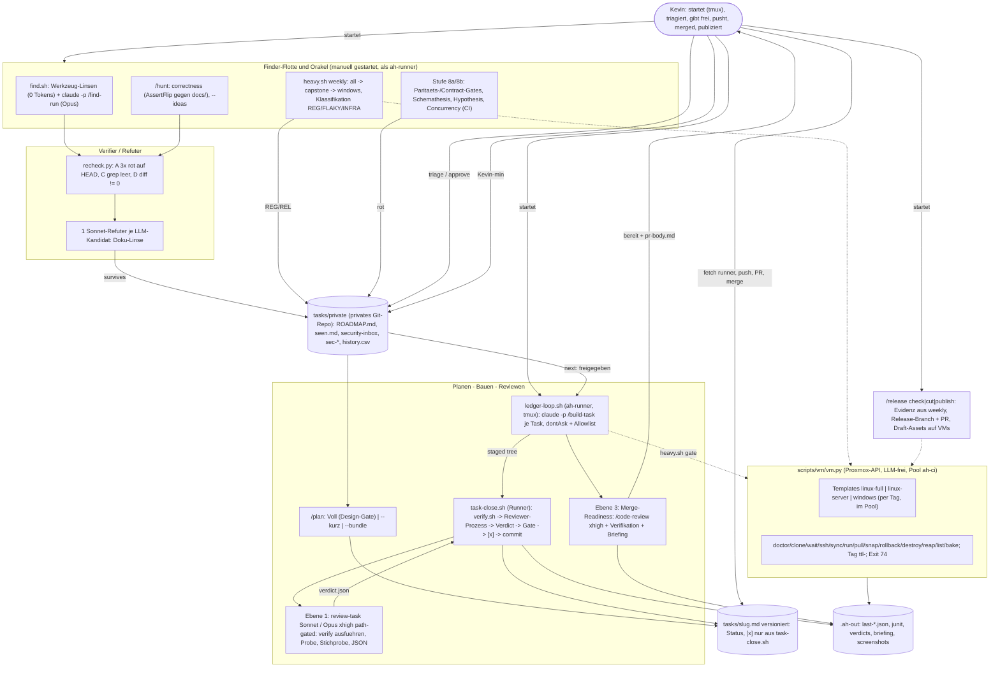

# Autonomes Testen, Finden und Bauen — Roadmap Fassung 2 (revidiert nach Kritik, „alles manuell gestartet")

## 1. Herkunft und Lesehinweis

Stand 2026-09-07. Fassung 2 ersetzt `docs/features/autonomy-roadmap.md` (Fassung 1, im Folgenden **F1**, weiter lesbar als `docs/features/autonomy-roadmap-v1.md`).
Herkunft: F1 (zehn Stufen, 65 Kritikpunkte eingearbeitet, alle Pfade im Checkout geprüft) + Kevins
sechzehn Entscheidungen vom 2026-09-07 (**D1–D16**: kein Timer, kein Cron, crabbox wird abgeschafft,
Windows komplett über eine Homelab-VM, lokale Ledger + `tasks/ROADMAP.md`, Finder-Flotte, ein
kontinuierlicher Worker, Reviewer besser eingebaut, alles manuell startbar) + fünf Detail-Designs
(Betriebsmodell, Finder-Flotte, Worker/Skalierung, Reviewer, VM-Skill) + einer End-to-End-Gegenprüfung
von F1 unter D1–D16 (30 Befunde, davon 6 Blocker) + **der Kritik dreier Skeptiker an Fassung 2 (74
Punkte, davon 9 Blocker — Abschnitt 19 listet jeden Punkt mit Reaktion)**. Quellen-Nummern **[Qn]** sind
die aus F1 Abschnitt 11 und werden fortgeführt (neue ab [Q66]; [Q63], [Q68], [Q73] wurden für diese
Revision **live nachgelesen** und um die zitierten Sätze ergänzt). Neues gegenüber dem Repo-Stand ist
**(neu)**; was weder im Checkout noch in den Quellen belegt ist, heißt **unverifiziert**. Zahlen sind
Annahmen ±50 %, bis die erste Messung (`total_cost_usd`, `Kevin-min:`-Spalte, `timings.txt`) sie ersetzt.
**Zeilenangaben** (`datei:zeile`) gelten für den Checkout `feature/code-review-fixes` @ `c22f4c6` vom
2026-09-07; `/plan` greppt sie vor dem Schreiben eines Ledgers neu (Gegenprüfung F2 #17).

**Das ist ein Plan, kein Ledger.** Es entsteht kein Code und kein Branch. Jede Stufe wird bei Freigabe
über `/plan` (heute `/feature-plan`) zu Spec + Ledger (`tasks/<slug>.md`) und läuft dann durch den
Build-Zyklus. Die Stufen sind so geschnitten, dass sie einzeln messbar sind, Stufe 1 in zwei Tagen steht
und ab Stufe 7 der Worker die **Skript- und Test-Anteile** der restlichen Stufen baut — die
**Harness-Anteile** (`.claude/**`, `CLAUDE.md`, Hooks, die Skripte, die der Loop selbst ausführt) baut
Kevin in kleinen interaktiven Sessions, weil der Worker sie per Harness-Schutz nicht anfassen darf
(Skeptiker 3 #2).

**Stufen-Nummern sind Kennungen, keine Reihenfolge.** Die Ausführungsreihenfolge steht in Abschnitt 7.0
(Ausführung und VM-freie Orakel vor Infrastruktur, Infrastruktur vor Gates, Gates vor Worker; Stufe 11
ist in Stufe 12 gefaltet). Die Nummern bleiben, damit F1-Verweise, die fünf Detail-Designs und die
Kritik weiter lesbar sind.

**Leitsatz von Fassung 2:** Kevin startet, Skripte entscheiden deterministisch, Modelle arbeiten
innerhalb von Deckeln, `tasks/private/ROADMAP.md` ist die einzige Reihenfolge-Wahrheit, das Ledger die
einzige Fortschritts-Wahrheit. **Evidenz entsteht nur in Prozessen, die das Modell nicht steuert** (der
Runner verifiziert, reviewt, committet — nicht die Session, die gebaut hat). Nichts läuft ohne Start;
einmal gestartet darf ein Lauf Stunden dauern und viele Aufgaben abarbeiten.

---

## In einfachen Worten (Lesehilfe)

Dieser Abschnitt ist für den schnellen Einstieg. Alles darunter ist Nachschlagewerk für die Umsetzung.

**Das Ziel.** Du startest, Skripte prüfen, Modelle arbeiten innerhalb von Deckeln, du entscheidest am
Design-Gate und beim Merge. Nichts läuft ohne deinen Start; einmal gestartet darf ein Lauf Stunden
dauern und viele Aufgaben abarbeiten. Kein Timer, kein Cron, kein crabbox.

**Neun Befehle, die du am Ende hast.** `/roadmap` pflegt die eine geordnete Liste aller Vorhaben und
Funde. `/plan` macht aus einem Eintrag Spec und Ledger und stoppt am Design-Gate. `/build` startet den
Worker, der freigegebene Ledger nacheinander abarbeitet, und öffnet später den Draft-PR. `/review` ist
der Reviewer, der Tests selbst ausführt und dir zum PR eine belegte Checkliste liefert. `/test` startet
den Wochenlauf mit allen Tests auf VMs, inklusive Windows. `/vm` verwaltet die Proxmox-VMs. `/find`
lässt die Finder-Flotte nach Sicherheit, totem Code, Duplikaten und Vereinfachungen suchen. `/hunt`
jagt Bugs in einer Komponente oder sammelt Ideen. `/release` prüft und schneidet ein Release.

**Die Reihenfolge des Aufbaus** (Abschnitt 7.0; die Stufen-Nummern sind nur Kennungen):
1. Stufe 0 und 1: Aufräumen, Tests dürfen nicht mehr lügen. Zwei Tage.
2. Stufe 3: Release-Prüfungen und der Wochenlauf, zunächst noch über crabbox.
3. Stufe 8a/8b: kostenlose Prüfer ohne VM (Paritäts-Tests, API-Fuzzing, Eigenschaftstests), parallel dazu.
4. Stufe 2: der eigene Proxmox-VM-Skill ersetzt crabbox. Der Wochenlauf ist der Regressionstest dafür.
5. Stufe 4: ein eigener Unix-User für den Runner ohne Zugang zu deinen Tokens, und die technischen Gates.
6. Stufe 5 und 6: Roadmap-Datei mit Skript, Beweisregeln, Reviewer in drei Ebenen.
7. Stufe 7: der Worker. Ab hier baut er die Skript-Anteile der restlichen Stufen selbst.
8. Stufe 8c/8d, 10, 12, 13: Windows-Dienst-Smoke, Finder-Werkzeuge als Pilot, Reviewer-Kalibrierung, die
   Windows-VM mit vollen Klick-Journeys, der Release-Befehl.
9. Stufe 9: die Finder-Flotte mit Sprachmodell-Linsen und der Bug-Hunt, zuletzt und nur gegen gemessene Lücken.

**Was es kostet, ehrlich gerechnet.** Etwa 45 bis 55 Opus-Bautage, verteilt über fünf bis sechs Monate,
weil dein Review und Merge der Takt sind. Im Vollbetrieb bei einem Worker-Lauf pro Woche etwa 800 bis
1150 Dollar Tokens im Monat, mit hartem Deckel über zwei API-Workspaces. Deine Zeit: fünf bis fünfeinhalb
Stunden pro Woche im Vollbetrieb, neun bis elf in den Bauwochen mit Triage. Alle Zahlen sind Annahmen,
plus oder minus die Hälfte, bis die erste Messung sie ersetzt.

**Was du jetzt entscheiden musst** (Abschnitt 16, mit Empfehlung je Frage): die Prioritätsklassen
(Frage 2), das Abgabe-Limit für offene PRs (3), das Budget (4), den Storage-Typ für schnelle Klone (13),
die Windows-Lizenz (14), den Ort des privaten Roadmap-Repos (41) und ob `git commit` aus der
Allowlist verschwindet (44).

**Wo weiterlesen.** Abschnitt 2 Kurzfassung, 3.1 Befehle, 3.4 deine Woche in Minuten, 7.0 Reihenfolge,
14 Sofort-Befunde, 16 offene Fragen.

---

## 2. Kurzfassung

Die Diagnose aus F1 gilt unverändert: die sechs release-blockierenden Defekte des 0.43.x/0.44.0-Fensters
wurden alle durch **Ausführung** gefunden, keiner durch statische LLM-Review; „grün" lügt an vier
Stellen still; Kevin — nicht Compute — ist der Engpass. Was sich ändert, ist das Betriebsmodell:

- **Kein Timer, kein Cron, keine Nightlies** (D2/D8/D9). Neun Kevin-Verben (`/roadmap /plan /build
  /review /test /vm /find /hunt /release`) ersetzen `ah-heavy.timer`, den Sonntags-Capstone, die
  `desktop-e2e-windows.yml`-Nightly und den 2-Nächte-Cap des Hunters. **Stundenlange Läufe sind
  Terminal-Prozesse, keine Skills:** `ledger-loop.sh` (Worker) und `heavy.sh weekly|capstone` startet
  Kevin in `tmux` (bzw. `setsid nohup … &`); die Skills `/build --queue` und `/test weekly|capstone`
  drucken nur den Startbefehl und lesen `state.json`/`report.md` (`status`) — eine Claude-Session kann
  keinen 8-h-Prozess halten (Bash-Timeout 10 min, Idle-Stopp; Skeptiker 1 #2).
- **Evidenz ohne Reward-Hacking-Fenster** (Skeptiker 2 #1, Skeptiker 3 #1 — der wichtigste Umbau
  dieser Revision). Die Build-Session (`claude -p "/build-task …"`) baut und **staged**; danach führt
  `scripts/dev/task-close.sh` **(neu)** — ein Bash-Skript außerhalb der Modell-Session — `verify.sh`
  selbst aus, ruft den Reviewer als **eigenen Prozess** mit festem Prompt und `--json-schema`, schreibt
  das Verdict, prüft es deterministisch (Scope, Diff-Scan, Tree-Hash, `sec`-Sperre), hängt `Evidenz:`/
  `Review:` ans Ledger und committet. Das Modell committet nie und schreibt nie `[x]`; `git add|commit`
  verschwinden aus der Worker-Allowlist. Der Commit-Gate-Hook, der Verdict-Hook und die
  Tree-Hash-Kette über `mark-done` aus F2 entfallen damit — Stufe 4 wird kleiner, nicht größer.
- **Der Runner ist ein eigener Unix-User** `ah-runner` (Skeptiker 2 #2, Skeptiker 3 #3). Ein eigenes
  `HOME` allein entfernt weder den gh-Token im Secret Service (D-Bus), noch `~/.ssh/id_ed25519`, noch den
  Remote `personal`, und Testcode, den Builder oder Finder schreiben, läuft via `pytest`/`go test` mit
  allen Ambient-Credentials — keine Allowlist greift dort (Permissions-Doku: Read/Edit-Regeln gelten
  nicht für Subprozesse, die selbst Dateien öffnen [Q63]). `ah-runner` hat keine D-Bus-Session, keine
  Schlüssel, einen eigenen Klon `/srv/ah/repo` mit `pushurl=/dev/null`, Toolchains unter `/opt`;
  Kevin holt fertige Branches per `git fetch runner`. Frage 27 aus F2 ist damit entschieden, nicht
  optional.
- **crabbox wird abgeschafft** (D11) — aber **nach** `/test weekly`, nicht davor (Skeptiker 3 #5):
  Stufe 3 baut `heavy.sh` auf den heutigen Wrappern (`crabbox_warm/iter/multibox.sh`), Stufe 2 tauscht
  darunter `vm.py` **(neu, Python-Stdlib, Proxmox-API)** ein; die Weekly ist der Regressionstest der
  Migration (gleiche Summary-Zeilen vorher/nachher). `vm.py` bleibt bei den D11-Verben (klonen, warten,
  syncen, ausführen, holen, Snapshot/Rollback, zerstören, Aufräumer, plus `doctor`/`list`/`bake`);
  Tokens nur auf Pool `/pool/ah-ci`, jede Operation fail-closed auf Tag `ah`; erste Task ist eine
  **Probe**, ob Template 9402 überhaupt einen qemu-guest-agent hat (0 Treffer im Repo — Skeptiker 1 #5).
- **Windows komplett** (D10): Agent als Dienst mit echten Metriken und Enrollment gegen die
  Linux-Server-Box, Desktop unter WebView2 mit vollen Journeys, MSI install/uninstall — über ein
  eigenes Windows-Template im Homelab. Der `windows-latest`-GUI-Smoke (F2 Stufe 11) wird als ½-Tag-
  Nachsatz **in Stufe 12 gefaltet** (Skeptiker 3 #13); die Go-Agent-Jobs auf `windows-latest` bleiben
  0-€-PR-Tier.
- **`tasks/private/`** (D12) ist ein **eigenes privates Git-Repo** im gitignorten Unterordner
  (Skeptiker 2 #8): Roadmap, `seen.md` (Dedup/abgelehnt/Baseline/Quarantäne in einer Datei),
  `security-inbox.md`, `sec-*`-Ledger, `history.csv`. `roadmap.py` **(neu, Python-Stdlib, hermetisch
  getestet — statt „~200 Zeilen awk")** committet lokal bei jedem Schreibzugriff; Kevin pusht in
  `/roadmap sync`. Fünf geschriebene Zustände statt fünfzehn, kein Score, kein Freeze-Modus
  (Skeptiker 3 #11).
- **Finder-Flotte** (D13): zwölf Linsen, drei Rollen; **F0 startet als Pilot** mit den Regeln, die die
  Toolchains schon haben (rustc `dead_code`, tsc `noUnusedLocals`, ruff F401/F841, ESLint
  `no-unused-vars` auf `error`) plus **einem** neuen Werkzeug (`golang.org/x/tools/cmd/deadcode`, zweimal
  `GOOS`); jedes weitere Werkzeug erst nach zwei Läufen mit Akzeptanz (Skeptiker 3 #12). Ein Refuter
  (Doku-Linse) statt zwei — die Reproduktion ist Skript (Skeptiker 3 #10). Klasse A geht immer durch
  `/plan --kurz`, das Triage-Gate gilt nur für C/D (Skeptiker 3 #17). GUI-Explorer nach „Danach".
- **Ein Worker** (D14/D16), keine parallelen Build-Lanes. Budget je Ebene als eigener `claude -p`-Aufruf
  mit eigenem Deckel (Bau 12 $, Review 3/8 $, Merge-Readiness 25 $), Laufsumme 200 $ — F2s 10 $ je
  Iteration hätte genau die Risikopfad-Tasks abgebrochen (Skeptiker 1 #6, Skeptiker 2 #4).
- **Reviewer in drei Ebenen** (D7): deterministisches Gate in `task-close.sh` (kein Modell), Task-Review
  als kalter Prozess (Sonnet, Opus `xhigh` path-gated; führt `Verify:` aus, Test-ohne-Fix-Probe **mit
  Fehlerart-Auswertung**, Mutations-**Stichprobe** über ein Skript-Primitiv), Merge-Readiness mit
  Briefing. Das Abschnitts-Review (F2 Ebene 2) wird **nicht gebaut**, bis eine Messung es verlangt
  (Skeptiker 3 #9).

| Stufe | Reihe | Inhalt | Liefert | Bau (Opus) | Laufend/Monat |
|---|---|---|---|---|---|
| 0 | 1 | Vorab: Checkout auf `main`, PR #8 **und #9** entscheiden, Workspaces + Build-Tier-Antrag, `.gitignore`-Whitelist `!.claude/rules/ !.claude/agents/`, Verify-Konvention **ohne Env-Präfix**, Skill-Namen gegen Built-ins prüfen, ROADMAP-Seed | — | ½ Tag | 0 € |
| 1 | 2 | Grün heißt Beweis: `run.sh --strict\|--only\|--step`, `verify.sh` + `last-verify.json`, Required-Menge pro Host, Exit 75, `agent-windows`-CI, Doku-Drift | Guardrails · Plattform | 2 Tage | 0 € |
| 3 | 3 | Ausführung zuerst: Release-Assertionen, `check-versions.sh`, `-race`, Upgrade-Pfad, `heavy.sh all\|capstone\|weekly` **auf heutigen Wrappern**, Klassifikation (INFRA ≠ REG, Zweit-VM, Gegenprobe gegen letzten PASS), Reruns sichtbar | Bugs · Plattform | 3–4 Tage | 0 €, ~19 VM-h/Woche |
| 8a/8b | 4 | VM-freie Orakel **vorgezogen** (Skeptiker 3 #4): Parität/Contract, OpenAPI-Snapshot, IPC-Inventar, Schemathesis, Hypothesis, Concurrency — interaktiv, parallel zu Reihe 3/5 | Bugs | 6 Tage | 0 € |
| 2 | 5 | **Proxmox-VM-Skill (Linux)**: qemu-ga-Probe, `vm.py` (D11-Verben), Pool-ACL, Templates, Wrapper, Multibox, crabbox-Rückbau — **zwei** Ledger | Infrastruktur | 6–8 Tage | 0 € |
| 4 | 6 | Runner-Isolation (`ah-runner`, eigener Klon, gescopter PVE-Token), `permissions.ask`, `task-close.sh`, Harness-Schutz über `harness-paths.txt`, `ledger.sh`, Kill-Switch, `sec`-Sperre, Ruleset ohne Bypass | Guardrails | 2–2,5 Tage | 0 € |
| 5 | 7 | Roadmap & Beweis: `tasks/private/` (privates Repo), `roadmap.py`, `/roadmap`, `/plan --kurz\|--bundle`, Beweisklassen A–D, JUnit mit Konsument, Playwright `live` | Autonomie · Guardrails | 3 Tage | 0 € |
| 6 | 8 | Reviewer-Ebenen 0/1/3: Agent-Dateien, `verdict.schema.json`, `review.sh`/`review-probe.sh` (Fehlerart, `--mutate`), Risikopfad-Liste, Briefing | Guardrails · Autonomie | 4 Tage | 150–300 $ |
| 7 | 9 | **Worker** `ledger-loop.sh` (tmux) + `/build-task`, `dontAsk` + Allowlist, Deckel je Ebene, Abbruch-Aufräumen, `/build pr\|ci\|status` | Autonomie | 3 Tage | 650–850 $ (1 Lauf/Woche) |
| 8c/8d | 10 | Windows-Dienst-Smoke (`windows-latest`, Dispatch), **Finder-Werkzeugschicht F0 als Pilot** (Toolchain-Regeln + `deadcode`) | Plattform · Qualität | 2 Tage (Worker) | 0 € |
| 10 | 10 | `harness_eval` (7 Seeds) und Reviewer-Kalibrierung | Guardrails | 2 Tage (Worker) | 20–60 $ |
| 12 | 10 | **Windows-VM** (D10 komplett, inkl. F2-Stufe 11): Spike, Template (pwsh 7, WiX offline, Long-Paths), Agent-Dienst + Enrollment über `vmbr1`, WebView2-Journeys, MSI, Dispatch-Nachsatz, `/test windows` | Plattform · Bugs | 7–9 Tage + Spike | 0 € Tokens, ~1,5 VM-h/Woche |
| 13 | 10 | `/release check\|cut\|publish`: Evidenz-Pflicht, `cut` = Release-Branch + PR (Ruleset ohne Bypass), Draft-Asset-Install auf VMs | Guardrails | 1–2 Tage (Worker + Kevin-Session) | 1–3 $ |
| 9 | 11 | **Finder-Flotte F1/F2 + `/hunt`**: LLM-Linsen, ein Refuter, `find.sh` headless als `ah-runner`, Recheck, Dedup, Ideen-Modus (kein GUI-Explorer) | Bugs · Ideen · Qualität | 4–5 Tage + 3 Piloten | 130–270 $ |
| 11 | — | **entfällt** — in Stufe 12 gefaltet | | | |

Summe ≈ 45–55 Opus-Tage ≈ 9–11 Bauwochen; Kalender **5–6 Monate** (≈ 17 System-PRs + Stufe 9,
Windows-Template-Bau, 5 Wochenläufe Kalibrierung; Kevin merged ~3 PRs/Woche, davon höchstens einer für
das System, wenn parallel Features gemergt werden — Skeptiker 1 #14). Laufend ≈ **800–1 150 $/Monat**
Tokens im Vollbetrieb bei einem Worker-Lauf pro Woche (F2 hatte 450–750 $ ohne Review-Kosten je Lauf
gerechnet; Workspace-Deckel 900 + 300 $ hart), ≈ 100–120 VM-h/Monat; Kevin ≈ 5–5,5 h/Woche im
Vollbetrieb, ≈ 3,3 h in ruhigen Wochen, **9–11 h in den Bauwochen mit Baseline-Triage** (Abschnitt 3.4,
12.3).

---

## 3. Betriebsmodell „alles manuell"

### 3.1 Befehlsoberfläche

Neun Kevin-Verben plus zwei interne Skills unter `.claude/skills/<verb>/SKILL.md`. Die bestehenden
Verzeichnisse `feature-plan`, `feature-build`, `feature-review`, `test` werden umbenannt (`git mv`;
`AUTONOMOUS.md` nennt die alten Namen einmal als Alias — Zeitpunkt: Frage 5), **nachdem** Stufe 0 die
Zielnamen gegen die Built-ins geprüft hat (`claude /help`; `/test`, `/simplify`, `/code-review`, `/run`,
`/init`, `/loop` existieren als Built-ins, `/test` wird heute bereits überschattet — Skeptiker 1 #20).
Skills, die Geld oder VMs kosten oder nach außen wirken (`/build`, `/test`, `/vm`, `/find`, `/hunt`,
`/release`), tragen `disable-model-invocation: true` [Q73]. Die Skills-Doku sagt dazu: verhindert
automatisches Laden durch das Modell, das Vorladen in Subagenten und seit v2.1.196 das Feuern per
Scheduled Task — ob ein `claude -p "/name"`-Aufruf als Modell-Invocation zählt, steht dort **nicht**
(unverifiziert). Deshalb bekommen die Skills, die der Runner in `-p` aufruft, **eigene Dateien ohne den
Flag**: `build-task` (eine Task bauen und stagen) und `find-run` (eine Linse) — Skeptiker 1 #8. Der
F2-Fallback `AH_STARTED_BY=kevin` ist gestrichen: eine Env, die das Modell im selben Bash-Aufruf selbst
setzt, ist kein Gate (Skeptiker 2 #15, Skeptiker 3 #21). Das reale Gate gegen Selbststart ist, dass
`heavy.sh`, `multibox.sh`, `bake.sh`, `ledger-loop.sh` nicht allowlisted sind und der Runner keine
Credentials hat.

| Verb | Aufruf | Zweck | Output | Dauer | Kosten | Kevin |
|---|---|---|---|---|---|---|
| **/roadmap** | `/roadmap` · `triage` · `add "<text>" [--class]` · `approve R-nnnn [--revoke]` · `sync` · `lint` · `stats` | Rendert „Als Nächstes", WIP, Zähler, `ALT`-Zeilen; führt Kevin per `AskUserQuestion` durch neue Einträge (annehmen / ablehnen / zurückstellen / bündeln); setzt Freigaben; `sync` zieht PR-/Merge-Stand per `gh` **und pusht das private Repo** (Prompt); prüft Invarianten; Metriken (Tasks/Tag, $/Task, Review-Fix-Anteil, Wartezeiten, Kevin-min/PR) | `tasks/private/ROADMAP.md`, lokaler Commit im privaten Repo | Sekunden; `triage` 10–15 min | 0 $ (Skript); `triage` Cent-Beträge | 10–15 min je Triage |
| **/plan** | `/plan R-nnnn` (Voll) · `/plan --kurz R-nnnn` · `/plan --bundle R-a,R-b,…` | F1-`feature-plan` (interaktiv, Design-Gate). Liest den Roadmap-Eintrag; `--kurz` erzeugt aus Beweis + Eintrag ein 1–3-Task-Ledger ohne lange Spec — **Pflichtzeile: beabsichtigte Semantik gegen `docs/`** (Klasse A immer hier, Skeptiker 3 #17); `--bundle` fasst gleich-komponentige REF-Einträge in ein Sammel-Ledger | `docs/features/<slug>.md` (nur Voll), `tasks/<slug>.md` `Status: geplant`, Roadmap-Spalte `Ledger` | 10–40 min | 3–8 $ Opus (Voll), 1–2 $ (Kurz) | Voll-Gate 45–60 min, Kurz-Gate 5–10 min |
| **/build** | `/build tasks/<slug>.md` (interaktiv) · `/build --queue [--max-hours 8] [--max-budget-usd 200] [--max-tasks N]` · `/build status` · `/build pr <slug>` · `/build ci <slug>` | Interaktiv wie heute, aber jede Task schließt über `bash scripts/dev/task-close.sh <id>` (verify → Reviewer-Prozess → Verdict → `mark-done` → Commit), nie über `git commit`. `--queue` **druckt** den Startbefehl (`sudo -u ah-runner tmux new -d -s ah-loop 'bash scripts/dev/ledger-loop.sh …'`) und endet; `status` liest `state.json`/`summary-*.md`. `pr`: `git fetch runner feature/<slug>`, Rebase, Push + Draft-PR (zwei Prompts). `ci`: rote CI-Jobs eines **eigenen** PR fixen (Fremd-PRs verweigert, Skeptiker 2 #6) | Commits auf `feature/<slug>` im Runner-Klon, Ledger `[x]` mit `Evidenz:`/`Kosten:`/`Review:`, `.ah-out/loop/<slug>/<iter>.json`, `pr-body.md` | 15–30 min je Task; 3–4 h je 8-Task-Ledger | 5–6 $ Bau + Ø 1,9 $ Review je Task | Start 1 min; `pr` 3 min |
| `/build-task` (intern) | `claude -p "/build-task tasks/<slug>.md"` — nur vom Loop oder interaktiv von `/build` | Genau eine Task: Ledger-Kopf lesen, Toolchain-Preflight, bauen, `verify.sh` iterativ, stagen, `commit-msg.txt` schreiben, `[~]`/`[?]` per `ledger.sh mark-skip\|mark-question`; **kein Commit, kein `[x]`** | Staged Tree + `.ah-out/loop/<slug>/<task>.commit-msg.txt` | 10–20 min | 5–6 $ Opus (Deckel 12 $) | 0 |
| **/review** | (automatisch über `task-close.sh`) · `/review branch [<base>]` · `/review pr <n>` (nur eigene PRs) · `/review harness` | Ebene 1 Task-Review als **eigener Prozess** mit festem Prompt (Sonnet; Opus `xhigh` path-gated), Ebene 3 Merge-Readiness (`/code-review xhigh` + Verifikation je Fund + Briefing), `harness` = `harness_eval` | `verdict.json` je Einheit (vom Runner geschrieben), Ledger-Tasks/Roadmap-Zeilen für Funde, `.ah-out/review/<slug>/pr-body.md` | Task 3–6 min, Merge 15–30 min, harness 20–40 min | Task 0,5–1,5 $ Sonnet / 3–5 $ Opus xhigh; Merge 8–20 $; harness 10–15 $ | Briefing-Ersparnis **unbelegt**, wird ab dem nächsten PR gemessen |
| **/test** | `/test quick` · `/test all [--base <sha>]` · `/test capstone [--flags]` · `/test windows` · `/test weekly` · `/test status` · `/test gate --for tasks/<slug>.md` (intern, vom Loop) | `quick`: lokal `bash scripts/dev/verify.sh --strict quick`. `all`/`capstone`/`windows`/`weekly` **drucken** den `tmux`-Startbefehl für `scripts/tests/heavy.sh` (eine `linux-full`-VM; 7 VMs; `linux-server` + `windows`; all → capstone → windows mit Klassifikation); `status` liest `.ah-out/weekly/<datum>/report.md` | `report.md`, `tasks/private/history.csv`, `junit/`, Roadmap-Zeilen (REG/REL/FLAKY) | quick 5–10 min; all ~75 min; capstone 2,5–3 h; windows 60–90 min (unverifiziert); weekly 5–6 h | 0 $ Tokens; VM-Stunden | Start 2 min; Report 20 min |
| **/vm** | `/vm doctor` · `clone --profile p --role r [--ttl 3h]` · `wait` · `ssh` · `sync` · `run -- <cmd>` · `pull` · `snap` · `rollback` · `destroy` · `reap [--all]` · `list` · `bake --profile p` | Dünne Primitive auf `python3 scripts/vm/vm.py` (Proxmox-API). Keine Intelligenz. Allowlisted sind nur `list doctor wait ssh sync run pull`; `clone destroy reap snap rollback bake` stehen unter `permissions.ask` (interaktiv Prompt; im Loop ruft sie das Skript, nie die Modell-Session — Skeptiker 2 #3) | `.vm/warm.env`, `.vm/lane`, Proxmox-Tags `ah;role-…;lane-…;sc-…;ttl-<epoch>;tpl-…` | clone 5–11 min (Full) / Sekunden (Linked, unverifiziert); run/sync Sekunden–Minuten | 0 $ | 0; `list` am Ende jedes Laufs |
| **/find** | `/find <linse\|all> <komponente> [--deep] [--cap 5] [--budget USD]` · `bash scripts/dev/find.sh reject <key> "<grund>"` | Druckt den Startbefehl für `find.sh` als `ah-runner` (Workspace-Key „ah-hunt"); vorher exportiert Kevins Shell optional `gh api …/code-scanning/alerts > .ah-out/find/codeql.json` (Skeptiker 1 #11). `find.sh`: Werkzeug-Linsen (0 Tokens) → LLM-Linse via `claude -p "/find-run …"` (Opus) → **ein** Refuter je Kandidat (Sonnet, Doku-Linse) → mechanischer Recheck → Dedup → Cap → Roadmap-Zeilen | Roadmap-Zeilen, `tasks/finder/<linse>-<komp>-<jjjj-mm>.md`, `tasks/private/security-inbox.md`, `.ah-out/find/<run>/` | 10–30 min | Werkzeuge 0 $; LLM-Linse 5–10 $ + 0,5–1 $ Refuter je Kandidat | Triage 15–30 min je Lauf |
| `/find-run` (intern) | `claude -p "/find-run <linse> <komp>"` — nur von `find.sh` | Eine LLM-Linse im Wegwerf-Worktree; Output ausschließlich `finding.schema.json` | `.ah-out/find/<run>/llm.json` | 5–15 min | 5–10 $ Opus (Deckel 15 $) | 0 |
| **/hunt** | `/hunt <komponente>` · `/hunt --ideas` | F1 Stufe 9 in Mechanik (Opus-Hunter, AssertFlip gegen `docs/`, Refuter, Beweis-Gate, Cap 3 Funde/Lauf, Dedup) auf demselben Runner wie `/find` (`/hunt <komp>` ≡ `/find correctness <komp> --cap 3`); `--ideas` → IDEE-Zeilen (Ablauf 60 d). `--gui` ist nach „Danach" verschoben (Skeptiker 1 #12) | Roadmap-Zeilen BUG/IDEE, Beweis-Branch `bughunt/<datum>` im Runner-Klon, `.ah-out/hunt/<datum>/` | 30–90 min | 8–25 $ je Lauf (Deckel 25 $); ideas 5–10 $ | Triage 20–30 min je Lauf |
| **/release** | `/release check X.Y.Z` · `/release cut X.Y.Z` · `/release publish X.Y.Z` | `check`: `check-versions.sh`, CHANGELOG-Abschnitt, **Evidenz-Pflicht** (letzter Weekly-Report PASS auf einem Vorfahren von HEAD ohne Code-Änderung dazwischen, Versions-Dateien ausgenommen). `cut`: Bump-Commits auf Branch `release/vX.Y.Z` + Draft-PR (Prompt) — **kein Direkt-Commit auf `main`**, weil das Ruleset keinen Bypass-Akteur hat (Skeptiker 1 #7); nach Kevins Merge Tag auf den Merge-Commit (Prompt), Push (Prompt), `gh run watch`, ein Re-Run bei transientem Fehler, `minisign -V` + `cosign verify`, Draft-Assets auf VMs installieren. `publish`: `gh release edit --draft=false` (Prompt) | Release-PR, Tag, verifizierter Draft, `.ah-out/release/X.Y.Z.md` | check 2 min, cut 45–90 min (PR + CI), publish 1 min | 1–3 $ | 60–90 min je Release |

**Verify (Oberfläche):** `ls .claude/skills` zeigt genau die elf Verzeichnisse; `git grep -n
feature-build .claude` → 0 Treffer außer der Alias-Zeile in `AUTONOMOUS.md`; `claude /help` zeigt keine
Kollision der neun Kevin-Verben mit Built-ins (sonst Umbenennung vor dem Sweep); `/build --queue` und
`/test weekly` beenden sich nach dem Drucken des Startbefehls (kein laufender Prozess in der Session);
`grep -rn 'AH_STARTED_BY' .claude scripts` → 0.

### 3.2 Zustandsautomat einer Einheit

Einheit = eine Roadmap-Zeile `R-nnnn` (Idee, Fund, Regression, Feature, Sammel-Batch). **Die Roadmap
schreibt fünf Zustände selbst** (`neu`, `zurückgestellt`, `abgelehnt`, `freigegeben`, `erledigt`); alles
dazwischen **liest** `roadmap.py` aus dem Ledger-Kopf (`Status: geplant | freigegeben | aktiv | bereit |
blockiert`) und aus der `PR`-Spalte — keine Doppelbuchführung (Skeptiker 3 #11). Der Ledger trägt neu
gegenüber heute `freigegeben` und `bereit`.

```
neu ──(Kevin /roadmap triage)──► /plan ──► Ledger geplant ──(Kevin approve)──► freigegeben
 │              │                                                                  │ (Loop)
 ├─► abgelehnt  └─► zurückgestellt (IDEE/REF mit Ablauf → lint meldet ALT)          ▼
 │                                                                     aktiv ──► bereit ──(Kevin /build pr)──► PR ──(Kevin merge)──► erledigt
 └─► Klasse C/D + Aufwand S: Triage-Gate = Kevins Haken ──► freigegeben      │        └─(Boundary)─► bereit* (Capstone je Branch)
                                                                        blockiert ([?], infra, Boundary, Stall, Budget)
```

| Übergang | Wer | Auslöser/Kommando | Datei ändert sich |
|---|---|---|---|
| — → `neu` | Skill (`find.sh`, `heavy.sh` REG/REL) oder Kevin (`/roadmap add`) | `roadmap.py add --class … --source … --proof …` | `tasks/private/ROADMAP.md` (Zeile unter „Neu") + lokaler Commit, Beweis-Branch im Runner-Klon |
| `neu` → `/plan` / `abgelehnt` / `zurückgestellt` | **Kevin** | `/roadmap triage` oder Hand-Edit | Roadmap-Zeile |
| `neu` → `freigegeben` direkt (**Triage-Gate**) | **Kevin** | nur **Klassen C/D** (toter Code, Parität) mit Beweis und Aufwand S (≤ 3 Dateien): der Haken **ist** das Gate; Kurz-Ledger aus der Vorlage. Klasse A (SEC/REG/BUG) **immer** `/plan --kurz` — die Fix-Richtung ist eine Designentscheidung (`f7c1ee1`: Fund richtig, Fix falsch) | Ledger-Kopf `freigegeben`, Roadmap |
| Ledger `geplant` → `freigegeben` | **Kevin** (Design-Gate) | `/roadmap approve R-nnnn` → `ledger.sh status <slug> freigegeben` | Ledger-Kopf, Roadmap. **Der einzige Pflicht-Checkpoint** |
| REG-Kurz-Ledger → `freigegeben` | **Kevin** (1 min in `/roadmap triage`) | Haken — **nicht automatisch** (Skeptiker 2 #9: eine bewusste Verhaltensänderung sähe wie eine Regression aus, und der billigste „Fix" wäre die Erwartung im Test); geänderte Erwartungswerte in einem REG-Diff sind `blocker` | Ledger-Kopf |
| `freigegeben` → `aktiv` | Skript | `ledger-loop.sh` nimmt oberstes `freigegeben`; `lane.sh new <slug>` im Runner-Klon; `ledger.sh status aktiv` | Ledger-Kopf (`aktiv`, `Start:`), Worktree |
| `aktiv` (Task für Task) | Modell baut + staged; **Runner** verifiziert, reviewt, committet | `claude -p "/build-task …"` → `task-close.sh <id>` | Code + `tasks/<slug>.md` (`[x]` + `Evidenz:` + `Kosten:` + `Review:`) in **jedem** Task-Commit — außer bei gitignorten `sec-*`-Ledgern (Ausnahme der Invariante) |
| `aktiv` → `bereit` | Skript nach letztem `[ ]`, `/test gate`, `/review branch` | `ledger-loop.sh` | Ledger `Status: bereit`; bei `Heavy: scenario …` → `bereit*` („capstone offen") |
| `aktiv` → `blockiert` | Skript | Ledger-Datei über 2 Iterationen byte-identisch (Stall), `[?]` blockiert Rest, Boundary-Pfad, `permission_denials`, `error_max_budget_usd`/`--max-turns` (mit Aufräumen, Stufe 7), Exit 74 ⇒ `infra` | Ledger; Worker geht zum nächsten Ledger |
| `bereit` → PR | **Kevin** | `/build pr <slug>`: `git fetch runner feature/<slug>`, `git rebase origin/main` + `verify.sh --strict quick`, `git push -u` (Prompt), `gh pr create --draft --body-file …` (Prompt); Rebase-Konflikt → Fix-Task ins Ledger, nicht Handarbeit | Roadmap-Spalte `PR` |
| PR (CI rot) → PR | Kevin startet, Modell fixt | `/build ci <slug>` (nur eigene PRs) | Ledger, Code |
| PR → `erledigt` | **Kevin** (GitHub, kein Auto-Merge) | `/roadmap sync` liest `gh pr list --state merged`, ruft `lane.sh done <slug>`; `Kevin-min:` Selbstauskunft | Roadmap, Worktree weg |
| `zurückgestellt`/`neu` mit Ablauf → `ALT` | Skript (Anzeige) | `roadmap.py lint` (nur IDEE/REF/Einträge ohne Beweis); SEC/REG/REL/BUG verfallen nie, > 30 Tage ohne Entscheidung erscheinen ebenfalls als `ALT`. Kevin löscht oder archiviert von Hand — kein `expire`-Verb | Roadmap (Markierung) |

**Verify (Automat):** `python3 -m pytest scripts/dev/tests/test_roadmap.py -q` **(neu)** prüft hermetisch
jeden Übergang (Fixture-Roadmap + Fixture-Ledger, erwartete Zeile danach) und verweigert unerlaubte
(`neu` → `aktiv` ohne `freigegeben`, `aktiv` ohne `Ledger:`-Spalte). Live: ein Probe-Eintrag R-0001
durchläuft alle Zustände; `git log` zeigt, dass jeder Task-Commit eines versionierten Ledgers
`tasks/<slug>.md` enthält.

### 3.3 `tasks/private/ROADMAP.md` — Format und Regeln

**3.3.1 Ort: `tasks/private/` als eigenes privates Git-Repo** (Skeptiker 2 #8; Frage 1 damit
entschieden). Der Ordner ist im Hauptrepo gitignored (`tasks/private/`), enthält ein eigenes `.git` und
ein privates Remote (Kevins Token, nur interaktiv). Inhalt: `ROADMAP.md`, `seen.md` (Dedup-Keys ·
Datum · Grund · Art `rejected|baseline|quarantine|expired` — **eine** Datei statt `rejected.md` +
`baseline-<tool>.txt` + `quarantine.md`, Skeptiker 3 #26), `security-inbox.md`, `sec-*.md`-Ledger und
-Specs, `history.csv` des Wochenlaufs. `roadmap.py` committet lokal nach **jedem** Schreibzugriff
(`git -C tasks/private commit -qam "<verb> <id>"`); `/roadmap sync` pusht (Prompt). Gründe für privat:
(a) Repo PUBLIC — Sicherheitsfunde, Homelab-Notizen, Beweis-Branch-Namen; (b) das `main`-Ruleset
(Stufe 4, PR-Pflicht **ohne** Bypass) macht ein täglich kuratiertes versioniertes File unbedienbar;
(c) Feature-Branches würden beim Rebase an derselben Datei kollidieren. Was F2 „`rebuild` rekonstruiert
die Roadmap" nannte, ist gestrichen — `neu`/`zurückgestellt`/`abgelehnt`/SEC hätten kein versioniertes
Ledger und wären verloren gewesen (Skeptiker 1 #18); die Historie liegt jetzt im privaten Repo.
Format dokumentiert in `tasks/README.md` (versioniert, ohne Inhalte).

**3.3.2 Aufbau.** Pipe-Table, eine Zeile pro Einheit, sortiert nach Blöcken; `scripts/dev/roadmap.py`
**(neu, Python-Stdlib, ~400 Zeilen inkl. Parser; hermetischer Test `scripts/dev/tests/test_roadmap.py`)**
schreibt nur ganze Zeilen (append unter „Neu", Status-Spalte per ID); Kevin editiert alles Übrige von
Hand. Vor jedem Schreiben `ROADMAP.md.bak`; geschrieben wird nur, wenn `Zeilen nach ≥ Zeilen vor −
erwartete Archivierungen` (Row-Count-Invariante — ein Parse-Fehler darf keine SEC-Zeile still
verschlucken, Skeptiker 2 #14). Schreibzugriffe unter `flock tasks/private/.roadmap.lock`; ist die
Datei jünger als 5 s (Editor offen), bricht `roadmap.py` mit Meldung ab.

```
# AdminHelper — Roadmap (roter Faden)
Stand: 2026-09-07 · WIP: aktiv 1/1 · bereit 1/2 · pr 2/3 · neu 7/20 · ALT: 2
Klassen: SEC(P0) > REG(P1) > REL(P2) > BUG(P3) > FEAT(P4) > REF(P5) > IDEE(P6) · innerhalb Klasse: Reihenfolge der Zeilen (Kevin), dann Datum

## Als Nächstes (roadmap.py next)
1. R-0042 REG  agent_monitoring rot seit weekly 09-06 (3× identisch, Zweit-VM rot)   → freigegeben, wartet auf Worker
2. R-0031 FEAT Pro-Connection-Notiz                                                   → freigegeben, wartet auf Worker
3. R-0038 REF  toter Command enroll_device + 3 ungenutzte Helfer (agent)              → /plan --bundle R-0038,R-0039

## In Arbeit
| ID | Klasse | Titel | Status | Quelle / Beweis | Ledger | Hängt ab von | PR | Ablauf | Kevin-min |
|---|---|---|---|---|---|---|---|---|---|
| R-0031 | FEAT | Pro-Connection-Notiz (Web + Desktop) | aktiv (T4/9) | kevin 2026-09-01 | tasks/connection-note.md | — | — | — | — |
| R-0027 | BUG | Login-Ratelimit ×N bei Redis-Ausfall | pr | hunt 2026-08-30 · bughunt/2026-08-30@a1b2c3d | tasks/fix-ratelimit-redis.md | — | #12 | — | — |

## Neu (untriagiert — /roadmap triage)
| R-0044 | SEC | SEC-003 (Details: security-inbox.md) | neu | find:security 2026-09-06 · find/2026-09-06@9f8e7d6 | — | — | — | nie | — |
| R-0045 | REF | Duplikat: _esc_tag vs. safe_metric_part (monitoring) | neu | find:dup 2026-09-06 · **Beweis fehlt** | — | — | — | 2026-09-20 | — |

## Zurückgestellt
## Blockiert
## Abgeschlossen (letzte 30 Tage)
## Archiv
```

Spalten (zehn; jede hat einen Skript-Konsumenten): `ID` (R-nnnn, monoton, nie wiederverwendet) · `Klasse`
· `Titel` (bei SEC nur Kennung) · `Status` (3.2; Ledger-Zustände werden beim Rendern aus dem Ledger
gelesen) · `Quelle / Beweis` (`kevin|find:<linse>|hunt|weekly|review|release` + Datum + Branch@SHA, oder
„Beweis fehlt") · `Ledger` · `Hängt ab von` (R-IDs; `next` überspringt Einträge, deren Abhängigkeit
nicht **gemergt** ist — `git merge-base --is-ancestor`) · `PR` · `Ablauf` (IDEE 60 d, REF 90 d, „Beweis
fehlt" 14 d, SEC/REG/REL/BUG nie; Konsument: `lint` → `ALT`) · `Kevin-min` (Selbstauskunft beim Merge,
eine Zahl; Konsument: `stats`). Gestrichen gegenüber F2: `Rang` (Kevin sortiert Zeilen), `Nächster
Schritt` (Freitext ohne Konsument), `Modus: freeze` (`approve --revoke` reicht), Zustände `triagiert`,
`spec`, `bau`, `gemergt`, `verifiziert`, `verfallen`, `unbelegt` (jetzt Beweis-Spalte).

**3.3.3 Prioritätsklassen.** P0 **SEC** Sicherheit (privat, Beweis-Branch wird nie gepusht) · P1 **REG**
Regression aus `/test weekly` (3× identisch rot **und** auf einer zweiten frischen VM rot **und**
Gegenprobe gegen den **letzten PASS-Commit** aus `history.csv` rot — `--base main` ist für einen Lauf
auf `main` leer, Skeptiker 3 #23) · P2 **REL** Release-Blocker (Versions-Drift, rote Signatur, roter
`audit.yml`, roter `main`-CI) · P3 **BUG** Fund mit Failing-Test, keine Regression · P4 **FEAT** Kevins
Features · P5 **REF** Refactor/Vereinfachung/toter Code/Duplikat/Doku-Drift/Codequalität · P6 **IDEE**
aus `/hunt --ideas`, ohne Orakel, zählt nie als Fund. Kevin darf innerhalb der Klasse umsortieren
(Zeilenreihenfolge), nicht klassenübergreifend (sonst ist die Klasse falsch gesetzt). Reihenfolge SEC
vor REG und BUG vor FEAT: Frage 2. **Ablage-Regel für Klasse-A-Funde auf Risikopfaden** (Skeptiker 2
#5): ob ein Fund SEC oder BUG heißt, entscheidet eine LLM-Linse — deshalb wird jeder Klasse-A-Fund,
dessen Datei in `review-risk.txt` steht, für die **Ablage** wie SEC behandelt (Ledger
`tasks/private/sec-<slug>.md`, kein versionierter Text), bis Kevin den PR öffnet und den Ledger dabei
nach `tasks/` verschiebt.

**3.3.4 Beweis-Pflicht je Klasse (Fund-Regel).** Ohne Beweis der richtigen Art bleibt ein Eintrag mit
„Beweis fehlt" (Ablauf 14 d) und wird nicht triagiert (`roadmap.py lint` verweigert `freigegeben`). Die
vier Beweisklassen A–D sind in Abschnitt 8.3 ausgeführt; Kurzform:
- **SEC / REG / BUG (Klasse A):** Failing-Test auf HEAD, 3× identisch rot, ≤ ~40 Zeilen, Assertion
  nennt erwartet/beobachtet, auf lokalem Branch `bughunt/<datum>` bzw. `find/<datum>` im Runner-Klon;
  Fix-Verify `git cherry-pick <sha> && bash scripts/dev/verify.sh <komp>` (F1 Stufe 4, unverändert). SEC
  zusätzlich Refuter `survives`; REG zusätzlich Zweit-VM + Gegenprobe gegen letzten PASS.
- **REL:** Skript-Exit ≠ 0 (`check-versions.sh`, `minisign -V`, `gh run view` rot) mit Ausgabe-Tail.
- **REF toter Code (Klasse C):** Analyzer-Treffer + repo-weiter Wort-grep leer + Checkliste dynamischer
  Oberflächen abgehakt + Entfernung unter `verify.sh --strict quick` (und `GOOS=windows go build` beim
  Agent) grün + Metrik (−LOC). Kein LLM-Urteil zählt.
- **REF Duplikat / Vereinfachung / Refactor / Perf (Klasse B):** Tests grün vorher **und** nachher
  (`last-quick.json` beider Stände), Metrik strikt besser (gleiches Werkzeug, gleiche Version),
  Boundary-Pfade unberührt oder schwerer Tier, **Coverage der refaktorierten Region nicht gesunken**
  (deterministisch, je Sprache) **und** Mutations-**Stichprobe** (2 Mutanten über
  `review-probe.sh --mutate`, die Suite muss beide fangen — sonst zuerst Testlücke `gap:`). Eine
  Stichprobe ist kein Beweis der Äquivalenz und heißt im Text auch so (Skeptiker 3 #8).
- **REF Doku-Drift / Codequalität (Klasse D-nah):** `doc-smoke.py`-Diff bzw. Werkzeug-Regel-ID mit
  Datei:Zeile; Fix-Verify = Werkzeug sauber.
- **Parität / Contract / Deps (Klasse D):** Paritäts-Test mit Nicht-Leer-Assertion, rot bei
  Einzelmutation; Deps: Advisory-ID aus rotem `audit.yml`.
- **IDEE:** kein Beweis, dafür Ablaufdatum; Cap 5 je Lauf.

**3.3.5 WIP-Limits und Caps.** `aktiv` ≤ 1 (ein Worker) · `bereit` ≤ 2 (danach stoppt der Worker: Kevin
muss pushen) · `pr` ≤ 3 (danach stoppt der Worker: Kevin muss mergen; Frage 3) · `neu` ≤ 20 (danach
verweigert `roadmap.py add`; Finder/Hunt enden mit „Cap erreicht", nichts wird gestapelt) · je
`/find`-Lauf ≤ 5 gerenderte Einträge (≤ 3 bei `simplify`/`gaps`), davon ≤ 3 SEC, Überhang als
`overflow: N` · je `/hunt` ≤ 3 BUG · VMs gleichzeitig: `vm.py doctor` rechnet **cluster-weit** (alle
`ah`-VMs + RAM-Bedarf der geplanten Rollen gegen `GET /nodes/{node}/status`), nicht gegen eine
Prozess-Konstante; `AH_VM_MAX` bleibt als zusätzlicher Deckel (8) · offene REF-Batches je Komponente ≤ 1.

**3.3.6 Wer liest wie.** `/plan` liest `roadmap.py show R-nnnn`. Der Worker liest `roadmap.py next
--status freigegeben` — nie das Ledger-Verzeichnis scannen. Finder/Hunt/Weekly schreiben ausschließlich
`roadmap.py add --dedup-key …` (Treffer gegen Roadmap, Archiv, `tasks/**/*.md`, `seen.md` → „dup",
nichts geschrieben; für `sec:`-Keys steht in `seen.md` nur `sha256(key)`). `roadmap.py lint` (auch am
Start jedes Loops): jede `aktiv`/`bereit`-Ledger-Datei hat eine Zeile; jede `aktiv`-Zeile hat ein
existierendes Worktree; keine zwei Zeilen mit gleichem Dedup-Key; Ablaufdaten → `ALT`; `Merker:`/„bei
Gelegenheit" in `tasks/*.md` ohne Roadmap-Zeile → Warnung; **`Verify:`-Zeilen, die mit `[A-Z_]+=`
beginnen, werden verweigert** (Skeptiker 1 #1).

**Verify (Roadmap):** `test_roadmap.py` hermetisch: `add` ohne Beweis landet mit „Beweis fehlt" und
Ablauf +14 d; `add` mit bekanntem Dedup-Key schreibt nichts; `next` liefert SEC vor REG vor FEAT und
überspringt ungemergte Abhängigkeiten; `lint` findet die fünf Invariantenbrüche der Fixture (inkl.
Env-Präfix-Verify); Cap 20 verweigert die 21. Zeile; paralleler `add` aus zwei Prozessen (flock) erzeugt
zwei Zeilen mit fortlaufenden IDs; Row-Count-Invariante bricht bei kaputter Zeile ab und lässt `.bak`
stehen; nach jedem Schreibzugriff existiert ein neuer Commit in `tasks/private/.git`.

### 3.4 Kevins Woche in Minuten

Kevin-Minuten wurden nie gemessen (reads.json/autonomy gaps); die Tabelle ist eine Schätzung. **Messung
beginnt mit dem nächsten PR** (drei Werte vor Stufe 6 als Basis; Skeptiker 2 #7), nicht erst ab dem
ersten Merge eines Worker-Ledgers. Der F2-Satz „Briefing spart 30–60 min" ist bis dahin unbelegt, weil
der Basiswert „heute 60–120 min je PR" eine F1-Schätzung ist.

| Tätigkeit | Annahme | Herkunft |
|---|---|---|
| Design-Gate Feature-Ledger (10–15 Tasks) | 45–90 min → ≈ 6 min/Task | F1 Abschnitt 6 |
| Kurz-Gate (`/plan --kurz`, jede Klasse A) | 5–10 min | Beweis liegt vor, Semantik-Zeile gegen `docs/` ist die Entscheidung |
| Triage-Gate Finder-Batch C/D (≤ 15 Tasks mit Beweis-Zeile) | 15–20 min → ≈ 1 min/Task | kein Verstehen des Fehlers nötig |
| PR-Review + Merge mit Review-Briefing | Feature 30–45 min (**unbelegt**, wird gemessen), Kurz-/Sammel-PR 10–15 min | Reviewer-Design 10.6 |
| REG-Haken in `/roadmap triage` | 1–2 min | Skeptiker 2 #9 |
| Triage REF-Kandidat (Metrik + Coverage + Stichprobe liegen vor) | 2–3 min | Schätzung |
| `/test weekly`-Report lesen, REG/FLAKY-Triage | 20 + 10 min/Woche | F1 Stufe 2 |
| `/hunt`-Triage | 20–30 min je Lauf | F1 Stufe 9 |
| Worker-Summary lesen, Worker starten (`tmux`), `/build pr` | 5 + 1 + 3 min je Tag | — |
| Roadmap-Pflege (`/roadmap`, Reihenfolge, Freigaben, `sync`) | 20 min/Woche | — |

**Typischer Tag mit PR (≈ 60–90 min):** morgens `/roadmap` (3 min), Worker-Summary (5 min), `/build pr
<slug>` (3 min); abends `/review pr <n>`-Briefing lesen und mergen (30–45 min Feature, 10–15 min
Kurz-PR), `/roadmap triage` falls Finder liefen (10–15 min), ggf. Kurz-Gate + `approve` (5–10 min),
Worker starten (1 min). **Ruhiger Tag (≈ 15–20 min):** Roadmap + Summary lesen, Worker starten.

**Typische Woche (Vollbetrieb, ≈ 300–330 min ≈ 5–5,5 h):** Mo–Do 2 PR-Tage à 75 min + 2 ruhige à 20 min
= 190 min. Fr abends `/test weekly` (2 min) + `/hunt <komponente>` (1 min). Sa: Weekly-Report (20 min),
REG/FLAKY-Triage (10 min), Hunt-Triage (20–30 min), **ein Voll-Gate alle zwei Wochen** (45–60 min ⇒
≈ 25–30 min/Woche anteilig — F2 rechnete „~2 Voll-Gates/Monat" und gleichzeitig eines je Woche,
Skeptiker 2 #20) = 75–90 min. Zwei Kurz-Gates Klasse A (≈ 15 min). Release alle ~4 Wochen (60–90 min)
≈ 20 min/Woche anteilig. **Ruhige Woche** (kein Voll-Gate, kein Hunt) ≈ 200 min ≈ 3,3 h. **Bauwochen des
Systems:** 5–8 h in Wochen mit einem System-Gate + PR; **9–11 h in den Wochen mit Baseline-Triage
(Stufe 8d) oder Windows-Spike (Stufe 12)** — die Zeile „Kevin-h je Kalenderwoche" in 12.3 rechnet das
aus. Amortisiert: Feature-Task ≈ 8–10 Kevin-min, Finder-Batch-Task ≈ 2–4 Kevin-min, Einzel-Bugfix-PR
≈ 25–35 Kevin-min (inkl. Kurz-Gate).

Durchsatz-Grenze: ~3 gemergte PRs/Woche (1 Feature + 2 Kurz/Sammel), ~2 Voll-Gates/Monat. Daran sind
alle Caps kalibriert (Abschnitt 9).

---

## 4. Ausgangslage (Stand 2026-09-07, gekürzt und aktualisiert)

1. **Der Ledger-Loop existiert und liefert:** `AUTONOMOUS.md`, `.claude/skills/{feature-plan,feature-build,feature-review,test}/SKILL.md`, `tasks/*.md` (8 Dateien; 5 Ledger durch, 7 PRs gemergt, kein Revert), `scripts/dev/lane.sh` (Worktree + Pond), `scripts/tests/run.sh` (dep-gated, Exit 75 = SKIP), `scripts/tests/crabbox_*.sh` (15 Dateien, 1 460 Zeilen: 661 Orchestrierung in `crabbox_{lib,warm,iter,reap,multibox,bake}.sh`, 799 Box-seitige Rollen/Bootstrap/Debug). Gemessener Durchsatz (Git-Log): monitoring-overhaul 46 Tasks in 7,6 h (10 min/Commit ohne ausführenden Reviewer), alert-sent-state 12 Tasks in 1,9 h, merker-cleanup ~24 min/Task inkl. xhigh-Review; Review-Fix-Anteil 24–42 %; Draft-PR → Merge 3,6 h bis 177 h Wall-Clock; Kevin-Minuten je Gate/PR **nie erfasst**; Kosten je Task **nie gemessen**.
2. **Grün lügt still — an vier Stellen (unverändert F1):** (a) alle 7 `scripts/tests/desktop_e2e_*.sh` beenden mit `exit 0`, wenn nach erfolgreichem `e2e_require` (`lib_e2e_stack.sh:44–52`) `cargo tauri` fehlt (`desktop_e2e_live.sh:33–34`) — auf crabbox real, weil `crabbox_bootstrap.sh:122–123` `cargo install tauri-cli … || true` schreibt; (b) `scripts/tests/agent_install_test.sh:27,28,36` exit 0; (c) `run.sh` findet `ruff` nur im PATH (Ledger `code-review-fixes` T6 hat den Venv-Fallback inzwischen gebaut, `layer_lint` Z. 106–124) und `run.sh:153–157` kennt `AH_TEST_DB` nicht; (d) pytest-interne `skipif` (`test_stream_redis.py:30`, `test_migrations_smoke.py:21`, `apps/ca-issuer/tests/test_db_token_store.py:100`) laufen als „passed" durch. `crabbox_multibox.sh:250` kennt kein `skipped`.
3. **Kein maschinenlesbares Verdikt:** 0 JUnit-Produzenten (`apps/desktop/e2e/wdio.conf.js:67` `reporters: ['spec']`); `tasks/test-infra-capstone-release.md` A4/A6 behaupten JUnit als `[x]`.
4. **Keine deterministischen Gates, und der Runner hat heute alles:** `.claude/settings.json` hat 40 `allow`-Regeln (u. a. `Bash(git add:*)` Z. 33, `Bash(git commit:*)` Z. 34, `Bash(git checkout:*)` Z. 37, `Bash(git stash:*)` Z. 43, `Bash(pytest:*)`, `Bash(bash scripts/tests/run.sh:*)`), `ask`/`deny`/`hooks` leer; `feature-build/SKILL.md:66` empfiehlt `git checkout -- <datei>` (Memory `revert-check-never-git-checkout`). Auf der Dev-Box (verifiziert, Skeptiker 2): der gh-Token liegt im Secret Service (`~/.config/gh/hosts.yml` ohne Klartext, `DBUS_SESSION_BUS_ADDRESS` gesetzt) — jeder Prozess des Users `kevin` kann ihn abfragen; `~/.ssh/id_ed25519` existiert; Remotes `origin` (AdminCave) **und** `personal` (`ks98/AdminHelper`), Credential-Helper `gh auth git-credential` in der **globalen** gitconfig. Ein eigenes `HOME` entfernt nichts davon. Die Verify-Konvention (`source .devenv.sh && cd … && .venv/bin/python -m pytest`) matcht unter Compound-Command-Matching keine Allow-Regel, und **Env-Präfixe** (`AH_STRICT=1 bash …`) matchen ebenfalls keine — „An allow rule won't match past an assignment of any other variable" [Q63].
5. **Bug-Entdeckung ist ein Einmal-Ereignis:** `audit.yml` (GitHub-Cron Montag 06:17 UTC, `audit.yml:14`) war 9× rot ohne Konsument (13.07.–31.08.), am 03.09. grün, am 07.09. wieder rot; 2 von 8 Merkern wurden Release-Defekte; der End-Review findet pro Build 9–15 Funde, die der Task-Review durchließ (15 / 14 / 9 / 1 CONFIRMED in den letzten vier Builds).
6. **Alle 6 release-blockierenden Defekte** im 0.43.x/0.44.0-Fenster (zstd `c7506ed`, glibc `4120005`→`a2dd823`, restore-Rechte `56d7cbf`, SSRF-ping `f7c1ee1`→`8c82b55`, HOOK_EVENTS `eef3844`, Doku-Modell) kamen aus Ausführung oder Merkern, keiner aus statischer Review. 4 davon hätte der schwere Tier gefangen, 3 die Artefakt-Assertionen. Keiner war toter Code, ein Duplikat oder Komplexität (Skeptiker 3 #12 — deshalb startet F0 als Pilot).
7. **Drei Wiederholungstäter-Klassen:** „stiller Erfolg" (≥ 8×), „Kopie driftet" (≥ 12×), „getestetes Artefakt ≠ ausgeliefertes" (3×). Prototypen existieren: `apps/server/tests/test_event_whitelist.py`, `test_route_auth_gate.py` (Nicht-Leer-Guard Z. 139), CI-Job `frp-consistency`. Bekannte Kopien: `apps/server/app/core/ssrf.py` (64 Z.) ↔ `apps/monitoring/app/core/ssrf.py` (74 Z., 30 Diff-Zeilen), `scripts/install.sh` ↔ `scripts/update.sh`, `apps/web/src/lib/api/types.ts` ↔ `apps/desktop/ui/src/lib/api/types.ts` (`sync-from-web.sh`), `docker-compose.yml` ↔ `.env.example` ↔ `apps/*/app/core/config.py`. Kein `.gitattributes` — `CHANGELOG.md` kollidiert bei jedem Rebase (Skeptiker 3 #22).
8. **Generatoren fehlen komplett** (0 Vorkommen hypothesis/schemathesis/proptest/fast-check/`func Fuzz`); kein `go test -race` in `ci.yml`. Belegte Bug-Klassen mit Property-Eignung: FRP-TOML-Injection, Line-Protocol-Escaping, SSRF-URL-Klassifikation.
9. **Windows:** `rust-windows` fährt `cargo test --locked` auf `windows-latest`; der Go-Agent wird nur `GOOS=windows go vet` (`ci.yml:190`) + cross-compiled; `services_windows_test.go` läuft nie; Perm-Assertions in `apply_test.go:74` und `enroll_test.go:131` sind bereits per `runtime.GOOS != "windows"` geguardet (Korrektur zu F1 — weitere Brüche erwartet der erste native Lauf); `release.yml:159` baut das MSI `continue-on-error`. Doku-Drift: `docs/developer/cicd.html` DE+EN „cargo check auf Windows", `DEVELOPMENT.md:394` nennt einen CI-Job `desktop-e2e`, den es nicht gibt. windows-latest-Runner laufen als Administrator [Q65]. Windows Server 2025 liefert **nur Windows PowerShell 5.1**, kein `pwsh` (Skeptiker 1 #13).
10. **Infrastruktur:** Dev-Box ohne Display; `go` und `ruff` sind **nur nach `source .devenv.sh`** im PATH (verifiziert: `command -v go` → MISSING ohne), Postgres läuft (`AH_TEST_DB`), kein Redis; Claude Code lokal 2.1.263. crabbox 0.50.0 Provider proxmox liefert genau vier Dinge (Klonen aus Template 9402 mit `-proxmox-full-clone true` ~637 s, SSH-Lease, rsync-Sync mit Excludes aus `.crabbox.yaml`, Stop), `targets: linux`, `coordinator: never`, keine Snapshots/Pools/Checkpoints; **wie crabbox die IP der Box ermittelt, steht nirgends** — `git grep -il 'qemu-guest-agent|qemu-ga'` → 0 Treffer im Repo, Ubuntu-Cloud-Images bringen den Agent nicht mit (Skeptiker 1 #5). Stand 07.09. laufen zwei Boxen (`ah-srv` VMID 101, `ah-desktop-70c1` VMID 102, `keep=true`) für PR #8 (`feature/dependency-refresh`, Draft, CI 19/20 grün, laut PR-Body „noch nicht mergen") — nicht angefasst. Der Haupt-Checkout steht **heute auf `feature/code-review-fixes`** @ `c22f4c6` (Ledger `Status: erledigt`, T1–T6 `[x]`, **Draft-PR #9 offen**), nicht auf `main`; die Regel „gebaut wird in Lanes" hält in der Praxis nicht, und ein schmutziger Haupt-Checkout ist der Normalzustand (Skeptiker 3 #15). `tasks/README.md` „Aktueller Stand" ist veraltet. Ledger-Commit-Praxis heute: eigener `chore(ledger): T<n> done`-Commit je Task (6 der letzten 25 Commits).
11. **Harness-Dateien, die F1 plant, wären lokal-only:** `.gitignore:53–55` ignoriert `.claude/*` und gibt nur `settings.json` und `skills/` frei — `.claude/rules/` und `.claude/agents/` würden in Worktrees, frischen Klonen und im Worker still fehlen. `.claude/rules` und `.claude/agents` existieren heute nicht. Ebenfalls **nicht** in `.gitignore`: `.ah-out/`, `.vm/`, `tasks/private/` (Skeptiker 1 #18).
12. **crabbox-Reichweite im Repo:** 48 Dateien nennen crabbox (ohne `node_modules`/`.git`/`target`): `CLAUDE.md` (Abschnitt „Testing auf crabbox"), `DEVELOPMENT.md`, `AUTONOMOUS.md`, alle vier Skills, `tasks/README.md`, `scripts/dev/lane.sh` (`command -v crabbox || exit 1` in `lane_done`, `cbx_load_env`, Z. 68–71), `.github/workflows/{ci,crabbox}.yml` (`frp-consistency` greppt `crabbox_bootstrap.sh:451–454`), `.crabbox.yaml`, `.agents/skills/crabbox/`, `apps/desktop/e2e/{README.md,wdio.conf.js}`, `docs/developer/cicd.html` DE+EN, 13 Allowlist-Einträge in `.claude/settings.json`, `AH_OUT_DIR`-Default `.crabbox-out` in `run.sh:54`, Memory-Notizen. Die Rollen-Skripte koppeln an crabbox nur über `cbx_marker`/`cbx_build_agent_deb` (4 Stellen).

---

## 5. Leitprinzipien

1. **Fund = fehlschlagender Test auf HEAD.** Ein Kandidat ohne Test, der auf HEAD dreimal identisch rot ist, wird nie Ledger-Task — nur „Beweis fehlt", Quarantäne oder `[?]`. Der Beweis ist ein **normal fehlschlagender Test auf einem nie zu mergenden Branch** `bughunt/<datum>` bzw. `find/<datum>`; die Fix-Task verifiziert per `git cherry-pick <sha>` → Test grün. Keine Marker-Gymnastik (xfail/`t.Skipf`/`#[ignore]`). Mutanten-Überlebende und Lint-Funde sind Kategorie „Testlücke" (`[?]`, Dedup-Präfix `gap:`) (Refute-or-Promote [Q22], curl-Bounty [Q23]).
2. **Für Refactoring, Vereinfachung, toten Code und Duplikate gilt eine andere, ebenso harte Beweis-Regel (neu, D13).** Toter Code: Analyzer-Treffer **und** repo-weiter Wort-grep über alle Dateitypen leer **und** die repo-spezifische Checkliste dynamischer Oberflächen abgehakt **und** Entfernung unter `verify.sh --strict quick` (+ Windows-Cross-Build) grün. Refactor/Vereinfachung: Suite grün vorher **und** nachher, Metrik messbar besser (gleiches Werkzeug, gleiche Version), Boundary-Pfade unberührt oder schwerer Tier, **Coverage der Region nicht gesunken** (deterministisch) **und** eine Mutations-**Stichprobe** (zwei Mutanten über `review-probe.sh --mutate`, die die bestehende Suite fangen muss — überlebt einer, ist es zuerst eine Testlücke). Die Stichprobe heißt Stichprobe, nicht Beweis (Skeptiker 3 #8). Kein LLM-Urteil zählt als Beweis; der Finder liefert nie einen Patch (Lehre `f7c1ee1`: Fund richtig, Fix falsch).
3. **SKIP ≠ grün — auch innerhalb von pytest, auch bei Reruns.** Im autonomen Pfad (`--strict`) ist ein nicht ausführbarer Pflicht-Schritt **und** ein übersprungener Pflicht-Test ein FAIL; ein erst roter, dann grüner Test ist `flaky`, nicht PASS (Skeptiker 3 #16); jede Stufe endet mit einer Summary-Zeile als Evidenz, nie mit einer Behauptung. Infra-Fehler sind Exit 74 `UNVERIFIED (infra)`, nie rot/grün — und werden vom Worker als `stop: infra` klassifiziert, nie als Regression (Skeptiker 3 #3).
4. **Gates sind Credentials, Prozessgrenzen und Artefakte — nicht String-Matches (präzisiert).** Push/PR/Bake/Publish bleiben bei Kevin, weil der Runner als eigener Unix-User **kein Token erreichen kann** (keine D-Bus-Session, keine Schlüssel, eigener Klon mit `pushurl=/dev/null`, gescopter PVE-Token nur im Pool) und weil `permissions.ask` dokumentiert subcommand-, subshell- und substitutionsbewusst ist [Q63]. **Evidenz entsteht nur in Prozessen, die das Modell nicht steuert:** `task-close.sh` führt `verify.sh` aus, ruft den Reviewer als eigenen Prozess, schreibt Verdict und `[x]`, committet — die Build-Session kann weder `last-verify.json` noch ein Verdict noch einen Commit erzeugen (Skeptiker 2 #1, Skeptiker 3 #1; METR-Reward-Hacking-Klasse [Q29]). Hooks bleiben für Harness-Schutz und Reviewer-Allowlist; PostToolUse-Hooks können per Exit 2 Feedback geben, aber die ausgeführte Aktion nicht rückgängig machen [Q3] (Wortlaut präzisiert, Skeptiker 2 #22).
5. **Alles manuell gestartet — nichts läuft ohne Kevins Start (neu, D2/D8/D9).** Kein Timer, kein Cron, keine Routine, kein Nightly-Workflow im Repo (`audit.yml` bleibt GitHub-seitig als einziger Cron, sein Konsument ist `/test weekly`). Lange Läufe sind **Terminal-Prozesse in `tmux`**, keine Skill-Sessions (Skeptiker 1 #2). Einmal gestartet darf ein Lauf Stunden dauern und viele Aufgaben abarbeiten — begrenzt durch Deckel (Budget je Ebene und je Lauf, Turns, Wall-Clock, Stall, WIP-Caps, VM-Kapazität, TTL), nie durch Kevins Anwesenheit. Der Aufräumer läuft am Ende jedes `vm.py`-Aufrufs, nicht im Timer. Zwei automatische Auslöser gibt es trotzdem und stehen in Abschnitt 15: `/release check` startet die Windows-Dispatch-Jobs, falls älter als 7 Tage; jeder `vm.py`-Aufruf reapt abgelaufene VMs der eigenen Lane (Skeptiker 2 #23).
6. **Ausführung und kostenlose Orakel vor Infrastruktur, Infrastruktur vor Gates, Gates vor Worker.** Release-Assertionen und `/test weekly` (Stufe 3) laufen auf den heutigen Wrappern, **bevor** crabbox ersetzt wird — die Weekly ist der Regressionstest der Migration (Skeptiker 3 #5); Paritäts-Tests, `-race`, Schemathesis, Hypothesis (Stufe 8a/8b) sind VM-frei und kommen **vor** dem VM-Skill, nicht neun Wochen danach (Skeptiker 3 #4 — F1-Lehre #32 wieder in Kraft); LLM-Linsen und Hunter kommen zuletzt und nur gegen gemessene Lücken (Buttercup 90 % Präzision ohne Reasoning-Modell [Q26]).
7. **Kevin nur an Start, Gate und Merge — mit ehrlicher Minutenzahl.** Kein Auto-Publish, kein Auto-Fix, kein Auto-Merge, kein Gate-Skip, keine Auto-Freigabe (auch nicht für Regressionen — der Haken kostet eine Minute, Skeptiker 2 #9); WIP-Caps (`bereit` ≤ 2, `pr` ≤ 3, `neu` ≤ 20), Cap 5 Einträge je Finder-Lauf und Cap 3 je Hunt als harte Stop-Bedingungen, weil Fix-/Merge-Kapazität der Engpass ist (Glasswing [Q25], AIxCC-SoK 45,6 % falsche Auto-Patches [Q24]). `Kevin-min:` wird **ab dem nächsten PR** gemessen (KPI 5).
8. **Budget-Kill-Switch dreistufig, Automation nie auf dem Max-Plan.** `--max-budget-usd` **je Ebene** (Bau 12 $, Task-Review 3/8 $, Merge-Readiness 25 $, Finder-Linse 15 $, Hunt 25 $) als eigener `claude -p`-Aufruf, `--max-budget-usd` je Lauf (Loop 200 $), und je ein Console-Workspace („ah-build" 900 $, „ah-hunt" 300 $ inkl. Finder) mit Spend-Limit (harter 400/429-Stopp ohne `retry-after` bis Monatsanfang [Q13]); `total_cost_usd` ins Ledger nur aus API-Key-Läufen. Kein API-Key auf VMs, kein Homelab-Token beim Hunter/Finder. Interaktive Sessions (Kevin) laufen auf dem Max-Plan; die dort von `task-close.sh` gestarteten Reviewer-Prozesse erben Kevins Login — das ist beaufsichtigt, keine Automation.
9. **Kein neues Signal ohne Konsumenten am Tag 1.** Jede neue Prüfung ist Gate (Ausnahmeliste ≤ 5) oder schreibt Roadmap-Zeilen mit Ablaufdatum, dessen Konsument `roadmap.py lint` (`ALT`) ist; Report-only ohne Leser wiederholt den `audit.yml`-Fehler. Kein Werkzeug wird CI-Gate, bevor seine Baseline gemessen 0 ist.
10. **Roadmap = einzige Reihenfolge-Wahrheit, Ledger = einzige Fortschritts-Wahrheit (neu, D12).** Kein Skript scannt `tasks/` nach Arbeit; der Worker zieht nur `freigegeben`-Zeilen; Finder/Hunt/Weekly schreiben nur Roadmap-Zeilen; die Roadmap spiegelt Ledger-Zustände nicht, sie liest sie; Kevin kuratiert von Hand; das private Repo ist die Historie.
11. **Erweitern, nicht ersetzen — YAGNI, auch gegen den eigenen Plan.** Markdown-Ledger und -Roadmap bleiben handeditierbar; Skills, Lanes, `run.sh`, die Box-seitigen Rollen-Skripte und die 21 wdio-Specs bleiben die Basis; crabbox wird ersetzt, weil es nur vier Primitive lieferte und Windows nicht kann. Gegenüber F2 gestrichen, weil ohne heutigen Konsumenten: Abschnitts-Review (Ebene 2), GUI-Explorer, `--tasks-per-session`, `Modus: freeze`, P-Score, `review-probe.sh --on-box`, fünf Task-Templates, `bughunt-metrics.md`, `vm.py`-Verben jenseits von D11, Auto-Reap am Anfang jedes Aufrufs, `AH_VM_CLONE_PARALLEL`, `idle`-Fristen (Skeptiker 3 #19/#26). Jede Stufe ist einzeln messbar; Stufen nach 13 nur mit Nachweis aus den Metriken.

---

## 6. Ziel-Architektur

**Rollen.** *Finder-Flotte* (Stufen 8/9) erzeugt Kandidaten aus zwölf Linsen: sieben Werkzeug-Linsen (Analyzer, Duplikat-Scanner, Komplexitätsmetriken, Deps, Architektur-/Paritäts-Tests, i18n, Doku-Smoke — als Pilot zuerst nur Toolchain-Regeln + `deadcode`) und fünf LLM-Linsen (`correctness` = Hunter, `security --deep`, `simplify`, `perf`, `gaps`); dazu Release-Artefakt-Assertionen, `/test weekly` (REG/REL) und Generatoren (Stufe 8). *Verifier/Refuter* ist zuerst Skript (`recheck.py`: Klasse A 3× rot, C grep leer, D diff ≠ 0), bei LLM-Kandidaten zusätzlich **ein** kalter Sonnet-Refuter (Doku-Linse: dokumentiert? welche Journey?). *Triage/Dedup* ist Skript: Exit 74 = INFRA, Re-Run grün = FLAKY (Quarantäne mit Ablauf in `seen.md`), 3× rot + Zweit-VM + Gegenprobe letzter PASS = REG; Dedup-Key gegen alles Gesehene inkl. abgelehnter Keys. *Roadmap* (`tasks/private/ROADMAP.md`, privates Repo) ordnet; *Ledger* (`tasks/<slug>.md`, versioniert außer `sec-*`) führt Fortschritt; `roadmap.py`/`ledger.sh` sind dünn. *Planner* = `/plan` bis Design-Gate (Kevin), `--kurz`/`--bundle` für Beweis-Einheiten. *Worker* = `ledger-loop.sh` als Unix-User `ah-runner` in `tmux`: eine Build-Session (`claude -p "/build-task"`, Opus, `dontAsk` + Allowlist) pro Task, dann `task-close.sh` (verify → Reviewer-Prozess → Verdict → `[x]` → Commit) im Runner, seriell über Ledger-Grenzen. *Reviewer* = drei Ebenen (Gate in `task-close.sh`, Task-Review-Prozess, Merge-Readiness) plus Refuter; nur Ebene 0 ist tokenfrei. *VM-Skill* = `vm.py` als dumme Primitive mit D11-Verben; Szenarien (`heavy.sh all|capstone|windows|weekly`) sitzen in Wrappern und werden vom Runner-Bash gerufen, nie aus der Modell-Session. *Release-Gate* = `/release check|cut|publish` mit Evidenz-Pflicht aus dem letzten `/test weekly`, `cut` über Release-Branch + PR; Kevin merged, taggt, pusht, publiziert.

**Datenflüsse.** `run.sh`/`verify.sh` schreiben `$AH_OUT_DIR/last-<layer>.json` bzw. `last-verify.json` (HEAD, **Tree-Hash = `git write-tree` über einen temporären Index mit `git add -A` ohne `tasks/` und `.ah-out/`** — sieht auch untracked Inhalte, Skeptiker 3 #6, und bricht nicht, wenn `mark-done` das Ledger editiert, Skeptiker 1 #3; Zeit, Schritt-Ergebnisse, strict, reruns); JUnit nur für pytest/Playwright/wdio (Konsument: Klassifikation); `history.csv` im privaten Repo; `report.md`, Verdicts (vom Runner geschrieben), Briefings, Screenshots nach `.ah-out/` (lokal, gitignored); Funde als Roadmap-Zeile mit `Beweis` und als Ledger-Task aus **einer** Vorlage; Kosten als `total_cost_usd` ins Ledger; Kevin-Minuten als Spalte. Fertige Branches liegen im Runner-Klon; Kevin holt sie per `git fetch runner`.

**Infrastruktur.** Dev-Box: User `kevin` (interaktiv, Max-Plan, Toolchains via `.devenv.sh`) und User `ah-runner` (Worker/Reviewer-Probe/Finder/Hunter; eigener Klon `/srv/ah/repo`, Toolchains unter `/opt/ah-toolchain` oder group-readable, eigene Test-DB-Rolle, kein D-Bus, keine Schlüssel, Workspace-Keys in `/home/ah-runner/.config/ah/`), Proxmox `babo` (Templates `linux-full`/`linux-server`/`windows` im Pool `ah-ci`, Bridge `vmbr1`, zwei gescopte API-Tokens), GitHub Actions ubuntu-/windows-latest für den 0-€-PR-Tier (Agent-Go-Tests unter Windows, MSI-Build, WebView2-Smoke per Dispatch, `audit.yml`). Keine Cloud-Routines, keine systemd-Timer.



---

## 7. Die Stufen im Detail

### 7.0 Ausführungsreihenfolge (Nummern sind Kennungen)

| Reihe | Stufe | Wer baut | Warum an dieser Stelle |
|---|---|---|---|
| 1 | 0 Vorab | Kevin (½ Tag) | Konventionen, Workspaces, Whitelist — ohne sie ist jeder spätere PR falsch geschnitten |
| 2 | 1 Grün heißt Beweis | interaktiv | Alles Weitere misst mit `run.sh`/`verify.sh`; muss in 2 Tagen stehen |
| 3 | 3 Ausführung zuerst | interaktiv | Die zwei Dinge, die 6/6 Release-Defekte gefangen hätten — **auf den heutigen crabbox-Wrappern**, damit die Weekly ab W3 läuft und die Migration in Reihe 5 gegen sie gemessen wird (Skeptiker 3 #5) |
| 4 | 8a/8b VM-freie Orakel | interaktiv, parallel zu 3/5 | 0 € Tokens, keine VM; „Kopie driftet ≥ 12×" wartet nicht neun Wochen (Skeptiker 3 #4, F1-Lehre #32) |
| 5 | 2 VM-Skill | interaktiv | Erst jetzt crabbox ersetzen; die Weekly-Summary-Zeilen vorher/nachher sind der Test |
| 6 | 4 Runner-Isolation und Gates | interaktiv | Ohne `ah-runner` und `task-close.sh` darf kein autonomer Lauf starten |
| 7 | 5 Roadmap und Beweis | interaktiv | Der Worker braucht `next`, die Finder brauchen `add` |
| 8 | 6 Reviewer | interaktiv | Der Worker braucht `review-task` als Prozess |
| 9 | 7 Worker | interaktiv (Harness) | Danach baut der Worker |
| 10 | 8c/8d, 10, 12, 13 — **Skript-/Test-Anteile** | Worker | Harness-Anteile dieser Stufen (`.claude/skills/test\|release`, `permissions.ask`, Agent-Dateien) baut Kevin in kurzen interaktiven Sessions (je 1–2 h), weil der Harness-Schutz sie dem Worker verbietet (Skeptiker 3 #2) |
| 11 | 9 Finder-Flotte | Harness Kevin, Skripte Worker | Startbedingung: ≥ 4 Wochen Daten aus 3/5/7/8 |
| — | 11 | entfällt | in 12 gefaltet (Skeptiker 3 #13) |

Zuordnung F1 → F2 (unverändert): 1 → 1 · neu → 2 · 2a/2b/2c/4-Klassifikation → 3 · 3 → 4 ·
4-Beweis/JUnit/Playwright + neu → 5 · 7a → 6 · 8 → 7 · 5a/5b/6 + Linter-Welle → 8 · 9 + neu → 9 ·
7b → 10 · 10 → (11 →) 12 · „Danach"-Windows-VM → 12 · neu → 13.

### Stufe 0 — Vorab (kein Build, ≈ ½ Tag + 1,5 h Kevin)

- Stufe 1 hängt am **Merge von PR #9** (`feature/code-review-fixes`, `Status: erledigt`, T1–T6 `[x]`; beide berühren `layer_lint`) — nicht mehr an offenen Tasks einer anderen Session. Haupt-Checkout zurück auf `main`, **PR #8 und #9 entscheiden** (mergen, schließen oder als Lane weiterführen). Die zwei PR-#8-Boxen ordnet Kevin zu (`crabbox list`); sie tragen kein `ah`-Tag und sind für `vm.py` später unsichtbar.
- **`.gitignore`:** `!.claude/rules/`, `!.claude/agents/` ergänzen (heute `.claude/*` mit nur `settings.json` + `skills/`); neu aufnehmen `.ah-out/`, `.vm/`, `tasks/private/` (keiner der drei ist heute drin).
- Console-Workspaces „ah-build" (Spend-Limit **900 $**, Frage 4) und „ah-hunt" (300 $, Finder + Hunter) mit eigenem API-Key anlegen; **Build-Tier jetzt beantragen**, nicht „vor Stufe 6" — der Start-Tier-Cap (500 $) liegt unter dem Workspace-Cap (Skeptiker 2 #12).
- **Verify-Konvention beschließen:** Ledger-`Verify:`-Zeilen künftig **nur** als `bash scripts/dev/verify.sh <komponente> [--strict] [--tree <pfad>] [args]` oder `bash scripts/tests/run.sh <layer> [--strict] [--only <keys>] [--step <name>]` — **nie mit Env-Präfix**, weil eine Allow-Regel nicht über eine Variablenzuweisung hinweg matcht („An allow rule won't match past an assignment of any other variable" [Q63]; Skeptiker 1 #1). Bestehende Ledger und Skill-Texte werden in Stufe 1 umgestellt.
- **Ledger-Commit-Konvention beschließen:** `tasks/<slug>.md` wird im Task-Commit mitgestaged (F1 3g; `git revert` trifft Code und Evidenz zusammen) — Frage 37; Ausnahme: gitignorte `sec-*`-Ledger.
- **Skill-Namen gegen Built-ins prüfen** (`claude /help`): `/plan /build /review /vm /find /hunt /release /roadmap /test`; Kollision ⇒ anderer Name vor dem Sweep (Skeptiker 1 #20).
- **`tasks/private/` anlegen** (Kevin, 20 min): `git init`, privates Remote, `ROADMAP.md` seeden (Zeilen für `code-review-fixes` (pr #9), `dependency-refresh` (pr #8, blockiert), die Stufen dieser Roadmap als FEAT `geplant` in Reihenfolge 7.0, `Hängt ab von`). Übergangsregel bis Stufe 5: Kevin pflegt die Datei von Hand; Format wie 3.3.2.
- **Kevin-min messen ab jetzt:** die nächsten drei PRs (#8, #9, Stufe-1-PR) bekommen eine Minutenzahl — Basis für 3.4 (Skeptiker 2 #7).

### Stufe 1 — Grün heißt Beweis: SKIP-Härtung, Verify-Wrapper mit Flags, `last-verify.json`, Required-Menge pro Host, erster Windows-Go-Lauf, Doku-Drift
**Liefert:** Guardrails · Plattform · **Ziel.** Kein Lauf kann ohne reale Ausführung grün sein — auch nicht durch pytest-interne Skips; Verify-Zeilen sind allowlist-tauglich (Flags, kein Env-Präfix) und erzeugen ein Evidenz-Artefakt mit echtem Tree-Hash; die Go-Suite läuft erstmals unter Windows; falsche Doku-Aussagen sind weg. Keine VM, keine Modell-Änderungen. **Muss in ~2 Tagen stehen.**

**Deliverables.**
- `scripts/tests/run.sh`: Flags `--strict`, `--only <keys>`, `--step <name>` (setzen intern `AH_STRICT`/`AH_ONLY`/`AH_STEP`; die Envs bleiben für Skripte auf der VM gültig, wo keine Allowlist greift). **Required-Menge pro Host:** Default-Liste im Skript-Kopf (ruff, pytest ×3, go test, cargo test, vitest ×2), überschreibbar durch `AH_REQUIRED` aus `.devenv.sh` (gitignored, host-spezifisch — Dev-Box ohne Redis: `test_stream_redis` dort nicht Required; VM-Profil `linux-full`: alles Required). SKIP eines Required-Steps oder einer per `--only` angeforderten Komponente ⇒ FAIL, Exit ≠ 0, Zeile `strict-failed: <step> (SKIP)`. `AH_TEST_DB` als `DATABASE_URL`-Fallback **nur** für den Server-Schritt (Z. 153–157, kollisionsfrei mit T6). pytest unter `--strict` mit `-rs`; Required-Tests je verfügbarer Vorbedingung (Postgres ⇒ `test_migrations_smoke`, `test_db_token_store`; Redis ⇒ `test_stream_redis`): SKIPPED ⇒ `strict-failed: <test> (test-skip)`. Summary-Zeile (`run.sh:278`) um `K test-skips, R reruns`. Die fünf hermetischen Shell-Tests (`install_test`, `init-secrets_test`, `uninstall_test`, `restore_guard_test`, `gateway_mtls_test`) kommen mit `update_test`/`agent_install_test`/`diagnostics_test` in **einen** Block unter dem `--only`-Key `scripts` im unit-Layer. **Artefakt:** `run.sh` schreibt pro Lauf `$AH_OUT_DIR/last-<layer>.json` {HEAD, Tree-Hash, Zeit, Ergebnis je Schritt, `strict`, `reruns`} — **Tree-Hash = `GIT_INDEX_FILE=$(mktemp) git add -A -- . ':(exclude)tasks/' ':(exclude).ah-out/' && git write-tree`** (sieht untracked Inhalte; unabhängig von Ledger-Edits; eine Funktion `scripts/dev/tree-hash.sh` **(neu, ~10 Zeilen)**, die auch `review.sh` und `task-close.sh` nutzen — Skeptiker 3 #6, Skeptiker 1 #3). Vorgezogen aus F1 Stufe 3c, weil Stufe 3 und Beweisklasse B es brauchen.
- `scripts/dev/verify.sh <komponente> [--strict] [--tree <pfad>] [args]` **(neu)**: sourct `.devenv.sh` (bzw. `$AH_DEVENV`, für `ah-runner` `/home/ah-runner/.devenv.sh`), löst Venv-Pfade und `AH_TEST_DB→DATABASE_URL` auf, ruft die schnelle Suite der Komponente (delegiert an `run.sh --only`, optional gezielte pytest-/go-/vitest-Args), `--tree` fährt die Suite gegen einen anderen Tree (Reviewer-Probe, Stufe 6) und schreibt `$AH_OUT_DIR/last-verify.json` im selben Schema. Einzige Verify-Form, die `/plan` schreibt und die allowlisted ist (`Bash(bash scripts/dev/verify.sh *)`, `Bash(bash scripts/tests/run.sh *)`).
- `scripts/tests/desktop_e2e_{live,crud,connect,connect_tunnel,monitoring,sse_push,tunnel}.sh`: `exit 0` → `exit 75` im tauri-cli-Zweig (`_live.sh:34`, `_crud.sh:27`, `_monitoring.sh:28`, `_sse_push.sh:29`, `_tunnel.sh:36`, `_connect.sh:54`, `_connect_tunnel.sh:57`); `agent_install_test.sh:27,28,36`: `exit 0` → `exit 75`; `update_test.sh` + `install_test.sh`: fehlendes `minisign` → `exit 75` statt WARN; Ursache mitfixen: `crabbox_bootstrap.sh:122–123` `|| true` → harter Abbruch (die Datei wandert in Stufe 2 nach `scripts/vm/bootstrap_linux.sh`). Hermetischer Test `scripts/tests/desktop_e2e_skip_test.sh` **(neu)**: PATH-Shims + maskiertes `cargo tauri` → 75 (CI-Job `ops-scripts`). `crabbox_multibox.sh:250`: Summary um `K skipped`; debian:9-Skip (`:151`) als Marker, unter `--strict` failed.
- `.github/workflows/ci.yml` **(neu)** Job `agent-windows` (`runs-on: windows-latest`, setup-go wie Job `agent`, `timeout-minutes: 15`, `workflow_dispatch`): `go test -v ./...`, `go build -o adminhelper-agent.exe ./cmd/adminhelper-agent`, Smoke `.\adminhelper-agent.exe version`. Perm-Guards sind vorhanden (`apply_test.go:74`, `enroll_test.go:131`); weitere Brüche werden im ersten Lauf erwartet — **Probelauf per `gh workflow run --ref <branch>`** vor dem Merge, Job hart, sobald die Probe grün ist. `-race` unter Windows erst nach cgo/gcc-Prüfung (unverifiziert).
- `.claude/skills/feature-build/SKILL.md`: Schritt 3 ruft `bash scripts/tests/run.sh quick --strict --only <komp>` statt Direktbefehle; Z. 66 `git checkout -- <datei>` → `git restore --source=HEAD --staged --worktree -- <datei>` [Q64]; Revert-Check ausdrücklich **nie** im Builder-Tree. Alle `Verify:`-Zeilen in `tasks/*.md` und den Skills auf Flag-Form umgestellt (`git grep -nE 'Verify:.*[A-Z_]+=' tasks .claude` → 0).
- Doku-Drift: `docs/developer/cicd.html` + `docs/en/developer/cicd.html` „cargo check auf Windows" → `cargo test --locked`, neuer Job, `--strict`/Exit-75-/test-skip-/rerun-Semantik, Verify-Konvention, `last-*.json`, Tree-Hash-Definition; `DEVELOPMENT.md:394` toter CI-Job `desktop-e2e` entfernen, `verify.sh` und `AH_REQUIRED` dokumentieren; `tasks/test-infra-capstone-release.md` A4/A6 auf Ist-Stand; tote `fabelreport.md`-Verweise (`AUTONOMOUS.md:85`, `feature-build/SKILL.md:76`, `feature-plan/SKILL.md:66`, `feature-review/SKILL.md:19`, `tasks/README.md:40`) auf „Spec-Feld des Ledger-Kopfs"; `tasks/README.md` „Aktueller Stand"; `apps/web/eslint.config.js:38` + `apps/desktop/ui/eslint.config.js:38` `@typescript-eslint/no-unused-vars` von `warn` auf `error`. `CHANGELOG.md` Unreleased.

**Verify.** Dev-Box nach `source .devenv.sh`, nach PR-#9-Merge: `bash scripts/tests/run.sh quick --strict` → **Exit 0** mit `… 0 skipped, 0 test-skips, 0 reruns` (die Required-Menge der Dev-Box ist per `AH_REQUIRED` das, was die Dev-Box kann — Skeptiker 1 #19, Skeptiker 2 #10); mit PATH-Shim, der `go` maskiert → Exit ≠ 0, `strict-failed: go-test (SKIP)`; ohne `--strict` → Exit 0 mit `… K skipped, J test-skips`; `.ah-out/last-quick.json` (bzw. `.crabbox-out/` bis Stufe 2) enthält HEAD + Tree-Hash, und eine neue untracked Datei ändert den Hash (Probe für Skeptiker 3 #6). Warme Box: `bash scripts/tests/crabbox_iter.sh quick --strict` → Exit 0, `0 test-skips`. `bash scripts/tests/desktop_e2e_skip_test.sh` grün. `bash scripts/dev/verify.sh server tests/test_migrations_smoke.py` → läuft ohne `source`/`cd` im Aufruf und schreibt `last-verify.json`; `bash scripts/dev/verify.sh monitoring --tree <worktree>` läuft gegen den anderen Tree. PR-CI: `agent-windows` grün und hart, Log zeigt `TestReWinServiceName`-PASS. `git grep fabelreport` → 0; `git grep -n 'exit 0' scripts/tests/desktop_e2e_*.sh` → 0 im SKIP-Zweig; `git grep -nE 'Verify:.*[A-Z_]+=' tasks .claude` → 0; `npm run lint` in `apps/web` rot bei eingebauter unbenutzter Variable; `ops-scripts` grün.

**Aufwand.** 2 Tage + Wartezeit auf PR-#9-Merge (ein Ledger, 12–14 kleine Tasks). **Kosten/Monat.** 0 €; einmalig ≈ 60 $. **Kevin.** 2 h (Gate + PR). **Risiken.** Weitere Windows-Portabilitätsbrüche → Probelauf; `AH_REQUIRED` pro Host ist eine zweite Wahrheit — `verify.sh` druckt sie in die Summary. **Abhängigkeiten.** 0 (PR-#9-Merge).

### Stufe 3 — Ausführung zuerst: Release-Assertionen, Versions-Check, `-race`, Upgrade-Pfad, `heavy.sh all|capstone|weekly` auf den heutigen Wrappern, Klassifikation
**Liefert:** Bugs · Plattform · **Ziel.** Die zwei Dinge, die 6 von 6 Release-Defekten gefangen hätten, laufen — von Kevin in `tmux` gestartet, ohne Timer — und klassifizieren ihre Befunde so, dass eine echte Regression automatisch Roadmap-Zeile und Kurz-Ledger wird (D4; die Freigabe ist Kevins Haken), ohne dass ein Umgebungsfehler als Produktbug „gefixt" wird. **Gebaut auf `crabbox_warm/iter/multibox.sh`** — Stufe 2 tauscht darunter die Implementierung und muss dieselben Summary-Zeilen liefern.

**Deliverables.**
- **3a Release-/CI-Assertionen (½–1 Tag, F1 2a unverändert):** `release.yml` nach dem Build `file … | grep 'statically linked'` **und** `objdump -T … | grep -o 'GLIBC_[0-9.]*' | sort -V | tail -1` gegen gepinnte Obergrenze; `ar t *.deb` ohne `.zst`; `minisign -V` gegen `MINISIGN_PUBKEY` direkt nach dem Signieren; **kein** `docker run debian:9` im Release-Job; `agent-windows` auf Tags: `adminhelper-agent.exe version` == Tag; `desktop-windows`: `msiexec /i <msi> /qn /l*v msi.log` + Pfad-Assert + `/x` (bleibt `continue-on-error` bis zum Gate-Flip in Stufe 12); `ci.yml` Job `agent`: `go test -race -cover ./...` [Q35]. `scripts/release/check-versions.sh` **(neu)** + `.claude/rules/release.md` **(neu, versioniert dank Stufe 0)** mit der Stellen-Liste aus der gitignorten Agent-Memory.
- **3b `heavy.sh all|capstone|weekly` (1,5–2 Tage, ersetzt F1 2b `heavy.sh` + Timer):** `scripts/tests/heavy.sh` **(neu)** als **Terminal-Entrypoint** (Kevin: `tmux new -d -s ah-weekly 'bash scripts/tests/heavy.sh weekly'`; `/test weekly` druckt genau diesen Befehl und liest danach `report.md`). Ruft **ausschließlich Wrapper**: `all` = `crabbox_warm.sh desktop` (bzw. frischer Klon) → `crabbox_iter.sh --cmd "AH_ALLOW_REAL=1 AH_STRICT=1 AH_CAPTURE=1 bash scripts/tests/run.sh all"` (Env-Präfix hier zulässig: der String läuft auf der VM, der lokale Aufruf ist `bash scripts/tests/crabbox_iter.sh …`; inkl. `scripts/tests/desktop_e2e_misc.sh` **(neu)** für die fünf verwaisten Specs login-error, logout, monitoring-alerts, connection-editor, theme-toggle; Upgrade-Pfad 3c; Playwright `live` aus Stufe 5) → Artefakte holen → Box stehen lassen (TTL). `--base <sha>` fährt denselben Schritt in einem Worktree auf `<sha>`; **Default ist der letzte PASS-Commit aus `history.csv`**, nicht `main` (auf `main` wäre die Gegenprobe leer — Skeptiker 3 #23). `capstone` = `crabbox_multibox.sh --capstone --moncheck --enforce` (7 VMs). `weekly` = all → capstone (→ windows ab Stufe 12) mit **Klassifikation**: Exit 74 oder `strict-failed: … (SKIP)` ⇒ **INFRA** (`UNVERIFIED`, nie REG — Skeptiker 3 #3); rot → Re-Run auf Schritt-Ebene (`run.sh --step <name>`) bzw. Spec-Ebene (`desktop_e2e_*.sh` respektieren `AH_SPEC`) auf derselben VM (`AH_NO_SYNC=1`); grün im Re-Run = FLAKY → `seen.md` (Art `quarantine`, Zähler, Ablauf) **und** `history.csv` Status `flaky` (Skeptiker 3 #16); 3× identisch rot → **Bestätigung auf einer zweiten frischen VM** **und** Gegenprobe gegen letzten PASS rot → REG → `roadmap.py add --class REG --proof …` (ab Stufe 5; bis dahin Kandidaten-Zeile in `tasks/private/ROADMAP.md` von Hand) + Kurz-Ledger `tasks/reg-<datum>-<slug>.md` `Status: geplant` mit `Komponente:` statt `Dateien:`; nur auf der ersten VM rot → `unbestätigt`, Kevin sichtet. `tasks/private/history.csv` (commit, step/spec, result `pass|fail|flaky|infra`, dauer) → pass^5 je Spec/Plattform; `report.md` (PASS / FAIL mit Liste / UNVERIFIED (Grund) — nie Bewertung); `audit.yml`-Stand per anonymer GitHub-API (`…/actions/workflows/audit.yml/runs?per_page=1`, Public-Repo, kein Token) als Report-Zeile, bei `failure` REL-Kandidat `deps-audit`; optional `AH_NOTIFY_URL` (ntfy/Mail-Webhook, Frage 9); Ende: `crabbox_reap.sh` für Szenario-Boxen, `crabbox list` (Exit ≠ 0 bei Fremd-Box). **Retry-Policy:** in den ersten fünf Weekly-Läufen **Reruns = 0** (Quarantäne kalibriert); danach Integration/E2E 1 Rerun nur bei Timeout/Connection (`pytest --reruns 1 --only-rerun 'Timeout|Connection'` [Q44], Playwright `retries: 1`) — jeder Rerun erscheint als `R reruns` in der Summary und als `flaky` in `history.csv`, nie als stilles PASS. **Kein Timer, kein systemd, kein Issue-Posting.** Kevin legt einen Rhythmus fest (z. B. Freitagabend), sonst reift pass^5 nie.
- **3c Upgrade-Pfad (½ Tag, F1 2c unverändert):** `scripts/tests/upgrade_path_test.sh` **(neu)** im integration-Layer: Stack mit `ghcr.io/admincave/*`-Images des letzten Release-Tags, Seeds via `e2e_api.py`, Wechsel auf Checkout-Images → `alembic upgrade head` beider Dienste, Daten unverändert, Agent-Push landet; `scripts/update.sh` **real** gegen den Stack. Dep-gated, unter `--strict` Required.
- Doku `docs/developer/cicd.html` DE+EN „Release-Assertionen", „Wochenlauf (/test weekly)", Klassifikation, Rerun-Semantik; `.claude/skills/test/SKILL.md` neu geschrieben (druckt Startbefehl, `status`, Leak-Regel, Zweit-VM-Regel, Rhythmus).

**Verify.** Release-Dry-Run per `workflow_dispatch` mit `CGO_ENABLED=1` bzw. `dpkg-deb -Zzstd` → rot an der Assertion; `msi.log` „Installation success or error status: 0"; `go test -race` findet ein eingebautes Data-Race auf Wegwerf-Branch; `check-versions.sh` rot bei absichtlich vergessenem Badge. Zwei `heavy.sh weekly` in Folge (aus `tmux`, Session geschlossen) liefern `report.md` mit den Summary-Zeilen (`run.sh[all]: N passed, 0 failed, 0 skipped, 0 test-skips, 0 reruns` und `multibox: N ok, 0 failed, 0 skipped`) oder benannten FAILs; simulierte Proxmox-Störung (falsche Template-ID) → `UNVERIFIED (infra)` ohne Box-Leiche; bewusst zufällig failender Test → `seen.md` quarantine + `flaky` in `history.csv`, kein REG; 3× rot nur auf VM 1, grün auf VM 2 → `unbestätigt`; 3× rot + Zweit-VM rot + Gegenprobe rot → REG-Kandidat + Kurz-Ledger mit `Beweis:`; `strict-failed (SKIP)` auf der Box → `UNVERIFIED (infra)`, kein REG; simulierter `audit.yml`-Fail erscheint im Report; `crabbox list` nach dem Lauf zeigt nur Warm-Boxen.

**Aufwand.** 3–4 Tage. **Kosten/Monat.** 0 € Tokens; `all` ≈ 3 VM-h (Klon ~11 min Full, Tauri-Build ~20 min kalt, `run.sh all` ~42–50 min), `capstone` ≈ 14 VM-h (7 × 2 h) ⇒ ≈ 17 VM-h je weekly, ≈ 70–80 VM-h/Monat. **Kevin.** 1,5 h Gate/PR + 2 min Start + 20 min Report je Lauf. **Risiken.** Desktop-Kette flakt → Report anfangs verrauscht (Quarantäne fängt es, Reruns bewusst aus); Zweit-VM verdoppelt die Zeit im REG-Fall; Kapazität bei laufenden Warm-Boxen → `crabbox list` vorab, Abbruch 74 mit Liste — **kein** automatisches Reapen von Kevins Warm-Boxen (Skeptiker 1 #21 zurückgewiesen: 40 min Hydrierung sind teurer als ein manueller `reap`). **Abhängigkeiten.** 1.

### Stufe 8a/8b — VM-freie Orakel (Reihe 4, interaktiv, parallel zu Stufe 3/2)

Text und Verify siehe Stufe 8 (weiter unten); hier nur die Einordnung: **8a Parität/Contract** (3 Tage) und **8b Generatoren** (3 Tage) brauchen weder VM noch Roadmap noch Worker — nur `run.sh` und `AH_TEST_DB`. Sie laufen als zwei gewöhnliche Feature-Ledger über `/feature-plan`/`/feature-build` (heutige Namen), in Lanes parallel zu Stufe 3 und 2. Ihre Funde landen bis Stufe 5 von Hand in `tasks/private/ROADMAP.md`. **Kevin.** 2 Gates + 2 PRs ≈ 3 h + 1 Triage-Halbtag Env-Parität (≈ 4 h) über 3 Wochen.

### Stufe 2 — Proxmox-VM-Skill (Linux): qemu-ga-Probe, `vm.py` mit D11-Verben, Pool-ACL, Templates, Wrapper, Multibox, crabbox-Rückbau
**Liefert:** Infrastruktur · **Ziel.** Alles, was heute crabbox liefert (Klon, SSH-Lease, Sync, Stop) plus das, was crabbox nie konnte (Snapshot/Rollback, Tags als Lease-Wahrheit, timerloser Reaper, Windows-Vorbereitung, Exit 74), als dünner, getesteter, LLM-freier Client — mit unveränderter Wrapper-Semantik, sodass `heavy.sh` (Stufe 3) unverändert läuft und die Weekly-Summary-Zeilen vorher/nachher die Migration verifizieren. Detail in Abschnitt 11.

**Deliverables (zwei Ledger statt vier — Skeptiker 1 #14).**
- **2a `vm-core` (3–4 Tage):** **T1 Probe (vor allem anderen):** Klon von 9402 per `pvesh`/`qm` → `qm agent <vmid> ping` — fällt sie, ist der **`linux-full`-Rebake mit qemu-guest-agent fester Teil von 2a** (ask-first, ~45 min Bake; Skeptiker 1 #5), sonst ist `wait` unerreichbar. T2 Pool `ah-ci` anlegen, Templates 9400/9401/9402 in den Pool, Rolle + zwei Tokens (11.2; `VM.GuestAgent.Audit` und `SDN.Use` **live verifiziert** [Q68]), ACL-Pfade per `doctor` prüfen (`/sdn/zones/localnetwork/vmbr1` unverifiziert). T3 `scripts/vm/vm.py` **(neu, Python 3 Stdlib, ~700 Zeilen)** mit den Verben `doctor clone wait ssh sync run pull snap rollback destroy reap list bake` (D11; kein `templates --prune`, `touch`, `lease`, `--linked auto`, `AH_VM_CLONE_PARALLEL`, `idle` — Skeptiker 3 #19); `clone` sendet `pool=$AH_PVE_POOL`; **jede** Operation verweigert VMs ohne Tag `ah` (fail-closed, auch `reap`/`list`-Zählung); `scripts/vm/tests/test_vm.py` **(neu)** gegen Fake-PVE mit **Fixtures aus einmal real mitgeschnittenen `pvesh … --output-format json`-Antworten** (prüft Retry-/Exit-Code-/Tag-Logik, nicht REST-Parameternamen — die prüft das Live-Verify); `scripts/vm/lib.sh` **(neu, ~40 Zeilen)**: `vm_load_env`, `vm_marker` (= `cbx_marker`), `vm_build_agent_deb`, `warm_get/set/clear`; Lane als **explizite Datei `.vm/lane`** (nie aus dem Verzeichnisnamen abgeleitet — zwei Checkouts mit gleichem Slug reapen sich sonst gegenseitig, Skeptiker 2 #16); `ruff check scripts/vm` in `layer_lint`, shellcheck-Glob um `scripts/vm/*.sh` (`run.sh:131`, `ci.yml:490`); Konfiguration nur aus `.claude/settings.local.json` `env` (`AH_PVE_URL|NODE|TOKEN|CA|STORAGE|BRIDGE|POOL`, `AH_VM_SSH_USER|KEY`, `AH_VM_MAX`, `AH_VM_LINKED`). Template `linux-server` per `vm.py bake --profile linux-server` (ask-first).
- **2b `vm-migration` (3–4 Tage):** `crabbox_lib.sh` → `scripts/vm/lib.sh`; `crabbox_warm.sh/iter.sh/reap.sh` → `scripts/vm/{warm,iter,reap}.sh` mit unveränderter Semantik (Env `AH_WARM_TTL`, `AH_ONLY`/`--only`, `AH_NO_SYNC`, `AH_CAPTURE`); `.crabbox/warm.env` → `.vm/warm.env` (Schlüssel identisch); `.crabbox-out` → `.ah-out` (`run.sh:54`, `wdio.conf.js:23`, `crabbox_debug.sh`, `.gitignore`); `crabbox_multibox.sh` → `scripts/tests/multibox.sh` (`lease()` = `vm.py clone … && vm.py wait`, Teardown `destroy --scenario <id>` per `trap`, **Klone seriell** — parallel erst nach Messung, Szenario-Tag `sc-<id>`, Summary `multibox: N ok, M failed, K skipped`, `--keep`, Kapazitäts-Check `vm.py doctor` cluster-weit vor dem ersten Klon → Exit 74 `capacity` mit Liste der belegenden VMs); `heavy.sh` ändert nur Pfade; Umbenennung/Löschung laut 11.4 (ein Sweep — Frage 15); `scripts/dev/lane.sh` verliert `command -v crabbox`/`cbx_load_env` (`lane.sh:68–71`) → `vm.py reap --lane <slug>`; Sweep über die 48 Fundstellen; `.claude/settings.json`: 13 crabbox-Einträge raus, rein `Bash(python3 scripts/vm/vm.py list *)`, `… doctor *`, `… wait *`, `… ssh *`, `… sync *`, `… run *`, `… pull *`, `Bash(bash scripts/vm/iter.sh *)`; **`ask`:** `Bash(python3 scripts/vm/vm.py clone *)`, `… destroy *`, `… reap *`, `… snap *`, `… rollback *`, `… bake *`, `Bash(bash scripts/vm/warm.sh *)`, `Bash(bash scripts/tests/multibox.sh *)`, `Bash(bash scripts/tests/heavy.sh *)` (Skeptiker 2 #3); `.claude/skills/vm/SKILL.md` **(neu)**; `ci.yml` `frp-consistency` auf `scripts/vm/bootstrap_linux.sh`; Doku CLAUDE.md („Testing auf crabbox" → „Testen auf VMs (/test, /vm)"), DEVELOPMENT.md, AUTONOMOUS.md, `docs/developer/cicd.html` DE+EN, `docs/index.html` DE+EN, `apps/desktop/e2e/README.md`, `tasks/README.md`, `CHANGELOG.md`; Memory-Notizen (Kevin).

**Verify.** 2a: `qm agent <klon> ping` → ok (oder Rebake-Task `[x]` mit neuem Template-Tag); `python3 -m pytest scripts/vm/tests -q` grün (Token-Header, `nextid`→`clone` mit `pool`→UPID→`exitstatus: OK`, Fehler → 74, Tag-Parsing, Reap-Auswahl ttl/lane, IP-Filter, genau 1 Retry auf 5xx, `capacity` → 74, Clone-Timeout → DELETE des `newid`, Operation auf VM ohne `ah`-Tag → Exit 2). `vm.py doctor` → `api ok`, `token ok (pool ah-ci)`, `storage raid5 type=<typ> linked=<yes|no> snapshots=<yes|no>`, Templates im Pool, `agent enabled`, fehlende Privilegien namentlich. Live: `vm.py clone --profile linux-full --role probe --ttl 20m` → `wait` liefert IP < 15 min → `run -- 'bash scripts/tests/run.sh lint'` → `4 passed, 0 failed, 0 skipped` → `snap probe s1` → `rollback probe s1` (oder Exit 74 mit Grund bei Fall B) → `destroy` → `list` leer; falscher Token → Exit 74 ohne VM; `destroy <fremde VMID ohne ah-Tag>` → Exit 2, VM unberührt; mit Runner-Token `clone` im Pool ok, `POST …/template` auf einer VM außerhalb des Pools → 403. 2b: `warm.sh desktop` einmal, `iter.sh quick` zweimal (erster ≤ 15 min, zweiter ≤ 5 min), roter Test → Exit 1, Box bleibt; `AH_WARM_TTL=20m` + 25 min + beliebiger `vm.py list` → Box weg; `heavy.sh weekly` (Kevin startet) liefert dieselben Summary-Zeilen wie der letzte Lauf auf crabbox; `multibox.sh --agents 1` → `5 ok, 0 failed, 0 skipped`; `git grep -il crabbox -- ':!CHANGELOG.md' ':!docs/features/autonomy-roadmap.md'` → 0; `lane.sh new probe && … warm.sh desktop && iter.sh quick` grün, `lane.sh done probe` räumt; CI grün; `crabbox list` leer → Kevin deinstalliert das Binary.

**Aufwand.** 6–8 Tage (F2: 4–5 — jede Live-Probe kostet ≥ 11 min Klon, crabbox brauchte Wochen für Hänger/Orphan-Fälle; Skeptiker 1 #22). Kalender 3–4 Wochen. **Kosten/Monat.** 0 € Tokens; einmalig ≈ 200 $. **Kevin.** 30 min Pool/Token/ACL/CA + 2 Gates à 30–45 min + 2 PR-Reviews à 45–60 min + Rebake-Freigabe + 30 min Weekly-Start ≈ 4,5 h. **Risiken.** Storage-Typ `raid5` (Frage 13); REST-Parameternamen vor Einbau mit `pvesh usage … -v` prüfen (unverifiziert); Umbenennungs-Sweep bricht eine vergessene Stelle → `git grep` als Verify. **Abhängigkeiten.** 1, 3 (die Weekly ist der Vergleichsmaßstab).

### Stufe 4 — Runner-Isolation und deterministische Gates: `ah-runner`, gescopter PVE-Token, `permissions.ask`, `task-close.sh`, Harness-Schutz, `ledger.sh`, Kill-Switch, `sec`-Sperre
**Liefert:** Guardrails · **Ziel.** Prompt-Pflicht und Definition of Done gelten technisch — auf Credential-Ebene, für jeden Subprozess (auch für Testcode, den das Modell schreibt), auch in `-p`; ein `[x]` und ein Commit entstehen nur im Runner-Prozess `task-close.sh`, nie in der Modell-Session; der Lauf kann seinen Harness nicht entschärfen; Sicherheitsfunde können nicht ins Public-Repo. **Kleiner als F2 Stufe 4:** Commit-Gate-Hook, Verdict-Hook und Tree-Hash-Kette über `mark-done` entfallen, weil das Modell nicht mehr committet (Skeptiker 2 #1, Skeptiker 3 #1).

**Deliverables.**
- **(a) Runner-Isolation als Unix-User** `scripts/dev/runner-setup.sh` **(neu, Kevin führt einmal mit sudo aus, ~60 Zeilen, idempotent)**: `useradd -m ah-runner` ohne Login-Shell-Extras, **keine D-Bus-Session, keine `~/.ssh`, kein gh**; eigener Klon `/srv/ah/repo` (`git clone /home/kevin/Dev/AdminCave/AdminHelper`, `remote.origin.pushurl=/dev/null`, `fetch` erlaubt) — Lanes sind Worktrees **dieses** Klons unter `/srv/ah/lanes/<slug>`; Kevins Checkout bekommt `git remote add runner /srv/ah/repo` (read-only). Toolchains: Go/Node/Rust/`ruff`-Venv nach `/opt/ah-toolchain` (oder `chmod g+rX` auf Kevins Installationen mit Gruppe `ah`) und `/home/ah-runner/.devenv.sh` mit `AH_REQUIRED`; eigene Postgres-Rolle/DB `ah_runner_test` als `AH_TEST_DB`; Workspace-Keys unter `/home/ah-runner/.config/ah/{build,hunt}.env` (nur `ah-runner` lesbar); `/home/ah-runner/.claude/settings.json` mit `permissions.deny`/`allow` (unten). `scripts/dev/runner-env.sh` **(neu)**: sourct `.devenv.sh`, `GH_TOKEN=`/`GH_CONFIG_DIR=$(mktemp -d)`, `ANTHROPIC_API_KEY` aus dem passenden Workspace-File, `AH_AUTONOMOUS=1`. **Bash-Sandbox** (bubblewrap, [Q11]) bleibt optional — für Go/Cargo/Node-Toolchains unverifiziert, deshalb keine Startbedingung. **Gescopter Proxmox-Token** `ah-runner@pve` mit derselben Rolle wie der interaktive Token, ACL nur `/pool/ah-ci` (+ Storage/SDN-Pfad), `AH_VM_MAX=2`: der Loop darf Single-VM-heavy (`heavy.sh gate`) autonom (Frage 11), Multi-VM bleibt Kevin.
- **(b) `permissions.ask`** in `.claude/settings.json` (Kevins interaktive Sessions): `Bash(git push *)`, `Bash(git commit *)` (der Weg ist `task-close.sh`), `Bash(gh pr create *)`, `Bash(gh pr merge *)`, `Bash(gh release edit *)`, `Bash(gh workflow run *)`, die `vm.py`-Verben aus Stufe 2b, `Bash(bash scripts/tests/heavy.sh *)`, `Bash(bash scripts/tests/multibox.sh *)`, `Bash(bash scripts/dev/ledger-loop.sh *)`, `Bash(bash scripts/dev/find.sh *)`; `Bash(git add:*)`/`Bash(git commit:*)` verlassen die Allowlist (Z. 33–34), `git checkout:*`/`git stash:*` (Z. 37, 43) ebenfalls (Frage 12 aus F1 damit anders entschieden als in F2 — die Praxis `git checkout -- <datei>` hat Fixes gelöscht). **Runner-HOME** (`/home/ah-runner/.claude/settings.json`): `permissions.deny`: `Bash(git stash *)`, `Bash(git checkout *)`, `Bash(git restore *)`, `Bash(git add *)`, `Bash(git commit *)`, `Bash(git push *)`, `Bash(python3 scripts/vm/vm.py *)`, `Bash(bash scripts/dev/task-close.sh *)`, `Bash(bash scripts/dev/ledger.sh mark-done *)`, `Edit(./tasks/**)`, `Edit(./.claude/**)`, `Edit(./scripts/dev/**)`, `Edit(./scripts/tests/run.sh)`, `Edit(./CLAUDE.md)`; `permissions.allow`: `Bash(bash scripts/dev/verify.sh *)`, `Bash(bash scripts/tests/run.sh quick *)`, `… lint *`, `… unit *`, `Bash(bash scripts/dev/ledger.sh mark-skip *)`, `… mark-question *`, `… set-files *`, `Bash(git diff *)`, `… log *`, `… show *`, `… status *`, `… grep *`, `Bash(rg *)`, `Bash(sed -n *)`, `Bash(cat *)`, `Bash(ls *)`, `Bash(wc *)`, `Edit(./apps/**)`, `Edit(./docs/**)`, `Edit(./scripts/**)` (Deny gewinnt für `scripts/dev/**`), `Edit(./CHANGELOG.md)`, `Edit(./README.md)`, `Edit(./DEVELOPMENT.md)`. Modus **`dontAsk`** (Doku: „Auto-denies tools unless pre-approved" [Q63]) statt `acceptEdits` (Skeptiker 2 #18, Skeptiker 3 #28); ob pfadbeschränkte `Edit(...)`-Allow-Regeln unter `dontAsk` so greifen, ist **unverifiziert** — Probe in Stufe 7.
- **(c) `scripts/dev/task-close.sh <task-id>` (neu, Bash, ~150 Zeilen — der Ort, an dem Evidenz entsteht):** läuft **außerhalb** der Build-Session (im Loop vom Runner-Bash; interaktiv vom Modell per allowlistetem Aufruf, nicht deny-bar zu umgehen, weil `git commit` selbst `ask` ist). Ablauf: (1) `git status --porcelain` — nur gestagte Änderungen; `tree-hash.sh` H; (2) `verify.sh <komp> --strict [Verify-Args aus der Task]` → `last-verify.json` mit H, rot ⇒ Abbruch `verify-red`; (3) `review.sh diff-scan` (Skip-Muster/`|| true`/`--no-verify`/`set +e`), `review.sh scope` (Staged ⊆ `Dateien:` der Task ∪ Tests ∪ `docs/` ∪ `CHANGELOG.md` ∪ Ledger; **Komponenten-Scope** für Tasks mit `Komponente:`), `review.sh docs-pairs`, `review.sh contracts`, **`sec`-Sperre** (gestaged: `tasks/private/**`, `tasks/sec-*.md`, `docs/features/sec-*.md`, oder Staged-Inhalt enthält `Dedup-Key: sec:` ⇒ Abbruch); (4) Reviewer als **eigener Prozess** (Stufe 6; bis dahin `--review none` nur ohne `AH_AUTONOMOUS`): `claude -p --agent review-task[-xhigh] --json-schema verdict.schema.json --max-budget-usd 3|8 --permission-mode dontAsk --permission-prompts none` mit **festem Prompt** (Task-Text, Diff-Pfad, H) → Runner schreibt `.ah-out/review/<slug>/<task>.r<n>.verdict.json`; `review.sh check-verdict` (Gültigkeit 10.5, `tree_hash == H`); (5) `approve` ⇒ `ledger.sh mark-done <id> --cost <$>` (hängt `Evidenz: run.sh[quick]: … @<HEAD-kurz> <ts>`, `Review: approve (…)`, `Kosten:` an), `git add tasks/<slug>.md` (versionierte Ledger), `git commit -F .ah-out/loop/<slug>/<task>.commit-msg.txt`; `request_changes` ⇒ Verdict-Pfad zurück an den Aufrufer (R2); `blocker` in R2 ⇒ `[?]` + Patch nach `.ah-out/review/<task>.rejected.diff` + `git restore --source=HEAD --staged --worktree -- <dateien>` (Runner-Operation). Exit-Codes: 0 committed · 3 request_changes · 4 blocked · 74 infra.
- **(d) Harness-Schutz über eine Liste** `scripts/dev/harness-paths.txt` **(neu)**: `.claude/**`, `CLAUDE.md`, `scripts/dev/hooks/**`, `scripts/dev/{verify,task-close,review,review-probe,ledger,runner-env,ledger-loop,tree-hash}.sh`, `scripts/dev/roadmap.py`, `scripts/tests/run.sh`, `scripts/tests/heavy.sh`, `scripts/vm/vm.py`. Konsumenten: PreToolUse-Deny-Hook auf Edit/Write im Runner-HOME (zusätzlich zu den `Edit`-Deny-Regeln; Hook fängt auch `sed -i` über Bash nur, wenn der Befehl erkannt wird — deshalb zusätzlich) **und** der Loop bricht vor jeder Iteration ab, wenn `git diff --quiet HEAD -- $(cat harness-paths.txt)` in der Lane nicht leer ist. Preflight liest `system/init` (Hooks geladen, Skills `build-task`/`review-task` vorhanden, `/code-review` vorhanden), sonst Exit 74; Claude-Code-Version **≥ 2.1.259** (`--permission-prompts none`; lokal 2.1.263), Aufruf explizit ohne `--bare` — sollte `--bare` Default werden, muss der Preflight das am `system/init` (Skills fehlen) erkennen (Skeptiker 1 #9).
- **(e)/(f)** `protect-tests.sh` nur Warnung; PostToolUse Edit/Write → `scripts/dev/format-file.sh` (Lint beim Edit [Q31]).
- **(g) `scripts/dev/ledger.sh`** **(neu, dünn, grep/sed)**: `start <id>` (Marker `.vm/active-task` mit ID + `Dateien:`/`Komponente:`), `mark-done <id> [--cost]` (nur von `task-close.sh` sinnvoll; verweigert ohne frisches `last-verify.json` mit passendem Tree-Hash), `mark-skip`, `mark-question`, `set-files`, `status <slug> <geplant|freigegeben|aktiv|bereit|erledigt|blockiert>`, `status` (Übersicht), `new-task <ledger> --template task` (**eine** Vorlage `tasks/templates/task.md` mit optionalen Feldern `Beweis/Orakel/Refuter/Dedup-Key/Komponente/Metrik`), `lint` (`Merker:` ohne Task → Warnung; `Verify:` mit Env-Präfix → Fehler).
- **(h0) Kill-Switch** `scripts/dev/harness.sh off|on|status` **(neu)**; Hooks ohne `AH_AUTONOMOUS=1` nur Warnungen; jeder Runner endet mit `vm.py list`. **(h)** `scripts/tests/hooks_test.sh` **(neu, hermetisch, `ops-scripts`)**: Harness-Deny, Reviewer-Allowlist (inkl. `sed -i`, `tee`, `cat > f`, `python3 -c`, `$(…)` ⇒ deny — Redirect-Ziele werden laut Doku gegen Edit-Regeln geprüft [Q63], der Rest ist nicht allowlisted), `task-close.sh`-Pfade (kein Verdict ⇒ Exit 4; Verdict mit falschem `tree_hash` ⇒ 4; `sec:` gestaged ⇒ 4; Komponenten-Scope allow/deny). **(i)** `CLAUDE.md` `# Compact instructions` [Q9]. **(j)** GitHub Ruleset auf `main`: PR-Pflicht, Status-Checks, Force-Push-Block, **kein Bypass-Akteur** — `/release cut` arbeitet deshalb über einen Release-Branch (Stufe 13) [Q18].
- **`.gitattributes` (neu):** `CHANGELOG.md merge=union` (Skeptiker 3 #22).

**Verify.** `hooks_test.sh` grün. **Red-Team als `ah-runner`** (Skeptiker 2 #2): ein Testfile, das `~/.ssh/id_ed25519` und `~kevin/.claude/settings.local.json` liest und `git push git@github.com:AdminCave/AdminHelper.git` sowie `git push /tmp/bare.git` versucht, scheitert an **allen vier** Stellen (ENOENT/EACCES, kein Key, pushurl, Bare unverändert); `gh auth status` → Exit ≠ 0; `busctl --user` → keine Session; `vm.py clone` mit Runner-Token im Pool ok, `vm.py bake` → 403. Wegwerf-Klon: `claude -p 'push den Branch' --permission-mode dontAsk --permission-prompts none --output-format json` als `ah-runner` → `permission_denials` enthält `git push`. `task-close.sh T1` ohne gestagte Änderung → Abbruch; mit `@pytest.mark.skip` im Diff → Exit 4; mit `tasks/private/x.md` gestaged → Exit 4; mit gültigem Verdict → Commit, `git log -1 --stat` zeigt Code + Ledger; nach dem Commit ist `last-verify.json`-Hash ≠ neuer Tree-Hash **nur** wegen `tasks/`-Änderung nicht — der Hash schließt `tasks/` aus (Probe für Skeptiker 1 #3). Edit an `.claude/settings.json` im Runner-Kontext → deny; `git commit` interaktiv → Prompt; `harness.sh off` → Warnungen statt Abbruch; `git push --force origin main` scheitert am Ruleset.

**Aufwand.** 2–2,5 Tage (F2: 3). **Kosten/Monat.** 0 €; Format-Hook ~1 s/Edit. **Kevin.** 1–1,5 h `runner-setup.sh` (sudo, Gruppen, Postgres-Rolle, Toolchain-Kopie) + 2 h Gate/PR + Ruleset-Klick + Runner-Token 15 min. **Risiken.** Toolchain-Doppelinstallation kostet Platz (~3 GB) — Alternative group-readable; `dontAsk`-Verhalten mit pfadbeschränkten Edit-Regeln unverifiziert (Probe Stufe 7). **Abhängigkeiten.** 1, 2.

### Stufe 5 — Roadmap und Beweis: `tasks/private/`, `roadmap.py`, `/roadmap`, `/plan --kurz|--bundle`, Beweisklassen A–D, JUnit mit Konsument, Playwright `live`
**Liefert:** Autonomie · Guardrails · **Ziel.** Der rote Faden existiert als Datei mit Skript **und Historie**; jede Einheit hat einen Zustand und eine Beweis-Pflicht; Finder/Hunt/Weekly haben einen Ort, an den sie schreiben, bevor sie gebaut werden; JUnit nur dort, wo die Klassifikation es braucht.

**Deliverables.**
- `tasks/private/` als privates Git-Repo (3.3.1): `ROADMAP.md`, `seen.md`, `security-inbox.md`, `history.csv` (aus `.ah-out/weekly/` hierher), `sec-*`; `tasks/README.md` dokumentiert Format, Klassen, Beweis-Pflicht, Status `freigegeben|bereit`, `Kevin-min`, die Ablage-Regel für Klasse A auf Risikopfaden.
- `scripts/dev/roadmap.py` **(neu, Python-Stdlib, ~400 Zeilen; Test `scripts/dev/tests/test_roadmap.py`)** mit **acht Verben**: `add --class --source --proof --dedup-key [--ledger]`, `show [R-nnnn]`, `next [--status freigegeben] [--exclude-components]`, `status <id> <neu|zurückgestellt|abgelehnt|freigegeben|erledigt>`, `approve <id> [--revoke]`, `sync` (`gh pr list --state merged` → `erledigt`, `lane.sh done`; `git -C tasks/private push` mit Prompt), `lint`, `stats` (Tasks/Tag aus `git log -p -- tasks/`, $/Task aus `total_cost_usd`, Review-Fix-Anteil, Wartezeit je Zustand, Kevin-min/PR, Stale-/Dedup-Quote). Gestrichen gegenüber F2: `verified`, `archive`, `expire`, `rebuild`, `set` (Spalten `PR`/`Kevin-min` setzt `sync` bzw. `/roadmap` per `AskUserQuestion`). Schreibzugriff unter `flock`, 5-s-Regel, `.bak` + Row-Count-Invariante, Cap 20 `neu`, lokaler Commit je Schreibzugriff.
- `.claude/skills/roadmap/SKILL.md` **(neu)**: `/roadmap` rendert; `/roadmap triage` führt per `AskUserQuestion` durch „Neu" (annehmen → `/plan` bzw. Triage-Gate nur C/D; ablehnen → `find.sh reject`; zurückstellen; bündeln → `--bundle`-Vorschlag; REG-Haken).
- `/plan` (heute `feature-plan`): liest `roadmap.py show`; Modus `--kurz` (1–3-Task-Ledger aus Beweis + Eintrag, keine Spec; **Pflichtzeile `Semantik:` gegen `docs/`**), `--bundle` (Sammel-Ledger ≤ 15 Tasks einer Komponente, nur REF); Kopf-Felder `Heavy: none | linux-full | scenario <flags> | windows` statt `Fast-Suite:`/`Warm-Profil:`; Parallelitäts-Prüfung gegen **alle** `aktiv`/`freigegeben`-Zeilen (Komponenten-Disjunktheit, geteilte Contract-Dateien); Verify-Zeilen nur Flag-Form; Zeilenangaben werden vor dem Schreiben neu gegrept; ROADMAP-Eintrag als Teil des Gates; für `sec-*` Spec unter `tasks/private/`.
- **Beweis-Konvention** in `tasks/README.md` + `docs/developer/cicd.html` DE+EN: die vier Beweisklassen aus Abschnitt 8.3 mit Feldern `Beweis:` (Branch + SHA + Kommando + erwartete Ausgabe), `Orakel:` (crash|contract|property|differential|mutation-sample|coverage|analyzer|metric), `Refuter:`, `Dedup-Key:` (`<klasse-präfix>:<komponente>:<datei>:<symbol>` bzw. `<orakel>:<komponente>:<symbol>:<top-3-frames>`), `Metrik:` (Klasse B), `Kosten:`, `HEAD:`; Fix-Task-`Verify: git cherry-pick <sha> && bash scripts/dev/verify.sh <komp>`; Kategorie `gap:`; **eine** Vorlage `tasks/templates/task.md` für `ledger.sh new-task`.
- JUnit nur als Flag, wo `heavy.sh weekly` es braucht: pytest `--junitxml`, Playwright `['list','html',['junit',{outputFile}]]`, wdio `@wdio/junit-reporter` (`wdio.conf.js:67`, Flags per `npm view`/Doku verifizieren — unverifiziert). **Gestrichen:** gotestsum, cargo-nextest, vitest-junit, `lib_junit.sh`. JUnit-XMLs kommen per `vm.py pull` nach `.ah-out/junit/`.
- Playwright-Projekt `live` **(neu)** in `apps/web/playwright.config.ts`: smoke/login/crud ohne `mocks.ts` gegen den `lib_e2e_stack.sh`-Stack im integration-Layer (`heavy.sh all`), nicht im PR-CI (Mock-Drift war `eef3844`). Monitoring-Migrations-Smoke, `test_stream_redis`, ca-issuer-TOCTOU im **integration-Layer** gegen Postgres/Redis des Compose-Stacks, dort Required.
- Ledger-Status `freigegeben`/`bereit` in `AUTONOMOUS.md`, `tasks/README.md`, `feature-build` (nimmt interaktiv weiterhin `geplant` per explizitem Pfad — das Starten bleibt dort die Freigabe; der Worker nimmt **nur** `freigegeben`).
- `heavy.sh weekly` (Stufe 3) schreibt REG/REL ab jetzt per `roadmap.py add`; `history.csv` zieht nach `tasks/private/`.

**Verify.** `python3 -m pytest scripts/dev/tests -q` grün (Fälle aus 3.3); Live-Probe R-0001 durch alle Zustände mit je einem Commit in `tasks/private/.git`; `/plan --kurz R-0001` erzeugt ein 2-Task-Ledger mit `Beweis:`- und `Semantik:`-Zeilen; `/plan` auf einer Zeile, deren Komponente mit einer `aktiv`-Zeile kollidiert, warnt; absichtlich roter Test auf Wegwerf-Branch → `heavy.sh all` JUnit in `.ah-out/junit/` zeigt genau diesen Fall; Playwright `live` grün gegen den Stack; die drei Integration-Required-Tests erscheinen erstmals als PASS im JUnit; `roadmap.py stats` druckt nach dem ersten Merge Tasks/Tag und Kevin-min/PR; `roadmap.py lint` verweigert eine `Verify: AH_STRICT=1 …`-Zeile.

**Aufwand.** 3 Tage. **Kosten/Monat.** 0 € (Skripte); `/plan --kurz` 1–2 $, Voll 3–8 $. **Kevin.** 1,5 h Gate/PR + 20 min Bootstrap + privates Remote anlegen 10 min. **Risiken.** Hand-Edit vs. Skript (flock + 5-s-Regel + `.bak`); Reporter-Flags unverifiziert. **Abhängigkeiten.** 1, 3, 4.

### Stufe 6 — Reviewer-Ebenen 0/1/3: Agent-Dateien, Verdict-Schema, `review.sh`/`review-probe.sh`, Risikopfad-Liste, Briefing
**Liefert:** Guardrails · Autonomie · **Ziel.** Der Task-Review glaubt dem Builder nicht mehr, erkennt Reward-Hacking und Konstruktionsfehler, liefert ein maschinenlesbares Urteil **an den Runner** (nicht an den Builder), ohne den Builder-Tree anzufassen; Kevin bekommt zum PR eine Checkliste mit Evidenz statt 9 000 Diff-Zeilen. Ziel: End-Review-CONFIRMED < 5 pro Build (heute 15/14/9/1). **Ebene 2 (Abschnitts-Review) wird nicht gebaut** — Trigger in 10.2 (Skeptiker 3 #9). Detail in Abschnitt 10.

**Deliverables (Reihenfolge = Wirkung zuerst, Eval danach in Stufe 10).**
- **T1** `.claude/skills/review/verdict.schema.json` **(neu)** + `scripts/dev/review.sh` **(neu)** mit `diff-scan`, `scope`, `docs-pairs`, `contracts`, `risk`, `check-verdict`, `pr-body`, `log` (Tree-Hash kommt aus `tree-hash.sh`) + `scripts/dev/review-risk.txt` **(neu)** (Startliste 10.3) + `scripts/dev/review-contracts.txt` **(neu)** (Glob → Prüfbefehl).
- **T2** `scripts/dev/review-probe.sh` **(neu)**: Worktree-Kopie auf HEAD, nur Test-Hunks anwenden, `verify.sh <k> --tree <wt> <test>`; **wertet die Fehlerart aus** — pytest: nur `AssertionError`/erwartete Exception im Zieltest zählt als „rot ohne Fix", Collection-/Import-Fehler ⇒ `probe.applicable: false, reason: new-symbol`; Go: `--- FAIL: TestX` ohne `[build failed]`; vitest: Test-Failure, kein Suite-Fehler (Skeptiker 3 #7). **`--mutate <datei>:<zeile> '<ersatz>'`** **(neu, ~10 Zeilen)**: setzt genau einen Mutanten in die Kopie, fährt die Suite, meldet `killed|survived` — das Primitiv, das der Reviewer für die Stichprobe braucht (er darf selbst nicht schreiben, Skeptiker 3 #8). Kein `--on-box` (kein Konsument).
- **T3** `.claude/agents/review-task.md` **(neu, Sonnet)**, `review-task-xhigh.md` **(neu, Opus, `effort: xhigh`)**, `refuter.md` **(neu, Sonnet, kalter Kontext; Enum `refuted|survives|needs_decision`)**; `tools: Read, Grep, Glob, Bash`, `disallowedTools: Write, Edit, NotebookEdit`, `maxTurns: 40/60/30`, Bash via `hooks:`-PreToolUse auf Allowlist `scripts/dev/hooks/review-bash-allow.sh` **(neu)** (`verify.sh`, `run.sh quick|lint|unit`, `review.sh`, `review-probe.sh` inkl. `--mutate`, `git diff|log|show|status|rev-parse|grep|worktree list`, `rg|grep|sed -n|cat|ls|wc`) [Q8]; **kein `memory:`** (Fehlerklassen gehören versioniert in `review/SKILL.md ## Signs`). Aufruf **immer als eigener Prozess** durch `task-close.sh` (`claude -p --agent review-task …`; sollte die CLI nur `--agents <json>` kennen [Q2], wird die Agent-Definition inline übergeben — unverifiziert, Probe T4), nie als Subagent des Builders (der Builder schriebe sonst den Reviewer-Prompt — Skeptiker 2 #17). `review/SKILL.md` (heute `feature-review`) mit Abschnitten „Ausführungspflichten", „Verdict-Schema", „Signs".
- **T4** `task-close.sh` bekommt den Review-Schritt (Stufe 4 (c) Punkt 4): `review.sh risk --staged` → Agent wählen → Prozess starten → `check-verdict` → Commit oder Exit 3/4. `build-task/SKILL.md`: Abschluss einer Task = `commit-msg.txt` schreiben, stagen, Summary-Zeile — **kein** Review-Aufruf, kein Commit. Ebene 3 am Ledger-Ende: `/code-review xhigh` (Verfügbarkeit im Runner-HOME **unverifiziert** — Preflight prüft `system/init`; Fallback `review-task-xhigh` im Modus `merge`, Skeptiker 1 #23) + Verifikation je Fund + `review.sh pr-body`; Eskalation: `blocker` ⇒ nie Commit, Runde 2 rot ⇒ `[?]` + `rejected.diff` + `git restore` durch den Runner, `needs_decision` ⇒ sofort `[?]`, ≥ 3 Review-`[?]` je Build ⇒ STOPP `review-stall`; Rückkanal: Funde außerhalb der Task → `[?]`, am Ledger-Ende ungelöst → `roadmap.py add --source review`.
- **T5** Doku: `docs/developer/cicd.html` DE+EN „Review-Ebenen & Verdict", `DEVELOPMENT.md`, `tasks/README.md` (`Review-Metrik:`-Kopfzeile, `## Review-Rest`), `AUTONOMOUS.md` („Zwei Review-Ebenen" → drei), `CHANGELOG.md`.

**Verify.** `bash scripts/tests/review_scripts_test.sh` **(neu, hermetisch, `ops-scripts`)**: `diff-scan` findet `@pytest.mark.skip`, `it.skip`, `|| true`, entfernte `assert`; `docs-pairs` rot bei einseitiger `docs/admin/x.html`; `check-verdict` verwirft `approve` mit `verify.executed:false`, stuft `blocker` ohne `evidence` auf `nit`, verwirft `tree_hash ≠ H`; `risk` liefert `xhigh` für `apps/monitoring/app/alerter.py`; `review-probe.sh` auf Seed 7 (`445e66f`-Tests ohne Router-Hunk) ⇒ `red_without_change: true`; auf einem Test mit neuem Import ⇒ `applicable: false, reason: new-symbol`; `--mutate` auf gedeckter Zeile ⇒ `killed`, auf ungedeckter ⇒ `survived`; `git status --porcelain` des Builder-Trees vor/nach byte-identisch; `git worktree list` = 1 danach. `hooks_test.sh`: `git stash`, `sed -i`, `tee`, `cat > f` im Reviewer-Kontext ⇒ deny, `verify.sh` ⇒ allow. `task-close.sh` mit `request_changes` ⇒ Exit 3, kein Commit; mit `approve` ⇒ Commit. Nächster realer Build: jeder Task-Commit trägt ein Verdict mit `verify.executed:true`; Briefing ≤ 1 Seite mit Evidenz-Tabelle; Kevins PR-Zeit selbstberichtet (Vergleich mit den drei Basiswerten aus Stufe 0).

**Aufwand.** 4 Tage (F2: 4–5; Ebene 2 entfällt). **Kosten/Monat.** Ebene 1 Sonnet 0,5–1,5 $/Task, Opus xhigh 3–5 $/Task (~30 % Risikopfad-Tasks ⇒ Ø ≈ 1,9 $/Task); Ebene 3 8–20 $/Ledger (davon 5–15 $ zahlt der heutige `/code-review` schon) ⇒ bei 80 Tasks/8 Ledgern im Monat ≈ 150–300 $. **Kevin.** 2 h Gate/PR einmalig; Briefing-Ersparnis wird gemessen. **Risiken.** `--agent`-Flag/Prozessaufruf unverifiziert (T4-Probe); vitest mit gesymlinktem `node_modules`/gemeinsames `CARGO_TARGET_DIR` in der Kopie unverifiziert (Fallback `npm ci`/`cargo build`); Sonnet-Recall auf Kind-A-Seeds unverifiziert → Risikopfad-Liste bewusst breit. **Abhängigkeiten.** 1, 4, 5.

### Stufe 7 — Der Worker: `ledger-loop.sh` in `tmux`, `/build-task`, `dontAsk` + Allowlist, Deckel je Ebene, Abbruch-Aufräumen, `/build pr|ci|status`, Boundary-Regel
**Liefert:** Autonomie · **Ziel.** Ein Worker arbeitet die freigegebenen Ledger in Roadmap-Reihenfolge ab — „abarbeitet, abarbeitet" (D14) — bis Queue leer oder Deckel, ohne pushen zu können, ohne Kevins Anwesenheit, mit sichtbarem Stopp, wenn Kevins Merge-Kapazität der Engpass wird. Ab hier baut der Worker die Skript-/Test-Anteile der Stufen 8c/8d, 10, 12, 13. Detail in Abschnitt 9.

**Deliverables.**
- `scripts/dev/ledger-loop.sh` **(neu, Bash, ~300 Zeilen — F2 sagte 150; Skeptiker 3 #25)** `[--ledger tasks/<slug>.md] [--max-hours 8] [--max-budget-usd 200] [--max-tasks N] [--pr-cap 3] [--resume]`, **Terminal-Entrypoint**, läuft als `ah-runner` in `tmux` (`/build --queue` druckt: `sudo -u ah-runner tmux new -d -s ah-loop 'cd /srv/ah/repo && bash scripts/dev/ledger-loop.sh --max-hours 8'`). **Preflight** (Exit 74): `roadmap.py lint`, Harness-Diff (`harness-paths.txt`) **in der Lane** (nicht „Haupt-Checkout sauber" — Kevins Checkout ist schmutzig, das ist normal; Skeptiker 3 #15), `vm.py list` ohne fremde/abgelaufene VMs, Toolchain-Versionen, `claude --version` ≥ 2.1.259, `system/init` zeigt Hooks + Skills `build-task`/`review-task` (+ `/code-review` oder Fallback-Vermerk), **Fundament-Check `verify.sh --strict --only <Komponenten des ersten Ledgers>`** (nicht die ganze `quick`-Suite — Skeptiker 2 #10), Caps (`bereit` < 2, `pr` < 3). **Ledger wählen:** `roadmap.py next --status freigegeben` (SEC > REG > … > REF; Abhängigkeiten gemergt); `lane.sh new <slug>` (Worktree `/srv/ah/lanes/<slug>`, idempotent); `git status --porcelain` nicht leer → `blockiert (Lane schmutzig)`, nächstes Ledger — **kein** `git stash`/`checkout --`/`clean`; `git fetch origin && git rebase origin/main` + `verify.sh --only <komp>`, Konflikt → `blockiert (rebase)`; Ledger `aktiv`. **Fundament-Check je Ledger:** rot in der Lane → dieselbe Zeile in Wegwerf-Worktree auf `origin/main`; `strict-failed (SKIP)` oder Exit 74 ⇒ **`stop: infra`** (nie REG); rot auch auf `main` → **`unbestätigt`-Zeile** in der Roadmap für Kevin, `stop: foundation-red` (keine REG, keine Auto-Freigabe — die REG-Definition verlangt Zweit-VM + Gegenprobe, die die Dev-Box nicht liefern kann; Skeptiker 3 #3); grün auf `main` → `blockiert (Branch rot: <step>)`. **Task-Loop:** je Iteration `runner-env.sh` → `claude -p "/build-task tasks/<slug>.md" --model opus --permission-mode dontAsk --permission-prompts none --max-turns 80 --max-budget-usd 12 --output-format json` (nie `--bare`); aus dem JSON `total_cost_usd`, `num_turns`, `permission_denials`, `plugin_errors`; dann **`task-close.sh <id>`** (eigene Deckel: Review Sonnet 3 $ / xhigh 8 $) → Exit 0 committed · 3 → zweite Build-Session mit Verdict-Pfad (R2, 12 $) → `task-close.sh` erneut · 4 → `[?]`; Log `.ah-out/loop/<slug>/<iter>.json`, `state.json` (inkl. Warte-Anteil in `vm.py`/Abschlüssen). **Abbruch je Task mit Aufräumen** (Skeptiker 2 #4): `error_max_budget_usd`/`--max-turns`/Exit 74 ⇒ `git diff > .ah-out/loop/<slug>/<task>.aborted.diff`, `git restore --source=HEAD --staged --worktree .`, neue Dateien aus `git status --porcelain` löschen (Loop-Operation, nicht Modell), Task `[?] budget|turns|infra`. **Abbruch je Ledger:** Ledger-Datei über 2 Iterationen byte-identisch ⇒ `blockiert (stall)`; `permission_denials` ⇒ `blockiert (denied: <regel>)`; Harness-Diff ⇒ **Exit 1 `stop: harness-modified`**. **Abschluss:** `verify.sh --strict quick` voll → `heavy.sh gate --for <ledger>` (path-gated: `Heavy: none` → Vermerk; `linux-full` → `vm.py clone … --ttl 3h` + `run.sh integration|e2e` + `destroy` — vom Loop-Bash, Runner-Token; Exit 74 ⇒ ein Retry, dann `blockiert (infra)`; `scenario …`/Boundary-Pfad ⇒ `bereit*` — **Capstone je Boundary-Branch**, kein Integrations-Branch (Skeptiker 3 #14)) → Ebene 3 (`claude -p "/review branch"`, Deckel 25 $, eine Fix-Runde) → `pr-body.md` → Ledger `bereit`. **Kein Push, kein PR.** **Deckel über den Lauf:** `--max-hours` (Default 8, an jeder Task-Grenze), `--max-budget-usd` (Default 200; Summe aller `total_cost_usd`), `--max-tasks`, Caps `bereit`/`pr` ⇒ **Exit 0 `stop: kevin-queue`**, VM-Kapazität, Harness-Diff. **Ende:** `vm.py reap`, `vm.py list`, Summary `.ah-out/loop/summary-<datum>.md` mit der Zeile `ledger-loop: <n> tasks, <k> ledgers ready, <b> blocked, <$> total, stop: <klasse>`; `/build status` liest sie.
- `.claude/skills/build-task/SKILL.md` **(neu, ohne `disable-model-invocation`)**: Session-Start-Protokoll (`git log -5`, Ledger-Kopf lesen — `freigegeben` zurückgezogen ⇒ Abbruch —, Toolchain-Preflight, letzte Summary-Zeile), genau eine Task, `verify.sh` iterativ, `[~]`/`[?]` nur per `ledger.sh mark-skip|mark-question`, stagen, `commit-msg.txt`, Summary-Zeile; **Verbote im Text und per Deny:** `git commit/add/stash/checkout`, `[x]`, Edits an `tasks/`. `.claude/skills/build/SKILL.md` (heute `feature-build`): interaktiver Modus ruft nach jeder Task `bash scripts/dev/task-close.sh <id>`; `--queue`/`status`/`pr`/`ci` wie 3.1; Push/PR-Schritte im Worker-Modus existieren nicht.
- `/build pr <slug>` **(neu, ~15 Zeilen in `lane.sh pr`)**: `git fetch runner feature/<slug>`, `git rebase origin/main` + `verify.sh --strict quick`, Konflikt → Fix-Task ins Ledger (Kevin startet `/build tasks/<slug>.md` interaktiv oder freigibt), `git push -u origin feature/<slug>` (Prompt), `gh pr create --draft --body-file .ah-out/review/<slug>/pr-body.md` (Prompt), `roadmap.py` PR-Spalte. `/build ci <slug>`: **nur** wenn `gh pr view --json headRepositoryOwner,author` = AdminCave/Kevin (Skeptiker 2 #6); `gh run view --log-failed`, Fix-Task ins Ledger, `task-close.sh`; `lane.sh watch-ci` **(neu)**: `gh run watch` + max. 2 `gh run rerun --failed`. Nach dem Merge `lane.sh done <slug>` + `roadmap.py sync`.
- `.claude/rules/boundary.md` **(neu, unscoped, 5 Zeilen, immer geladen — eine paths-scoped Rule bräuchte die Pfade im eigenen Frontmatter und wäre eine zweite Liste; Skeptiker 3 #27)**: berührt eine Task einen Pfad aus `scripts/dev/review-risk.txt`, setzt der Builder `Heavy: scenario --moncheck --enforce` und der Worker `bereit*` (Lehre `f7c1ee1`→`8c82b55`).
- Skill-Umbenennung `feature-plan/build/review` → `plan/build/review` (Frage 5), `AUTONOMOUS.md` Alias-Zeile, `DEVELOPMENT.md` mit `.devenv.sh`-Template und `runner-setup.sh`; `disable-model-invocation: true` nur in `build`, `test`, `vm`, `find`, `hunt`, `release` [Q73].
- **Probe (erste Task des Ledgers):** `dontAsk` + pfadbeschränkte `Edit`-Allow-Regeln + Deny auf `tasks/**` funktionieren wie erwartet in `-p` (sonst Fallback `acceptEdits` + Deny-Hook und Vermerk „unverifiziert → verifiziert/nicht").

**Verify.** 3-Task-Übungs-Ledger `tasks/probe.md` als `freigegeben`: Kevin startet `tmux new -d 'bash scripts/dev/ledger-loop.sh --max-hours 1 --max-budget-usd 60'` als `ah-runner`, schließt die Session, kommt zurück: `git -C /srv/ah/repo log main..feature/probe` zeigt 3 Commits, jeder mit `tasks/probe.md`; jede `[x]`-Zeile trägt `Evidenz:`, `Kosten:`, `Review:`; jeder Commit hat ein Verdict mit `tree_hash` = Hash des gestagten Stands **vor** `mark-done`; `permission_denials` leer; im Lauf `gh auth status` rot; provozierter `git push` in der Build-Session → `permission_denials`, pushurl scheitert zusätzlich; Ledger endet `bereit`, `pr-body.md` existiert; letzte Zeile `stop: ledger-leer`. Zweites Ledger mit unlösbarer Task → `blockiert (stall)` nach 2 Iterationen, Worker zieht das dritte. Task mit `--max-budget-usd 1` erzwungen → `aborted.diff` existiert, Lane sauber, Task `[?] budget`. Zwei `bereit`-Ledger → Worker startet nicht (`stop: kevin-queue`). Ohne `freigegeben` liefert `roadmap.py next` nichts; SEC-Zeile hinter drei FEAT → SEC zuerst; ungemergte Abhängigkeit → übersprungen. `go` aus dem PATH des Runners entfernt → `stop: infra`, keine REG-Zeile; absichtlich roter Test auf `main` → `unbestätigt`-Zeile, `stop: foundation-red`. Datei in der Lane editieren → `blockiert (Lane schmutzig)`, `git stash list` leer, Datei unverändert. Task auf `ssrf.py` endet `bereit*` mit Scenario-Vermerk. Änderung an `scripts/dev/task-close.sh` bricht den Loop vor der nächsten Iteration ab. `roadmap.py stats` druckt nach dem Probe-Lauf Tasks/Tag, $/Task, Review-Fix-Anteil, Warte-Anteil.

**Aufwand.** 3 Tage + 2 Kalibrierläufe. **Kosten/Monat.** Mechanismus 0 $; pro Task ≈ 5–6 $ Opus + 0,50 $ Re-Read + Ø 1,9 $ Review (Annahme, ab Lauf 1 messen); 20 Tasks/Lauf + 2 × Ebene 3 ≈ **165–210 $/Lauf**; bei 1 Lauf/Woche ≈ 650–850 $/Monat (Workspace „ah-build" 900 $), 2 Läufe/Woche nur nach Budget-Erhöhung (Frage 4). **Kevin.** 1 h Gate/PR + 1 min Start + 3 min `/build pr` je Ledger. **Risiken.** `dontAsk`-Probe; Cache kalt pro frischer Session (~0,50 $, bewusst gegen Drift); Runner ist nur so gut wie Stufen 4/6; Workspace-429 mitten im Lauf → Abbruch-Aufräumen greift, Kevin trägt Rest-Budget monatlich in `state.json` ein (API-Lesbarkeit des Rests unverifiziert). **Abhängigkeiten.** 4, 5, 6.

### Stufe 8 — Kostenlose Orakel: Parität/Contract, OpenAPI-Snapshots, IPC-Inventar, Generatoren (Reihe 4, interaktiv) · Windows-Dienst-Smoke, Finder-Werkzeugschicht F0 als Pilot (Reihe 10, Worker)
**Liefert:** Bugs · Plattform · Qualität · **Ziel.** „Kopie driftet" und „ignorierter Fehler" bekommen Gates für Sekunden Laufzeit ohne VM; Bug-Funde ohne LLM für die drei belegten Klassen plus Schema-Contract; die deterministischen Finder-Linsen starten als **Pilot** mit dem, was die Toolchains schon haben. 8a/8b werden **vorgezogen** (Reihe 4, zwei interaktive Ledger — Skeptiker 3 #4); 8c/8d baut der Worker.

**8a Parität/Contract (3 Tage, F1 5a unverändert, Reihe 4).** Paritäts-Tests nach Muster `test_event_whitelist.py` **(neu)**: `test_monitoring_proxy_allowlist.py`, `test_identity_header_contract.py`, `test_enrollment_hash_lockstep.py`, Architektur-Test „`next_fail_count`/Transition-Log nur in `check_engine.py`", `test_env_parity.py` **nur bei leerer Ausnahmeliste**; `test_ssrf_parity.py` **(neu)** für die zwei `ssrf.py` (30 Diff-Zeilen — bewusste Abweichungen als Allowlist mit Begründung); Tauri-IPC-Inventar `apps/desktop/ui/src/lib/bridge/ipc.inventory.test.ts` **(neu)** (33 `#[tauri::command]` im `generate_handler!` ↔ `invoke('…')`-Strings beidseitig — **verifiziert:** `enroll_device` (`commands.rs:105`) ist registriert und hat keinen UI-Aufrufer; Skeptiker 1 #16) + Serde-Roundtrip `models.rs` ↔ `bridge/types.ts`; Playwright-Mock-Contract gegen `openapi.snapshot.json`; i18n-Keyset DE/EN als vitest in web und desktop-ui; `sync-from-web.sh --check` **(neu)**; Svelte-Mount-Smoke mit Allowlist; OpenAPI-Snapshots `apps/{server,monitoring}/tests/openapi.snapshot.json` via inline-snapshot [Q42] + `oasdiff breaking` [Q41] — **sofort Gate** (Frage 18); `scripts/dev/doc-smoke.py` **(neu)** als Gate im Job `ops-scripts` mit Ausnahmeliste ≤ 5. Jeder Struktur-Guard mit Nicht-Leer-Assertion.

**8b Generatoren (3 Tage, F1 6 unverändert, Reihe 4).** Schemathesis 4.x [Q32] via `from_asgi()` in `apps/{server,monitoring,ca-issuer}/tests/test_schemathesis.py` **(neu)** als eigener dep-gated `run.sh`-Schritt mit eigenem JUnit, Auth-Matrix (Admin-JWT, read/rw-Key, server-gebundener Key mit fremdem `server_id`, `X-Internal-Key`), Checks `not_a_server_error`, `response_schema_conformance`, `negative_data_rejection`, `ignored_auth`, `use_after_free`, `ensure_resource_availability`, Ausschlussliste `schemathesis_exclude.toml` mit Begründung (Frage 33), `max_examples=5` in `quick`, 20 im PR-CI, 100–200 im weekly. Hypothesis [Q33] genau drei Ziele: FRP-TOML-Round-Trip (`frp/config_generator.py`), `victoria.py` `format_line`-Round-Trip, `ssrf.is_private_url` mit injiziertem Resolver + URL-Parser-Differential; `@example`-Pins committen, `.hypothesis/` gitignored. Postgres-Concurrency `apps/monitoring/tests/test_check_engine_concurrency.py` **(neu)** (Thread-Barrier gegen `AH_TEST_DB` bzw. Compose-Postgres; tötet den `with_for_update()`-Mutanten, `check_engine.py:180`). pytest-alembic `--test-alembic` mit `insert_into`-Seeds [Q43]. Zurückgestellt bleiben Go-Fuzz, rapid, proptest, fast-check, State-Machines.

**8c Windows-Dienst-Smoke auf `windows-latest` (1 Tag, F1 5b, Dispatch statt Nightly, Worker).** `workflow_dispatch`-Job `agent-windows-service`: `scripts/tests/agent_service_windows_test.ps1` **(neu)**: Admin-Preflight, `service install` → `sc query`/`sc qc` (start= auto, obj= LocalSystem) → `icacls` ProgramData nur SYSTEM + Administrators → uninstall; SMART als gemeldeter SKIP. Golden-Report auf Linux erzeugt (`report_golden_test.go` **(neu)**, `testdata/report_windows.json`), Monitoring-Fixture `test_agent_report_windows_fixture.py` **(neu)**. Kein Cron — Kevin startet per `gh workflow run` (oder `/release check` tut es).

**8d Finder-Werkzeugschicht F0 — Pilot (1 Tag, Worker; F2 hatte sieben unverifizierte Werkzeuge an Tag 1).** Begründung für den Pilot: keiner der sechs Release-Defekte war toter Code, Duplikat oder Komplexität; das Audit zeigt 33 YAGNI-Ablehnungen genau in dieser Klasse; sieben Baselines à 30–60 min wären 5 h Kevin-Triage auf Verdacht (Skeptiker 3 #12). **F0-Pilot:** Wrapper `scripts/dev/finder/tools/<tool>.sh <komp>` **(neu)** (dep-gated, Exit 75 = SKIP, unter `--strict` FAIL, normalisierte JSON-Zeilen `{tool, version, rule, file, line, symbol, message}`) für **Toolchain-eigene Regeln**: rustc `dead_code` unter `-D warnings` (6 `allow(dead_code)`-Stellen als Kandidaten), tsc `noUnusedLocals`, ruff F401/F841 (+ `--extend-select S,B,ASYNC` [Q36] für die `security`-Werkzeuglinse), ESLint `no-unused-vars` auf `error` (Stufe 1), `cargo-deny advisories` [Q38] und `audit.yml`-Advisories (Linse `deps`), Architektur-Tests aus 8a (Linse `arch`), `doc-smoke.py` (Linse `docs`), Keyset-Parität (Linse `i18n`) — plus **ein** neues Werkzeug: `golang.org/x/tools/cmd/deadcode` (Reachability ab `main`, **je `GOOS=linux` und `GOOS=windows`**, Schnittmenge zählt — 17 `//go:build`-Dateien; testet Klasse C am härtesten). **Warteliste** (je eines nach zwei Läufen mit KPI-2-Akzeptanz des Vorgängers, Doku vorher ziehen): vulture, knip, cargo-machete, jscpd, radon/gocyclo/ESLint `complexity`/clippy `too_many_lines`, golangci-lint v2 (gosec/errcheck/nilerr/noctx [Q37]), osv-scanner, import-linter — alle **unverifiziert**. CodeQL-Alerts: `find.sh` liest nur `.ah-out/find/codeql.json`, das Kevin vorher in seiner Shell per `gh api repos/AdminCave/AdminHelper/code-scanning/alerts` exportiert (`security_events`-Token, das `ah-runner` nicht hat; Skeptiker 1 #11) — optional. `scripts/dev/finder/baseline.py` **(neu)**: erster Lauf eines Werkzeugs = Baseline-Einträge in `tasks/private/seen.md` (Art `baseline`) + Triage; **kein CI-Job `static-analysis`, bevor die Baseline eines Werkzeugs gemessen 0 ist** (Frage 24 damit entschieden). `scripts/dev/finder/render.py` **(neu)**: Roadmap-Zeilen via `roadmap.py add`, Batch-Ledger `tasks/finder/<linse>-<komp>-<jjjj-mm>.md`; **Titel ausschließlich aus Vorlage + Schema-Feldern** (Datei/Symbol/Regel-ID), Freitext-Felder längen- und zeichensatzbegrenzt — Werkzeug-Output und Advisory-Texte sind fremde Eingaben (Skeptiker 2 #6, Vorfall-Klasse [Q17]). `scripts/dev/find.sh` **(neu)** zunächst ohne LLM-Teil. Hermetischer Test `scripts/tests/finder_render_test.sh` **(neu)**.

**Verify.** 8a: jeder Paritätstest wird bei Einzelmutation rot (Header in `nginx.conf` umbenennen; Router-Präfix entfernen; Hash im ca-issuer ändern; Feld in `types.ts` umbenennen; Zeile in einer `ssrf.py` ändern); `ipc.inventory.test.ts` meldet `enroll_device` als unreferenziert (erwartet — Roadmap-Zeile REF); `oasdiff` rot bei entferntem Response-Feld; `doc-smoke` rot bei umbenanntem Pfad; `sync-from-web.sh --check` rot bei Drift; Mount-Smoke rot bei `$effect`-Selbstabhängigkeit. 8b: alle neuen Tests grün auf HEAD; Seeded-Mutant-Gegenprobe (`_reject_toml_breakers` deaktivieren → Hypothesis rot; Escaping-Zeile in `_esc_tag` entfernen → rot; Auth-Dependency einer Route entfernen → `ignored_auth` rot; `with_for_update()` entfernen → Concurrency rot); Lauf ohne schemathesis unter `--strict` → `strict-failed: schemathesis (SKIP)`. 8c: Dispatch-Log zeigt `sc query` STATE RUNNING, `icacls` mit genau zwei ACEs; Golden-Diff leer. 8d: Wegwerf-Branch mit toter Funktion in `apps/agent` → `find.sh dead agent` rendert **genau einen** `dead:`-Eintrag mit leerem grep als `Beweis:`; zweiter Lauf → `0 promoted` (Baseline in `seen.md`); Key aus bestehendem Ledger → `deduped 1`; 12 Kandidaten bei `--cap 5` → `5 promoted, 7 overflow`; Werkzeug fehlt unter `--strict` → `strict-failed: <tool> (SKIP)`, nie „0 Funde"; `sec:`-Eintrag landet nur in `tasks/private/`; Titel mit eingeschleustem Steuertext im Werkzeug-Output wird gekürzt/escaped.

**Aufwand.** 8a 3 Tage, 8b 3 Tage (Reihe 4, interaktiv); 8c 1 Tag, 8d 1 Tag (Worker). **Kosten/Monat.** 0 € Tokens (+5–8 min CI/PR; +10–20 min VM/weekly); Bau ≈ 200–240 $. **Kevin.** 8a/8b: 2 Gates + 2 PRs ≈ 3 h + 1 Triage-Halbtag Env-Parität ≈ 4 h; 8c/8d: 1 Gate + 1 PR ≈ 1,5 h + Baseline-Triage des Piloten (Toolchain-Regeln sind heute schon grün; `deadcode` 30–60 min) ≈ 1 h ⇒ **Stufe 8 gesamt ≈ 9–10 h** (F2: „3 h + 2 Triage-Halbtage + 5 h"), verteilt auf Reihe 4 und Reihe 10. **Risiken.** Env-Parität meldet bewusste Asymmetrien → Roadmap statt Ausnahmeliste; Erst-Läufe der Generatoren rauschen (500er vs. Schema) → Einträge in `seen.md`, Task nur mit Beweis; `deadcode` unverifiziert → Doku vor Bau. **Abhängigkeiten.** 8a/8b: 1. 8c/8d: 1, 5, 7.

### Stufe 9 — Finder-Flotte F1/F2 und `/hunt`: LLM-Linsen, ein Refuter, `find.sh` headless als `ah-runner`, Recheck, Dedup, Ideen-Modus
**Liefert:** Bugs · Ideen · Qualität · **Ziel.** LLM-Exploration nur dort, wo Werkzeuge blind sind (Semantik, Vereinfachung, Modulgrenzen, Testlücken), mit demselben Beweis-Gate wie alles andere, kaltem Refuter, hartem Cap und einem Konsumenten (Roadmap-Inbox + Kevins Triage) — manuell gestartet (D9/D13). **Startbedingung:** Stufen 3/5/7/8 laufen ≥ 4 Wochen, Roadmap und Worker nehmen den Ausstoß auf, drei Piloten (`find.sh correctness monitoring` **headless als `ah-runner`** mit ah-hunt-Key, `total_cost_usd ≤ 10` je Linse) liegen vor — headless über denselben Mechanismus, den Stufe 7 für den Worker bewiesen hat (`claude -p "/find-run …"` mit Skill statt `--agent`); interaktive Finder-Läufe auf Kevins Max-Plan gibt es nicht (Leitprinzip 8; Skeptiker 1 #10). **Harness-Anteil** (Agent-Dateien, Skills) baut Kevin interaktiv (≈ 1 Tag), **Skript-Anteil** der Worker. Detail in Abschnitt 8.

**Deliverables.**
- **F1 LLM-Linsen (2 Tage):** `.claude/agents/finder.md` **(neu, Opus, `tools: Read, Grep, Glob, Bash, Write, Edit`, `disallowedTools: WebFetch, WebSearch`, `maxTurns: 120`, `isolation: worktree`, Bash-Allowlist wie Reviewer + `scripts/dev/finder/tools/*`)** — Linse = Prompt-Parameter, **ein** Agent; die F2-Pfadregel „Write/Edit nur unter `**/tests/**`" ist gestrichen (kein Hook dafür, Bash könnte ohnehin schreiben): der Wegwerf-Worktree ist die Isolation, und `find.sh` extrahiert beim Materialisieren des Beweis-Branches **nur** `git diff -- '**/tests/**' '**/*_test.go' '**/*.test.ts'` (Skeptiker 3 #18). `.claude/skills/find-run/SKILL.md` **(neu, intern)** und `.claude/skills/find/SKILL.md` **(neu, druckt Startbefehl; Beweisklassen, Checkliste, Linsen-Prompts)**; **ein** Refuter je Kandidat (`refuter.md` aus Stufe 6, Doku-Linse: „ist das Verhalten in `docs/` als beabsichtigt dokumentiert? welche User-Journey läuft über den Pfad?"); die Repro-Linse aus F2 entfällt — `recheck.py` tut mechanisch dasselbe (Skeptiker 3 #10). Refuter-Input stellt `find.sh` zusammen (Kandidat + Diff + docs-Auszug + Recheck-Log), nie der Finder. `scripts/dev/find/finding.schema.json` **(neu, gemeinsam mit `/hunt`)**; `scripts/dev/finder/recheck.py` **(neu)** (Klasse A: Patch anwenden, 3× rot; C: grep leer; D: diff ≠ 0); `find.sh` komplett (Preflight `runner-env`, HEAD-Pinning, Werkzeuge → Baseline → LLM → Recheck → Refuter → Dedup gegen alles Gesehene inkl. `seen.md` → Cap → Render → Summary-Zeile `find[<linse>][<komp>] @<HEAD>: N candidates, R refuted, S stale, D deduped, P promoted, O overflow, cost $X`); `find.sh reject <key> "<grund>"` → `seen.md`. Kein P-Score: Klasse → Beweisklasse → Datum, Kevin sortiert (Skeptiker 3 #11).
- **`/hunt` (1 Tag):** `.claude/skills/hunt/SKILL.md` **(neu)** = `find.sh correctness <komp> --cap 3` mit F1-Stufe-9-Mechanik (Rotation über sieben Komponenten mit `git log --since=30.days` + `docs/`-Seite als Spezifikation-of-record, AssertFlip-Prompt, 3–5 Mutanten zur Änderung [Q28], `rg`-Pflicht, `--max-budget-usd 25`, `--max-turns 150`, `CLAUDE_CODE_PROMPT_CACHE_TTL=1h` [Q12]); `--ideas`: Input nur vorhandene Signale (`gap:`, Quarantäne, rote `audit.yml`-Läufe, `[~]`/`[?]`-Reste, Doku-Drift, `git log --since=30.days`), Output IDEE-Zeilen mit Ablauf 60 d, Cap 5, kein Fund. **`--gui` ist nach „Danach" verschoben:** `gui_explore.py` mit `computer_toolset_20260801` wäre ein zweiter Agent-Runtime (SDK, API-Key, Screenshot-Roundtrip, ~300–500 Zeilen plus Orakel) für Journeys, die die 21 Specs deterministisch decken; Computer Use läuft nicht in `-p` [Q15] (Skeptiker 1 #12, Skeptiker 2 #19). Metriken kommen aus `roadmap.py stats`, kein `bughunt-metrics.md`.
- **F2 Klasse B (1 Tag, nach Stufe 6):** Prompt-Blöcke `simplify`/`perf`/`refactor`, Reviewer nutzt `review-probe.sh --mutate` für die Stichprobe und prüft Coverage vorher/nachher, Metrik-Werkzeuge gepinnt (radon/gocyclo/ESLint `complexity`/jscpd — unverifiziert; bis zur Verifikation nur `git diff --shortstat` und Aufruferzahl als Metrik).
- Isolation: `ah-runner`, ah-hunt-Key, kein PVE-Token (Finder brauchen keine VM), git-Operationen (Branch `find/<datum>`, Commit) ausschließlich in `find.sh` außerhalb der Session, `pushurl=/dev/null`; Finder laufen **gleichzeitig zum Worker** (read-only, ROADMAP unter flock), nie zwei Finder derselben Linse parallel.
- Doku `AUTONOMOUS.md` „Finder", `docs/developer/cicd.html` DE+EN „Finder-Flotte" (Linsen-Tabelle, Beweisklassen, Baseline-Regel, Inbox-Pfade), `tasks/README.md` (Felder `Linse:`, `Klasse:`, `Metrik:`; `tasks/finder/`, `seen.md`), `CHANGELOG.md`.

**Verify.** Drei Piloten `find.sh correctness monitoring` als `ah-runner` mit `total_cost_usd ≤ 10` je Linse (aus dem `-p`-JSON); jeder gerenderte A-Eintrag hat einen auf `main` 3× roten Test (Recheck-Log); der `f7c1ee1`-Seed wird `refuted` mit Zitat aus `docs/admin/monitoring.html`; gesäte Auth-Lücke (`test_route_auth_gate`-Ausnahme) → Failing-Test + `survives`, Ablage in `tasks/private/`, SEC-Titel ohne Pfad/Symbol; erneuter Lauf → `0 promoted` (Dedup); die Finder-Session kann `~kevin/.claude/settings.local.json` nicht lesen (EACCES) und nicht pushen (`permission_denials` + pushurl); Beweis-Branch enthält nur Test-Dateien; Kevins Haupt-Checkout ist unberührt. `/hunt`: drei Piloten mit `total_cost_usd ≤ 25`, ≥ 1 Kandidat mit rotem Test auf HEAD oder belegte „0 Kandidaten"; Refuter + Recheck töten ≥ 50 % [Q22]; nach zwei Wochen ≥ 80 % Akzeptanz [Q25][Q26]. F2: absichtlich schlechtes Refactoring (Logik in ungetesteten Zweig) → Reviewer `request_changes` per überlebendem Mutanten aus `--mutate`; korrektes zeigt `Metrik:` vorher/nachher, Coverage ≥ vorher und zwei gefangene Mutanten im Verdict.

**Aufwand.** 4–5 Tage (F2: 5–6; GUI-Explorer raus) + 3 Piloten + 2 Wochen Messung. **Kosten/Monat.** Finder: Wochenlauf `find.sh all <komp>` ≈ 15 $ (Werkzeuge 0 $, `correctness` Opus 5–10 $, 8 Kandidaten × 1 Refuter × 0,5–1 $), `--deep`/`simplify` je +10 $ ⇒ 60–150 $ bei einem Lauf/Woche; `/hunt` 4 × 8–25 $ + ideas 4 × 5–10 $ ⇒ 50–140 $; Workspace „ah-hunt" 300 $ hart. **Kevin.** 1 Tag interaktive Harness-Session (Agent/Skill-Dateien, ≈ 2 h Kevin) + 15–30 min Triage je Finder-Lauf, 20–30 min je Hunt; ≈ 1 Draft-PR/Woche aus S-Funden (+ 20–30 min Review). **Risiken.** LLM-Funde ohne Ausführung sind Slop (curl < 5 % [Q23]) → Beweis-Gate; `simplify` (33 YAGNI-Ablehnungen) und `perf` (35 Funde geringer Ertrag) nur opt-in mit Pflicht-Zahl (Frage 25); `[?]`-Quote > 50 % ⇒ Pilot stoppen. **Abhängigkeiten.** 5, 6, 7, 8.

### Stufe 10 — `harness_eval`: sieben echte Seeds, Baseline, Reviewer-Kalibrierung (Worker)
**Liefert:** Guardrails · **Ziel.** Der Reviewer wird gemessen, nicht geglaubt: fünf Konstruktionsfehler-Replays (Urteilskraft) und zwei Fix-Reversals (Plumbing) aus dem Git-Log; Baseline mit dem heutigen Review **vor** jeder Prompt-Änderung; die Metrik „End-Review-CONFIRMED pro Build" entscheidet, ob Ebene 2 je gebaut wird.

**Deliverables.** `scripts/tests/harness_eval/harness_eval.sh` **(neu)** `[--seed <id>] [--agent review-task|review-task-xhigh] [--k 1|3] [--max-budget-usd N]`; Seeds unter `scripts/tests/harness_eval/seeds/<id>/{base.sha,diff.patch,task.md,expected.json}`: Kind A (Basis = Task-Commit`^`, Diff = der real committete Task-Diff, Erwartung `blocker`/`needs_decision`): `6b3a542` (merker T1 mono_age-Guard → `e5d8563`), `d12b10e` (overhaul T31 Hook bei critical → T36 `567e6e0`), `0a7b87e` (overhaul T20 `Math.max(0, cooldown || 30)` → T44 `22cd30e`), `7676695` (overhaul T11 synchroner Notify im CRUD-Pfad → T46 `1751cc3`), `f7c1ee1` (SSRF-Guard gegen `docs/admin/monitoring.html`, Erwartung `needs_decision`, Umkehr `8c82b55`); Kind B (HEAD, Fix ohne Nicht-Test-Hunk, Erwartung `verify.exit_code != 0` bzw. `probe.red_without_change`): `67d934f` (code-review-fixes T3, `test_hook_isolation.py`), `445e66f` (T1, `test_checks_crud.py`). Ablauf je Seed: `git worktree add --detach .ah-out/heval/<id> <base>` → Diff stagen → **derselbe Prozessaufruf wie in `task-close.sh`** (Reviewer als eigener Prozess, fester Prompt, `--json-schema verdict.schema.json`) → Verdict gegen `expected.json` (`verdict` ∈ Menge **und** `findings[].file` trifft). Kind-B-Seeds, deren Reverse-Hunk nicht mehr greift ⇒ `SKIP`, gezählt, nie grün. **Bewusst keine Seeds:** zstd, glibc, restore, HOOK_EVENTS (statisch nicht sichtbar / Paritätstest-Klasse — Goodhart). Läuft nie im PR-CI; Kevin startet (`/review harness`). Baseline-Zahl in `docs/developer/cicd.html` DE+EN.

**Verify.** `harness_eval.sh --agent review-task --k 1` ⇒ 7/7 erwartete Verdicts in 3 aufeinanderfolgenden Läufen; Seed 5 ⇒ `needs_decision` (Frage 30: `blocker` auch akzeptabel?); Kind-B-Seeds zeigen `verify.exit_code != 0`; `--max-budget-usd` bricht ab; Baseline-Lauf mit heutigem `feature-review` dokumentiert (Erwartung: Seed 1 wird nicht gefunden — Ledger-Beleg).

**Aufwand.** 2 Tage. **Kosten/Monat.** pass^1 Sonnet ≈ 7 × 1–2 $ ≈ 10–15 $ × 2–4 Läufe ⇒ 20–60 $; pass^3 Opus xhigh nur auf Seeds 1/2/4 ≈ 15–25 $ vor dem Merge eines Skill-/Agent-PRs. **Kevin.** 1 h + Seed-Freigabe 30 min. **Risiken.** Seeds altern (Kind A ist gegen seine Basis fest; Kind B kann SKIP werden); Primärmetrik nach drei Builds ≥ 5 ⇒ erst Seeds erweitern und `## Signs` nachziehen, nichts Neues bauen. **Abhängigkeiten.** 6, 7 (ein gemessener Build).

### Stufe 11 — entfällt (in Stufe 12 gefaltet)

F2 wollte `wdio.windows.conf.js` + WebView2-Smoke auf `windows-latest` in 3 Tagen entwickeln, „Iteration nur über GitHub-Runs, 20–30 min je Versuch". Stufe 12 entwickelt dieselbe Config auf der Windows-VM mit Minuten-Loop und vollem Stack; der `workflow_dispatch`-Job auf `windows-latest` wird dort ein ½-Tag-Nachsatz, der MSI-Gate-Flip folgt aus pass^5 der VM-Läufe (Skeptiker 3 #13). Spart ~2 Tage und einen Gate/PR-Zyklus. D10 nennt `windows-latest` nicht.

### Stufe 12 — Windows-VM (D10 komplett, inkl. F2-Stufe 11): Template, Agent-Dienst + Enrollment über `vmbr1`, WebView2-Journeys, MSI install/uninstall, Dispatch-Nachsatz, `/test windows`
**Liefert:** Plattform · Bugs · **Ziel.** Das, was `windows-latest` nicht kann: Cross-Host-mTLS-Enrollment eines Windows-Agent-Dienstes gegen die Linux-Server-Box, echte Metriken im Monitoring, der Desktop-Client unter WebView2 mit Login/CRUD/Tunnel/RDP/Credential Manager gegen denselben Server, MSI install/uninstall — als vierte Rolle im Multibox-Szenario und als dritte Ebene von `/test weekly`. Der 0-€-Dispatch-Smoke auf `windows-latest` entsteht als Nachsatz aus derselben Config. Detail in Abschnitt 11.5. **Harness-Anteil** (`.claude/skills/test/SKILL.md` um `windows`) baut Kevin interaktiv (30 min).

**Deliverables (zwei Ledger + Spike).**
- **T1 Spike (1 Tag Opus + Kevin an der noVNC-Konsole, realistisch 4–6 h — der Agent sieht den Windows-Bildschirm nicht; Skeptiker 2 #7):** manuelle Windows-Server-2025-Eval-VM (Installation, VirtIO, qemu-ga, OpenSSH, **PowerShell 7 (`pwsh`) installieren — Server 2025 liefert nur 5.1** (Skeptiker 1 #13), Autologon `ah`); Proben mit `[x]`/`[~]`-Beleg: (a) `smoke.e2e.js` direkt über SSH vs. über `win/run-interactive.ps1` (`schtasks /Create … /RU ah /IT /RP <pw> /F` — `/RP` ist Pflicht bei `/RU`, das Passwort liegt nur auf der VM) — klärt, ob WebView2/msedgedriver/mstsc eine interaktive Sitzung brauchen; (b) Storage-Typ (`vm.py doctor`); (c) Tar-Sync (`git archive` + Diff → `tar.exe`, kein rsync); (d) **Long-Paths** (`git config core.longpaths true`, `LongPathsEnabled`) für `node_modules`/`target`; (e) **WiX**: Tauri lädt es beim ersten MSI-Build aus dem Internet — Probe, ob ein Offline-Vorab-Download ins Template möglich ist; (f) `slmgr /rearm` bei Server-2025-Eval (unverifiziert).
- **12a `vm-windows-template` (2 Tage):** `scripts/vm/bootstrap_windows.ps1` **(neu, idempotent, gepinnte Installer + SHA256 wie `bootstrap_linux.sh`)**: pwsh 7 als OpenSSH-Default-Shell, Go 1.25.0, Rust MSVC + VS 2022 Build Tools (`--add Microsoft.VisualStudio.Workload.VCTools`), Node 22, `cargo install tauri-cli --locked --version 2.11.2`, `tauri-driver`, WebView2 Evergreen Runtime, Git (+ `core.longpaths`), `LongPathsEnabled`, WiX vorab (aus Spike (e)), cloudbase-init (`configdrive2` [Q58][Q71]), `frpc-x86_64-pc-windows-msvc.exe` (Pin `FRP_SHA256_WINDOWS_AMD64` aus `release.yml:25,176–185`), qemu-ga (`Get-Service QEMU-GA` [Q69]), `C:\work\sync-extract.ps1`, `C:\work\run-interactive.ps1` **(neu)**, Cache-Wärmung (`cargo tauri build --debug --no-bundle` ≈ 25–30 min kalt, `npm ci`, `go build`); `vm.py snap <vmid> clean` → `vm.py bake --profile windows` → Tags `ah-tpl-windows;built-<datum>;eval-<ablauf>`; `vm.py doctor` warnt ab `built + 150 Tage` (Eval 180 Tage, Aktivierung binnen 10 Tagen [Q60]); Packer `proxmox-iso` (`cd_files` autounattend, `additional_iso_files` virtio-win [Q59]) erst vor dem ersten Rebake — **Rebake #1 ist damit Handarbeit (2 h+), nicht „1–2 h amortisiert 5 min/Woche"** (Skeptiker 2 #21); `ci.yml` `frp-consistency` um den 5. Pin, `scripts/vm/tests/test_pins.py` **(neu)** hält Go/Node/tauri-cli-Pins beider Bootstraps gleich. Keine Homelab-Werte im Repo.
- **12b `vm-windows-roles` (3–4 Tage + ½ Tag Dispatch-Nachsatz):** `scripts/tests/box_winagent.ps1`, `box_windesktop.ps1` **(neu)**; `multibox.sh --windows` / `--capstone-win`; `scripts/tests/box_serverbox.sh … windows` seedet `mb-agent-win` + Token (`MB_SID_WIN`, `MB_PTOK_WIN`). **W1** nativer `go vet/test/build` + `version` → `WIN_GOTEST_OK`. **W2** `adminhelper-agent.exe provision --url https://$SRV_IP --token … --server-id … --insecure` (TOFU wie `box_agentbox.sh:48`) → `service install` (`sc create … obj= LocalSystem`, `service_windows.go:47–53`) → `sc query` RUNNING → `icacls %ProgramData%\AdminHelper` nur SYSTEM + Administrators (`securedir_windows.go`) → Monitoring-Log `POST /agent/<sid>/report` ≥ 1 binnen 120 s, Report mit `services`-Block (`parseScQuery`, `services_windows.go:32`) und `os=windows`; SMART als gemeldeter SKIP; `service uninstall` → 1060. Tunnel-Rolle bewusst nicht (`frpc/platform_windows.go` No-op, Frage 17). **W3** `cargo tauri build --debug --no-bundle --config tauri.e2e.conf.json` (warm ≈ 5 min), App-Settings `{"mode":"server","allowSelfSignedCerts":true}` unter `app_data_dir()` (Windows-Pfad unverifiziert), **`apps/desktop/e2e/wdio.windows.conf.js` (neu, hier entwickelt — nicht auf `windows-latest`)** mit `@wdio/tauri-service` 1.4.0, `driverProvider: 'official'`, `autoDownloadEdgeDriver: true` [Q55], Screenshot je `it` + `window.__errs`-Dump, JUnit, `application: target/debug/adminhelper.exe` über `--interactive`; Spec-Matrix: 16 Specs unverändert (smoke, login-error, logout, server-crud, connection-crud, connection-editor, tunnel-crud, tunnel-create, provisioning, settings-mode, monitoring-alerts, monitoring-check, notification-push, theme-toggle, enroll-form, enroll-trust-dialog — Enroll-Identität landet im **Windows Credential Manager**, `keyring` Feature `windows-native`, `Cargo.toml:24`), Windows-Varianten für `ssh-connect` (Ziel-Container auf der Linux-Agent-Box, Assertion sshd-Log dort), `web-connect` (Edge statt `xdg-open`-Shim; First-Run-Policy unverifiziert — oder `[~]`, Frage 35), `rdp-connect` (`open_rdp_windows` schreibt `.rdp` + startet `mstsc`, `apps/desktop/src-tauri/src/connection/rdp.rs:157–180`; Assertion xrdp-Log vor dem Zertifikatsdialog + `Stop-Process mstsc` — unverifiziert); `tunnel-start`/`tunnel-connect` nur in `--capstone-win`; **neu Windows-only:** `cmdkey /list` zeigt `com.admincave.adminhelper*` nach Enroll → `WIN_CREDMAN_OK`, Eintrag überlebt Logout. Default-Liste für `iter.sh --windows desktop` 12 Specs ≈ 15–25 min warm (Annahme). **W4** `cargo tauri build --bundles msi` (Release, nur auf Windows [Q72]; Default Per-User `%LOCALAPPDATA%`), `msiexec /i <msi> /qn /norestart /L*V …\msi-install.log` [Q70] → Exit 0, Log „Installation success or error status: 0", Exe vorhanden → Installed-App-Smoke → `WIN_MSI_APP_STARTS`; `msiexec /x … /qn` → Exit 0, Exe weg → `WIN_MSI_UNINSTALL_OK`. **Dispatch-Nachsatz (F2 Stufe 11, ½ Tag):** `.github/workflows/desktop-e2e-windows.yml` **(neu)**: nur `workflow_dispatch`, `runs-on: windows-latest`, `timeout-minutes: 60` gegen den msedgedriver↔WebView2-Hänger [Q54], `tauri build --debug --no-bundle --config tauri.e2e.conf.json`, Specs `smoke.e2e.js` + `login-unreachable.e2e.js` **(neu, ohne Backend)**; grep-Gate in `ci.yml`, dass `tauri-plugin-wdio-webdriver` nicht in `Cargo.toml` auftaucht; `release.yml`: `desktop-windows` von `continue-on-error` (`:159`) auf hart, sobald **pass^5 ≥ 0,95 über 5 `/test windows`-Läufe auf der VM** (Frage 19 angepasst). **Nach dem Szenario:** `vm.py pull <win> 'C:\work\adminhelper\.ah-out\**' .ah-out/win/`, `vm.py rollback <win> base` (Windows-Box = ein Dauerklon mit `--ttl 24h`, Frage 16). `/test windows` = `scripts/vm/scenarios/windows.sh` **(neu)**: `linux-server` + `windows`; `heavy.sh weekly` bekommt die dritte Ebene; `history.csv` je Windows-Spec.
- Doku: `docs/developer/cicd.html` + `desktop.html` DE+EN (Plattform-Matrix „Linux getestet / Windows getestet (VM) / macOS ungetestet"), `apps/desktop/e2e/README.md` (Provider-Matrix), `DEVELOPMENT.md`, `AUTONOMOUS.md`, Memory `release-testing-depth` („Plattform-Matrix grün", Kevin).

**Verify.** Template: `vm.py clone --profile windows --role win --ttl 24h` → `wait` IP ≤ 20 min → `run -- 'go version; cargo --version; node -v; cargo tauri --version; $PSVersionTable.PSVersion; Get-Service QEMU-GA,sshd | % Status'` → pwsh 7, alles Running → `snap base --ram` → `rollback base` → `run … hostname` ≤ 90 s. Kette: `bash scripts/tests/multibox.sh --windows` → Marker `WIN_GOTEST_OK`, `WIN_PROVISION_OK`, `WIN_SERVICE_RUNNING`, `WIN_ACL_OK`, `WIN_REPORT_OK`, `WIN_METRICS_OK`, `WIN_UNINSTALL_OK`, `WIN_CREDMAN_OK`, `WIN_MSI_APP_STARTS`, `WIN_MSI_UNINSTALL_OK`, `smoke__…__pass.png` mit Login-Card, `multibox: N ok, 0 failed, K skipped`; `vm.py list` zeigt danach nur die Windows-Box (TTL 24 h), nach TTL leer; `timings.txt` mit realen Dauern. Dispatch: Artefakt enthält `smoke__…__pass.png`, JUnit ≥ 3 passed; simulierter Driver-Mismatch endet am Job-Timeout, nicht hängend. Linux: `scripts/vm/iter.sh --desktop` unverändert grün.

**Aufwand.** Spike 1 Tag + 12a 2 Tage + 12b 3–4 Tage + Nachsatz ½ Tag ≈ 7–9 Tage; Kalender ≈ 4 Wochen. **Kosten/Monat.** 0 € Tokens laufend (Bau ≈ 200–230 $); `/test windows` ≈ 50–65 min warm, ≈ 2 h kalt ⇒ ≈ 1,5 VM-h/Woche; Disk Template ≈ 60–80 GB + Klon; Windows-VM 4 vCPU/8 GB dauerhaft belegt, solange sie lebt; Lizenz 0 € (Eval) oder Retail (Frage 14). **Kevin.** **8–12 h** (F2: „2 h Erstinstallation + 4 h"): Spike an der Konsole 4–6 h, 2 Gates (45–60 min), 2 PR-Reviews (45–60 min), 30 min Harness-Session; Rebake #1 Handarbeit 2 h+. **Eval-Uhr:** Template ≈ W14 ⇒ Ablauf ≈ Monat 9–10 (nicht „Monat 7"), `doctor` warnt ab Tag 150. **Risiken.** Interaktive Sitzung (Spike klärt); msedgedriver↔WebView2-Drift hängt statt zu failen → harte Timeouts (Spec 180 s, Lauf 3 000 s); Windows-Portabilitätsbrüche im ersten `go test` sind Funde (Exit 1), keine Infra-Fehler (74); Storage-Typ entscheidet über Snapshot-Rollback (sonst Re-Klon ≈ 80 GB/15 min); RAM-Kapazität von `babo` für Capstone + Windows-Dauerklon ist **Vorbedingung**, nicht nur Frage 34 — `doctor` rechnet sie vor dem ersten Windows-Klon. **Abhängigkeiten.** 2, 3.

### Stufe 13 — `/release check|cut|publish`: Evidenz-Pflicht, Release-Branch + PR, Checkpoint über Tree-Hash, Draft-Asset-Install auf VMs (Worker + Kevin-Session)
**Liefert:** Guardrails · **Ziel.** Der Release-Prozess (heute 5 Handschritte + 3 Testebenen aus Kevins Memory) wird ein Skill mit Beweis-Pflicht: kein Tag ohne PASS des letzten `/test weekly` auf einem Vorfahren von HEAD ohne Code-Änderung dazwischen; ein roter Befund erzwingt nicht die Wiederholung aller Ebenen; das ausgelieferte Artefakt wird vor `publish` real installiert (Klasse „getestetes Artefakt ≠ ausgeliefertes", glibc zweimal); **und der Prozess respektiert das `main`-Ruleset ohne Bypass** (Skeptiker 1 #7). **Harness-Anteil** (`.claude/skills/release/SKILL.md`, `permissions.ask` für `gh release edit`) baut Kevin interaktiv (1 h); `scripts/release/release.sh` der Worker.

**Deliverables.** `.claude/skills/release/SKILL.md` **(neu)** + `scripts/release/release.sh` **(neu)**: `check X.Y.Z` (`check-versions.sh` aus Stufe 3, CHANGELOG-Abschnitt, `.claude/rules/release.md`, Evidenz: `.ah-out/weekly/<datum>/report.md` PASS mit HEAD, der Vorfahr von HEAD ist und `git diff --quiet <weekly-head> HEAD -- apps/ scripts/ docker-compose*.yml ':(exclude)<versions-dateien aus check-versions.sh>'` leer — **Versions-Dateien ausgenommen**, sonst schlägt ein Re-`check` nach `cut` an den eigenen Bump-Commits fehl (Skeptiker 3 #24); Checkpoint: Ebene übersprungen, wenn `last-<layer>.json` grün und Tree-Hash passt; `audit.yml` grün; `agent-windows-service`/`desktop-e2e-windows` per `gh workflow run` gestartet, falls älter als 7 Tage — **ein automatischer Auslöser, steht in Abschnitt 15**); `cut X.Y.Z` (Branch `release/vX.Y.Z` mit Bump-Commits `tauri.conf.json`, `Cargo.toml`/`Cargo.lock`, CHANGELOG, Doku-Badges/News DE+EN → Push (Prompt) → `gh pr create` (Prompt) → **Kevin merged** → `release.sh tag X.Y.Z`: annotierter Tag auf den Merge-Commit (Prompt), Push (Prompt), `gh run watch` release.yml + docker.yml, ein `gh run rerun --failed` bei transientem Fehler, `minisign -V` + `cosign verify` gegen den Draft; **Draft-Assets installieren:** `gh release download vX.Y.Z` (Kevins Token, sein Terminal) → `.deb` auf `linux-server`-VM (`agent_install_test.sh` real), `update.sh` gegen den Draft (Tag-Override **unverifiziert**), MSI `/qn` + `/x` auf der Windows-VM; `.ah-out/release/X.Y.Z.md`); `publish X.Y.Z` (`gh release edit --draft=false` → Prompt; Memory `release-process` aktualisieren — Kevin). Ultrareview vor dem Tag bleibt Frage 23 [Q14].

**Verify.** `check` verweigert ohne Weekly-Evidenz auf HEAD (Liste der Code-Änderungen seit dem Report); `check` nach grünem weekly + Doku-only-Commit → ok; `check` nach `cut` (nur Bump-Commits) → ok; `cut` auf einem Wegwerf-Tag im Klon mit lokalem Bare-Remote zeigt Release-Branch, PR-Body und nach simuliertem Merge den Tag auf dem Merge-Commit mit verifizierten Signaturen; Draft bleibt Draft bis `publish`; simulierter roter `desktop-windows` → `tag` bricht vor `publish` ab; MSI aus dem Draft installiert und deinstalliert auf der Windows-VM (`msi.log` Status 0); direkter Push auf `main` scheitert am Ruleset.

**Aufwand.** 1–2 Tage. **Kosten/Monat.** 1–3 $ je Release. **Kevin.** 60–90 min je Release (heute ≈ 180 bei einem roten Befund; ein Merge-Klick mehr als in F2) + 1 h Gate/PR + 1 h Harness-Session einmalig. **Risiken.** `update.sh`-Tag-Override unverifiziert (sonst nur `install.sh`-Pfad gegen den Draft); Checkpoint darf nie eine Ebene überspringen, deren Tree-Hash nicht passt. **Abhängigkeiten.** 3, 4, 12 (Windows-Ebene optional bis dahin: `check` meldet `UNVERIFIED (windows)`).

**Danach — nur mit Nachweis aus den Metriken (Stufen 3–13):** Abschnitts-Review (Ebene 2) nur bei ≥ 5 Wechselwirkungs-CONFIRMED im End-Review in zwei Builds nach Ebene 1; GUI-Explorer (`gui_explore.py`, Linux zuerst) nur, wenn zwei `/hunt --ideas`-Läufe GUI-Lücken benennen, die die 21 Specs nicht decken; weitere Finder-Werkzeuge je eines nach Akzeptanz des Vorgängers (Warteliste 8d); weitere Finder-Linsen (`dup` als eigener Prompt, `quality`, `tests`) nach gemessener Ausbeute; Go-Fuzz/rapid/proptest/fast-check/`contracts/`-Fixtures (Trigger: reale Bug-Klasse in den Parsern); Chaos-Suite mit Toxiproxy [Q52] (Trigger: Reconnect-/Clock-Jump-Defekt); Packer-Rebake für das Windows-Template (vor dem ersten Eval-Ablauf ≈ Monat 9); parallele Klone (`AH_VM_CLONE_PARALLEL`) nach I/O-Messung auf `raid5`; Migration der Linux-wdio-Kette auf `@wdio/tauri-service` nur mit konkretem Nachweis; zweiter Worker nur unter der Startbedingung aus Abschnitt 9.4; Ultrareview vor Release-Tags [Q14]; hypervisor-seitiger Reaper (Frage 12); Bash-Sandbox für den Runner, sobald für die Toolchains verifiziert.

---

## 8. Finder-Flotte im Detail (D13)

### 8.1 Wo die Flotte andockt

Die Flotte generalisiert die F1-Rolle „Finder/Explorer" auf Codequalität und ist der **Konsument**, der der F1-Linter-Welle 5c fehlte (Leitprinzip 9). Sie erzeugt **Kandidaten mit Beweis**, nie Fixes, und läuft durch dieselbe Kette Recheck → Refuter → Dedup → Roadmap. Sie **erweitert** `/hunt`: Korrektheit ist eine von zwölf Linsen; derselbe Runner (`find.sh` als `ah-runner`), derselbe Refuter, dasselbe `finding.schema.json`. Sie braucht **keine VM** — alles läuft auf der Dev-Box in einem Wegwerf-Worktree des Runner-Klons; VMs braucht erst der Worker, wenn ein Fund einen Boundary-Pfad berührt. Ausgabe sind Roadmap-Zeilen plus Batch-Ledger unter `tasks/finder/` **(neu)**; Sicherheitsfunde und Klasse-A-Funde auf Risikopfaden nur in `tasks/private/` (3.3.3).

### 8.2 Linsen-Katalog — zwölf Linsen, drei Rollen, nicht hundert

Antwort auf „zehn oder hundert": **zwölf** benannte Linsen, aber nur **eine Finder-Agent-Definition** (`.claude/agents/finder.md`, Linse = Prompt-Parameter), **ein Refuter** (`.claude/agents/refuter.md`, gemeinsam mit dem Reviewer-Stack) und **ein Renderer-Skript**. Eine Linse existiert nur, wenn sie (a) eine eigene Beweisregel, (b) eine Dedup-Key-Form und (c) einen Triage-Slot bei Kevin hat — hundert Linsen wären hundert Baselines zum Triagieren, der 681-Funde-Fehler in Serie. Zehn Agenten wären YAGNI: die LLM-Linsen teilen 90 % ihres Prompts. Werkzeug zuerst: was ein Analyzer deterministisch findet, wird nicht per Opus gesucht. **Werkzeuge kommen einzeln:** F0 startet mit Toolchain-Regeln + `deadcode`; jedes weitere Werkzeug erst nach zwei Läufen mit Akzeptanz des Vorgängers (Stufe 8d). Neue Linse = Tabellenzeile + Prompt-Block + ggf. Tool-Wrapper, nie ein neuer Agent.

| # | Linse (`/find <linse>`) | Typ | Werkzeuge (Beleg) | Beweisklasse | Dedup-Key | in `all`? |
|---|---|---|---|---|---|---|
| L1 | `security` | Werkzeug + LLM (`--deep`) | **F0:** ruff `S`,`B`,`ASYNC` [Q36]; cargo-deny advisories [Q38]; CodeQL-Default-Alerts nur aus Kevins Export-Datei [Q39]. **Warteliste:** golangci-lint v2 mit gosec/errcheck/nilerr/noctx [Q37]; Semgrep CE mit Repo-Regeln (Router ohne Permission-Dependency, httpx ohne timeout, `shell=True`) — `.svelte` nicht unterstützt (Frage 26). LLM: Opus, **nur** Risikopfade (`review-risk.txt`) + `git log --since=30.days` (Big-Sleep-Muster [Q27]) | A | `sec:<komp>:<datei>:<symbol>` (in `seen.md` nur `sha256`) | Werkzeuge ja, LLM nur `--deep` |
| L2 | `correctness` | LLM | = `/hunt`: AssertFlip gegen `docs/` als Spezifikation-of-record, `rg`-Pflicht vor „nicht implementiert" | A | `bug:<komp>:<symbol>:<top-3-frames>` | ja (die eine LLM-Linse in `all`) |
| L3 | `dead` | Werkzeug (+ Refuter) | **F0:** rustc `dead_code` unter `-D warnings` (6 `allow(dead_code)`-Stellen im Crate als Kandidaten), tsc `noUnusedLocals`, ruff F401/F841, ESLint `no-unused-vars` (`error` ab Stufe 1), **`golang.org/x/tools/cmd/deadcode`** (Reachability ab `main`, **je GOOS**; unverifiziert — Doku vor Bau), i18n-Key-Skript (582 `t('…')`-Keys gegen `dictionaries.ts`). **Warteliste:** vulture, knip, cargo-machete (unverifiziert) | C | `dead:<komp>:<datei>:<symbol>` | ja |
| L4 | `dup` | Werkzeug | **F0:** Paar-Liste bekannter Kopien als Paritäts-Tests (Stufe 8a: `ssrf.py` ×2 — 30 Diff-Zeilen bei 64/74; `install.sh` ↔ `update.sh`; `types.ts` ×2; compose ↔ `.env.example` ↔ `config.py`). **Warteliste:** jscpd (unverifiziert) | D (Paritäts-Test) oder B (Dedupe) | `dup:<komp>:<dateiA>~<dateiB>` | ja |
| L5 | `refactor` | Werkzeug (Schwellen) | **Warteliste:** radon `cc`, gocyclo/gocognit, ESLint `complexity`, clippy `too_many_lines` (alle unverifiziert). Bis dahin Grobmessung (awk bis zur nächsten Definition): `routers/agent.py:agent_report` 256 Z., `check_engine.py:execute_check` 140, `alerter.py:process_alert` 128, `monitor.go:Init` 111, `SettingsModal.svelte` 612 | B (beim Fix) | `refactor:<komp>:<datei>:<symbol>` | Werkzeug ja (sobald vorhanden), LLM nein |
| L6 | `simplify` | LLM | Opus; „weniger Code, gleiche Tests, gleiche Sicherheits-Invarianten"; Pflicht: `metric_before` mit Werkzeug+Version (oder `git diff --shortstat` + Aufruferzahl), betroffene Tests | B | `simplify:<komp>:<datei>:<symbol>` | **nein** (opt-in; 33 YAGNI-Ablehnungen im Audit) |
| L7 | `perf` | LLM + Messskript | Beweis ist eine gemessene Zahl (Query-Count via SQLAlchemy-Echo, Latenz im Test), kein Prosa-Verdacht | B | `perf:<komp>:<datei>:<symbol>` | **nein** (opt-in; 35 Perf-Funde mit geringem Ertrag) |
| L8 | `docs` | Werkzeug + LLM | `doc-smoke.py` (Stufe 8a: Pfade/Env/URLs); semantische Drift = L2 mit `--spec docs/<seite>` | A oder `[?]` | `doc:<seite>:<anker>` | Werkzeug ja |
| L9 | `gaps` | LLM (mechanischer Beweis) | Finder pflanzt 3–5 Mutanten in Boundary-Dateien über `review-probe.sh --mutate` [Q28]; Überlebender = Fund; Coverage-0-Funktionen in Boundary-Dateien | `gap:` `[?]` | `gap:<komp>:<datei>:<symbol>` | **nein** (nur Boundary, Cap 3) |
| L10 | `deps` | Werkzeug | `audit.yml` (pip-audit, cargo audit, govulncheck, npm audit ×3), cargo-deny licenses [Q38]. **Warteliste:** osv-scanner, cargo-machete/knip unused deps (unverifiziert) | D (roter Lauf → Eintrag) | `dep:<ökosystem>:<paket>:<advisory>` | ja |
| L11 | `arch` | Werkzeug (+ LLM-Vorschlag) | Architektur-Tests im Stil `test_event_whitelist.py` (Stufe 8a). **Warteliste:** import-linter (unverifiziert); LLM nur als `[?]`-Vorschlag mit Import-Kette | D | `arch:<komp>:<regel>` | Werkzeug ja |
| L12 | `i18n` | Werkzeug | Keyset-Parität DE/EN, `sync-from-web.sh --check`, ungenutzte Keys (Teil von L3). UX-Konsistenz **keine** Flotten-Linse → `/hunt --ideas` | D | `i18n:<app>:<key>` | ja |

Reihenfolge der ersten Läufe (Vorschlag): monitoring (höchste Fix-Dichte: 38 fix-Commits/90 Tage, größte Funktionen) → server → agent (Windows-Build-Tag-Schnittmenge testet `dead` hart) → desktop-ui.

### 8.3 Beweisregel je Klasse — was `recheck.py` mechanisch nachprüft

**Klasse A — Bug (L1-LLM, L2, L8-semantisch).** F1 Stufe 4 unverändert: Test auf HEAD **3× identisch rot**, ≤ ~40 Zeilen bzw. minimierter Input, Assertion nennt erwartet/beobachtet; normal fehlschlagender Test auf lokalem Branch `find/<datum>` bzw. `bughunt/<datum>` im Runner-Klon (nie gemergt, kein Push); Patch unter `.ah-out/find/<run>/<key>.patch`, **nur Test-Dateien** (`find.sh` extrahiert `git diff -- '**/tests/**' '**/*_test.go' '**/*.test.ts'`). `Beweis:` = `git apply <patch> && bash scripts/dev/verify.sh <komp> <testpfad>` → rot. Fix-Task-Verify `git cherry-pick <sha> && bash scripts/dev/verify.sh <komp>` → grün. **Recheck:** Patch in Wegwerf-Worktree, Test 3× ausführen. Finder liefert **keinen** Fix-Vorschlag. **Triage:** immer `/plan --kurz` mit `Semantik:`-Zeile — die Fix-Richtung ist eine Designentscheidung (Skeptiker 3 #17). **Ablage:** Datei in `review-risk.txt` ⇒ `tasks/private/` bis zum PR (3.3.3).

**Klasse B — Vereinfachung/Refactor/Perf/Duplikat-Dedupe (L4-B, L5, L6, L7).** Der Finder beweist nur den **Ist-Zustand messbar** (Metrik heute, Werkzeug + Version gepinnt). Der eigentliche Beweis fällt beim Fix und wird vom Reviewer erzwungen — fünf Bedingungen im Commit-Body: (1) `bash scripts/dev/verify.sh <komp> --strict` **vor und nach** dem Diff grün (beide Summary-Zeilen aus `last-verify.json` zitiert); (2) `Metrik:` strikt besser, gleiches Werkzeug, gleiche Version (`radon 6.x cc: 27 → 9`, `git diff --shortstat` nur Nicht-Test-Dateien `-84/+31`, `jscpd: 3 Klone → 0`, Query-Count `7 → 2`); (3) Sicherheits-Invarianten unverändert: Diff berührt **keinen** Pfad aus `review-risk.txt` — oder der Ledger trägt `Heavy: scenario --moncheck --enforce` **und** die Paritäts-/Auth-Gate-Tests laufen grün; (4) **Coverage der refaktorierten Region nicht gesunken** (deterministisch: `pytest --cov` auf die Datei, `go test -coverprofile` + `go tool cover -func`, `vitest --coverage`; Rust: kein verifiziertes Werkzeug → nur (5)); (5) **Mutations-Stichprobe:** der Reviewer benennt **zwei** Mutanten in der refaktorierten Region (Operator kippen, Zweig entfernen), `review-probe.sh --mutate` setzt sie nacheinander in die Worktree-Kopie, die bestehende Suite muss **beide** fangen. Überlebt einer → das Refactoring hat Logik in ungetestetes Gebiet verschoben → `request_changes` („Test zuerst"), nie „ist doch äquivalent". Zwei Mutanten sind eine **Stichprobe**, kein Äquivalenzbeweis — im Verdict heißt das Feld `mutation_sample` (Skeptiker 3 #8). Öffentliche Signaturen unverändert **oder** alle Aufrufer im Diff. Duplikat zusammenführen zusätzlich: beide Vorher-Stellen durchlaufen **denselben** Differential-Test, sonst ist die Zusammenführung eine Verhaltensänderung → Klasse A. Der Finder-Eintrag nennt einen **Nutzen-Satz mit Zahl** („256-Zeilen-Handler, 4 Aufrufer, 0 Tests auf Zweig X"); ohne Zahl kein Eintrag.

**Klasse C — toter Code (L3, L12-Keys).** Fünf Schritte, alle vor dem Rendern:
1. **Analyzer-Treffer** (rustc-Warnung / tsc / ruff / ESLint / `deadcode` / i18n-Skript; später vulture ≥ 80 % Konfidenz, knip, cargo-machete) mit Werkzeug + Version in `Beweis:`.
2. **Repo-weiter Wort-grep** `git grep -n -w <symbol> -- ':!<eigene datei>'` über **alle** Dateitypen (`.py .go .rs .ts .svelte .js .html .toml .yml .yaml .sh .md .json .conf`) → nur eigene Tests. Der grep ist der `Beweis:`-Befehl (erwartet: leer) und wird von `recheck.py` erneut ausgeführt.
3. **Checkliste dynamischer Oberflächen — konkret für dieses Repo** (der Refuter hakt sie ab): **Python** FastAPI-Decorators/`include_router` (24 Stellen); Alembic `upgrade`/`downgrade` + Revision-IDs (12 + 9 Migrationen); pytest-Fixtures/`conftest.py`; `monkeypatch.setattr("dotted.path")` (18 in Tests); **Hook-Script-Namensraum** in `apps/server/app/modules/hooks/script_worker.py` (`http_get`, `http_post`, `print`, `result`, `logs` per `__globals__` in Nutzer-Skripte injiziert — sehen statisch tot aus); String-Registries `_EVENT_BUILDERS`/`VALID_EVENTS` (`notifications/event_bridge.py`), `CHECK_TYPES` (`apps/monitoring/app/check_types.py`); `setattr(model, field, getattr(data, field))`-Update-Muster (6 Router) — Pydantic-Felder sind **Wire-Contract**, nie „tot"; `relationship("…")`-Strings; Env-Namen in `config.py` ↔ Compose. **Go** Build-Tags (17 `//go:build`-Dateien) → `deadcode` läuft **zweimal** (`GOOS=linux`, `GOOS=windows`), Schnittmenge zählt; cobra `AddCommand` (10 Stellen); JSON-Keys des Agent-Reports (Contract zu Monitoring); `//go:embed`. **Rust** `#[tauri::command]` + `generate_handler![…]` (`main.rs`, 33 Commands) ↔ UI-`invoke('…')`-Strings (**verifiziert:** `enroll_device`, `commands.rs:105`, ist registriert und hat keinen `invoke`-Aufrufer — Kandidat, keine Gewissheit: der Refuter prüft Doku und Enrollment-Journey); `#[cfg(target_os)]`/`cfg_attr(not(unix), allow(dead_code))` (`rdp_logic.rs`); `#[allow(dead_code)]` in `notifications.rs:179` (Kandidat); serde-Feldnamen = Wire-Contract zu `bridge/types.ts`. **TS/Svelte** `invoke('…')`-Strings; i18n-Keys via `t('…')`; `data-testid`-Selektoren der Playwright-/wdio-Specs; **Kopien** über `sync-from-web.sh` (in web unbenutzt ≠ in desktop unbenutzt). **Übergreifend** Env-Namen, HTTP-Pfade, Event-Namen, `docs/`-Erwähnungen (ein dokumentiertes CLI-Flag ist Produktfläche, nicht tot), `.github/`, `scripts/`, e2e.
4. **Entfernung validiert** (beim Fix): `bash scripts/dev/verify.sh <komp> --strict` grün **plus** `GOOS=windows go vet ./... && GOOS=windows go build` (Agent) bzw. `cargo clippy -- -D warnings` (Desktop); OpenAPI-Snapshot + IPC-Inventar (Stufe 8a) unverändert; keine Doku-Referenz (`doc-smoke`); Boundary-Pfad → schwerer Tier.
5. **Risikoklasse:** Standard `NIEDRIG` (Bündelung bis 10–15 Funde je PR erlaubt); Symbol in Boundary-Datei → eigener PR mit `Heavy:`-Zeile. Metrik: gelöschte Zeilen/Dateien.

**Klasse D — Parität/Contract/Deps (L4-D, L10, L11, L12).** Zwei Kopien mit `diff`-Zeilenzahl ≠ 0 bzw. identisch-und-ungeschützt → Deliverable ist ein Paritäts-Test nach Muster `test_event_whitelist.py` mit **Nicht-Leer-Assertion**, der bei einer Einzelmutation (Header umbenennen, Präfix entfernen) rot wird. Ist der Test **schon auf HEAD rot**, ist es zusätzlich ein Klasse-A-Fund (zweiter Key). Deps: roter `audit.yml`-Lauf → REL-Eintrag mit Advisory-ID (Dedup gegen den letzten Eintrag derselben ID).

### 8.4 Präzisionsschutz — Lehren aus dem Audit und Gegenmaßnahmen

Belegt (reads.json): 681 Funde → 590 `[x]` / 97 `[~]`; Existenz-Präzision ≈ 90 %; Rauschen ≈ 10 % (26 DUP-Marker, ~61 „veraltet" — der Report lief gegen einen Snapshot); 158 von 681 reine Testlücken (23 %); 33 `[~]` YAGNI-Ablehnungen; `f7c1ee1` brach den Kern-Use-Case und wurde erst vom Multibox-Closed-Loop enttarnt; B5 stand doppelt in zwei Ledgern.

1. **Staleness → HEAD-Pinning.** Finder arbeitet auf gepinntem SHA (`HEAD:` im Eintrag); Recheck validiert auf aktuellem `main`; ohne Reproduktion dort = `stale`, verworfen (gezählt).
2. **Duplikate → Dedup gegen alles Gesehene.** `Dedup-Key:` über `tasks/**/*.md` (inkl. `audit-fixes.md`, `tasks/finder/*.md`), `tasks/private/seen.md` (append-only: Key · Datum · Grund · Art; `sec:`-Keys als `sha256`), Roadmap + Archiv, `CHANGELOG.md` Unreleased. Abgelehnte Keys bleiben — sonst kehrt jeder abgelehnte Fund beim nächsten Lauf zurück. Verfallene REF-Kandidaten dürfen erneut gemeldet werden, wenn sich die Datei geändert hat (Frage 8: Key + Datei-Hash in `seen.md`).
3. **Testlücken-Flut → nur L9 darf `gap:` erzeugen.** Renderer-Filter: Eintrag ohne A/C/D-Beweis, dessen Evidenz „kein Test existiert" lautet, wird verworfen. L9 nur Boundary-Dateien, Beweis = `--mutate`-Log + grüne Summary-Zeile, Cap 3, Status `[?]`.
4. **Falscher Fix → Finder liefert keinen Patch, ein Refuter mit Doku-Linse.** Refuter-Pflichtfragen: „Ist das Verhalten in `docs/` als beabsichtigt dokumentiert?" und „Welche dokumentierte User-Journey läuft über diesen Pfad?" (Konflikt → `needs_decision` → `[?]`, Frage 29). Genau das hätte `f7c1ee1` gestoppt — `docs/admin/monitoring.html` benennt Monitoring privater Hosts als Zweck. Die F2-„Repro-Linse" als zweiter Refuter entfällt: `recheck.py` führt `proof_cmd` mechanisch aus, ein Modell, das dasselbe tut, ist Doppelarbeit (Skeptiker 3 #10). Als **Harness-Seed** (Stufe 10) muss der `f7c1ee1`-Kandidat `refuted` werden.
5. **Scope-Creep → Finder kann nicht bauen.** Tools und Hooks wie Stufe 9; Output ist ausschließlich das Schema; der Renderer schreibt Markdown aus einer Vorlage, Titel nur aus Schema-Feldern (Datei/Symbol/Regel-ID), Freitext längen- und zeichensatzbegrenzt — Werkzeug-Output, Advisory-Texte und CI-Logs sind fremde Eingaben, die sonst als Roadmap-Titel in `/plan` und den Builder wandern (Skeptiker 2 #6, Vorfall-Klasse [Q17]).
6. **Cap ohne stilles Abschneiden.** ≤ 5 gerenderte Einträge pro Lauf (Kevins Triage-Kapazität), ≤ 3 für L6/L9; Überhang als `overflow: N` in Summary und Ledger-Kopf.
7. **Priorisierung ohne Score.** Klasse → Beweisklasse → Datum; Kevin sortiert Zeilen. Der F2-Score `P = S × E × R / A` ist gestrichen — 9.2 sagte für dieselbe Reihenfolge schon „kein Scoring-Algorithmus" (Skeptiker 3 #11).
8. **Rauschen-KPI pro Linse.** Akzeptanz (von Kevin bestätigt ÷ gerendert) über vier Läufe ≥ 80 %; darunter Linse opt-in oder gestrichen — nie Cap erhöhen. Kosten je akzeptiertem Eintrag ≤ 30 $ (Werkzeug-Linsen ≈ 0 $). Median „Eintrag → gefixt" ≤ 30 Tage; unentschiedene REF-Einträge erscheinen nach 90 Tagen als `ALT` (Kevin löscht; Key nach `seen.md`, Art `expired`).

### 8.5 Lauf-Skelett `scripts/dev/find.sh`

Werkzeuge, Recheck, Dedup, Render laufen deterministisch in Bash/Python (0 $); nur Finder und Refuter brauchen ein Modell. Läuft **als `ah-runner`** (Kevin: `sudo -u ah-runner bash scripts/dev/find.sh …`, von `/find` gedruckt).

```bash
#!/usr/bin/env bash
# find.sh <linse|all> <komponente> [--deep] [--cap N] [--budget USD] | find.sh reject <key> "<grund>"
set -euo pipefail
. scripts/dev/runner-env.sh hunt                 # ah-runner: kein gh-Token, pushurl=/dev/null, kein PVE-Token, ah-hunt-Key
LINSE=$1 KOMP=$2 CAP=${CAP:-5}; HEAD=$(git rev-parse HEAD)
RUN="$(date +%Y%m%d-%H%M)-$LINSE-$KOMP"; OUT=".ah-out/find/$RUN"; mkdir -p "$OUT"
git worktree add --detach "/srv/ah/lanes/find-$RUN" "$HEAD"        # Finder-Worktree = die Isolation
# 1 Werkzeuge (0 Tokens), dep-gated (Exit 75 = SKIP; --strict => FAIL); CodeQL nur aus .ah-out/find/codeql.json (Kevins Export)
for t in $(finder_tools_for "$LINSE" "$KOMP"); do
  bash "scripts/dev/finder/tools/$t.sh" "$KOMP" > "$OUT/$t.json" || rc=$?; classify_step "$t" "${rc:-0}"; done
python3 scripts/dev/finder/baseline.py diff tasks/private/seen.md "$OUT"/*.json > "$OUT/tools-new.json"
# 2 LLM-Linse: claude -p "/find-run $LINSE $KOMP" --json-schema finding.schema.json --max-budget-usd 15 (Opus; correctness/security xhigh)
#   -> "$OUT/llm.json"; dann je Kandidat EIN Refuter: claude -p --agent refuter (Sonnet, kalter Kontext, Input von find.sh zusammengestellt)
# 3 Recheck (proof_cmd mechanisch: A 3x rot in frischem Worktree auf origin/main, C grep leer, D diff != 0)
python3 scripts/dev/finder/recheck.py "$OUT/tools-new.json" "$OUT/llm.json" > "$OUT/verified.json"
# 4 Dedup: git grep -F "Dedup-Key: <key>" -- 'tasks/**/*.md' 'CHANGELOG.md' + tasks/private/seen.md + ROADMAP/Archiv (sec: als sha256)
# 5 Cap, Render -> roadmap.py add (Beweis vorhanden | "Beweis fehlt") + tasks/finder/<linse>-<komp>-<jjjj-mm>.md
#   | sec: oder Datei in review-risk.txt -> tasks/private/ (security-inbox.md bzw. sec-<slug>.md) + redigierte Roadmap-Zeile
python3 scripts/dev/finder/render.py "$OUT/verified.json" --cap "$CAP" --head "$HEAD"
# 6 Beweis-Branch find/<datum> nur aus Test-Diffs (git-Operationen nur hier, nie in der Modell-Session); Worktree entfernen
# 7 Summary-Zeile (Evidenz)
echo "find[$LINSE][$KOMP] @${HEAD:0:7}: $N candidates, $R refuted, $S stale, $D deduped, $P promoted, $O overflow, cost \$$COST"
```

Eintrags-Format (Task-Schema aus `/plan` + Zusatzfelder):
```
### F<n> — <Titel aus Vorlage: dead: <datei>:<symbol>>  [ ]
Komponente: apps/… · Dateien: … · Linse: dead · Klasse: C · Aufwand: S
Änderung: <1–3 Sätze>
Beweis: deadcode v0.x (GOOS=linux ∩ windows) + `git grep -n -w foo_bar -- ':!apps/agent/internal/x.go'` → leer · Checkliste: kein cobra/Build-Tag/embed/JSON-Key
Metrik: <nur Klasse B: Ist-Wert, Werkzeug, Version>
Dedup-Key: dead:agent:internal/x.go:foo_bar · HEAD: c22f4c6 · Refuter: survives (Sonnet)
Risiko: Boundary nein · Heavy: none
Verify: bash scripts/dev/verify.sh agent --strict
Doku: keine (intern)
```

**Kevin-Triage (der Gate-Haken):** Inbox lesen (≤ 5 Einträge) → je Eintrag annehmen (bei Klasse **C/D** mit Aufwand S ist der Haken das Gate — der Worker nimmt das Batch-Ledger direkt, Frage 6), ablehnen (`find.sh reject <key> "<grund>"`), oder `[?]`. **Klasse A immer `/plan --kurz`** (5–10 min, `Semantik:`-Zeile); Klasse B und alle M/L-Einträge durch `/plan --kurz` bzw. `/plan`. Bündelung: ein Batch-Ledger = ein Worker-Lauf = ein Draft-PR (≤ 15 S-Funde einer Komponente); Boundary-Funde nie bündeln.

**Abbruch der Flotte:** liegt die Akzeptanz aller LLM-Linsen nach zwei Messzyklen unter 50 %, bleiben nur die Werkzeug-Linsen (F0) als Gates; F1/F2 werden abgeschaltet.

---

## 9. Worker, Queue und Skalierung (D14/D16)

### 9.1 Durchsatzmodell mit Zahlen

**Worker-Seite.** Belegt: 10–14 min/Task ohne ausführenden Reviewer (overhaul 35 Commits in 5,85 h, sent-state 9,7 min/Task, merker ~24 min inkl. xhigh). Reviewer-Ebene 1 als eigener Prozess (führt `verify.sh` aus + Probe + ggf. Stichprobe) kostet +5–10 min ⇒ **T_task = 15–25 min**. Frische Session pro Task +~1 min + 0,50 $ Cache-Re-Read. Pro Ledger-Abschluss ~5 min `verify.sh --strict quick` lokal, path-gated 50–60 min VM (vom Runner in Bash gefahren, Token ≈ 0), Ebene 3 10–30 min. **Pro 8-h-Lauf:** 8 h − 1 h Abschlüsse (2 Ledger) = 7 h ÷ 15–25 min = **17–28 Tasks**, realistisch ~20 (overhaul schaffte 46 in 7,6 h — ohne ausführenden Reviewer, mit 24 % Review-Fix-Anteil; die niedrigere Zahl kauft den Anteil < 15 %). **Kosten pro Lauf** (F2 hatte den Review vergessen — Skeptiker 1 #6, Skeptiker 2 #13): 20 × (5–6 $ Bau + 0,5 $ Re-Read + Ø 1,9 $ Task-Review) + 2 × 8–20 $ Merge-Readiness ≈ **165–210 $** (±50 %, ab Lauf 2 durch `state.json` ersetzen). Deckel je Ebene: Bau 12 $, Review 3 $ (Sonnet) / 8 $ (Opus xhigh), Merge-Readiness 25 $; Lauf 200 $.

**Kevin-Seite (der eigentliche Takt).** Aus 3.4: Feature-Task ≈ 8–10 Kevin-min amortisiert (Gate 6 + PR 2 + Grundlast), Finder-Batch-Task ≈ 2–4, Einzel-Bugfix-PR ≈ 25–35 (inkl. Kurz-Gate). Bei 5–6 h/Woche sind das ~35–45 Feature-Tasks/Woche **oder** ~100 Finder-Batch-Tasks **oder** ~10 Einzel-Bugfix-PRs — als Obergrenze, wenn Kevin nichts anderes macht.

**Wo der Engpass ist.** Ein Worker × 2 Läufe/Woche = ~40 Tasks; bei Feature-Mix kostet das Kevin 5,5–7 h ⇒ **Kevin ist mit einem Worker bei zwei Läufen pro Woche gesättigt** — und der Workspace „ah-build" (900 $) ebenfalls (2 Läufe/Woche ≈ 1 300–1 700 $/Monat). Bei reinem Finder-Batch-Mix 1,5–3 h — dort ist Luft. Ein zweiter Worker verdoppelt gebaute Tasks, **nicht gemergte**; technisch bringt er +30–60 % Wall-Clock (füllt die VM-Wartezeit des ersten; unverifiziert), nicht 2×. **Konsequenz:** Skalieren heißt Kevin-Minuten pro gemergter Task senken — Hebel in dieser Reihenfolge: Batching (9.3), Beweis-Regel statt Kevin-Verstehen (8.3), Review-Fix-Anteil < 15 % (Stufe 6), Abgabe-Queue-Cap (9.2), Review-Briefing (Stufe 6, Wirkung wird gemessen).

### 9.2 WIP-Limits und Queue-Disziplin

`aktiv` ≤ 1 · `bereit` ≤ 2 · `pr` ≤ 3 (Frage 3) · `neu` ≤ 20 · REF-Batches je Komponente ≤ 1 · IDEE ≤ 20 insgesamt. Alle vom Worker im Preflight und an jeder Ledger-Grenze geprüft; erreicht ⇒ **sichtbarer Stopp** (`stop: kevin-queue`), nie Stapeln. Nebeneffekt: Token-Kosten koppeln sich automatisch an Kevins Merge-Takt — der Worker kann nicht schneller Geld ausgeben, als Kevin merged.

Reihenfolge: (1) SEC/REG/REL immer zuerst — Preemption nur an Ledger-Grenzen, eine laufende Task wird nie abgebrochen; (2) innerhalb der Klasse Kevins Zeilenreihenfolge, sonst Datum (kein Scoring-Algorithmus — YAGNI); (3) `Hängt ab von` erfüllt = **gemergt** (`git merge-base --is-ancestor <A-tip> main`), nicht nur `erledigt`; (4) Komponenten-Disjunktheit zu jeder aktiven Lane plus geteilte Contract-Dateien (`apps/server/app/modules/*/schemas.py`, Alembic-Ordner, `frp/config_generator.py`, `commands.rs`/`bridge/types.ts`, `nginx.conf`) — bei einem Worker nur gegen Kevins interaktive Lane relevant; (5) gleiche Komponente hintereinander (Cache warm, weniger Rebase).

### 9.3 Batching und Granularität

- **REF-Funde gebündelt:** ein Ledger `tasks/finder/<linse>-<komp>-<jjjj-mm>.md` pro (Linse, Komponente, Welle), **≤ 15 Tasks**, ein Branch, ein PR. Kevin: ~20 min Triage-Gate + ~15 min PR statt 15 × 25 min. Ein Batch schließt bei 15 Tasks oder 14 Tagen; neue Kandidaten derselben Komponente werden per `Dedup-Key` angehängt, solange der Batch `geplant`/`neu` ist.
- **Bugfixes einzeln:** ein Fund = ein Kurz-Ledger `tasks/fix-<slug>.md` (1–2 Tasks: Cherry-Pick des Beweis-Tests + Fix) = ein PR mit CHANGELOG-Eintrag (`git revert` trifft genau einen Fix; PR-Body ist die Fehlerbeschreibung). Ausnahme: mehrere Funde **desselben Laufs in derselben Datei** dürfen ein Ledger bilden. Auf Risikopfaden bis zum PR unter `tasks/private/`.
- **Features:** ein Ledger = ein PR (heutiges Muster). **Regressionen:** Kurz-Ledger `tasks/reg-<datum>-<slug>.md`, Freigabe per Kevins Haken (Frage 7 entschieden).
- **Eine Task pro Session, überall.** F2s `--tasks-per-session 3` für REF-Batches ist gestrichen (Frage 40 entfällt): 1 $ Ersparnis je Dreier gegen einen zweiten Stall-/Drift-Pfad ohne Konsumenten (Skeptiker 3 #26).

### 9.4 Parallelität — Entscheidung und Startbedingung (D16)

**Empfehlung: kein zweiter Worker.** Gemessen ist der Durchsatz ~1 Ledger/Tag, gleich Kevins Merge-Takt; zwei Lanes verdoppeln Rebase- und Review-Last, nicht den Output; `bereit`/`pr`-Caps würden beide Worker sofort stoppen. Parallel bleiben: mehrere VMs je Szenario (Capstone 7, Windows 2, cluster-weiter Kapazitäts-Check), Finder neben dem Worker (read-only, ROADMAP unter flock), `heavy.sh weekly` neben dem Worker (getrennte VMs; **kein gegenseitiger Ausschluss** — beide prüfen `doctor` cluster-weit, ein Wettlauf zwischen zwei Startern endet als sauberer Exit 74 `capacity`, nicht als falsches Rot; Skeptiker 2 #11 teilweise). `lane.sh`-Worktree-Mechanik bleibt nur zur Isolation (Runner-Klon ≠ Kevins Checkout).

**Startbedingung für einen zweiten Worker (alle drei, gemessen über 2 aufeinanderfolgende Wochen aus `roadmap.py stats`):** (1) Abgabe-Queue am Wochenende = 0 (Kevin merged schneller, als ein Worker liefert); (2) `roadmap.py next` liefert ≥ 2 freigegebene Ledger mit disjunkten Komponenten **und** ohne geteilte Contract-Dateien; (3) Warte-Anteil im Loop-Log (`state.json`: Sekunden in `vm.py`/Abschlüssen ÷ Gesamt) ≥ 25 %. Dann: `ledger-loop.sh --worker b` mit `flock` je Ledger und `roadmap.py next --exclude-components "$(roadmap.py active-components)"` — vorbereitet in der Schnittstelle, nicht gebaut (YAGNI). Revisionskriterium alternativ: Wartezeit `freigegeben`→`aktiv` > 7 Tage bei leerer Merge-Queue.

### 9.5 Effizienz ohne Verlust und Backlog-Alterung

| Hebel | Entscheidung | Begründung |
|---|---|---|
| Frische Session pro Task | Default, ohne Ausnahme | Kontext-Drift/„false completion" sind die dokumentierten Fehlermodi langer Sessions [Q19][Q30]; 0,50 $ Re-Read = < 10 % der Task-Kosten |
| Der Runner wartet, nicht das Modell | Klon, schwere Suite, Capstone, Reviewer-Prozess = Bash im `tmux`-Runner | kein Token für Warten, kein kalter Cache, kein `--max-turns`-Verbrauch; und kein 10-min-Bash-Timeout einer Session |
| Cache-TTL | 5-min-Default | Turns liegen Sekunden auseinander; die lange Pause (VM) ist außerhalb der Session; `CLAUDE_CODE_PROMPT_CACHE_TTL=1h` [Q12] nur für `/hunt` |
| Komponententests statt Vollsuite | `bash scripts/dev/verify.sh <komp> --strict` je Task | bestehende Mechanik, Flag-Form |
| Schwere Suite nur pro Ledger | path-gated `heavy.sh gate` | 50–60 min VM je Lauf |
| Sonnet für Nebenrollen | Task-Review, Refuter, Klassifikation; Opus für Build, Branch-Review, Hunter, `security`/`simplify` | ≈ 40 % der Opus-Kosten bei gleichem Kontext (Frage 20) |
| Budget je Ebene | eigener `claude -p`-Aufruf mit eigenem Deckel | ein 10-$-Deckel je Iteration hätte Bau + xhigh-Review nicht gefasst und genau die Risikopfad-Tasks gekillt |
| Re-Reads vermeiden | `Loop-Resume`-Block ≤ 12 Zeilen im Ledger-Kopf; `CLAUDE.md` (heute 275 Zeilen) unter 200 durch Auslagerung des Test-Abschnitts in `/vm`/`/test` (**Kevin-Session** — Harness); Ledger ≤ 40 KB | Doku-Empfehlung [Q9]; `audit-fixes.md` (478 KB) wäre ~120k Token pro Session |
| Test-Output-Filter | optional PreToolUse-Hook, nur Fehlerzeilen, **Summary-Zeile nie filtern** | größter Cache-Write-Posten je Task [Q5] |
| Metriken | `roadmap.py stats`: Tasks/Tag, $/Task, Review-Fix-Anteil, Wartezeit je Zustand, Kevin-min/PR, Stale-/Dedup-Quote, Warte-Anteil | alles aus vorhandenen Artefakten, kein neues Signal ohne Konsument |

**Backlog-Alterung.** `roadmap.py` druckt je Klasse Anzahl, Alter der ältesten freigegebenen Zeile und **ETA = freigegebene Tasks ÷ Tasks/Woche der letzten 14 Tage**. Ablauf: IDEE 60 d, REF 90 d ohne Freigabe, „Beweis fehlt" 14 d ⇒ `ALT`-Markierung durch `lint`, Kevin löscht (Key nach `seen.md`); SEC/REG/REL/BUG verfallen nie, > 30 Tage ohne Entscheidung erscheinen als `ALT` (Merker-Lehre). Zusammenlegen: REF gleicher Komponente → ein Batch; zwei BUG mit gleichem Dedup-Key → einer. **Feature-Freeze** ist keine Betriebsart mehr: will Kevin nur Funde abarbeiten, gibt er keine FEAT frei (`approve --revoke`) — `Modus: freeze` mit eigener `/plan`-Logik hatte keinen Konsumenten (Skeptiker 3 #26; Frage 10 entfällt). Was **nicht** passiert: kein automatisches Umsortieren, kein Scoring, kein Auto-Verwerfen von SEC–FEAT.

---

## 10. Reviewer-Ebenen (D7)

### 10.1 Diagnose: warum der Task-Review heute wenig findet

| Build | Tasks | End-Review (xhigh) | Review-Fix-Commits |
|---|---|---|---|
| monitoring-overhaul (PR #4, 116 Dateien, +8 986) | 46 | **15 CONFIRMED** → T36–T47 | 11 Tasks (24 %) |
| alert-sent-state (PR #5) | 12 | **14 distinkt** → T8–T12 | 5 Tasks (42 %) |
| admincave-design-adoption (PR #3) | 15 | **9 Funde** | 2 von 20 Commits |
| merker-cleanup (PR #7) | 4 | **1 Konstruktionsfehler** (`6b3a542` → `e5d8563`) | 1 von 6 |

| # | Ursache (heute, `feature-review/SKILL.md` + `feature-build/SKILL.md` Schritt 4) | Maßnahme |
|---|---|---|
| U1 | Reviewer sieht nur `git diff --staged`; **glaubt** dem Builder, dass `Verify:` grün war | Reviewer **führt aus**: Verify + Test-ohne-Fix-Probe — als eigener Prozess, den der Runner startet |
| U2 | Kein Effort, keine Modellwahl nach Risiko (`general-purpose`-Subagent, Default-Effort) | Sonnet Default, Opus `xhigh` path-gated (`review-risk.txt`) |
| U3 | Kein Pflichtblick auf Partnerstellen/Aufrufer — T39 (4. Admin-Pfad), T42 (Tabelle ohne Cleanup), T43 (Check-Typ ohne UI-Bucket), T36 (Hub-Payload beidseitig) sind Vollständigkeits-, keine Diff-Fehler | `rg`-Pflicht auf Partnerstellen in Ebene 1 + Ebene 3; Ebene 2 erst mit Messung (10.2) |
| U4 | Grauzone „max. 2 Runden, dann Commit des Sauberen" | `blocker` ⇒ **mechanisch** kein Commit (`task-close.sh` liest das Verdict, das es selbst geschrieben hat); Runde 2 rot ⇒ `[?]` |
| U5 | Urteil ist Prosa — der Builder liest `request_changes` weich | **JSON-Verdict** mit Schema (`--json-schema`); der Builder sieht nur den Verdict-Pfad in R2, der Runner entscheidet |
| U6 | Niemand misst, was der Reviewer verpasst | `harness_eval` mit echten Seeds + Metrik „End-Review-CONFIRMED pro Build" (Stufe 10) |
| U7 | Kevin liest den ganzen PR-Diff (60–120 min, F1-Schätzung), weil ihm niemand sagt, **was** geprüft wurde | Merge-Readiness-Checkliste mit Evidenz (Ebene 3); Wirkung ab dem nächsten PR gemessen |
| U8 (neu) | Der Builder spawnt heute den Reviewer als Subagent und schreibt dessen Prompt; ein Verdict, das der Builder ablegt, prüft der Builder gegen sich selbst | Reviewer ist ein **Prozess des Runners** mit festem Prompt; Verdict schreibt der Runner (Skeptiker 2 #1/#17, Skeptiker 3 #1) |

Was bleibt: die 7 Kriterien in `feature-review/SKILL.md`, frischer Kontext je Commit-Einheit, `/code-review` als End-Review-Motor, Ledger als einzige Wahrheit.

### 10.2 Die Ebenen

| Ebene | Auslöser | Modell / Effort | Muss tun | Liefert | Dauer / Kosten (Annahme) |
|---|---|---|---|---|---|
| **0 Gate** (kein Modell) | jeder `task-close.sh`-Aufruf (Runner; interaktiv vom Modell gerufen, `git commit` direkt ist `ask`) | — | Artefakt frisch (`verify.sh` gerade ausgeführt) + Tree-Hash passt + `verdict: approve` + Diff-Scan leer + Scope + kein `sec`/`tasks/private` + Ledger-Konvention | Commit / Exit 3 / Exit 4 | < 1 s Gate + Verify-Dauer, 0 $ |
| **1 Task-Review** | von `task-close.sh` als eigener Prozess gestartet, fester Prompt (Task-Text, Diff, Tree-Hash), `--json-schema`, `dontAsk` | **Sonnet** (Deckel 3 $); **Opus `xhigh`** (Deckel 8 $), wenn `review.sh risk --staged` = `xhigh` | (1) `Verify:` selbst ausführen (Flag-Form, Tail ≤ 20 Zeilen, `strict-failed` ⇒ `blocker`); (2) **Test-ohne-Fix-Probe**, wenn der Diff Test- **und** Nicht-Testdateien ändert: `review-probe.sh` (Worktree-Kopie auf HEAD, nur Test-Hunks, `verify.sh --tree`) — zählt nur eine **Assertion-Failure im Zieltest** als „rot ohne Fix"; Import-/Collection-/Build-Fehler ⇒ `probe.applicable: false, reason: new-symbol` (ehrlich statt Scheingrün, Skeptiker 3 #7); Probe anwendbar und nicht rot ⇒ `blocker` „Test beweist die Änderung nicht"; reine Test-Task ⇒ neuer Test grün auf HEAD **und** mit einem vom Reviewer benannten 1-Zeilen-Mutanten (`--mutate`) rot; reiner Refactor ⇒ Klasse-B-Regel (8.3: Coverage + 2-Mutanten-Stichprobe über `--mutate`); (3) **Diff-Scan** mechanisch (`review.sh diff-scan`, läuft ohnehin im Gate): Skip-Muster/`\|\| true`/`--no-verify`/`set +e` ⇒ `blocker`; Assertion-Schwächung (entfernte `assert`/`expect(` ohne Ersatz, `assert True`/`toBeTruthy()`, `pytest.raises(Exception)`, geänderte Erwartungswerte ohne Begründung, erhöhte `retries`/`timeout`) ⇒ `important` — **in REG-Ledgern `blocker`** (Skeptiker 2 #9); (4) **Scope** deckungsgleich mit Ebene 0; (5) **Doku DE/EN**: `docs/<pfad>.html` ohne `docs/en/<pfad>.html` im Diff ⇒ `blocker`; `Doku:` ≠ `keine` ohne Doku ⇒ `blocker`; `Doku: keine` bei sichtbarer Wirkung ⇒ `important`; Doku-Satz fachlich gegen Code (T2 code-review-fixes: „ausgegraut" behauptet, CSS fehlte); (6) **Contracts** (`review-contracts.txt`: Glob → Prüfbefehl, z. B. `notifications/**` → `test_event_whitelist.py`, `check_types.py` → `test_push_only_ui_sync.py`, `alembic/versions/**` → `test_migrations_smoke.py` mit `AH_TEST_DB`, `core/{auth,identity}.py` → `test_route_auth_gate.py`; CLAUDE.md-Stolperfallen `MINISIGN_PUBKEY`-Paar, `FRP_VERSION`-Quartett, Versions-Trio ohne Partnerstelle ⇒ `blocker`); (7) **Partnerstellen**: je neues Symbol/Feld/Event/Tabelle/Check-Typ `rg` (max. 6 Aufrufe): Produzent/Konsument, Cleanup, Downgrade, `to_dict`, UI-Bucket, i18n DE+EN, Doku — fehlend innerhalb der Task ⇒ `important`, außerhalb ⇒ `needs_decision`-Vorschlag; (8) **Plattform-Tasks** (nur `*_windows.go`/Windows-Zweige): `verify.executed: false, reason: platform`, `approve` nur mit `platform_deferred: true`, Task bekommt `Plattform-Verify: offen (agent-windows \| Windows-VM)` | `structured_output` → Runner schreibt `verdict.json` `level: task` | 3–6 min; Sonnet 0,5–1,5 $, Opus xhigh 3–5 $ |
| **2 Abschnitts-Review** — **nicht gebaut** | — | — | **Trigger für den Bau:** End-Review-CONFIRMED der Klasse Partnerstelle/Wechselwirkung ≥ 5 in zwei Builds **nach** Ebene 1 (`harness_eval`/Ledger-Kopf `Review-Metrik:` liefert die Zahl). F2 baute die Ebene auf Verdacht und hängte die Streichregel nach — der gemessene Hebel (U1) wird von Ebene 1 + 3 adressiert; ob danach ≥ 5 Wechselwirkungs-Funde pro Build übrig bleiben, ist unbekannt (Skeptiker 3 #9). Wenn gebaut: Opus, nach jedem `##`-Abschnitt, Funde nur mit Evidenz | — | (wäre 3–6 $/Abschnitt) |
| **3 Merge-Readiness** | Ledger ohne `[ ]`, vor `bereit`, vom Loop als Prozess gestartet (Deckel 25 $) | `/code-review xhigh` (built-in; Verfügbarkeit im Runner-HOME **unverifiziert** — Preflight prüft, Fallback `review-task-xhigh` Modus `merge`) + **Opus xhigh**-Agent für Verifikation; Checkliste **deterministisch** (`review.sh pr-body`) | Jeden `/code-review`-Fund adversarial prüfen (Datei öffnen, Test schreiben/ausführen in Worktree-Kopie) → CONFIRMED wird `[ ]`-Task unter `## Review-Funde Abschluss` (eine Fix-Runde durch Build-Session + `task-close.sh`), PLAUSIBLE mit Begründung verworfen; Partnerstellen über Komponenten (Server↔Monitoring↔UI↔Agent) — die U3-Klasse wird hier geprüft, solange Ebene 2 nicht existiert; danach Checkliste rendern | `.ah-out/review/<slug>/pr-body.md` (Kevin fügt ihn per `gh pr create --body-file` ein) | 15–30 min; 8–20 $ (5–15 $ zahlt der heutige `/code-review` schon) |
| **R Refuter** (Finder/Hunt) | pro Kandidat, vor dem Roadmap-Eintrag, von `find.sh` gestartet | **Sonnet**, kalter Kontext (nur Kandidat + Diff + docs-Auszug + Recheck-Log — zusammengestellt vom Skript, nie vom Finder) | Widerlegen mit der **Doku-Linse**: dokumentiertes Verhalten? Welche Journey? Setup-Artefakt? Duplikat? Klasse C Checkliste; Klasse B Beweisregel nachrechnen. Reproduktion ist Sache von `recheck.py` | Verdict `level: refute` `refuted\|survives\|needs_decision` | 2–4 min; 0,3–1 $ |

**Agent-Dateien (drei):** `.claude/agents/review-task.md` (Sonnet), `review-task-xhigh.md` (Opus, `effort: xhigh`, `maxTurns: 60`; Modi `task|merge` über den Prompt, weil `effort` im Frontmatter statisch ist [Q8]), `refuter.md` (Sonnet, `maxTurns: 30`); alle `tools: Read, Grep, Glob, Bash`, `disallowedTools: Write, Edit, NotebookEdit`, Bash über `hooks:`-PreToolUse auf die Allowlist (10.4), **kein** `memory:`. Alle lesen zuerst `review/SKILL.md` (eine Kriterienliste; Abschnitte „Ausführungspflichten", „Verdict-Schema", „Signs" = gelernte Fehlerklassen, versioniert, von Kevin am Gate lesbar). **Aufruf immer als eigener Prozess** (`claude -p --agent <name> --json-schema … --permission-mode dontAsk --permission-prompts none --max-budget-usd …`) durch `task-close.sh`, `ledger-loop.sh` (Ebene 3), `find.sh` (Refuter) oder `harness_eval.sh` — nie als Subagent einer Build-Session.

**Was der Reviewer NIE tut:** Edits im Builder-Tree, `git stash`/`checkout`/`restore`/`add`/`commit` (nicht allowlisted ⇒ deny unter `dontAsk`; zusätzlich Hook), Redirects in Dateien (`> f`, `tee`, `sed -i` — Redirect-Ziele prüft Claude Code gegen Edit-Regeln [Q63], `Edit` ist disallowed), schwere Suiten (`integration|e2e|all`), VM-Kommandos, Netz außer Tests.

### 10.3 Modell- und Effort-Wahl nach Pfadrisiko

`scripts/dev/review-risk.txt` (Globs; `review.sh risk --staged` druckt `xhigh`/`standard`; **der eine** Pfad-Ort — `boundary.md` referenziert ihn, unscoped). Startliste (alle Pfade existieren): `apps/server/app/core/{auth,identity,ssrf,rate_limit}.py`, `apps/server/app/modules/{enrollment,api_keys,users,notifications,frp,monitoring_proxy}/**`, `apps/server/alembic/versions/**`, `apps/monitoring/alembic/versions/**`, `apps/monitoring/app/{alerter,check_engine,schemas}.py`, `apps/monitoring/app/routers/agent.py`, `apps/monitoring/app/core/{auth,ssrf}.py`, `apps/server/app/modules/*/schemas.py`, `apps/ca-issuer/**`, `apps/gateway/**`, `apps/agent/internal/{enroll,frpc,provision}/**`, `apps/desktop/src-tauri/src/{auth,tofu,frpc,tunnel,enrollment,keyring_store,models}.rs`, `apps/desktop/ui/src/lib/bridge/types.ts`, `apps/desktop/ui/src/lib/api/types.ts`, `scripts/install.sh`, `scripts/update.sh`, `docker-compose*.yml`, `.github/workflows/**`. Regeln: Ebene 1 → xhigh bei Treffer, sonst Sonnet; Ebene 3 → immer Opus, `/code-review xhigh` bei Treffer im Branch-Diff, sonst `high`; Refuter → Sonnet, Kandidat auf Risikopfad → `survives` erzeugt zusätzlich `Heavy: scenario …` und die private Ablage (3.3.3). Begründung: Sonnet ≈ 40 % der Opus-Kosten [Q12]; der T1-Konstruktionsfehler wurde nachweislich erst bei xhigh gefunden (`e5d8563`). Ob Sonnet die Kind-A-Seeds ohne xhigh trifft, ist **die** offene Messfrage (Frage 21) — bis zur Messung bleibt die Liste breit (jede Aufnahme ≈ 3 $/betroffene Task; Frage 32).

### 10.4 Kollisionsfreiheit und Bash-Einschränkung

`scripts/dev/review-probe.sh`: **lokal** — `git worktree add --detach .ah-out/review/wt-<task> HEAD`; `git diff --staged -- <testpfade> | git -C "$WT" apply` (nur Test-Hunks; `git apply` bei Rename/Delete unverifiziert → dann `applicable: false, reason: apply-failed`); `node_modules` symlinken, `CARGO_TARGET_DIR` teilen (unverifiziert, Fallback `npm ci`/`cargo build` in der Kopie); `bash scripts/dev/verify.sh <k> --tree "$WT" <test>` → **Fehlerart auswerten** (pytest: `-rA`-Zeile `FAILED …::test_x - AssertionError|<erwartete Exception>` ⇒ rot-ohne-Fix; `ERROR`/`ImportError`/`ModuleNotFoundError`/Collection ⇒ `new-symbol`; Go: `--- FAIL: TestX` ohne `[build failed]`/`undefined:`; vitest: `✗`/`FAIL` im Test, kein `Failed to resolve import`); `--mutate <datei>:<zeile> '<ersatz>'`: schreibt genau eine Zeile in der Kopie um, fährt `verify.sh --tree`, meldet `killed|survived`, stellt die Zeile zurück; `git worktree remove --force`. Kein `git stash`, kein `git apply -R` im Builder-Tree; `git status` vor/nach identisch. Kein `--on-box` (F2): Task-Verify auf der VM gibt es nicht — Heavy ist pro Ledger (Skeptiker 3 #26). Bash-Allowlist im Agent-Frontmatter (`scripts/dev/hooks/review-bash-allow.sh`): `bash scripts/dev/verify.sh *`, `bash scripts/tests/run.sh quick|lint|unit *`, `bash scripts/dev/review.sh *`, `bash scripts/dev/review-probe.sh *`, `git diff|log|show|status|rev-parse|grep|worktree list *`, `rg|grep|sed -n|cat|ls|wc *`; alles andere `permissionDecision: deny` [Q3][Q8]. **`hooks_test.sh` prüft die Read-only-Behauptung real:** `cat > f`, `tee f`, `sed -i`, `python3 -c`, `$(git stash)` im Reviewer-Bash ⇒ deny (Skeptiker 3 #8; Redirection-Behandlung der Allowlist bis zum Test unverifiziert). Der Reviewer-Prozess läuft mit `--permission-mode dontAsk` — Regeln aus dem Runner-HOME, nicht vererbt vom Builder.

### 10.5 Verdict-Schema, Eskalation, Runden-Limit

`.claude/skills/review/verdict.schema.json` (draft-07, ein Schema für alle Ebenen; der Runner speichert das `structured_output` des Prozesses unverändert):

```json
{
  "schema_version": 2, "level": "task | merge | refute",
  "verdict": "approve | request_changes | needs_decision   (refute: refuted | survives | needs_decision)",
  "ledger": "tasks/<slug>.md", "task_id": "T3", "head": "<sha>",
  "tree_hash": "<git write-tree über temporären Index mit `git add -A` ohne tasks/ und .ah-out/ — vom Runner in den Prompt gegeben, vom Reviewer zurückgegeben, von check-verdict verglichen>",
  "model": "sonnet | opus", "effort": "default | xhigh", "round": 1,
  "verify":   {"executed": true, "command": "bash scripts/dev/verify.sh monitoring tests/test_x.py", "exit_code": 0,
               "summary_line": "run.sh[quick]: 3 passed, 0 failed, 0 skipped, 0 test-skips, 0 reruns", "tail": "…20 Zeilen…"},
  "probe":    {"applicable": true, "executed": true, "red_without_change": true, "reason": null, "command": "…", "tail": "…"},
  "mutation_sample": {"applicable": false, "planted": 0, "killed": 0, "mutants": []},
  "coverage": {"applicable": false, "before": null, "after": null},
  "diff_scan":{"skip_patterns": [], "weakened_assertions": [], "scope_violations": []},
  "docs":     {"required": true, "de_en_pairs_ok": true, "missing": []},
  "contracts":{"touched": ["apps/monitoring/app/check_types.py"], "checks_run": ["test_push_only_ui_sync.py"], "all_green": true},
  "partners": [{"symbol": "PUSH_ONLY_TYPES", "checked": ["MonCheckLine.svelte", "MonitoringTab.svelte"], "missing": []}],
  "platform_deferred": false,
  "findings": [{"severity": "blocker | important | nit", "file": "…", "line": 0, "what": "…", "why": "…",
                "fix": "…", "evidence": "Befehlsausgabe | datei:zeile + konkreter Input | Test-Entwurf"}],
  "cost_usd": null
}
```

Gültigkeit (`review.sh check-verdict`, Python-stdlib): `approve` nur mit `verify.executed && exit_code==0`, `probe.red_without_change` falls `probe.applicable` (bei `applicable: false` muss `reason` gesetzt sein), `mutation_sample.killed == planted` falls `applicable`, `coverage.after >= before` falls `applicable`, alle `diff_scan`-Listen leer, `docs.de_en_pairs_ok`, `contracts.all_green`, keine `blocker`; `blocker`/`important` **ohne `evidence`** wird auf `nit` heruntergestuft (kein Alibi-Fund); `tree_hash` muss dem Wert entsprechen, den der Runner in den Prompt gab (sonst Exit 4). Ablage `.ah-out/review/<slug>/<task>.r<runde>.verdict.json` (gitignored, **vom Runner geschrieben**); Ledger-Zeile `Review: approve (sonnet, R1, verify ✓, probe ✓)`; CSV `.ah-out/review/review-log.csv`. **Schweregrade:** `blocker` = Verify rot/nicht ausgeführt · Probe anwendbar und nicht rot · Skip-Muster · Produktivcode außerhalb · Sicherheitsregression · Contract-Partnerstelle fehlt · DE/EN-Paar fehlt · Task nicht wie spezifiziert · geänderte Erwartungswerte in einem REG-Ledger; `important` = benannter Fehlerfall mit Input · Ressourcen-Leak · fehlender Fehlerpfad-Test bei neuem Flow · Doku-Aussage falsch · Assertion-Schwächung bestätigt; `nit` = Stil, blockiert nie.

**Eskalation (alles Runner-Logik in `task-close.sh`/`ledger-loop.sh`).** R1 `approve` → Commit. R1 `request_changes` → Exit 3; der Loop startet eine **zweite Build-Session** mit dem Verdict-Pfad (Deckel 12 $), die nur innerhalb der Task-Dateien ändert und erneut staged; `task-close.sh` R2 mit **frischem** Reviewer-Prozess (bekommt Verdict R1 + neuen Diff). R2 `approve` → Commit. R2 `blocker` → Exit 4: Task `[?]` mit Blocker-Text, Patch nach `.ah-out/review/<task>.rejected.diff`, `git restore --source=HEAD --staged --worktree -- <dateien>` — **nie** „das Saubere committen". R2 unerledigtes `important` → Commit nur mit `Begründung:` in der Task-Zeile **und** `[?]`-Folgeeintrag unter `## Review-Rest` (Frage 22). `needs_decision` in R1 → sofort `[?]`, kein Fix-Versuch. **Stall:** ≥ 3 Tasks eines Builds als Review-`[?]` ⇒ STOPP `review-stall` (die Spec ist dann wahrscheinlich falsch). Ebene-3-CONFIRMED → `## Review-Funde Abschluss`; am Ledger-Ende ungelöste Funde außerhalb des Scopes → `roadmap.py add --source review`. Interaktiv (Kevins Session) ist der Ablauf derselbe; der Unterschied ist nur, wer `task-close.sh` aufruft.

### 10.6 Merge-Readiness-Checkliste (deterministisch, keine Hostnamen/IPs)

```
## Merge-Readiness — feature/<slug> · 12 Tasks: 11 [x] · 1 [?] · Risiko: xhigh (monitoring/alembic, alerter.py)
Evidenz
- run.sh[quick] @<sha7> --strict: 10 passed, 0 failed, 0 skipped, 0 test-skips, 0 reruns        ← last-quick.json
- run.sh[integration] @<sha7> (linux-full): 6 passed, 0 failed, 0 skipped | UNVERIFIED (infra) | übersprungen (path-gate)
- Task-Reviews: 12 approve (9 sonnet, 3 opus-xhigh) · 4 request_changes R1 · 0 R2-Blocker · Probe 7/9 rot-ohne-Fix, 2 new-symbol · Stichprobe 2/2 killed (T5)
- End-Review /code-review xhigh: 7 Findings → 3 CONFIRMED → T17–T19 [x] · 4 PLAUSIBLE verworfen (Begründung im Ledger)
Contracts: alembic c1d3… (downgrade ✓ smoke) · Hub-Payload new_status (server ✓, monitoring ✓) · Parität ✓
Doku: 2 DE/EN-Paare ✓ · CHANGELOG Unreleased ✓ · Plattform-Verify offen: —
Für dich (≈ 10 min): 1. [?] T7 <Frage> · 2. Spot-Check apps/monitoring/app/alerter.py (32 Zeilen) · 3. Heavy: scenario offen ja/nein
Kosten: total_cost_usd <n> · Review-Metrik: task 12 (3 rc, 1 blocker) · abschluss 3 CONFIRMED (davon Wechselwirkung 1)
```

### 10.7 Kalibrierung und Metrik

Seeds und Runner in Stufe 10. **Primärmetrik:** „End-Review-CONFIRMED pro Build" (Baseline 15 / 14 / 9 / 1; Ziel < 5 bzw. < 0,3 je Task bei Ledgern < 15 Tasks), gemessen über die nächsten drei Builds, **mit Zählung der Klasse „Wechselwirkung/Partnerstelle"** (Trigger für Ebene 2); Ledger-Kopfzeile `Review-Metrik: task 12 (3 rc, 1 blocker) · abschluss 2 CONFIRMED (Wechselwirkung 1)`. **Sekundär:** Review-Fix-Commit-Anteil < 15 % (heute ~25 %); `harness_eval` pass^1 7/7 in drei Läufen, pass^3 vor Merge eines Skill-/Agent-PRs; False-Positive-Quote der Ebene 1 (vom Builder in R2 begründet zurückgewiesene `important`) < 20 % — steigt sie, wird der Prompt entschärft, nicht der Effort erhöht; Anteil `probe.reason: new-symbol` (zeigt, wie oft die Probe blind ist). **Konsequenz bei Verfehlung:** Wechselwirkungs-CONFIRMED ≥ 5 in zwei Builds ⇒ Ebene 2 als Ledger; Primärmetrik nach drei Builds ≥ 5 ⇒ Seeds aus genau diesen Funden ergänzen + `## Signs` nachziehen; nichts Neues bauen.

---

## 11. VM-Skill und Windows-Kette (D11/D10)

### 11.1 Was crabbox lieferte und was `vm.py` ersetzt

crabbox 0.50.0 liefert für den Provider `proxmox` genau vier Dinge — Klonen aus Template 9402 (Full Clone, ~637 s), SSH-Lease, rsync-Sync, Stop. Alles andere hat AdminHelper selbst in `crabbox_*.sh` gebaut. Diese vier Dinge sind ~25 Proxmox-API-Aufrufe. **Was bleibt:** die Box-seitigen Rollen-Skripte (`crabbox_{serverbox,desktopbox,agentbox,agentbox_rpm,tunnelbox,visitorbox,moncheckbox,bootstrap,debug}.sh`, 799 Zeilen — sie laufen auf der VM und kennen crabbox nur über `cbx_marker`/`cbx_build_agent_deb`), `run.sh`, `lib_e2e_stack.sh`, die 21 wdio-Specs, die 7 `desktop_e2e_*.sh`, **und `heavy.sh` aus Stufe 3, das nur Wrapper ruft**. **Was neu ist:** `scripts/vm/vm.py`, `scripts/vm/lib.sh`, Wrapper `scripts/vm/{warm,iter,reap,bake}.sh` mit **unveränderter Aufruf-Semantik**, `.claude/skills/vm/SKILL.md`, Windows-Template + zwei Windows-Rollen + `wdio.windows.conf.js`. **Offen vor allem anderen:** wie crabbox heute die IP ermittelt — im Repo steht kein qemu-guest-agent (0 Treffer), Ubuntu-Cloud-Images bringen keinen mit; die erste Task von Stufe 2a ist deshalb `qm agent <klon> ping` (Skeptiker 1 #5).

**Warum Python-Stdlib statt Bash+curl+jq oder `proxmoxer`:** UPID-Polling mit Backoff, JSON für `PUT config`, TLS-Pinning auf die PVE-CA (fail-closed, kein `verify=False`), Tar-Stream-Sync für Windows und ein hermetischer Test brauchen in Bash gleich viele Zeilen und sind schlechter testbar; `proxmoxer` ist nicht installiert und wäre eine Abhängigkeit für ~25 Endpunkte. `ruff.toml` deckt `scripts/vm/` automatisch ab. **Größe:** ~700 Zeilen für 13 Verben (F2 sagte ~600 für 15 — Erfahrungswert 2–3×, Skeptiker 3 #25; weniger Verben gleichen einen Teil aus).

### 11.2 Verben, Konfiguration, Rollen/ACL, Tags, Aufräumer, Fehlerklassen

**Konfiguration (nichts versioniert — Repo PUBLIC):** aus `.claude/settings.local.json` → `env` wie heute `cbx_load_env`: `AH_PVE_URL` (`https://<host>:8006`, Basis `/api2/json/` [Q66]), `AH_PVE_NODE`, `AH_PVE_TOKEN` (`USER@REALM!TOKENID=UUID` → Header `Authorization: PVEAPIToken=…`; „API tokens do not need CSRF values for POST, PUT or DELETE" [Q66]), `AH_PVE_CA`, `AH_PVE_STORAGE` (`raid5`), `AH_PVE_BRIDGE` (`vmbr1`), **`AH_PVE_POOL` (`ah-ci`)**, `AH_VM_SSH_USER|KEY`, `AH_VM_MAX` (Default 3, Capstone 8, Runner 2 — Frage 34), `AH_VM_LINKED` (`0|1`, einmal nach `doctor` gesetzt). Für `ah-runner` dieselben Schlüssel in `/home/ah-runner/.config/ah/pve.env` mit dem Runner-Token.

**Rolle und ACL (Privilegien live gegen [Q68] geprüft — Skeptiker 1 #4, Skeptiker 2 #3):**
```
pveum pool add ah-ci
qm set 9400 --pool ah-ci; qm set 9401 --pool ah-ci; qm set 9402 --pool ah-ci        # Templates in den Pool
pveum role add AHVM --privs "VM.Clone VM.Allocate VM.PowerMgmt VM.Snapshot VM.Snapshot.Rollback \
  VM.Config.Options VM.Config.Network VM.Config.Cloudinit VM.Config.Disk VM.Config.Memory VM.Config.CPU \
  VM.Audit VM.GuestAgent.Audit SDN.Use Datastore.AllocateSpace Datastore.Audit Pool.Audit Sys.Audit"
pveum user add ah-vm@pve;      pveum user add ah-runner@pve
pveum acl modify /pool/ah-ci        -users ah-vm@pve,ah-runner@pve -roles AHVM
pveum acl modify /storage/raid5     -users ah-vm@pve,ah-runner@pve -roles AHVM
pveum acl modify /nodes/<node>      -users ah-vm@pve,ah-runner@pve -roles PVEAuditor        # GET /nodes/{node}/status (RAM)
pveum acl modify /sdn/zones/localnetwork/vmbr1 -users ah-vm@pve,ah-runner@pve -roles AHVM   # Pfad unverifiziert -> doctor
pveum user token add ah-vm@pve vm --privsep 1;  pveum user token add ah-runner@pve run --privsep 1
```
`VM.GuestAgent.Audit` = „issue informational QEMU guest agent commands" (Basis von `wait`, nicht `VM.Monitor`); `SDN.Use` = „access SDN vnets and local network bridges" (für `net0=…,bridge=vmbr1` in `PUT config`); Pool-ACLs propagieren auf alle Pool-Mitglieder; „privilege separated tokens can never have permissions on any given path that their associated user does not have" — beide Nutzer haben **nur** Pool-Rechte, also kann kein Token eine der 23 anderen VMs auf `babo` anfassen, auch nicht durch einen Bug in `vm.py`. **Kein** ACL auf `/vms`. `clone` sendet `pool=ah-ci`, sodass jede neue VM im Pool landet. Unterschied Runner-Token: nur `AH_VM_MAX=2`; ein Privileg-Unterschied für `bake` gibt es nicht (Template-Konvertierung braucht `VM.Allocate` wie `clone`) — der Runner ruft `bake` nie, und ein versehentliches Template im Pool wäre reparabel. **Unverifiziert:** exakter SDN-ACL-Pfad; ob `GET /cluster/nextid` ein Privileg braucht — `vm.py doctor` probiert jede Rechte-Klasse einzeln und meldet fehlende Privilegien namentlich.

| Verb | API (REST-Form vor Einbau mit `pvesh usage … -v` prüfen; Parameter aus `qm` [Q67]) | Verhalten |
|---|---|---|
| `doctor` | `GET /version`, `GET /nodes/{node}/storage/{storage}/status`, `GET /nodes/{node}/status`, `GET /cluster/resources?type=vm`, `GET /pools/{pool}` | API/Token/CA; Storage-`type` → Linked-Clone-/Snapshot-Fähigkeit; Templates per Tag im Pool; `agent: enabled=1`; **cluster-weite Kapazität**: alle `ah`-VMs (auch fremder Lanes) + RAM-Bedarf der geplanten Rollen gegen freies RAM → Exit 74 `capacity` mit Liste der belegenden VMs; Alter des Windows-Templates; jede Privileg-Klasse einzeln (403 → Name). Exit 74 bei rot |
| `clone --profile p --role r [--lane l] [--scenario id] [--ttl 8h] [--memory MB] [--cores N]` | `GET /cluster/nextid` → `POST …/qemu/{tplid}/clone` {`newid`,`name`,`full`,`storage`,`pool`} → UPID-Poll `GET /nodes/{node}/tasks/{upid}/status` → `PUT …/{newid}/config` {`tags`,`sshkeys`,`ciuser`,`ipconfig0=ip=dhcp`,`agent=enabled=1`,`net0=…,bridge=vmbr1`} → `POST …/status/start` | Template = neuestes `ah-tpl-<p>;built-<datum>` im Pool; druckt `VMID NAME`; bei Poll-Timeout/`exitstatus≠OK` halb angelegte VM per `DELETE …/{newid}?purge=1&destroy-unreferenced-disks=1` entsorgen → Exit 74; `doctor`-Kapazitätsprüfung vorab |
| `wait <vm> [--timeout 900\|1200]` | `GET …/agent/network-get-interfaces` alle 5 s, dann `ssh -o BatchMode=yes … true` bzw. `pwsh -c exit` | IPv4 auf der Bridge (lo/link-local/IPv6 gefiltert); druckt IP |
| `ssh <vm> [-- cmd]` | — | ersetzt `crabbox ssh/connect` |
| `sync <vm> [--no-delete]` | — | Linux: `rsync -az --delete --exclude-from scripts/vm/rsync-exclude.txt` (Excludes aus `.crabbox.yaml`; `target/`, `node_modules/`, `.venv/` überleben). Windows: `tar -cz -X … . \| ssh ah@ip pwsh -File C:\work\sync-extract.ps1` (bsdtar `tar.exe`, kein rsync — unverifiziert) |
| `run <vm> [--sync] [--timeout S] [--out .ah-out] [--extend 8h] [--interactive] -- <cmd>` | — | ssh + Stream; Remote-Exit 1:1; ssh 255 → 74; `--extend` setzt den `ttl-`Tag neu (ersetzt F2s `idle`/`touch`); `--out` zieht `.ah-out/**`; Windows `pwsh -NoProfile`; `--interactive` über `win/run-interactive.ps1` (schtasks `/IT`) in die Autologon-Session |
| `pull <vm> <glob> <dir>` | — | rsync/scp zurück |
| `snap <vm> <name> [--ram]` / `rollback <vm> <name> [--start]` / `delsnap` | `POST …/snapshot` {`snapname`,`vmstate`}; `POST …/snapshot/{name}/rollback` {`start`} | „VMs will be automatically started if the snapshot includes RAM" [Q67]; Exit 74 mit Grund, wenn der Storage es nicht kann |
| `destroy <vm>… \| --scenario id \| --lane l \| --role r` | `POST …/status/stop` → Poll → `DELETE …/{vmid}?purge=1&destroy-unreferenced-disks=1` | verweigert Templates **und jede VM ohne Tag `ah`** (Exit 2) — zusätzlich zur ACL |
| `reap [--all] [--dry-run]` | `GET /cluster/resources?type=vm` | alle `ah`-VMs mit `ttl-<epoch>` < jetzt → destroy; ohne `--all` nur eigene Lane (`.vm/lane`); nie Templates |
| `list [--json] [--lane l]` | dito | VMID, Name, Rolle, Lane, Szenario, IP, Status, TTL-Rest, `EXPIRED`; VMs ohne `ah`-Tag nur gezählt; Exit ≠ 0 bei fremder `ah`-VM außerhalb `warm.env`/aktivem Szenario (Leak-Sweep) |
| `bake --profile p` (ask-first) | clone(Basis) → wait → sync → bootstrap → `run.sh unit` (Cache) → clean → `POST …/status/shutdown` → `POST …/template` → Tags | templatet **immer den frischen Klon**, nie eine geleaste VM (Memory-Lehre 2026-07-11); Template bleibt im Pool |

Gestrichen gegenüber F2 (Skeptiker 3 #19): `templates --prune` (Templates löscht Kevin von Hand, `doctor` listet sie), `touch` (→ `run --extend`), `lease` (`warm.sh` ruft `clone` + `wait` + `snap base` nacheinander), `ip` (in `wait`), `--linked auto` (Storage-Typ ändert sich nicht — einmal nach `doctor` in `AH_VM_LINKED` eintragen), `AH_VM_CLONE_PARALLEL` (seriell; parallel erst nach I/O-Messung auf `raid5`), `idle-`Tag, `owner-`Tag, Auto-Reap am **Anfang** jedes Aufrufs.

**Lease-Buchführung: Tags auf der VM, lokal nur ein Cache (Frage 36).** Name `ah-<role>-<lane|main>-<4hex>`; Tags `ah;role-<role>;lane-<lane>;sc-<scenario>;ttl-<epoch>;tpl-<profil>`. Warum Tags statt Datei: jeder Checkout kann jede `ah`-VM zuordnen (Lane, Szenario, Frist), der Reaper braucht keinen lokalen Zustand, crabbox-Alt-VMs (ohne `ah`-Tag) sind unsichtbar → gefahrlose Koexistenz während der Umstellung. Lokal `.vm/warm.env` mit **denselben Schlüsseln wie heute** (`desktop=<vmid>`, `server=<vmid>`, `server_ip`, `server_admin_pw`, `server_monitor_key`, `server_sid`, `server_ptok`, neu `windows=<vmid>`); `warm_get/set/clear` ziehen unverändert um; **Lane steht in `.vm/lane`** (von `lane.sh new` geschrieben; nie aus dem Verzeichnisnamen abgeleitet — Skeptiker 2 #16). **Unverifiziert:** erlaubter Zeichensatz/Länge von PVE-Tags (Fallback: dieselben Felder als `key=value` in `description`).

**Aufräumer ohne Timer.** Jeder `vm.py`-Aufruf ruft am **Ende** `reap` für die eigene Lane (≤ 1 GET, ~200 ms; `AH_VM_NO_AUTOREAP=1` schaltet ab). `warm.sh`/`iter.sh`/`multibox.sh`/`ledger-loop.sh`/`heavy.sh` enden mit `vm.py list` und **Exit ≠ 0 bei Leak**. Fristen: Warm-Boxen `--ttl 8h` (jeder `iter.sh`-Lauf verlängert per `run --extend 8h`), Multibox `--ttl 90m`, Windows-Dauerklon `--ttl 24h` (verlängert durch jeden `/test windows`-Lauf). Eine vergessene VM lebt maximal bis zum nächsten `vm.py`-Aufruf irgendeines Skills bzw. bis Kevin `bash scripts/vm/reap.sh --all` startet (hypervisor-seitiger Reaper: Frage 12). **Warm-Boxen werden nie automatisch von `heavy.sh` gereapt** — bei Kapazitätsmangel Exit 74 mit Liste, Kevin entscheidet (Skeptiker 1 #21 zurückgewiesen).

**Fehlerklassen:** 0 ok · 1 Remote-Kommando rot (**Testbefund**) · 2 Bedienfehler/Konfig/VM ohne `ah`-Tag · **74 Infra** (API 5xx nach genau einem Retry, Clone-Task `exitstatus ≠ OK`, keine IP binnen Timeout, SSH kommt nicht hoch, `capacity`, Storage voll, Snapshot/Linked-Clone nicht unterstützt, fehlendes Privileg) · 75 SKIP (nur `run.sh`/Suiten auf der Box). Bounds: API-Request 30 s; Clone-Poll 1 500 s (`full=1`) / 300 s (Linked); `wait` 900 s Linux / 1 200 s Windows; `run --timeout` von den Wrappern (3 000 s, `all` 6 000 s). Klon-Submits seriell.

### 11.3 Templates

| Profil (Tag `ah-tpl-…`) | Inhalt | Rollen | Heute |
|---|---|---|---|
| `linux-full` | Ubuntu 24.04 + docker/compose + Go 1.25.0 + Node 22 + rustup + tauri-cli 2.11.2 + tauri-driver + xvfb/WebKitWebDriver/gnome-keyring/xterm/freerdp2-x11 + frpc 0.69.1 + **qemu-guest-agent (Probe in 2a T1; fehlt er, Rebake vor allem anderen)** + `run.sh unit`-Caches | desktop (Warm-Loop, `run.sh all`) | 9402 (Fat) |
| `linux-server` | wie oben **ohne** Rust/Tauri/xvfb (Bootstrap-Profil `server`) | server, agent, agent-rpm, tunnel, visitor, moncheck | alle aus 9402 + erneuter Bootstrap je Rolle |
| `windows` | Windows Server 2025 Eval, VirtIO, qemu-ga, OpenSSH mit **PowerShell 7 (`pwsh`) als Default-Shell (nachinstalliert — Server 2025 liefert nur 5.1)**, Autologon `ah` (Passwort nur auf der VM, für `schtasks /RP`), **Long-Paths** (`LongPathsEnabled`, `git config core.longpaths`), Go, Rust MSVC + VS 2022 Build Tools, Node 22, tauri-cli 2.11.2, tauri-driver, WebView2 Evergreen, Edge, **WiX vorab geladen** (Tauri lädt es sonst beim ersten MSI-Build aus dem Netz), `frpc-x86_64-pc-windows-msvc.exe`, Git; 4 vCPU / 8 GB / 80 GB (Annahme) | win (agent + desktop + msi) | existiert nicht |
| Basis `ah-tpl-base-ubuntu` | heutiges 9400 (Cloud-Image, DHCP, cloud-init) — Saat für Rebakes | — | 9400/9401 |

Templates werden **per Tag aufgelöst** (`vm.py` nimmt das neueste `built-<datum>` je Profil im Pool) — kein „TEMPLATE_ID umtragen" nach jedem Bake. **Linked Clones und Snapshots** hängen am Storage-Typ von `raid5` (Frage 13): Linked Clones sind „not supported with LVM & ISCSI" [Q60]; `vm.py doctor` liest `GET /nodes/{node}/storage/raid5/status` → `type`. Fall A (thin/zfs/qcow2): `clone` mit `full=0` in Sekunden statt 11 min, Capstone spart ~7 × 10 min, Warm-Box-Reset per `rollback base`, Windows-Reset ~1 min. Fall B (LVM-thick/iSCSI): Vollklon wie heute, `snap`/`rollback` Exit 74 mit Grund, Windows-Reset = Re-Klon (~80 GB/15 min); dann lohnt ein kleines Thin-Pool-/ZFS-Storage für Test-VMs (Kevin, ~30 min). Rebake-Trigger: Pins in `bootstrap_linux.sh`/`bootstrap_windows.ps1` bumpen (`frp-consistency` prüft 5 Pin-Stellen). Bake: `bash scripts/vm/bake.sh linux-full|linux-server|windows` (ask-first) → Verify Probe-Klon `run.sh lint` → `4 passed, 0 failed, 0 skipped`.

### 11.4 Migration von crabbox (Schnittstelle bleibt, zwei Ledger, dann Umbenennung)

| Heute | Morgen | Semantik |
|---|---|---|
| `bash scripts/tests/crabbox_warm.sh <desktop\|server\|pond>` | `bash scripts/vm/warm.sh <desktop\|server\|pond\|windows>` | idempotent, Reuse per `.vm/warm.env`, `AH_WARM_TTL` |
| `crabbox_iter.sh <layer>` / `--cmd` / `--desktop [spec…]` | `scripts/vm/iter.sh` identisch + `--windows <agent\|desktop\|msi\|all>` | `--only`, `AH_NO_SYNC`, `AH_CAPTURE`, Box bleibt bei Fehler, Artefakte → `.ah-out/`, verlängert TTL |
| `crabbox_reap.sh [--pond p] [--all]` | `scripts/vm/reap.sh [--lane l] [--all]` | `ask` |
| `crabbox_multibox.sh --agents N --rpm --tunnel --desktop --moncheck --enforce --capstone --keep` | `scripts/tests/multibox.sh` + `--windows`, `--capstone-win` | `AH_DESKTOP_ID` → `AH_DESKTOP_VM` (Alias 1 Release); `ask` |
| `crabbox_bake.sh <desktop\|server>` | `scripts/vm/bake.sh <linux-full\|linux-server\|windows>` | ask-first |
| `.crabbox/warm.env`, `.crabbox-out/` | `.vm/warm.env` + `.vm/lane`, `.ah-out/` | Schlüssel identisch; `AH_OUT_DIR`-Default `run.sh:54`, `wdio.conf.js:23`, `box_debug.sh`, `.gitignore` |
| `crabbox list` (Leak-Check) | `python3 scripts/vm/vm.py list` | Exit ≠ 0 bei Fremd-VM |
| `heavy.sh` (Stufe 3) ruft `crabbox_*.sh` | `heavy.sh` ruft `scripts/vm/*.sh` | **gleiche Summary-Zeilen = Migration verifiziert** |

| Datei | Zeilen | Schicksal |
|---|---|---|
| `crabbox_lib.sh` | 128 | **ersetzt** durch `vm.py` + `scripts/vm/lib.sh` (~40 Z.) |
| `crabbox_warm.sh`, `crabbox_iter.sh` | 84, 96 | **neu geschrieben** als `scripts/vm/warm.sh` (~70), `iter.sh` (~80), Logik 1:1 |
| `crabbox_reap.sh`, `crabbox_bake.sh` | 48, 54 | **gelöscht**; `reap.sh` ~15 Z., `bake.sh` ~40 Z. |
| `crabbox_multibox.sh` | 251 | **umgebaut** zu `scripts/tests/multibox.sh` (~230 Z.; `lease()` 3 Zeilen, `+--windows`) |
| `crabbox_bootstrap.sh` | 139 | **verschoben** → `scripts/vm/bootstrap_linux.sh` (+ qemu-guest-agent, `\|\| true` hart) |
| `crabbox_debug.sh` | 45 | **umbenannt** `scripts/tests/box_debug.sh` |
| `crabbox_{server,desktop,agent,agentbox_rpm,tunnel,visitor,moncheck}box.sh` | 615 | **umbenannt** `box_*.sh`; einzige Änderung `. scripts/vm/lib.sh` |
| `.crabbox.yaml` | — | **gelöscht**, Excludes → `scripts/vm/rsync-exclude.txt` |
| `.github/workflows/crabbox.yml` (Actions-Hydration, nie genutzt) | ~120 | **gelöscht** |
| `.agents/skills/crabbox/SKILL.md`, 13 Allowlist-Einträge, crabbox-Binary + Broker-Login | — | **gelöscht** / ersetzt; Binary deinstalliert Kevin nach 2b, wenn `crabbox list` leer ist |

Netto: ~660 Zeilen Bash-Orchestrierung raus, ~700 Zeilen getestetes Python + ~350 Zeilen Bash-Wrapper rein, ~800 Zeilen Rollen-Skripte unverändert; keine externe Binärabhängigkeit, kein Broker. F1-Stellen, die crabbox voraussetzten, ändern nur Pfade: `heavy.sh` ruft `warm.sh`/`iter.sh`/`reap.sh`, Kapazitäts-Check = `vm.py doctor`; F1-Stufe-4-`-junit/-results-auto/-attest`/Receipts entfallen ersatzlos.

### 11.5 Multi-VM-Szenarien und die Windows-Kette

**Netz/IP:** alle VMs auf `vmbr1`, DHCP (`ipconfig0=ip=dhcp`; statische IPs kollidieren beim Klonen), IP nur über den Guest-Agent (`agent: enabled=1` im Template [Q69]; qemu-ga unter Windows liefert IPv4 — unverifiziert). `SRV_IP` fließt als `DOMAIN=<IP>` (IP-SAN) in die Server-Box (`box_serverbox.sh:32–34`) → Server-Box bleibt Schritt 1.

**Reihenfolge `multibox.sh`:** `sc=mb-$$`; (0) `vm.py doctor` cluster-weit: RAM aller geplanten Rollen gegen freies RAM **und** alle bestehenden `ah`-VMs → Exit 74 `capacity` mit Liste (Warm-Boxen, Windows-Dauerklon, Worker-Gate-VM) **vor** dem ersten Klon; (1) `server` klonen + warten → `SRV_IP`; dann seriell agent1/[rpm]/[tunnel]/[visitor]/[moncheck]; `[--windows]`: Windows-Box aus `.vm/warm.env` → `vm.py rollback <vmid> base --start` → `WIN_IP`; (2) moncheck start (mailpit); (3) `box_serverbox.sh SRV_IP [tunnel] [moncheck] [enforce] [windows]` → Marker `MB_*` (+ `MB_SID_WIN`, `MB_PTOK_WIN`); (4) Rollen-Skripte (teilweise parallel); (5) `[--windows]` `box_winagent.ps1` → `box_windesktop.ps1`; (6) Assertions (Reports ≥ Agents inkl. Windows), Summary `multibox: N ok, M failed, K skipped`; (7) Teardown per `trap`: `vm.py destroy --scenario $sc`; Windows-Box **nicht** zerstören → `rollback base` (lebt bis TTL 24 h); `--keep` lässt alles stehen; (8) Leak-Sweep. Zeit: heute 7 Klone seriell ≈ 75 min; Linked ≈ 5 min (Fall A, Annahme); parallele Klone erst nach I/O-Messung. Der cluster-weite Check löst den F1-Widerspruch „~2 beast-Boxen" vs. real gelaufener 7-Box-Capstone **und** den F2-Widerspruch „Cap 8" vs. Weekly 7 + Windows-Dauerklon + 2 Warm-Boxen = 10 (Skeptiker 1 #21, Skeptiker 2 #11): gezählt wird echtes RAM, nicht eine Konstante; ein Wettlauf zweier Starter endet als sauberer Exit 74.

**Windows-Kette W1–W4** ist in Stufe 12 ausgeführt (Agent nativ `go test`; Dienst + Enrollment + Metriken + ACL + Uninstall; WebView2-Journeys mit Spec-Matrix und Credential-Manager-Check; MSI install/smoke/uninstall). **Interaktive Sitzung:** SSH-Sessions unter Win32-OpenSSH laufen nicht auf dem interaktiven Desktop; ob WebView2/msedgedriver dort startet, ist **unverifiziert** — deshalb Autologon `ah` + `win/run-interactive.ps1` (`schtasks /Create /RU ah /RP <pw> /IT /F` + `schtasks /Run` + Polling auf Exit-Datei; `/RP` ist bei `/RU` Pflicht, Skeptiker 1 #13) hinter `vm.py run --interactive`; die Spike-Task in Stufe 12 entscheidet, ob der Umweg nötig ist. Credential Manager ist pro Benutzer → wdio-Runner und App laufen als `ah`.

### 11.6 Windows-Pfad explizit (aktualisierte F1-Tabelle)

| Option | Reifegrad | Belegt | Unverifiziert | Kosten | Rolle in F2 |
|---|---|---|---|---|---|
| **GitHub `windows-latest` für Go-Agent** (`go test`, `sc.exe`, `icacls`, Golden-Diff) | dokumentiert (Server 2025, Admin ohne UAC [Q56][Q65]) | Tests laufen; Cross-Compile existiert | cgo/gcc für `-race`, lokalisierte `sc`-Ausgaben, weitere Portabilitätsbrüche | 0 € | Stufe 1 (PR-Job), Stufe 8c (Dispatch) — **bleibt** |
| **GitHub `windows-latest` für Tauri-GUI** (`tauri-driver` 2.0.6 + msedgedriver, `@wdio/tauri-service` 1.4.0) | offizieller Tauri-CI-Pfad [Q53][Q55] | Matrix ubuntu+windows | WebView2-Runtime im Image; Mismatch hängt [Q54] | 0 € | **Nachsatz in Stufe 12** (Dispatch-Smoke aus der auf der VM entwickelten Config; F2 Stufe 11 entfällt) |
| **MSI-Silent-Install + Release-exe-Version** in `release.yml` | dokumentiertes `msiexec /qn` [Q70] | `desktop-windows`-Job existiert (`continue-on-error`) | tauri-driver gegen Release-Build | 0 € | Stufe 3a, Gate-Flip Stufe 12 (pass^5 der VM-Läufe) |
| **Proxmox-Windows-VM über `vm.py`** (Server 2025 Eval, virtio-win, qemu-ga, cloudbase-init `configdrive2`, OpenSSH + pwsh 7, Autologon [Q57][Q58][Q60][Q71]) | Bausteine einzeln dokumentiert; Lifecycle durch `vm.py` | Proxmox-Wiki, Microsoft-Doku | Tar-Sync, interaktive Sitzung, Storage-Typ, qemu-ga-IPv4, Registry-Details, Eval-Rearm, WiX offline, Long-Paths | 0 € extern; ~8 GB RAM/60–80 GB Disk; 7–9 Tage Aufbau + Rebake ≈ Monat 9 | **Stufe 12 — D10 komplett** |
| hyperv / windows-sandbox / azure / aws / cua-Provider | vorhanden in crabbox 0.50.0 | Provider-Liste | brauchen Windows-Host bzw. Cloud-Kosten | Cloud-Kosten | entfällt mit crabbox |
| UIA-Tools (WinAppDriver, FlaUI, pywinauto, UFO²) | WinAppDriver seit 2020/21 tot [Q61] | — | ob sie in den WebView2-Accessibility-Baum sehen | — | nicht gebaut |
| Claude-Code-Computer-Use / Desktop-App auf Windows | nur interaktiv, nicht in `-p` [Q15] | Doku | — | — | nicht gebaut |

Offen und nur durch Kevin entscheidbar: `apps/agent/internal/frpc/platform_windows.go` ist ein dokumentierter No-op, dessen Config-Hash `sync.go` trotzdem persistiert (Frage 17).

### 11.7 Unverifiziert im VM-/Windows-Teil (als erste Tasks „Probe" in den Ledgern)

1. **qemu-guest-agent in Template 9402** (Probe 2a T1; Rebake, falls nein). 2. Storage-Typ von `raid5` → Linked Clones/Snapshots. 3. REST-Parameternamen/Pfade (`clone` mit `pool`, `agent/network-get-interfaces`, `snapshot`/`rollback`, `DELETE ?purge&destroy-unreferenced-disks`, `/cluster/nextid`, `template`) — API-Viewer per WebFetch nicht lesbar; `qm`-Manpage belegt die Optionen. 4. Tag-Zeichensatz/-Länge. 5. **Verifiziert:** Privilegien `VM.GuestAgent.Audit` (Guest-Agent-Info) und `SDN.Use` (Bridges) [Q68]; **unverifiziert:** exakter ACL-Pfad für `vmbr1` und ob `/cluster/nextid` ein Privileg braucht. 6. qemu-ga unter Windows liefert IPv4. 7. WebView2/msedgedriver/mstsc/Edge aus der SSH-Session vs. nur interaktiv. 8. Windows-Registry-Details (`HKLM:\SOFTWARE\OpenSSH\DefaultShell` auf pwsh 7, `administrators_authorized_keys`-ACL, Autologon, Edge `HideFirstRunExperience`, mstsc-Zertifikatsdialog). 9. `slmgr /rearm` bei Server-2025-Eval; Edge/WebView2 im Image vorinstalliert. 10. Tauri `app_data_dir()` und Per-User-MSI-Pfad unter Windows. 11. Monitoring-Internal-Endpunkt für den letzten Report (für `WIN_METRICS_OK`; Fallback Log-Grep). 12. Ob xrdp den mstsc-Versuch vor dem Zertifikatsdialog loggt. 13. Alle Dauern (Klon linked/full, Windows-Boot, Tauri-/MSI-Build) — im ersten Lauf nach `.ah-out/<scenario>/timings.txt`. 14. RAM/CPU-Kapazität von `babo` für Capstone + Windows-Dauerklon (**Vorbedingung** für Stufe 12, `doctor` rechnet sie). 15. Internetzugang der VMs für msedgedriver-Download, WiX, Eval-Aktivierung. 16. Windows-`tar.exe` als Sync-Kanal. 17. **WiX offline ins Template ladbar.** 18. **Long-Paths-Konfiguration reicht für `node_modules`/`target`.** 19. **`schtasks /RU ah /RP <pw> /IT` startet die GUI in der Autologon-Session.**

---

## 12. Kosten- und Zeitbudget

Annahmen (alle ±50 %, ab Stufe 7 durch gemessene `total_cost_usd` aus API-Key-Läufen ersetzen): Opus 5 = 5/25 $ pro MTok, Cache-Read 0,50 $; Sonnet 5 = 2/10 $ [Q12]; ein Claude-Code-Turn mit 80–100k Kontext ≈ 0,10–0,13 $; eine Build-Task ≈ 5–6 $ [Q5]; Opus-Bautag ≈ 30 $; GitHub-Actions-Minuten für das Public-Repo kostenlos [Q18]; VM-Stunden auf `babo` marginal 0 €, Kapazität (RAM) ist das eigentliche Budget; Kevin-Zeit siehe 3.4. Automation läuft **nicht** auf dem Max-Plan, sondern als `ah-runner` auf den Workspaces „ah-build" (**900 $** — F2 hatte 600 $, was schon bei einem Lauf/Woche inkl. Review reißt; Skeptiker 2 #12) / „ah-hunt" (300 $, Finder + Hunter) mit Spend-Limit [Q13]; Build-Tier-Antrag in Stufe 0. Der Workspace-Cap schlägt als 429 ohne `retry-after` bis Monatsanfang zu — das Abbruch-Aufräumen des Loops (Stufe 7) ist dafür gebaut; den Rest-Betrag trägt Kevin am Monatsanfang in `state.json` ein (API-Lesbarkeit unverifiziert).

### 12.1 Einmalig (Bau) und je Stufe

| Reihe | Stufe | Einmalig (Opus-Bau) | Laufend / Monat | Kevin (Gate + PR + Triage + Handarbeit) |
|---|---|---|---|---|
| 1 | 0 Vorab | ½ Tag | 0 € | 1,5 h (inkl. privates Repo, Workspaces, Skill-Namen-Check) |
| 2 | 1 SKIP-Härtung, `verify.sh` mit Flags, `last-*.json`, Required pro Host, Windows-Job, Doku | 2 Tage, ≈ 60 $ | 0 € | 2 h |
| 3 | 3 Release-Assertionen, `heavy.sh all\|capstone\|weekly` auf heutigen Wrappern, Upgrade-Pfad | 3–4 Tage, ≈ 100 $ | 0 € Tokens; ≈ 70–80 VM-h | 1,5 h + 22 min je Lauf |
| 4 | 8a/8b VM-freie Orakel (2 Ledger) | 6 Tage, ≈ 180 $ | 0 € (+5–8 min CI/PR) | 3 h Gates/PRs + 4 h Triage Env-Parität/Erst-Findings ≈ **7 h** |
| 5 | 2 VM-Skill Linux (2 Ledger, qemu-ga-Probe, Pool/ACL) | 6–8 Tage, ≈ 200 $ | 0 € | ≈ 4,5 h über 3–4 Wochen |
| 6 | 4 Runner-Isolation + Gates | 2–2,5 Tage, ≈ 70 $ | 0 € | 2 h + 1–1,5 h `runner-setup.sh` + Ruleset + Token |
| 7 | 5 Roadmap & Beweis | 3 Tage, ≈ 80 $ | 0 € (`/plan` 1–8 $ je Aufruf) | 1,5 h + 30 min Seed/Remote |
| 8 | 6 Reviewer-Ebenen 0/1/3 | 4 Tage, ≈ 120 $ | 150–300 $ | 2 h |
| 9 | 7 Worker | 3 Tage, ≈ 90 $ | 650–850 $ (1 Lauf/Woche inkl. Review) | 1 h + 4 min je Ledger |
| 10 | 8c/8d Windows-Dienst-Smoke + F0-Pilot (Worker) | 2 Tage, ≈ 60 $ | 0 € | 1,5 h + 1 h Baseline `deadcode` |
| 10 | 10 `harness_eval` (Worker) | 2 Tage, ≈ 60 $ | 20–60 $ | 1,5 h |
| 10 | 12 Windows-VM (Spike + 2 Ledger + Dispatch-Nachsatz) | 7–9 Tage, ≈ 200–230 $ | 0 € Tokens; ≈ 6 VM-h; Disk 60–80 GB | **8–12 h** (Spike an der Konsole 4–6 h, 2 Gates, 2 PRs, 30 min Harness-Session) + Rebake #1 2 h+ (≈ Monat 9) |
| 10 | 13 `/release` (Worker + Kevin-Session) | 1–2 Tage, ≈ 45 $ | 1–3 $ | 1 h Gate/PR + 1 h Harness-Session + 60–90 min je Release |
| 11 | 9 Finder-Flotte F1/F2 + `/hunt` (Harness Kevin, Skripte Worker) | 4–5 Tage, ≈ 140 $ + 3 Piloten ≈ 30 $ | 60–150 $ Finder + 50–140 $ Hunt/Ideen | 2 h Harness-Session + 15–30 min je Finder-Lauf, 20–30 min je Hunt |
| — | 11 | entfällt (in 12) | | |
| | **Summe** | **≈ 45–55 Opus-Tage ≈ 9–11 Bauwochen (≈ 1 400–1 700 $ einmalig)** | **≈ 800–1 150 $/Monat Tokens im Vollbetrieb bei 1 Worker-Lauf/Woche** (2 Läufe/Woche ≈ 1 450–2 000 $ — nur mit Budget-Erhöhung; harter Deckel 1 200 $ = Workspaces) + **≈ 100–120 VM-h/Monat** | **9–11 h/Woche in den Bauwochen mit Triage/Spike, 5–8 h in normalen Bauwochen, 5–5,5 h im Vollbetrieb, 3,3 h in ruhigen Wochen** |

### 12.2 Laufende Kosten je Posten (Vollbetrieb, 1 Worker-Lauf/Woche)

| Posten | Annahme | $/Monat |
|---|---|---|
| Worker-Bau `ledger-loop.sh` | 80 Tasks × (5–6 $ Opus + 0,5 $ Re-Read) | 440–520 |
| Reviewer Ebene 1 (Sonnet/xhigh, als Prozess) | 80 Tasks × Ø 1,9 $ (30 % xhigh) + R2-Anteil | 150–200 |
| Reviewer Ebene 3 (Merge-Readiness) | 8 Ledger × 8–20 $ | 65–160 |
| `find.sh` | 4–8 Läufe × 5–15 $ (Opus-Linse + **ein** Refuter), 2 × 10–25 $ (`security --deep`) | 60–150 |
| `/hunt` (+ ideas) | 4 × 8–25 $, 4 × 5–10 $ | 50–140 |
| `/plan` | 2 Voll × 3–8 $, 8 Kurz × 1–2 $ (Klasse A jetzt immer Kurz-Gate) | 15–35 |
| `harness_eval` | 1–2 × 10–15 $ (+ pass^3 vor Skill-PRs) | 10–30 |
| `/test`, `/vm`, `/roadmap`, `/release` | Skripte; Release 1–3 $ | 1–3 |
| **Summe Tokens** | Kevin-gebunden realistisch | **≈ 800–1 150 $** (F2: 450–750 — ohne Review je Lauf, mit zwei Refutern und GUI-Explorer gerechnet) |
| VM-Stunden | weekly ≈ 3 h all + 14 h capstone + 1,5 h windows ≈ 19 h/Woche; Worker heavy tier ≈ 1–2 h/Ledger | ≈ 100–120 VM-h |
| Dauerhaft | Windows-Template 60–80 GB + Linux-Templates; Windows-VM ~8 GB RAM zur Laufzeit; Toolchain-Kopie für `ah-runner` ~3 GB | — |

### 12.3 Kalender und Kevin-Stunden je Kalenderwoche

Reihe 1–9 sind seriell an Kevins Gates (≈ 10 Gates, ≈ 11 PR-Reviews); Reihe 4 läuft parallel in Lanes. **W1–2** Reihe 1/2 (PR #9 mergen, Stufe 0/1) · **W2–4** Reihe 3 (Stufe 3) → ab W3 `heavy.sh weekly` jede Woche auf crabbox-Wrappern, pass^5 reift bis W8 · **W3–5** Reihe 4 (8a/8b, parallel) · **W5–8** Reihe 5 (Stufe 2, 2 Ledger, qemu-ga-Probe, Rebake, Weekly-Vergleich) · **W8–9** Reihe 6 (Stufe 4) · **W9–10** Reihe 7 (Stufe 5) · **W10–11** Reihe 8 (Stufe 6) · **W11–12** Reihe 9 (Stufe 7, 2 Kalibrierläufe) → **ab W12 baut der Worker**: 8c/8d (W12–13), 10 (W13), 12 Spike (Kevin, W13), 12a/12b (W14–17), 13 (W17–18); Stufe 9 (Startbedingung ≥ 4 Wochen Daten aus 5/7/8, d. h. frühestens W16; 3 Piloten + 2 Wochen Messung → W20; Frage 39: parallel zu 12). **≈ 5 Monate bis Stufe 13, 5–6 Monate inkl. Stufe 9** (F2: „≥ 4"; Skeptiker 1 #14 — 17 System-PRs bei ~1 System-PR/Woche neben Features). Eval-Uhr des Windows-Templates startet ≈ W14 → Rebake ≈ Monat 9.

| Kalenderwoche | Was Kevin tut | Kevin-h (Schätzung) |
|---|---|---|
| W1–2 | PR #8/#9 entscheiden, Stufe 0 Handarbeit, Gate + PR Stufe 1, erste Kevin-min-Messungen | 4–5 |
| W3–5 | Gate + PR Stufe 3, Gates + PRs 8a/8b, Triage-Halbtag Env-Parität, 2 Weekly-Reports | **9–11** |
| W6–8 | 2 Gates + 2 PRs Stufe 2, Pool/Token, Rebake-Freigabe, Weekly-Reports | 6–7 |
| W9–12 | Gates + PRs Stufen 4/5/6/7, `runner-setup.sh`, Ruleset, Kalibrierläufe, Weekly | 6–8 |
| W13 | Windows-Spike an der Konsole, Gate 8c/8d + 10, Baseline `deadcode`, Weekly | **9–11** |
| W14–18 | Gates/PRs 12a/12b/13, 2 Harness-Sessions, Weekly, erste Worker-Läufe für Features | 6–8 |
| ab W16 | Finder-Piloten triagieren (3 × 30 min), Hunt-Triage, Weekly | 6–7 |
| Vollbetrieb | 3.4 | 5–5,5 (ruhig 3,3) |

---

## 13. Programm-KPIs und Abbruchkriterien

Sechs Zahlen, die ab Stufe 3 mitlaufen (`heavy.sh weekly`-Report, `roadmap.py stats`, Ledger-Kopf). Review-Termin nach dem ersten vollen Release-Zyklus mit laufendem System (≈ Woche 20).

| KPI | Quelle | Zielkorridor | Konsequenz bei Verfehlung |
|---|---|---|---|
| 1 Release-/Feld-Defekte pro Release, die erst der Capstone oder ein Nutzer fand | `CHANGELOG.md` Fixed + `.ah-out/release/*.md` | 0.44.0: 6 → ≤ 2 nach Stufe 3, ≤ 1 nach Stufe 8 | Stufe 3/8 nachschärfen, bevor 9 startet |
| 2 Akzeptanzrate automatisch angelegter Einträge (Kevin bestätigt ÷ gerendert), je Quelle/Linse | Roadmap + `tasks/private/seen.md` | ≥ 80 % über 4 Läufe (Glasswing 90,6 % [Q25], Buttercup 90 % [Q26]) | Refuter verschärfen, Linse opt-in/streichen, Scope kleiner — nie Cap höher; kein weiteres Werkzeug, solange der Vorgänger unter 80 % liegt |
| 3 Kosten pro akzeptiertem Fund / pro gemergter Task | `total_cost_usd` ÷ akzeptierte Einträge bzw. gemergte Tasks | Fund ≤ 30 $ (LLM-Linsen), ≈ 0 $ (Werkzeuge); **Task ≤ 10 $ inkl. Task-Review und amortisierter Merge-Readiness** (F2 sagte 6–8 $ und wäre am ersten Tag rot gewesen — Skeptiker 2 #13; Ebene 2 nicht im Default) | Generator-Mix ändern, LLM-Anteil senken, Sonnet-Anteil erhöhen, Risikopfad-Liste nach Messung kürzen |
| 4 Review-Fix-Anteil / End-Review-CONFIRMED pro Build (mit Zählung „Wechselwirkung") | Ledger-Kopf `Review-Metrik:` | < 15 % (heute ~25 %); < 5 CONFIRMED (heute 15/14/9/1) | Reviewer-Prompt/`## Signs`/`harness_eval`-Seeds nachziehen; Wechselwirkung ≥ 5 in zwei Builds ⇒ Ebene 2 als Ledger |
| 5 Kevins Wochenminuten (Selbstauskunft `Kevin-min` ab dem nächsten PR + Weekly-Report) | Roadmap-Spalte, Report | 9–11 h in Triage-/Spike-Wochen, 5–8 h Bauwochen, 3,3–5,5 h Vollbetrieb | Caps senken (`pr` 3 → 2, Finder-Cap 5 → 3), Finder-Takt 2 Wochen, keine FEAT-Freigaben |
| 6 Queue-Gesundheit: ETA (freigegebene Tasks ÷ Tasks/Woche), Alter der ältesten SEC/REG/BUG-Zeile, Stale-/Dedup-Quote der Finder, Anteil `probe.reason: new-symbol`, `stop: infra`-Quote | `roadmap.py stats`, Summary-Zeilen, `state.json` | ETA ≤ 6 Wochen; kein `ALT` > 30 Tage bei SEC/REG; Stale ≤ 5 %, Dedup ≤ 10 %; `stop: infra` ≤ 1 je 10 Läufe | Keine FEAT-Freigaben (9.5); HEAD-Pinning/Key-Form prüfen; `AH_REQUIRED`/Toolchain des Runners prüfen |

**Abbruch einer Stufe:** liefert sie nach vier Wochen Betrieb keinen Beitrag zu KPI 1–4 (kein Fund, kein verhinderter Defekt, keine gemessene Verbesserung), wird sie zurückgebaut oder auf Report-only **mit Ablaufdatum** gesetzt — nicht als Zombie weiterbetrieben (Lehre `audit.yml`). **Abbruch einer Finder-Linse/eines Werkzeugs:** Akzeptanz < 80 % über 4 Läufe → opt-in; zwei Läufe ohne triagierbaren Fund → pausieren; die Warteliste rückt nicht nach. **Abbruch der Flotte:** Akzeptanz aller LLM-Linsen nach zwei Messzyklen < 50 % → nur Werkzeug-Linsen (F0) bleiben als Gates. **Abbruch des Programms:** liegt die Akzeptanzrate nach Stufe 9 zwei Messzyklen unter 50 % oder übersteigt Kevins Wochenaufwand im Vollbetrieb dauerhaft 8 h, bleibt das System auf Stufe 8 stehen (kostenlose Orakel + `heavy.sh weekly` + VM-Skill + Worker für Kevins Features), und Finder-LLM-Linsen und Hunter werden abgeschaltet.

---

## 14. Sofort-Befunde aus der Analyse (Seed für die ersten Ledger)

Alle Punkte im Checkout `feature/code-review-fixes` @ `c22f4c6` verifiziert (Pfad:Zeile), soweit nicht als unverifiziert markiert. Eingabe für `/plan` der Stufen 0–3 bzw. für die ersten Finder-/Hunter-Läufe. Zeilenangaben mit Datum 2026-09-07; `/plan` greppt sie neu.

| # | Befund | Beleg | Stufe |
|---|---|---|---|
| 1 | Alle sieben `desktop_e2e_*.sh` beenden mit `exit 0`, wenn `cargo tauri` fehlt → `run.sh e2e` kann ohne GUI-Lauf grün sein | `desktop_e2e_live.sh:34`, `_crud.sh:27`, `_monitoring.sh:28`, `_sse_push.sh:29`, `_tunnel.sh:36`, `_connect.sh:54`, `_connect_tunnel.sh:57` | 1 |
| 2 | `agent_install_test.sh` skippt mit `exit 0` ohne gpg/curl/Testkey | `scripts/tests/agent_install_test.sh:27,28,36` | 1 |
| 3 | Ursache von 1 auf der Box: `cargo install tauri-cli … \|\| true` | `scripts/tests/crabbox_bootstrap.sh:122–123` | 1/2 |
| 4 | `run.sh` lintet nur server+monitoring; ruff-Venv-Fallback existiert seit T6 (`layer_lint` Z. 106–124), `AH_TEST_DB` fehlt im Server-Schritt | `scripts/tests/run.sh:106–124, 153–157`; PR #9 | 0/1 |
| 5 | Fünf hermetische Shell-Tests laufen in keinem `run.sh`-Layer, nur im CI | `run.sh` `layer_integration` vs. `ci.yml` `ops-scripts` | 1 |
| 6 | Fünf Desktop-Specs hängen an keinem Orchestrator (login-error, logout, monitoring-alerts, connection-editor, theme-toggle) | `scripts/tests/desktop_e2e_*.sh`, `crabbox_desktopbox.sh` | 3 |
| 7 | `crabbox_multibox.sh` kennt kein `skipped`; debian:9-Skip ist nur eine Notiz | `crabbox_multibox.sh:250`, `:151` | 1/2 |
| 8 | Kein JUnit-Produzent; `tasks/test-infra-capstone-release.md` A4/A6 fälschlich `[x]` | `apps/desktop/e2e/wdio.conf.js:67` | 1/5 |
| 9 | `go test -cover` ohne `-race`; `services_windows_test.go` wird nie ausgeführt | `.github/workflows/ci.yml:190–194` | 1/3 |
| 10 | Windows-MSI-Build ist `continue-on-error` → fehlendes MSI fällt still | `.github/workflows/release.yml:159` | 3/12 |
| 11 | `enableFrpcService`/`restartFrpc` unter Windows No-ops, `sync.go` persistiert den Hash trotzdem — Soll-Verhalten offen | `apps/agent/internal/frpc/platform_windows.go` | Frage 17 |
| 12 | **Verifiziert:** 33 `#[tauri::command]` im `generate_handler!`; `enroll_device` (`commands.rs:105`) ist registriert, hat aber keinen `invoke('enroll_device')`-Aufrufer in `apps/desktop/ui/src` — Kandidat für Klasse C (Refuter prüft Enrollment-Journey und Doku); `Settings.sync_url` vs. TS `url` weiter unverifiziert | `commands.rs:105`, `main.rs`, `bridge/index.ts` (32 `invoke`) | 8a |
| 13 | **gestrichen** — `alerter._send_webhook` hat den SSRF-Guard (`from app.core.ssrf import is_private_url` `alerter.py:35`, `if is_private_url(url)` `:392`); F2 hatte ihn als „nicht gesichtet" geführt (Skeptiker 1 #16) | `apps/monitoring/app/alerter.py:35,392` | — |
| 14 | Bei Redis-Ausfall und `WEB_CONCURRENCY>1` wirkt das Login-Rate-Limit pro Worker (×N) | `apps/server/app/core/rate_limit.py:120–170` — aus Code-Lesen | 8b/9 |
| 15 | Doku-Drift: „cargo check auf Windows" (DE+EN), toter CI-Job `desktop-e2e`, fünf `fabelreport.md`-Verweise, `tasks/README.md` „Aktueller Stand" veraltet | `docs/developer/cicd.html:40`, `docs/en/developer/cicd.html:40`, `DEVELOPMENT.md:394`, `AUTONOMOUS.md:85`, Skills, `tasks/README.md:37–42` | 1 |
| 16 | `audit.yml` am 07.09. wieder rot — kein Konsument | `gh run list --workflow=audit.yml` | 3 |
| 17 | `git add:*`, `git commit:*`, `git checkout:*`, `git stash:*` allowlisted; `feature-build/SKILL.md:66` empfiehlt `git checkout -- <datei>` | `.claude/settings.json:33,34,37,43` | 1/4 |
| 18 | Migrations-Smoke, `test_stream_redis`, ca-issuer-TOCTOU skippen auf der Box (kein `DATABASE_URL`/Redis im unit-Layer) | `test_migrations_smoke.py:21`, `test_stream_redis.py:30`, `apps/ca-issuer/tests/test_db_token_store.py:100` | 1/5 |
| 19 | Web-Playwright `retries: 2`, 100 % gemockt — UI↔API-Drift unsichtbar | `apps/web/playwright.config.ts`, `tests/e2e/mocks.ts` | 5 |
| 20 | PR #8 seit 03.09. blockiert ohne `main`-Gegenprobe; zwei Boxen laufen dafür; **PR #9 (`code-review-fixes`) offen als Draft** | `gh pr view 8`, `gh pr view 9`, `crabbox list` | 0/3 |
| 21 | `.gitignore` ignoriert `.claude/*` außer `settings.json`/`skills/` → geplante `.claude/rules/` und `.claude/agents/` wären lokal-only; `.ah-out/`, `.vm/`, `tasks/private/` fehlen ebenfalls | `.gitignore:53–56` | 0 |
| 22 | `@typescript-eslint/no-unused-vars` steht auf `warn` in beiden ESLint-Configs → `npm run lint` grün trotz unbenutzter Variablen | `apps/web/eslint.config.js:38`, `apps/desktop/ui/eslint.config.js:38` | 1 |
| 23 | Haupt-Checkout steht auf `feature/code-review-fixes` (Ledger `erledigt`), nicht auf `main`; Regel „gebaut wird in Lanes" hält nicht; ein schmutziger Haupt-Checkout ist Normalzustand | `git branch --show-current` | 0/7 |
| 24 | `lane.sh done` bricht ohne crabbox-Binary ab und sourct `crabbox_lib.sh` — bricht am ersten Tag von D11 | `scripts/dev/lane.sh:68–71` | 2b |
| 25 | `ssrf.py` existiert doppelt (Server 64 Z., Monitoring 74 Z., 30 Diff-Zeilen) ohne Paritäts-Test; ob Abweichungen bewusst sind, nicht analysiert | `apps/server/app/core/ssrf.py`, `apps/monitoring/app/core/ssrf.py` | 8a |
| 26 | Ledger-Commit-Praxis heute `chore(ledger): T<n> done` als Extra-Commit (6 der letzten 25) — widerspricht F1 3g „im Task-Commit stagen" | `git log --oneline -25` auf `feature/code-review-fixes` | 0 |
| 27 | `frp-consistency` greppt `scripts/tests/crabbox_bootstrap.sh` — Pfad ändert sich mit Stufe 2, fünfter Pin kommt mit Stufe 12 | `.github/workflows/ci.yml:436–455` | 2b/12 |
| 28 | End-Review-Funde pro Build 15 / 14 / 9 / 1 (CONFIRMED), Review-Fix-Anteil 24–42 % — Task-Review glaubt dem Builder | Ledger `monitoring-overhaul.md` Phase 10, `alert-sent-state.md` Phase 6, `merker-cleanup.md:16` | 6/10 |
| 29 | Hook-Script-Namensraum (`http_get`, `http_post`, `print`, `result`, `logs`) wird per `__globals__` injiziert — jede Dead-Code-Analyse sieht ihn als tot | `apps/server/app/modules/hooks/script_worker.py` | 8d (Checkliste) |
| 30 | `crabbox_multibox.sh` leased seriell unter `flock` (`cbx_warmup_locked`); 7 Klone ≈ 75 min — der crabbox-Hänger (~7 h) war ein Broker-Problem | `scripts/tests/crabbox_lib.sh:70–88` | 2b |
| 31 **(neu)** | Env-Präfix-Verify-Zeilen (`AH_STRICT=1 bash …`) matchen keine Allow-Regel — im Runner mit `--permission-prompts none` jede Task `denied` | Permissions-Doku „An allow rule won't match past an assignment of any other variable" [Q63]; `tasks/*.md`, `feature-build/SKILL.md` | 0/1 |
| 32 **(neu)** | Ein eigenes `HOME` entfernt weder gh-Token (Secret Service über D-Bus), noch `~/.ssh/id_ed25519`, noch Remote `personal`, noch den globalen Credential-Helper; Testcode läuft mit allen Ambient-Credentials | `~/.config/gh/hosts.yml` ohne Klartext, `DBUS_SESSION_BUS_ADDRESS`, `git remote -v`, `git config --global credential.helper` | 4 |
| 33 **(neu)** | Kein qemu-guest-agent im Repo-Bootstrap; wie crabbox die IP der Box ermittelt, ist nirgends belegt | `git grep -il 'qemu-guest-agent\|qemu-ga'` → 0 | 2a |
| 34 **(neu)** | Kein `.gitattributes`; `CHANGELOG.md` kollidiert bei jedem Ledger-Rebase | `ls .gitattributes` → fehlt | 4 |
| 35 **(neu)** | `go` und `ruff` sind ohne `source .devenv.sh` nicht im PATH — ein Runner mit eigenem HOME hätte ohne Toolchain-Pfade jeden Lauf als `strict-failed` beendet | `command -v go` → MISSING | 1/4 |
| 36 **(neu)** | Windows Server 2025 hat nur Windows PowerShell 5.1; alle Windows-Aufrufe in F2 setzen `pwsh` voraus | Skeptiker 1 #13 (nicht in research.json; Provider-Doku noch zu ziehen) | 12 |

---

## 15. Bewusst NICHT gebaut

- **Timer, Cron, systemd-Units, Cloud-Routines, Desktop-Scheduled-Tasks, Nightly-Workflows** für Wochenlauf, Capstone, Hunter, Finder, Windows-Smoke (D2/D8/D9): Kevin startet; Deckel begrenzen die Laufzeit. **Ausnahmeliste der automatischen Auslöser (vollständig, Skeptiker 2 #23):** (1) `audit.yml` als GitHub-seitiger Cron mit `/test weekly` als Konsument; (2) `/release check` startet `gh workflow run agent-windows-service|desktop-e2e-windows`, falls der letzte Lauf älter als 7 Tage ist (0 €, von Kevins `check`-Aufruf ausgelöst); (3) jeder `vm.py`-Aufruf reapt am Ende abgelaufene VMs der eigenen Lane (zerstört VMs, aber nur solche mit `ah`-Tag und abgelaufener TTL). Ein hypervisor-seitiger Reaper (cron auf `babo`) ist Infra-Hygiene, kein Testlauf — Frage 12.
- **Skills, die stundenlang laufen** (F2: `/build --queue`, `/test weekly` als Skill-Sessions): eine Claude-Session hält keinen 8-h-Prozess (Bash-Timeout, Idle-Stopp). Lange Läufe sind `tmux`-Prozesse; Skills drucken und lesen (Skeptiker 1 #2).
- **Commit, Verdict, `[x]` oder `last-verify.json` aus der Build-Session** (F2 Stufe 4/6): das Modell würde die Artefakte schreiben, die sein eigenes Gate liest (METR-Klasse [Q29]). Stattdessen `task-close.sh` im Runner; Commit-Gate-Hook, Verdict-Hook, `AH_STARTED_BY`-Env, Tree-Hash über `git diff HEAD` entfallen (Skeptiker 2 #1/#15, Skeptiker 3 #1/#6).
- **„Eigenes HOME" als Credential-Grenze**: entfernt weder D-Bus-Token noch SSH-Keys noch Remotes; der Runner ist ein Unix-User (Skeptiker 2 #2). Bash-Sandbox (bubblewrap) erst, wenn für Go/Cargo/Node verifiziert.
- **Abschnitts-Review (Ebene 2), Reviewer als Subagent des Builders, zwei Refuter je Kandidat, Reviewer-Mutationsprobe ohne Skript-Primitiv**: Ebene 2 nur mit gemessenem Trigger (10.2); der Reviewer ist ein Runner-Prozess; ein Refuter mit Doku-Linse, Reproduktion ist `recheck.py`; Mutanten setzt `review-probe.sh --mutate` — und heißen Stichprobe (Skeptiker 3 #8/#9/#10, Skeptiker 2 #17).
- **GUI-Explorer (`gui_explore.py`, Computer Use)** jetzt: zweiter Agent-Runtime für Journeys, die 21 Specs deterministisch decken; Computer Use nicht in `-p` [Q15]; nach „Danach" mit Trigger (Skeptiker 1 #12, Skeptiker 2 #19).
- **Sieben unverifizierte Analyzer an Tag 1, `static-analysis`-CI-Job vor Baseline 0, P-Score, `Modus: freeze`, `--tasks-per-session`, `review-probe.sh --on-box`, fünf Task-Templates, `bughunt-metrics.md`, drei Key-Dateien gleicher Form, `roadmap.sh rebuild`, 16 Roadmap-Verben, 15 Roadmap-Zustände, `Rang`-Spalte, `vm.py`-Verben jenseits von D11 (`templates --prune`, `touch`, `lease`, `idle`, `--linked auto`, `AH_VM_CLONE_PARALLEL`, `owner-`-Tag, Auto-Reap am Anfang)**: kein heutiger Konsument (Skeptiker 3 #11/#12/#19/#26, Skeptiker 2 #14).
- **Stufe 11 (`wdio.windows.conf.js` auf `windows-latest` entwickeln)**: 20–30 min je Iteration über GitHub-Runs, während die Windows-VM einen Minuten-Loop hat; als Nachsatz in Stufe 12 (Skeptiker 3 #13).
- **Auto-Freigabe von Regressionen**: der Haken kostet eine Minute und verhindert, dass eine bewusste Verhaltensänderung per Erwartungswert-„Fix" zurückgedreht wird (Skeptiker 2 #9).
- **Triage-Gate für Klasse A**: Fix-Richtung ist Designentscheidung (`f7c1ee1`); immer `/plan --kurz` (Skeptiker 3 #17).
- **Automatisches Reapen von Kevins Warm-Boxen durch `heavy.sh`, gegenseitiger Ausschluss Worker/Weekly**: 40 min Hydrierung sind teurer als ein manueller `reap`; cluster-weite RAM-Rechnung + sauberer Exit 74 reicht (Skeptiker 1 #21 und Skeptiker 2 #11 zurückgewiesen bzw. teilweise).
- **Kevin als Bypass-Akteur des `main`-Rulesets** für Bumps/Tags: `/release cut` geht über Release-Branch + PR (Skeptiker 1 #7).
- **Fremd-PRs mit `/review pr` oder `/build ci` bearbeiten**: fremder Code liefe lokal mit Kevins Credentials; nur eigene PRs, Fremd-PRs read-only (Skeptiker 2 #6).
- **crabbox-Provider-Brücke, externer Adapter, `proxmoxer`, Bash+curl+jq-Variante** (D11): vier Primitive rechtfertigen keinen Broker; Python-Stdlib mit Fake-PVE-Test aus realen Fixtures.
- **Zweiter Build-Worker, 2-Lane-Dispatcher, Agent Teams, Dynamic Workflows für den Build, Integrations-Branch für gebündelte Capstones** (D16): Kevin am Merge ist der Engpass; Startbedingung in 9.4 definiert; Capstone je Boundary-Branch (Skeptiker 3 #14). Agent Teams spawnen in `-p` nicht.
- **Auto-Publish, Auto-Merge, Auto-Push, Auto-Fix durch Reviewer/Finder, Gate-Skip, Auto-Verwerfen schmutziger Lanes** in jeder Form: Ein-Gate-Regel; 45,6 % semantisch falsche Auto-Patches [Q24]; teuerster Fehler dieses Repos war ein falscher Fix (`f7c1ee1`). Ausnahme: das **Aufräumen nach Budget-/Turn-Abbruch** durch den Loop (Patch gesichert, dann `restore`) — das ist Loop-Hygiene, kein Verwerfen von Arbeit (Skeptiker 2 #4).
- **GitHub-Issues, Code-Scanning-Alerts oder Dauer-Issue als Fund-Kanal** (D12): Public-Repo; Sicherheitsfunde bleiben lokal; CodeQL-Alerts liest `find.sh` nur aus Kevins Export-Datei.
- **JSON-Roadmap, Roadmap-Renderer, JSON-Ledger, Session-Lock-Server, Embedding-Dedup, Result-Schema für den Worker-Loop, Prioritäts-Scoring über Klassen hinweg**: Markdown + `flock` + grep-Key + Handreihenfolge reichen (Leitprinzip 11); `roadmap.py` ist ein Parser mit Test, keine Datenbank; `finding.schema.json` bleibt ausschließlich Finder-/Hunter-Output.
- **Hundert Finder-Linsen oder ein Agent pro Linse**: ohne eigene Beweisregel und Triage-Slot nur Rauschen. **`simplify`/`perf` in `all`**: 33 YAGNI-Ablehnungen, 35 Perf-Funde geringen Ertrags im Audit — opt-in mit Pflicht-Zahl. **Mutation-Testing-Vollläufe** (mutmut/cargo-mutants/gremlins/Stryker): vier Toolchains für die niedrigstwertige Klasse; L9 nutzt 3–5 handgepflanzte Mutanten über `--mutate`, der Reviewer zwei. **Coverage-Schwellen/Mutation-Score als Gate**: Assertion-Weakening als Haupt-Failure-Mode — Coverage dient nur als Nicht-Sinken-Bedingung in Klasse B. **SonarQube/CodeClimate/Semgrep Pro/AI-QA-SaaS/Flaky-SaaS**: kein `.svelte`, keine Preise, keine Kontrolle. **Report-only-Analyzer ohne Konsument**: jede Werkzeug-Linse ist Gate (Baseline 0) oder schreibt Inbox — ein drittes gibt es nicht.
- **3-Reviewer-Debatte als Default, Reviewer-`memory: project`, Ultrareview pro Task/Ledger, eigene Agent-Dateien pro Sprache, PostToolUse als Review-Gate, Reviewer auf Fable 5.1**: Coverage skaliert nur mit gutem Verifier (Large Language Monkeys [Q74]) — der Verifier (Verify + Probe) kommt zuerst; gelernte Fehlerklassen gehören versioniert in `## Signs`; Ultrareview bleibt Release-Gate-Frage [Q14]; PostToolUse kann per Exit 2 Feedback geben, aber die Aktion nicht rückgängig machen [Q3]; Fable-Output 50 $/MTok.
- **Windows-`latest`-GUI-Nightly, Proxmox-Windows-VM „zurückgestellt"** (F1): D10 will Windows komplett — die VM ist der Heavy-/Release-Tier, `windows-latest` bleibt 0-€-PR-Tier per Dispatch. **Packer für das Windows-Template jetzt**: erst vor dem ersten Rebake (≈ Monat 9; Rebake #1 ist deshalb Handarbeit). **Windows 11 Enterprise Eval als zweites Template**: 90 Tage, doppelter Rebake-Takt — Frage 14.
- **Deny-Hook mit `if`-Filter als Push-/PR-Sperre, protect-tests als Deny-Gate**: `permissions.ask` ist subcommand-, subshell- und substitutionsbewusst [Q63]; das Gate ist der fehlende Token des Unix-Users; Edit-Hooks sind per `sed -i` umgehbar. **Anders als F2:** `git checkout:*`/`git stash:*`/`git add:*`/`git commit:*` **verlassen** die Allowlist — die präzise Regel allein hat den Fix-Verlust (Memory `revert-check-never-git-checkout`) nicht verhindert.
- **xfail/`t.Skipf`/`#[ignore]`-Beweise, `docker run debian:9` im Release-Job, Docker-Postgres/Redis im `run.sh`-unit-Layer, JUnit für Go/Rust/vitest, `lib_junit.sh`, cargo-nextest, crabbox-Receipts/Attestation**: wie F1 (kollidieren mit Skip-Gates / externe Abhängigkeit / Host-Abhängigkeit / kein Konsument / entfällt mit crabbox).
- **Migration der Linux-wdio-Kette auf `@wdio/tauri-service`**: einziges funktionierendes GUI-E2E (21 Specs) — Windows bekommt eine eigene Config.
- **Go-Fuzz/rapid/proptest/fast-check/State-Machines jetzt, Chaos-Suite mit Toxiproxy jetzt, OTel-Collector, Message-Batches-API im Loop [Q75], Fast Mode, Python-Agent-SDK-Orchestrator, Retro-/Self-Improvement-Skill mit `claude plugin eval`, Video pro Spec**: Trigger fehlt oder Infrastruktur vor Evidenz (F1 Abschnitt 9, unverändert). Der GUI-Explorer wäre ein SDK-Orchestrator gewesen — deshalb konsequent „Danach".
- **Self-hosted GitHub-Runner auf dem Public-Repo, Nightly-Roh-Logs als Issue-Kommentare, `actions/attest` ins öffentliche Sigstore-Log**: Public-Repo, Logs enthalten Homelab-IPs [Q18].
- **Kevin-Zeit-Tracking-Tool**: eine Zahl in einer Spalte reicht — aber ab dem nächsten PR, nicht irgendwann. **Benachrichtigungs-Pflicht**: Webhook optional (Frage 9).

---

## 16. Offene Fragen an Kevin

Jede Frage mit Empfehlung, Begründung, Trade-off. Aus F1/F2 übernommen, wo noch offen (Nummern bleiben). **Durch die Kritik entschieden und keine Frage mehr:** 1 (Roadmap: privates Repo in `tasks/private/`), 7 (REG-Freigabe: Kevins Haken, nicht automatisch), 10 (Freeze-Modus: gestrichen — keine FEAT freigeben reicht), 24 (kein CI-Gate vor Baseline 0), 27 (eigener Unix-User: Pflicht für Worker, Reviewer-Probe, Finder, Hunter), 31 (Ebene 2: nicht gebaut, Trigger definiert), 40 (`--tasks-per-session`: gestrichen). Entfallen aus F1: Q6/Q7 (Timer, ask-Aufhebung — D2/D8), Q15 (Cap/Nacht — Cap/Lauf), Q19/Q20 (Parallelität/Start — D8/D16).

**Betriebsmodell**
2. **Prioritätsklassen:** SEC vor REG, BUG (Fund mit Beweis) vor FEAT — einverstanden, oder Features vor Bug-Funde? Empfehlung wie vorgeschlagen, weil Funde mit Beweis kleiner sind als Features und der Worker sie zwischen zwei Features abräumt. Trade-off: ein Finder mit hoher Ausbeute verzögert Features — dafür sortierst du Zeilen innerhalb der Klasse oder gibst keine weiteren Funde frei.
3. **Abgabe-Queue-Cap `pr` ≤ 3 und `bereit` ≤ 2** (F1: 5)? Empfehlung 3/2 = ein Kevin-Abend; koppelt Token-Kosten an deinen Merge-Takt. Trade-off: längere Worker-Läufe stoppen früher mit `stop: kevin-queue`.
4. **Budget-Topologie (F1 Q3, angepasst):** Workspaces „ah-build" **900 $** und „ah-hunt" 300 $, Max-Plan nur interaktiv, **Build-Tier-Antrag in Stufe 0**. Ein Worker-Lauf kostet inkl. Review ≈ 165–210 $; 900 $ ⇒ **ein Lauf pro Woche** in der Bauphase. Willst du zwei Läufe/Woche (≈ 1 450–2 000 $/Monat) — dann Workspace auf 1 800 $? Empfehlung: ein Lauf/Woche bis zur ersten `state.json`-Messung.
5. **Skill-Umbenennung `feature-plan/build/review` → `plan/build/review`:** jetzt (Stufe 1, ein Sweep) oder mit dem Worker-Ledger (Stufe 7)? Empfehlung: Stufe 7 — dann ändern sich Skill-Texte ohnehin; vorher in Stufe 0 gegen Built-ins prüfen (`claude /help`). Trade-off: zwei Namenswelten in Doku und Roadmap für ~11 Wochen.
6. **Triage-Gate („Design-Gate-lite") — jetzt nur für Klasse C/D:** darf dein Haken in `/roadmap triage` für tote-Code-/Paritäts-Funde mit Aufwand S (≤ 3 Dateien, Beweis liegt vor) das Design-Gate ersetzen, sodass der Worker das Batch-Ledger direkt nimmt? Klasse A (Bugs) geht immer durch `/plan --kurz` (5–10 min) mit `Semantik:`-Zeile. Empfehlung: ja für C/D. Trade-off: du siehst bei C/D keinen Spec-Text, nur den Beweis.
8. **Verfallsfristen:** IDEE 60 d, REF 90 d, „Beweis fehlt" 14 d — `lint` markiert `ALT`, du löschst; verfallene REF-Kandidaten dürfen erneut gemeldet werden, wenn sich die Datei geändert hat? Empfehlung: ja (Key + Datei-Hash in `seen.md`). Trade-off: ~10 Zeilen Dedup-Logik.
9. **Benachrichtigung am Ende langer Läufe** (`AH_NOTIFY_URL`, ntfy/Mail-Webhook)? Empfehlung: ja, optional — `heavy.sh weekly` dauert 5–6 h, `ledger-loop.sh` 8 h, beide in `tmux`. Trade-off: ein Secret mehr in `settings.local.json` bzw. im Runner-Config.
11. **Darf der Loop am Ledger-Ende die Einzel-VM für den heavy tier automatisch klonen** (Runner-Token im Pool, `AH_VM_MAX=2`)? Empfehlung: ja; Multi-VM bleibt ask-first. Trade-off: eine VM/Ledger ohne deine Bestätigung — sie läuft im Loop-Bash, nie in der Modell-Session.
12. **Hypervisor-seitiger Reaper** (cron auf `babo`, `qm`-basiert, nur Tag `ah` + abgelaufene TTL)? Das ist Infra-Hygiene, kein Testlauf — verstößt es gegen D2? Empfehlung: erlauben, weil eine vergessene VM sonst bis zum nächsten `vm.py`-Aufruf lebt. Trade-off: ein Cron außerhalb des Repos.
41. **Privates Remote für `tasks/private/`:** eigenes privates GitHub-Repo unter deinem Account, oder ein Bare-Repo auf `babo`/NAS? Empfehlung: privates GitHub-Repo (Backup außerhalb des Homelabs, `gh` vorhanden). Trade-off: Sicherheitsfunde liegen bei GitHub — privat, aber extern.
42. **`ah-runner` auf der Dev-Box:** Toolchains als Kopie nach `/opt/ah-toolchain` (~3 GB, eigene Pins) oder deine Installationen group-readable (`chmod g+rX`, Gruppe `ah`)? Empfehlung: Kopie — sonst zieht jedes `rustup update` deinerseits den Runner mit. Trade-off: zwei Toolchain-Stände, `test_pins.py` hält sie gleich.

**VM-Skill und Windows**
13. **Storage-Typ von `raid5`** (LVM-thin/ZFS/qcow2 → Linked Clones + Snapshots; LVM-thick/iSCSI → weder noch): darf Stufe 2 ein kleines Thin-/ZFS-Storage für Test-VMs voraussetzen (~30 min Handarbeit, Klon in Sekunden statt 11 min, Windows-Reset per Rollback), oder bleibt es beim Vollklon? Empfehlung: Thin-Storage, wenn `raid5` thick ist.
14. **Windows-Lizenz:** Server 2025 Eval (180 Tage, 0 €, Rebake ≈ Monat 9, Rebake #1 Handarbeit 2 h+, Packer danach) vs. gekaufte Lizenz (kein Rebake-Zwang, Preis nicht recherchiert) vs. zusätzlich Windows 11 Enterprise Eval (90 Tage, näher am Client-Alltag, zweites Template)? Empfehlung: Server 2025 Eval, ein Template für Agent **und** Desktop. Trade-off: WebView2-Verhalten auf Server ≠ Client in Randfällen.
15. **crabbox-Umbenennung** (`crabbox_*` → `box_*`/`scripts/vm/*`, 48 Dateien) in einem Sweep (Stufe 2b) oder Kompatibilitäts-Shims für ein Release? Empfehlung: ein Sweep — Shims mit „crabbox" im Namen widersprechen D11.
16. **Windows-Box-Lebensdauer:** ein Dauerklon mit `rollback base` und TTL 24 h oder Klon pro Szenario (sauberer, aber ohne Linked Clones ≈ 80 GB/≈ 15 min je Lauf)? Empfehlung: Dauerklon (hängt an 13).
17. **frpc unter Windows (F1 Q11):** (b) Windows-Agent = Monitoring-only, Doku + `WIN_FRPC_NOOP`-Assertion — oder (a) frpc als Windows-Dienst (neues Feature)? Empfehlung (b). Trade-off: Windows-Tunnel bleiben unmöglich, dafür keine Scheinfunktion mit persistiertem Hash.
34. **Kapazität von `babo`** (RAM für Capstone 7 + Windows-Dauerklon 8 GB + Warm-Boxen) und **Windows-VM-Größe** (4 vCPU/8 GB/80 GB) — `vm.py doctor` rechnet ab Stufe 2 mit echten Zahlen; **Stufe 12 startet nur, wenn Capstone + Windows gleichzeitig passen** (Vorbedingung, nicht Frage). Kennst du die Zahl schon?
35. **`web-connect`/`rdp-connect` unter Windows:** Varianten bauen (Edge-First-Run-Policy, mstsc-Zertifikatsdialog — beides unverifiziert) oder unter Windows bewusst `[~]` und nur `ssh-connect` + Tunnel-Journeys fahren? Empfehlung: Spike entscheidet; im Zweifel `[~]` mit Begründung.
36. **Lease-Wahrheit als Proxmox-Tags** (lane-/checkout-übergreifend sichtbar) oder lokale Datei wie heute? Empfehlung: Tags; Lane-Name steht explizit in `.vm/lane`. Trade-off: ein zweiter Rechner mit demselben Token sieht dieselben Leases (gewollt?).

**Reviewer**
20. **Modellwahl Nebenrollen (F1 Q8):** Sonnet für Task-Review, Refuter, Klassifikation; Opus nur für Worker, `security`-Linse, xhigh-Review, Hunter — bestätigt? Trade-off: schwächerer Refuter kann False-Positives durchlassen — Metrik zeigt es nach 2 Wochen.
21. **Sonnet als Default für Ebene 1** (≈ 60 % billiger, xhigh path-gated) — oder Opus Default, Sonnet nur für Doku-/UI-Kleinkram, bis `harness_eval` Sonnets Recall auf den Kind-A-Seeds gemessen hat? Empfehlung: Sonnet + breite Risikopfad-Liste; nach zwei Wochen messen.
22. **Unerledigtes `important` nach Runde 2:** Commit mit `Begründung:` + `[?]`-Folgeeintrag unter `## Review-Rest` (hält den Worker flüssig) — oder strikt `[?]` ohne Commit wie bei `blocker`? Empfehlung: Ersteres; in REG-Ledgern sind geänderte Erwartungswerte ohnehin `blocker`.
30. **Seed 5 (`f7c1ee1`, SSRF-Guard gegen dokumentierten RFC1918-Use-Case):** ist `blocker` als Reviewer-Urteil ebenfalls akzeptabel, oder muss der Code↔Doku-Konflikt zwingend `needs_decision` sein? Empfehlung: beides akzeptieren, `needs_decision` bevorzugt.
32. **Risikopfad-Liste `review-risk.txt`:** `users/`, `api_keys/`, `monitoring_proxy/` sind wegen T39/T41 drin — zu breit? Jede Aufnahme kostet ≈ 3 $ pro betroffener Task **und** schickt Klasse-A-Funde dort in die private Ablage; jede Streichung ist ein blinder Fleck bis zur Messung.
23. **Ultrareview vor Release-Tags (F1 Q16):** als Ebene nach grünem `/test weekly` (5–25 $/Run, claude.ai-Login) [Q14]? Empfehlung: ja, in „Danach"; Klasse „Konstruktionsfehler erst im xhigh-Branch-Review".

**Finder-Flotte**
25. **Linse `simplify` überhaupt bauen?** 33 YAGNI-Ablehnungen im Audit sprechen dagegen. Empfehlung: opt-in mit Pflicht-Zahl und Cap 3, zwei Pilotläufe, dann KPI 2 entscheidet.
26. **Stil für Repo-Invarianten:** Semgrep-CE-Regeln (YAML, kein `.svelte`) oder pytest-Architektur-Tests nach Muster `test_event_whitelist.py`? Empfehlung: pytest (Prototyp existiert, läuft in `run.sh`, kein neues Werkzeug); Semgrep nur für die Python-Security-Regeln — und erst als Warteliste nach `deadcode`.
29. **`docs/` als Spezifikation-of-record (F1 Q5):** Konflikt Test-vs-Doku immer `needs_decision`/`[?]`; Pilot stoppt bei `[?]`-Quote > 50 %? Empfehlung: ja — CLAUDE.md sagt „falsche Doku ist ein Bug", Code- oder Doku-Bug entscheidest du. Trade-off: mehr `[?]` in deiner Triage statt stiller Auto-Anpassung.
33. **Schemathesis-Auth-Matrix und Ausschlussliste (F1 Q4):** Admin-JWT, read/rw-Key, server-gebundener Key mit fremdem `server_id`, `X-Internal-Key`; ausgeschlossen `/api/auth/bootstrap`, Blacklist-Cleanup, `provision/activate`, Hook create/trigger/run, FRP-Docker-/Status-Endpunkte. Trade-off: jede Ausnahme ist eine Blindstelle.
39. **Reihenfolge Windows-VM (Stufe 12) vor oder nach Finder-Flotte (Stufe 9)?** Empfehlung: parallel ab W13 (der Worker baut 12, du triagierst 9-Piloten ab W16), weil D10 komplett gewollt ist und die Template-Pflege Kalenderzeit braucht; falls nur eines: 12 zuerst.
43. **CodeQL-Export als Finder-Input** (`gh api …/code-scanning/alerts` in deiner Shell vor jedem `/find security`) — willst du den Schritt, oder bleibt CodeQL außen vor (kein `.svelte`, Alerts nur mit `security_events`-Token lesbar)? Empfehlung: außen vor, bis F0 zwei Läufe hinter sich hat.

**Gates und Konventionen**
18. **OpenAPI-Snapshot/oasdiff als Gate (F1 Q9):** sofort Gate (Snapshot-Update im selben Commit), kein Report-only-Monat. Trade-off: Reibung bei jedem API-Change ab Tag 1.
19. **Release-Gate für Windows (F1 Q10, angepasst):** `desktop-windows` hart schalten, sobald pass^5 ≥ 0,95 über 5 `/test windows`-Läufe **auf der VM** (statt Dispatch-Läufe). Trade-off: ein Windows-Hänger kann einen Release verzögern.
28. **Playwright-Retries (F1 Q14):** im CI von 2 auf 1; in `heavy.sh weekly` die ersten fünf Läufe 0, danach 1 mit `flaky`-Ausweis. Trade-off: PRs gelegentlich röter, dafür sichtbar.
37. **Ledger-Commit-Konvention:** `tasks/<slug>.md` im Task-Commit stagen (F1 3g) oder eigener `chore(ledger):`-Commit wie heute? Empfehlung: im Task-Commit (Evidenz und Code in einem Revert; `task-close.sh` tut genau das). Trade-off: gemischte Commits.
38. **`Kevin-min:`-Selbstauskunft pro PR** (eine Zahl beim Merge) — **ab dem nächsten PR**, nicht erst im Vollbetrieb. Ohne sie bleibt das Kevin-Modell in 3.4 unkalibriert, KPI 5 Fiktion und die Briefing-Ersparnis Behauptung.
44. **`git add:*`/`git commit:*`/`git checkout:*`/`git stash:*` aus der Allowlist entfernen** (F1 Q12 anders als in F2): interaktiv heißt das ein Prompt, wenn das Modell direkt committen will statt `task-close.sh` zu rufen. Empfehlung: entfernen — der `git checkout -- <datei>`-Fixverlust ist passiert, obwohl die Regel im Skill stand. Trade-off: gelegentliche Prompts in deinen Sessions.

**Aus F1 unverändert offen:** F1 Q2 (laufende Boxen zuordnen), Q13 (protect-tests nur Warnung), Q18 (Verify-Konvention nur Wrapper-Form — jetzt Flag-Form) — jeweils mit der F1-Empfehlung.

---

## 17. Quellen

Nur verwendete Quellen; Aussagen ohne Quelle sind aus den Repo-Befunden (Pfade/Zeilen im Checkout geprüft) oder als „unverifiziert"/„Annahme" markiert. [Q1]–[Q65] aus F1 unverändert, [Q66]–[Q75] neu.

- [Q1] Claude Code Headless: https://code.claude.com/docs/en/headless
- [Q2] CLI-Referenz (`--max-budget-usd`, `--max-turns`, `--bare`, `--permission-prompts none`): https://code.claude.com/docs/en/cli-reference
- [Q3] Hooks (Events, Exit 2, `permissionDecision`; PostToolUse blockt nicht): https://code.claude.com/docs/en/hooks
- [Q4] Structured Outputs im Agent SDK/CLI: https://code.claude.com/docs/en/agent-sdk/structured-outputs
- [Q5] Kosten, PreToolUse-Output-Filter-Beispiel: https://code.claude.com/docs/en/costs
- [Q6] Kosten-Tracking (`total_cost_usd` inkl. Subagenten): https://code.claude.com/docs/en/agent-sdk/cost-tracking
- [Q7] OpenTelemetry-Export — nicht eingesetzt: https://code.claude.com/docs/en/monitoring-usage
- [Q8] Subagents (`.claude/agents/*.md`, `memory`, `maxTurns`, `disallowedTools`, `hooks:`, `isolation: worktree`, `effort` statisch): https://code.claude.com/docs/en/sub-agents
- [Q9] Best Practices und Memory/Rules: https://code.claude.com/docs/en/best-practices · https://code.claude.com/docs/en/memory
- [Q10] Routines (Research Preview, Cloud) — nicht eingesetzt (D2): https://code.claude.com/docs/en/routines
- [Q11] Permission-Modi und Sandbox: https://code.claude.com/docs/en/permission-modes · https://code.claude.com/docs/en/sandbox-environments
- [Q12] Modellpreise und Prompt-Caching: https://platform.claude.com/docs/en/about-claude/pricing · https://platform.claude.com/docs/en/build-with-claude/prompt-caching
- [Q13] Rate-Limits und Spend-Caps: https://platform.claude.com/docs/en/api/rate-limits
- [Q14] Ultrareview: https://code.claude.com/docs/en/ultrareview
- [Q15] Computer Use (CLI macOS-/interaktiv-only; API-Toolset): https://code.claude.com/docs/en/computer-use · https://platform.claude.com/docs/en/agents-and-tools/tool-use/computer-use-tool
- [Q16] GitHub Actions `schedule` — nur noch für `audit.yml` relevant: https://docs.github.com/en/actions/reference/workflows-and-actions/events-that-trigger-workflows#schedule
- [Q17] Prompt-Injection-Vorfall Claude Code Action: https://www.microsoft.com/en-us/security/blog/2026/06/05/securing-ci-cd-in-agentic-world-claude-code-github-action-case/ · https://github.com/anthropics/claude-code-action/blob/main/docs/security.md
- [Q18] GitHub Self-hosted Runner, Secure-Use, Rulesets, Limits: https://docs.github.com/en/actions/reference/runners/self-hosted-runners · https://docs.github.com/en/actions/reference/security/secure-use · https://docs.github.com/en/actions/reference/limits
- [Q19] Anthropic „Effective harnesses for long-running agents": https://www.anthropic.com/engineering/effective-harnesses-for-long-running-agents
- [Q20] Anthropic „Harness design for long-running application development": https://www.anthropic.com/engineering/harness-design-long-running-apps
- [Q21] Anthropic „Demystifying evals for AI agents": https://www.anthropic.com/engineering/demystifying-evals-for-ai-agents
- [Q22] Refute-or-Promote: https://arxiv.org/abs/2604.19049
- [Q23] curl-Bounty: https://daniel.haxx.se/blog/2026/04/22/high-quality-chaos/
- [Q24] DARPA AIxCC (SoK 45,6 % falsche Auto-Patches): https://www.darpa.mil/news/2025/aixcc-results
- [Q25] Anthropic Mythos Preview / Glasswing: https://www.anthropic.com/research/mythos-preview · https://www.anthropic.com/research/zero-days
- [Q26] Trail of Bits Buttercup: https://blog.trailofbits.com/2025/08/09/trail-of-bits-buttercup-wins-2nd-place-in-aixcc-challenge/
- [Q27] Google Big Sleep: https://projectzero.google/2024/10/from-naptime-to-big-sleep.html
- [Q28] Meta ACH: https://arxiv.org/abs/2501.12862
- [Q29] METR Reward-Hacking: https://metr.org/blog/2025-06-05-recent-reward-hacking/
- [Q30] Ralph-Loop und offizielles Plugin: https://ghuntley.com/ralph/ · https://github.com/anthropics/claude-code/blob/main/plugins/ralph-wiggum/README.md
- [Q31] SWE-agent: https://arxiv.org/html/2405.15793v3
- [Q32] Schemathesis 4.x: https://schemathesis.readthedocs.io/en/stable/reference/cli/ · https://schemathesis.readthedocs.io/en/stable/reference/checks/
- [Q33] Hypothesis stateful testing: https://hypothesis.readthedocs.io/en/latest/stateful.html
- [Q34] Go native fuzzing — zurückgestellt: https://go.dev/doc/security/fuzz/
- [Q35] Go race detector: https://go.dev/doc/articles/race_detector
- [Q36] ruff-Regeln (S/B/ASYNC): https://docs.astral.sh/ruff/rules/
- [Q37] gosec / golangci-lint v2: https://github.com/securego/gosec
- [Q38] cargo-deny: https://embarkstudios.github.io/cargo-deny/
- [Q39] CodeQL Sprachen (kein .svelte): https://codeql.github.com/docs/codeql-overview/supported-languages-and-frameworks/
- [Q40] pytest-randomly: https://github.com/pytest-dev/pytest-randomly
- [Q41] oasdiff: https://github.com/oasdiff/oasdiff
- [Q42] inline-snapshot: https://github.com/15r10nk/inline-snapshot
- [Q43] pytest-alembic: https://pytest-alembic.readthedocs.io/en/latest/quickstart.html
- [Q44] pytest-rerunfailures: https://github.com/pytest-dev/pytest-rerunfailures/blob/master/README.rst
- [Q45] pgregory.net/rapid — zurückgestellt: https://pkg.go.dev/pgregory.net/rapid
- [Q46] proptest — zurückgestellt: https://proptest-rs.github.io/proptest/intro.html
- [Q47] fast-check — zurückgestellt: https://fast-check.dev/
- [Q48] mutmut — gestrichen: https://mutmut.readthedocs.io/en/latest/
- [Q49] gremlins — gestrichen: https://github.com/go-gremlins/gremlins
- [Q50] cargo-mutants — gestrichen: https://mutants.rs/pr-diff.html
- [Q51] StrykerJS — gestrichen: https://stryker-mutator.io/docs/stryker-js/vitest-runner/
- [Q52] Toxiproxy: https://github.com/Shopify/toxiproxy
- [Q53] Tauri WebDriver + CI-Guide: https://v2.tauri.app/develop/tests/webdriver/ · https://v2.tauri.app/develop/tests/webdriver/ci/
- [Q54] Tauri Manual Setup (msedgedriver↔WebView2, Hänger): https://v2.tauri.app/develop/tests/webdriver/manual-setup/
- [Q55] `@wdio/tauri-service` Plattform-Support (`driverProvider: 'official'`, `autoDownloadEdgeDriver`) und Log-Forwarding: https://webdriver.io/docs/desktop-testing/tauri/platform-support/ · https://webdriver.io/docs/desktop-testing/tauri/log-forwarding/
- [Q56] GitHub windows-latest Image (Server 2025, Edge/Edge Driver 152): https://github.com/actions/runner-images/blob/main/images/windows/Windows2025-Readme.md
- [Q57] Proxmox Windows-Server-2025-Best-Practices / virtio-win: https://pve.proxmox.com/wiki/Windows_2025_guest_best_practices
- [Q58] Proxmox Cloud-Init / cloudbase-init (`citype configdrive2`): https://pve.proxmox.com/wiki/Cloud-Init_Support
- [Q59] Packer proxmox-iso: https://developer.hashicorp.com/packer/integrations/hashicorp/proxmox/latest/components/builder/iso
- [Q60] OpenSSH auf Windows Server 2025 / Eval-Fristen / Templates & Linked Clones: https://learn.microsoft.com/en-us/windows-server/administration/openssh/openssh_install_firstuse · https://www.microsoft.com/en-us/evalcenter/evaluate-windows-server-2025 · https://pve.proxmox.com/wiki/VM_Templates_and_Clones
- [Q61] appium-windows-driver (WinAppDriver nicht mehr gepflegt): https://github.com/appium/appium-windows-driver
- [Q62] Max-Plan / Usage Credits: https://support.claude.com/en/articles/11049741-what-is-the-max-plan · https://support.claude.com/en/articles/12429409-extra-usage-for-paid-claude-plans
- [Q63] Claude Code Permissions — Compound Commands, Wrappers, Env-Präfixe, Redirections, `dontAsk` (**live nachgelesen 2026-09-07:** „Claude Code also strips a leading assignment of certain known-safe environment variables, so `Bash(npm test *)` matches `NODE_ENV=test npm test`. An allow rule won't match past an assignment of any other variable. A deny or ask rule matches past any leading assignment“; „Deny and ask rules apply when any subcommand matches them, including a command nested inside a subshell, a command substitution, or a control-flow body“; Read/Edit-Deny-Regeln gelten „not to arbitrary subprocesses that read or write files indirectly“; Output-Redirects werden gegen Edit-Regeln geprüft; `dontAsk` „Auto-denies tools unless pre-approved“): https://code.claude.com/docs/en/permissions
- [Q64] `git restore` (`--staged`, `--worktree`, `--source`): https://git-scm.com/docs/git-restore
- [Q65] GitHub-hosted Runners „Administrative privileges": https://docs.github.com/en/actions/reference/runners/github-hosted-runners
- [Q66] **(neu)** Proxmox VE API (Token-Header `PVEAPIToken=`, kein CSRF für Tokens, Basis `/api2/json/`, UPID): https://pve.proxmox.com/wiki/Proxmox_VE_API
- [Q67] **(neu)** Proxmox `qm`-Manpage (clone `--full`, template, snapshot `--vmstate`, rollback `--start`, destroy `--purge`/`--destroy-unreferenced-disks`, `agent network-get-interfaces`, `--agent enabled=1`, cloud-init-Optionen): https://pve.proxmox.com/pve-docs/qm.1.html
- [Q68] **(neu)** Proxmox User Management (`pveum user token add --privsep`, Rollen/ACL, Privilegien; **live nachgelesen 2026-09-07:** `VM.GuestAgent.Audit` = „issue informational QEMU guest agent commands“, `SDN.Use` = „access SDN vnets and local network bridges“, Pool-ACLs propagieren auf Pool-Mitglieder, „privilege separated tokens can never have permissions on any given path that their associated user does not have“): https://pve.proxmox.com/pve-docs/chapter-pveum.html
- [Q69] **(neu)** Proxmox Qemu Guest Agent (`qm set --agent 1`, Windows-MSI, `Get-Service QEMU-GA`): https://pve.proxmox.com/wiki/Qemu-guest-agent
- [Q70] **(neu)** Microsoft msiexec (`/i`, `/x`, `/qn`, `/norestart`, `/L*V`): https://learn.microsoft.com/en-us/windows-server/administration/windows-commands/msiexec
- [Q71] **(neu)** cloudbase-init Tutorial (ConfigDriveService, Plugins): https://cloudbase-init.readthedocs.io/en/latest/tutorial.html
- [Q72] **(neu)** Tauri Windows Installer (MSI nur auf Windows, Per-User `%LOCALAPPDATA%`, WebView2-Modi): https://v2.tauri.app/distribute/windows-installer/
- [Q73] **(neu)** Claude Code Skills (Frontmatter `disable-model-invocation`, `user-invocable`, `allowed-tools`, `model`, `effort`; **live nachgelesen 2026-09-07:** der Flag verhindert automatisches Laden durch das Modell, Vorladen in Subagenten und seit v2.1.196 das Feuern per Scheduled Task — `claude -p "/name"` wird nicht erwähnt, daher unverifiziert): https://code.claude.com/docs/en/skills
- [Q74] **(neu)** Large Language Monkeys (Coverage skaliert mit Verifier): https://arxiv.org/abs/2407.21787
- [Q75] **(neu)** Message Batches API — nicht eingesetzt: https://platform.claude.com/docs/en/build-with-claude/batch-processing

**Unverifiziert (in Recherche und Repo nicht belegt, im Text so markiert):** exakter Proxmox-ACL-Pfad für die Bridge (`/sdn/zones/localnetwork/vmbr1`) und ob `/cluster/nextid` ein Privileg braucht (die Privilegien selbst sind verifiziert); REST-Parameternamen/-Pfade (`clone` mit `pool`, `agent/network-get-interfaces`, `snapshot`/`rollback`, `DELETE ?purge`, `template`); qemu-guest-agent in Template 9402 (Probe 2a T1); Storage-Typ/Linked-Clone-Fähigkeit von `raid5`; PVE-Tag-Zeichensatz; qemu-ga-IPv4 unter Windows; Windows-GUI/Credential-Manager aus nicht-interaktiver OpenSSH-Sitzung und `schtasks /RU … /RP … /IT`-Workaround; pwsh-7-Nachinstallation als Default-Shell; WiX offline ins Template; Long-Paths für `node_modules`/`target`; Windows-Registry-Details; RDP-Ziel-Variante; `slmgr /rearm`; Tauri `app_data_dir()`/MSI-Pfad unter Windows; Internet aus `vmbr1` für Eval-Aktivierung/msedgedriver/WiX; `update.sh`-Tag-Override gegen Draft-Releases; Windows-`tar.exe`-Sync; `disable-model-invocation` in `claude -p` (Doku schweigt); `claude -p --agent <name>` als Einzel-Flag (CLI-Referenz nennt `--agents <json>`); pfadbeschränkte `Edit(...)`-Allow-Regeln unter `dontAsk`; Hook-Deny und Redirect-Behandlung im Reviewer-Bash bis `hooks_test.sh`; Bash-Sandbox (bubblewrap) mit Go/Cargo/Node-Toolchains; Verfügbarkeit von `/code-review` im Runner-HOME; vitest mit gesymlinktem `node_modules`/gemeinsames `CARGO_TARGET_DIR` in Worktree-Kopien; `git apply` reiner Test-Hunks bei Rename/Delete; Tool-Existenz/Verhalten von `deadcode`, vulture, knip, cargo-machete, jscpd, radon, gocyclo, import-linter, ESLint `complexity`, clippy `too_many_lines`/`cognitive_complexity`; golangci-lint v2 mit dupl/unused/gocyclo in einer Config; rustc `dead_code` für `pub`-Items im Binary-Crate; `Settings.sync_url` vs. TS `url`; Semgrep/CodeQL-Svelte-Extraktion; `@wdio/junit-reporter`-Flags; WebView2-Runtime im windows-latest-Image; cgo/gcc für `-race` unter Windows; Sonnet-Recall auf den Kind-A-Seeds; Wirkung des Review-Briefings (Basiswert wird ab dem nächsten PR gemessen); Lesbarkeit des Workspace-Restbudgets per API; alle Token-/Dauer-/VM-Zahlen (±50 %, ab dem ersten Lauf messen); Session-Dauer von alert-sent-state (Rebase-Timestamps). **Verifiziert seit F2:** Env-Präfix-Regel und `dontAsk` [Q63]; `VM.GuestAgent.Audit`/`SDN.Use`/Pool-ACL/privsep [Q68]; `alerter._send_webhook` hat den SSRF-Guard; `enroll_device` ohne UI-Aufrufer; `go`/`ruff` fehlen ohne `.devenv.sh`; kein `.gitattributes`; kein qemu-guest-agent im Repo; Claude Code lokal 2.1.263; Checkout `feature/code-review-fixes` @ `c22f4c6`, Ledger `erledigt`, PR #9 offen.

---

## 18. Änderungen gegenüber Fassung 1

*(Unverändert aus Fassung 2 — dokumentiert den Weg F1 → F2. Wo Abschnitt 19 widerspricht, gilt Abschnitt 19; insbesondere sind „Commit-Gate mit Evidenz und Verdict“, „Ebene 2“, „zwei Refuter“, „GUI-Explorer“, „`roadmap.sh`“, „Stufe 11“ und „≥ 4 Monate“ durch die Kritik überholt.)*
| Auslöser | Was sich geändert hat |
|---|---|
| **D1** Tests lügen nicht | Stufe 1 unverändert (`AH_STRICT`, Exit 75, `-rs`, Summary-Zeile); `last-<layer>.json`/`last-verify.json` aus F1 Stufe 3c nach Stufe 1 vorgezogen, weil `/test weekly` und Beweisklasse B es brauchen. |
| **D2** Wochenlauf ohne Timer | `ah-heavy.timer`/systemd-Units, Sonntags-Capstone-Timer und der Nightly `desktop-e2e-windows.yml` entfallen; `/test weekly` (all → capstone → windows) startet Kevin; Kevin legt einen Rhythmus fest, damit pass^5 reift; F1 Q6/Q7 entfallen. |
| **D3** Gates/Credential-Scoping bleiben | Stufe 4 = F1 Stufe 3 plus: Verdict-Prüfung im Commit-Gate, `sec-*`-Sperre, Komponenten-Scope für Regressions-/Finder-Tasks, gescopter Runner-PVE-Token statt „Runner hat keine Infra-Credentials". |
| **D4** Regression wird automatisch Ledger-Aufgabe | REG-Klasse P1 mit Zweit-VM-Bestätigung + `--base main`; Kurz-Ledger `tasks/reg-*.md` automatisch, Freigabe automatisch (Frage 7); der Fix-Lauf bleibt manuell gestartet; Worker-`stop: foundation-red`. |
| **D5** Paritäts-/Contract-Gates bleiben | Stufe 8a = F1 5a unverändert; zusätzlich Linse `dup`/`arch`/`i18n` der Finder-Flotte als Konsument. |
| **D6** Werkzeug-Generatoren bleiben | Stufe 8b = F1 6 unverändert („ohne Sprachmodell, ohne VM"). |
| **D7** Reviewer besser einbauen | F1 Stufe 7 → Stufe 6 mit vier Ebenen (Gate 0, Task 1, Abschnitt 2, Merge-Readiness 3) + Refuter; Sonnet Default, Opus xhigh path-gated über `review-risk.txt`; Test-ohne-Fix-Probe, Diff-Scan, Scope, DE/EN, Contracts, Partnerstellen als Pflichten; JSON-Verdict mit `evidence`-Pflicht; Eskalation ohne Grauzone; Review-Briefing für Kevins PR; Rückkanal `roadmap.sh add --source review`; kein `memory: project`; `harness_eval` mit 7 echten Seeds (statt 4) in eigener Stufe 10. |
| **D8** Runner ohne Cron, Loop bis leer/Deckel | F1 Stufe 8 `ledger-loop.sh` (ein Ledger, bedingt) → Stufe 7 `/build --queue` über die Roadmap, seriell über Ledger-Grenzen, Deckel Budget/Turns/Wall-Clock/Stall/`bereit`≤2/`pr`≤3/VM-Zahl; Stall = Ledger-Datei byte-identisch; Stop-Bedingung „Draft-PRs ≥ 5" (die nie feuern konnte, weil der Worker nicht pusht) → `bereit`/`pr`-Caps. |
| **D9** Bug-Hunt/Ideen/GUI manuell | F1 Stufe 9 → Teil von Stufe 9 als `/hunt <komp>\|--ideas\|--gui` auf dem Finder-Runner; Caps pro Lauf statt pro Nacht; Workspace „ah-hunt" deckt Finder + Hunter. |
| **D10** Windows komplett | F1 „Proxmox-Windows-VM zurückgestellt" → Stufe 12 (Template Server 2025 Eval, Agent-Dienst + Enrollment über `vmbr1`, WebView2-Journeys inkl. Credential Manager, MSI install/uninstall, `/test windows` als dritte Weekly-Ebene); `windows-latest`-Jobs bleiben als 0-€-PR-Tier per Dispatch (Stufen 1, 8c, 11); Windows-Tabelle (11.6) aktualisiert; Korrektur: Perm-Guards in `apply_test.go`/`enroll_test.go` existieren bereits. |
| **D11** crabbox abschaffen | Neue Stufe 2 direkt nach Stufe 1: `scripts/vm/vm.py` (Python-Stdlib, Proxmox-API, Fake-PVE-Test), Tags als Lease-Wahrheit, timerloser Reaper, Exit 74, Templates per Tag, Linked Clones/Snapshots (storage-abhängig); Wrapper behalten Semantik; 661 Zeilen Orchestrierung raus, 799 Zeilen Rollen-Skripte bleiben; F1-Stufe-4-Receipts/`-junit/-attest`, `.crabbox.yaml`, `crabbox.yml`, `.agents/skills/crabbox/`, 13 Allowlist-Einträge entfallen; `.crabbox-out` → `.ah-out`; `lane.sh` entkoppelt. |
| **D12** Lokale Ledger + `tasks/ROADMAP.md` | Stufe 5 neu: Roadmap-Datei (lokal, Frage 1), `roadmap.sh`, `/roadmap`, sieben Prioritätsklassen, Zustandsautomat mit `freigegeben`/`bereit`, Beweis-Pflicht je Klasse, WIP-Caps, Ablaufdaten, `Kevin-min`-Spalte; `/plan --kurz\|--bundle`; F1-„Kandidaten-Datei aus Vorlage" → `roadmap.sh add`; `audit.yml`-Konsument ist die Roadmap statt Dauer-Issue. |
| **D13** Finder-Flotte | Neu (Abschnitt 8, Stufen 8d/9): zwölf Linsen, drei Rollen; sieben Werkzeug-Linsen als Konsument der F1-„Linter-Welle 5c" (aus „Danach" vorgezogen); Beweisklassen A–D mit eigener harter Regel für Refactor (Tests grün vorher/nachher + Metrik + 2-Mutanten-Probe) und toten Code (Analyzer + grep + Checkliste dynamischer Oberflächen + Entfernung grün); Präzisionsschutz (HEAD-Pinning, Dedup gegen Abgelehntes, `gap:` nur L9, kein Patch, Cap 5, Score, KPI je Linse); `security-inbox.md` gitignored. |
| **D14** Ein Worker arbeitet kontinuierlich ab | Abschnitt 9: Durchsatzmodell (20 Tasks/8-h-Lauf, Kevin bei 2 Läufen/Woche gesättigt), Skalierung über Kevin-Minuten pro gemergter Task (Batching ≤ 15, Triage-Gate, Briefing, Caps), Backlog-Alterung mit ETA, `Modus: freeze`. |
| **D15** Workflow gegenprüfen | 30 Befunde der Gegenprüfung eingearbeitet, u. a.: `.gitignore`-Whitelist (#6 → Stufe 0), Auto-Freigabe durch „Starten ist Freigabe" (#3 → Worker nur `freigegeben`), Runner ohne Infra-Credentials vs. Regressions-Beweis auf VM (#4 → gescopter Token), SEC in versionierten Dateien (#5 → `sec-*`-Sperre), Draft-PR-Cap ohne Push (#7), Abhängigkeit = gemergt (#8), Zweit-VM-Regel (#13), Komponenten-Scope (#14), Ablaufdaten mit Konsument (#15), Stall-Definition (#26), `last-verify.json` (#27), Ledger-Commit-Konvention (#30), Windows-Spike (#16), Draft-Asset-Install (#17), `/release`-Skill (#18). |
| **D16** Parallele Lanes skeptisch | Empfehlung: kein zweiter Worker; Startbedingung (Queue 2 Wochen leer + ≥ 2 disjunkte freigegebene Ledger + Warte-Anteil ≥ 25 %) definiert, Schnittstelle vorbereitet, nichts gebaut; mehrere VMs pro Szenario ja (Capstone 7, Windows 2, Cap 8). |
| **Design Betriebsmodell** | Neun Verben, `disable-model-invocation`, Zustandsautomat, Roadmap-Format, Kevins Woche in Minuten (Abschnitt 3); Bau-Reihenfolge 13 Ledger → 14 Stufen. |
| **Design Finder-Flotte** | Abschnitt 8 vollständig; Rollout F0 (Stufe 8d) → F1 (Stufe 9) → F2 (Stufe 9, nach Reviewer). |
| **Design Worker/Skalierung** | Abschnitt 9; `ledger-loop.sh`-Präzisierung in Stufe 7; Regel R für Refactor/toten Code in die Beweisklassen integriert; `Kevin-min`-Spalte; Freeze-Modus. |
| **Design Reviewer** | Abschnitt 10 und Stufe 6/10; Seeds 6b3a542, d12b10e, 0a7b87e, 7676695, f7c1ee1, 67d934f, 445e66f. |
| **Design VM-Skill** | Abschnitt 11 und Stufen 2/12; Python-Stdlib statt Bash; Tags statt Datei; Windows Server 2025 Eval; Dauerklon mit Rollback; Packer erst vor Rebake #1. |
| **Nummerierung** | F1 1 → 1 · neu → 2 · 2a/2b/2c/4-Klassifikation → 3 · 3 → 4 · 4-Beweis/JUnit/Playwright + neu → 5 · 7a → 6 · 8 → 7 · 5a/5b/6 + 5c → 8 · 9 + neu → 9 · 7b → 10 · 10 → 11 · „Danach"-Windows-VM → 12 · neu → 13. |
| **Kosten/Zeit** | F1 ≈ 5 Bauwochen / 210–490 $/Monat / ≥ 3 Monate → F2 ≈ 9–11 Bauwochen / 450–750 $/Monat (Deckel 900 $) / ≥ 4 Monate — mehr, weil VM-Skill, Roadmap, Worker, Finder-Flotte und Windows-VM hinzukommen; Kevin-Woche jetzt in Minuten hergeleitet (5–5,5 h Vollbetrieb, 3,3 h ruhig, 5–8 h Bau). |
| **Bewusst gestrichen gegenüber F1** | Timer/Cron/Routines, crabbox-Receipts/Attestation, Draft-PR-Cap als Stop-Bedingung, „Proxmox-Windows-VM nicht bauen", Cap „3 Funde/Nacht, 2 Nächte/Woche", `memory: project` für den Reviewer, Kandidaten-Datei-Vorlage aus `heavy.sh`. |

---

## 19. Was die Kritik an Fassung 2 geändert hat

Drei Skeptiker, 74 Punkte (S1: 23, S2: 23, S3: 28; 9 Blocker). **Eingearbeitet: 71 · teilweise: 3 (S1 #21, S2 #11, S3 #11) · vollständig zurückgewiesen: 0** — innerhalb eingearbeiteter Punkte wurden drei Alternativvorschläge verworfen (Kevin als Bypass-Akteur des Rulesets, `lane.sh integrate` für gebündelte Capstones, Bash-Sandbox als Startbedingung). Zwei Blocker-Aussagen wurden für diese Revision live gegen die Provider-Doku geprüft (Env-Präfix-Regel [Q63], Proxmox-Privilegien [Q68]); die `disable-model-invocation`-Doku [Q73] nennt `-p` nicht — der Hedge kostet nichts und bleibt.

| Punkt | Kritik (Kurz) | Reaktion | Wo |
|---|---|---|---|
| S1 #1 (Blocker) | Env-Präfix (`AH_STRICT=1 bash …`) matcht keine Allow-Regel | **Eingearbeitet, verifiziert** (Doku-Zitat). Verify-Konvention nur Flag-Form (`--strict`, `--only`, `--tree`, `--step`); `roadmap.py lint`/`ledger.sh lint` verweigern `[A-Z_]+=`-Präfixe; alle Verify-Zeilen umgestellt | Stufe 0, 1, 3.3.6, 8.5, 9.5 |
| S1 #2 (Blocker) | Stundenlange Läufe sind als Skills nicht hostbar | **Eingearbeitet.** `ledger-loop.sh`/`heavy.sh` sind `tmux`-Entrypoints; `/build --queue`, `/test weekly\|capstone` drucken Startbefehl + `status`; `AH_STARTED_BY` gestrichen | 2, 3.1, Stufe 3b/7, Leitprinzip 5 |
| S1 #3 (Blocker) | Tree-Hash-Kette bricht an `mark-done`; `sec-*`-Invariante unerfüllbar | **Eingearbeitet.** Tree-Hash = `git write-tree` ohne `tasks/`/`.ah-out/` in `tree-hash.sh`; Ledger-Invariante mit Ausnahme für gitignorte Ledger; die Kette selbst entfällt durch S2 #1 | Stufe 1, 4c, 10.5, 6 |
| S1 #4 | Proxmox-Rolle fehlen `VM.GuestAgent.Audit`, `SDN.Use`; `clone` ohne `pool` | **Eingearbeitet, verifiziert.** Rolle ergänzt, ACL auf `/pool/ah-ci` + Storage + SDN-Pfad (Pfad unverifiziert → `doctor`), `clone` sendet `pool` | 11.2, Stufe 2a |
| S1 #5 | Template 9402 hat vermutlich keinen qemu-guest-agent | **Eingearbeitet.** 2a T1 = Probe `qm agent ping`; fällt sie, Rebake `linux-full` fester Teil von 2a | Stufe 2a, 11.1, 11.7 #1, §14 #33 |
| S1 #6 | 10-$-Deckel je Iteration reißt bei Risikopfad-Tasks | **Eingearbeitet.** Eigener `claude -p`-Aufruf je Ebene mit eigenem Cap (Bau 12, Review 3/8, Merge 25 $), Laufsumme 200 $ | Stufe 7, 9.1, Leitprinzip 8 |
| S1 #7 | Ruleset ohne Bypass vs. `/release cut` auf `main` | **Eingearbeitet.** `cut` = Branch `release/vX.Y.Z` + PR, Tag auf Merge-Commit; Alternative „Kevin Bypass-Akteur" zurückgewiesen | 3.1, Stufe 4j, 13 |
| S1 #8 | `disable-model-invocation` gefährdet den `-p`-Aufruf | **Eingearbeitet** (Doku nennt `-p` nicht → unverifiziert). Interne Skills `build-task`, `find-run` ohne Flag; Flag nur auf Kevin-Verben | 3.1, Stufe 7, 9 |
| S1 #9 | Pin ≥ 2.1.128 zu niedrig; `--bare` wird Default | **Eingearbeitet.** Pin ≥ 2.1.259 (lokal 2.1.263), Preflight prüft `system/init` auf Hooks + Skills, sonst Exit 74 | Stufe 4d, 7 |
| S1 #10 | Finder-Kosten hängen an unverifiziertem Headless-Pfad; interaktiv = Max-Plan | **Eingearbeitet.** Finder läuft headless als `ah-runner` über denselben `-p`-Mechanismus wie der Worker (Skill `find-run` statt `--agent`); keine interaktiven Finder-Läufe | Stufe 9, 3.1, Leitprinzip 8 |
| S1 #11 | CodeQL-Alerts brauchen ein Token, das der Runner nicht hat | **Eingearbeitet.** Kevin exportiert `codeql.json` in seiner Shell; `find.sh` liest nur die Datei; optional (Frage 43) | Stufe 8d, 8.5 |
| S1 #12 | GUI-Explorer = zweiter Agent-Runtime in 5–6 Tagen versteckt | **Eingearbeitet.** `--gui` nach „Danach" mit Trigger | Stufe 9, 13 Danach, §15 |
| S1 #13 | Windows-Inventar: kein `pwsh`, WiX, `schtasks /RP`, Long-Paths | **Eingearbeitet.** Alle vier in Template/Spike; 11.7 um #17–19 ergänzt | Stufe 12, 11.3, 11.5, 11.7 |
| S1 #14 | Kalender unterschätzt Merge-Kapazität | **Eingearbeitet.** Stufe 2 → 2 Ledger, Stufe 8 → 2+1 Ledger, Stufe 11 gefaltet; Kalender 5–6 Monate | 2, Stufe 2/8, 12.3 |
| S1 #15 | Stand veraltet (PR #9, Checkout-Branch) | **Eingearbeitet.** Stufe 0 „PR #8 und #9", Checkout `feature/code-review-fixes` @ `c22f4c6`, Beispiel-PR umnummeriert | §4.10, Stufe 0, 3.3.2, §14 #20/#23 |
| S1 #16 | Sofort-Befund #13 falsch, #12 verifizierbar | **Eingearbeitet, verifiziert** (`alerter.py:35/392`; `enroll_device` ohne UI-Aufrufer) | §14 #12/#13, 8.3 C |
| S1 #17 | Zeilenreferenzen driften | **Eingearbeitet.** Zeilen korrigiert (`run.sh:278/153–157/131`, `DEVELOPMENT.md:394`, `connection/rdp.rs`, ca-issuer-Pfad, 30 Diff-Zeilen, 48 Dateien); Datumsregel in §1 | §1, §4, §14 |
| S1 #18 | `rebuild` übertrieben; `.gitignore`-Einträge fehlen | **Eingearbeitet.** `rebuild` gestrichen; `tasks/private/` als privates Repo (mit S2 #8); `.ah-out/`, `.vm/`, `tasks/private/` in `.gitignore` | 3.3.1, Stufe 0 |
| S1 #19 | Stufe-1-Verify vs. Stufe-7-Preflight (STRICT auf Dev-Box) | **Eingearbeitet.** Required-Menge pro Host (`AH_REQUIRED` in `.devenv.sh`); Preflight `--only <Komponenten>`; Stufe-1-Verify: Exit 0 auf der Dev-Box, PATH-Shim ⇒ rot | Stufe 1, 7 |
| S1 #20 | Skill-Namen gegen Built-ins prüfen | **Eingearbeitet.** Stufe-0-Schritt `claude /help`; Umbenennung erst danach | Stufe 0, 3.1 |
| S1 #21 | `AH_VM_MAX=8` vs. Weekly + Warm-Boxen | **Teilweise.** Zählung eingearbeitet: `doctor` rechnet cluster-weit echtes RAM; Vorab-Reapen zurückgewiesen: Weekly reapt Kevins Warm-Boxen **nicht** automatisch (40 min Hydrierung), sondern bricht mit 74 + Liste ab | 3.3.5, 11.2, 11.5, Stufe 3b |
| S1 #22 | Stufe-2-Aufwand zu klein | **Eingearbeitet.** 6–8 Tage, Kalender 3–4 Wochen | Stufe 2, 12.1 |
| S1 #23 | `/code-review xhigh` im Runner-HOME unverifiziert | **Eingearbeitet.** Preflight prüft `system/init`; Fallback `review-task-xhigh` Modus `merge` | Stufe 6 T4, 7, 10.2 |
| S2 #1 (Blocker) | Evidenz-Artefakte vom Builder fälschbar (Reward-Hacking) | **Eingearbeitet — Kernänderung.** `task-close.sh` im Runner: verify → Reviewer-Prozess → Verdict → `[x]` → Commit; Modell committet nie; `git add\|commit` aus der Allowlist; Commit-Gate-/Verdict-Hook entfallen | 2, Leitprinzip 4, Stufe 4c, 6, 7, 10 |
| S2 #2 (Blocker) | „Runner hat kein Token" stimmt nicht (D-Bus, SSH-Key, `personal`, Testcode) | **Eingearbeitet.** Unix-User `ah-runner`, eigener Klon, Toolchains `/opt`, Red-Team-Verify; Bash-Sandbox nur „Danach" (für Toolchains unverifiziert) | 2, §4.4, Stufe 4a, §6, §14 #32 |
| S2 #3 (Blocker) | Proxmox-Rechte zu breit; `destroy` ohne Prompt allowlisted | **Eingearbeitet, verifiziert.** Beide Tokens nur `/pool/ah-ci` (privsep-Schnittmenge); `vm.py` fail-closed auf Tag `ah`; Allowlist nur `list\|doctor\|wait\|ssh\|sync\|run\|pull`, Rest `ask`; im Loop ruft Bash die Verben, nie die Modell-Session | 3.1, Stufe 2b, 11.2 |
| S2 #4 | Budget-Arithmetik kollidiert; Abbruch hinterlässt schmutzigen Tree | **Eingearbeitet.** Deckel je Ebene (S1 #6); Abbruch-Aufräumen im Loop (`aborted.diff`, `restore`, untracked löschen, `[?] budget\|turns\|infra`) | Stufe 7, §15 |
| S2 #5 | Vorab-Offenlegung über Nicht-SEC-Pfade | **Eingearbeitet.** Klasse-A-Funde auf Risikopfaden werden für die Ablage wie SEC behandelt (`tasks/private/` bis PR); `sec:`-Keys als `sha256`; Sperre prüft Staged-Inhalt; alle Key-Dateien im privaten Repo | 3.3.3, 3.3.6, Stufe 4c, 8.1, 8.3 A |
| S2 #6 | Fremd-PRs = fremder Code lokal; Advisory-Texte als Titel | **Eingearbeitet.** `/review pr`/`/build ci` nur für eigene PRs; Renderer-Titel nur aus Schema-Feldern, Freitext begrenzt | 3.1, Stufe 7, 8d, 8.4.5, §15 |
| S2 #7 | Kevin-Zeit in Bauwochen unehrlich klein; PR-Basiswert nie gemessen | **Eingearbeitet.** Stufe 8 ≈ 9–10 h, Stufe 12 8–12 h, Kevin-h je Kalenderwoche (9–11 h in W3–5/W13); Kevin-min ab dem nächsten PR; Briefing-Ersparnis „unbelegt" | 3.4, 12.1, 12.3, Stufe 0 |
| S2 #8 | Roadmap existiert in einer Kopie | **Eingearbeitet.** `tasks/private/` als privates Git-Repo, Commit je Schreibzugriff, Push in `/roadmap sync` (Frage 41) | 3.3.1, Stufe 5 |
| S2 #9 | Auto-REG-Freigabe umgeht den Checkpoint | **Eingearbeitet.** Kevins Haken bleibt (Frage 7 entschieden); geänderte Erwartungswerte in REG-Ledgern = `blocker` | 3.2, 10.2, 10.5, Leitprinzip 7 |
| S2 #10 | `AH_STRICT=1 run.sh quick` als Preflight auf der Dev-Box rot | **Eingearbeitet** (mit S1 #19, S3 #3): Required pro Host, Preflight `--only`, `strict-failed (SKIP)`/74 ⇒ `stop: infra` | Stufe 1, 7 |
| S2 #11 | VM-Deckel 8 bei Nebenläufigkeit verletzt | **Teilweise.** Cluster-weite RAM-Rechnung ja, Kapazität als Vorbedingung für Stufe 12 ja; gegenseitiger Ausschluss Worker/Weekly **nein** — Wettlauf endet als sauberer Exit 74 | 3.3.5, 9.4, 11.5, Stufe 12 |
| S2 #12 | Budget-Topologie reißt in der Bauphase | **Eingearbeitet.** Build-Tier in Stufe 0; „ah-build" 900 $ und **ein** Lauf/Woche (Frage 4); Rest-Budget manuell in `state.json` | Stufe 0, 7, §12, Frage 4 |
| S2 #13 | KPI 3 „6–8 $" widerspricht eigenen Zahlen | **Eingearbeitet.** KPI 3 ≤ 10 $ **und** Ebene 2 nicht im Default | §13, 9.1 |
| S2 #14 | `roadmap.sh` als awk-Mini-DB | **Eingearbeitet.** `roadmap.py` (Stdlib, Test), `.bak` + Row-Count-Invariante, 8 Verben | 3.3.2, Stufe 5 |
| S2 #15 | `AH_STARTED_BY` ist Theater | **Eingearbeitet.** Gestrichen | 3.1 |
| S2 #16 | Lane-Ableitung aus Verzeichnisnamen | **Eingearbeitet.** `.vm/lane` explizit | Stufe 2a, 11.2 |
| S2 #17 | Ebene 1 als Subagent: Builder schreibt den Reviewer-Prompt | **Eingearbeitet.** Reviewer/Refuter immer als eigener Prozess mit festem Prompt; Refuter-Input stellt `find.sh` zusammen | 10.2, Stufe 6 T3, 8.4.4 |
| S2 #18 | `acceptEdits` genehmigt Edits überall | **Eingearbeitet.** `dontAsk` + Allowlist (Edit-Regeln pfadbeschränkt — Probe in Stufe 7, unverifiziert) | Stufe 4b, 7 |
| S2 #19 | `gui_explore.py` vs. „kein SDK-Orchestrator" | **Eingearbeitet.** Nach „Danach" (mit S1 #12) | Stufe 9, §15 |
| S2 #20 | 3.4-Arithmetik (Voll-Gates/Monat) | **Eingearbeitet.** Ein Voll-Gate alle zwei Wochen, anteilig gerechnet | 3.4 |
| S2 #21 | Windows-Eval-Rechnung, Rebake #1 Handarbeit | **Eingearbeitet.** Ablauf ≈ Monat 9–10, `slmgr /rearm` unverifiziert, Rebake #1 2 h+ Handarbeit | Stufe 12, 11.6, Frage 14 |
| S2 #22 | PostToolUse-Wortlaut | **Eingearbeitet.** „kann per Exit 2 Feedback geben, aber nichts rückgängig machen" | Leitprinzip 4, §15 |
| S2 #23 | Zwei automatische Auslöser fehlen in der Ausnahmeliste | **Eingearbeitet.** Ausnahmeliste mit drei Einträgen | §15, Leitprinzip 5 |
| S3 #1 (Blocker) | Verdict schreibt die geprüfte Partei | **Eingearbeitet** (= S2 #1). Runner schreibt Verdict aus `structured_output`, Gate in `task-close.sh` | Stufe 4c, 6, 10 |
| S3 #2 (Blocker) | Harness-Schutz vs. „Worker baut Stufen 8–13" | **Eingearbeitet.** Jede Stufe in Harness-Anteil (Kevin interaktiv) und Skript-Anteil (Worker) gesplittet; Kevin-Stunden nachgezogen | §1, 7.0, Stufe 9/12/13, 12.1 |
| S3 #3 (Blocker) | Eigenes HOME ohne Toolchains ⇒ falsche REG | **Eingearbeitet.** `ah-runner` mit eigener `.devenv.sh`/Toolchains; `strict-failed (SKIP)`/74 ⇒ `stop: infra`; rot auf `main` ⇒ `unbestätigt`, keine REG, keine Auto-Freigabe | Stufe 4a, 7, Leitprinzip 3 |
| S3 #4 | Stufe 8 hinter Stufe 7 verletzt F1-Lehre #32 | **Eingearbeitet.** 8a/8b als Reihe 4 direkt nach Stufe 3, interaktiv, parallel | 7.0, Stufe 8, Leitprinzip 6, 12.3 |
| S3 #5 | Stufe 2 vor Stufe 3 liefert null Bug-Wert | **Eingearbeitet.** 3 vor 2; `heavy.sh` ruft nur Wrapper; Weekly-Summary-Zeilen = Migrationstest | 7.0, Stufe 3, 2, 11.1 |
| S3 #6 | Tree-Hash sieht neue Dateien nicht | **Eingearbeitet.** `GIT_INDEX_FILE=$(mktemp) git add -A && git write-tree`, eine Funktion | Stufe 1, §6, 10.5 |
| S3 #7 | Test-ohne-Fix-Probe degeneriert bei neuen Symbolen | **Eingearbeitet.** Fehlerart-Auswertung; `probe.applicable: false, reason: new-symbol`; Anteil als Metrik | Stufe 6 T2, 10.2, 10.4, 10.7 |
| S3 #8 | Mutationsprobe nicht ausführbar, kein Beweis | **Eingearbeitet.** `review-probe.sh --mutate` als Primitiv; „Stichprobe"; Klasse B zusätzlich Coverage vorher/nachher; `hooks_test.sh` prüft Redirects/`sed -i`/`tee`/`python3 -c` | 3.3.4, 8.3 B, 10.4, 10.5, Leitprinzip 2 |
| S3 #9 | Ebene 2 auf Verdacht | **Eingearbeitet.** Nicht gebaut; Trigger ≥ 5 Wechselwirkungs-CONFIRMED in zwei Builds; Frage 31 entfällt | 10.2, 10.7, Stufe 6, 13 Danach |
| S3 #10 | Zwei Refuter, einer doppelt | **Eingearbeitet.** Ein Refuter (Doku-Linse), Repro = `recheck.py` | 8.2, 8.4.4, 8.5, Stufe 9 |
| S3 #11 | Roadmap-Maschinerie für ≤ 20 Einträge | **Teilweise.** 5 geschriebene Zustände, Ledger-Status wird gelesen statt gespiegelt, P-Score/Freeze/`verifiziert`/`Rang` gestrichen, 8 Verben; **Ablauf bleibt** für IDEE/REF/„Beweis fehlt", weil `lint` (`ALT`) sein Konsument ist — nur das `expire`-Verb entfällt | 3.2, 3.3, 8.4.7, 9.5, Stufe 5 |
| S3 #12 | Sieben unverifizierte Werkzeuge + Baseline-Maschinerie an Tag 1 | **Eingearbeitet.** F0-Pilot = Toolchain-Regeln + `deadcode`; Warteliste je eines nach Akzeptanz; kein CI-Job vor Baseline 0 | Stufe 8d, 8.2, §13, Frage 24 entschieden |
| S3 #13 | Stufe 11 durch 12 überholt | **Eingearbeitet.** 11 in 12 gefaltet (Config auf VM, Dispatch-Nachsatz ½ Tag, Gate-Flip aus VM-pass^5) | Stufe 11, 12, 11.6, Frage 19 |
| S3 #14 | `bereit*`-Bündelung ohne Mechanismus | **Eingearbeitet.** Capstone je Boundary-Branch; `lane.sh integrate` zurückgewiesen (Rot nicht zuordenbar) | Stufe 7, §15 |
| S3 #15 | Preflight „Haupt-Checkout sauber" | **Eingearbeitet.** Gestrichen; Harness-Diff in der Lane + `lint`; Runner hat ohnehin eigenen Klon | Stufe 7, §4.10 |
| S3 #16 | Retry-Policy vs. D1 | **Eingearbeitet.** Erste fünf Weekly-Läufe Reruns = 0; danach `R reruns` in Summary, `flaky` in `history.csv` | Stufe 1, 3b, Leitprinzip 3, Frage 28 |
| S3 #17 | Triage-Gate nicht für Klasse A | **Eingearbeitet.** Nur C/D; Klasse A immer `/plan --kurz` mit `Semantik:`-Zeile | 3.2, 8.3 A, 8.5, Frage 6 |
| S3 #18 | `finder.md`-Pfadregel ohne Durchsetzung | **Eingearbeitet.** Gestrichen; `find.sh` extrahiert nur Test-Diffs | Stufe 9, 8.3 A |
| S3 #19 | `vm.py`-Verb-Sprawl; Fake-Test prüft eigene Annahmen | **Eingearbeitet.** 13 D11-Verben; `idle`/`touch`/`lease`/`prune`/parallel gestrichen; Fake-Fixtures aus realen `pvesh`-Antworten, Live-Verify ist der Test | 11.2, Stufe 2a, §15 |
| S3 #20 | Stand stale (PR #9, ruff-Fallback) | **Eingearbeitet** (= S1 #15) | Stufe 0, §4, §14 #4 |
| S3 #21 | `AH_STARTED_BY` Theater | **Eingearbeitet** (= S2 #15) | 3.1 |
| S3 #22 | Rebase-Konflikt unspezifiziert; `CHANGELOG.md` kollidiert | **Eingearbeitet.** `.gitattributes` `merge=union`; Konflikt → Fix-Task ins Ledger | Stufe 4, 7, §4.7, §14 #34 |
| S3 #23 | `--base main` für Weekly leer | **Eingearbeitet.** Gegenprobe gegen letzten PASS-Commit aus `history.csv` | Stufe 3b, 3.3.3 |
| S3 #24 | `/release check` nach `cut` schlägt an eigenen Bumps fehl | **Eingearbeitet.** Versions-Dateien vom Diff ausgenommen | Stufe 13 |
| S3 #25 | Größenangaben 2–3× zu klein | **Eingearbeitet.** `roadmap.py` ~400, `vm.py` ~700 (weniger Verben), `ledger-loop.sh` ~300, `task-close.sh` ~150; Kevin-PR-Minuten angepasst | 3.3.2, 11.1, Stufe 7 |
| S3 #26 | YAGNI-Sammelliste ohne Konsumenten | **Eingearbeitet.** Freeze, `--tasks-per-session`, `--on-box`, SEC-Titel-Redaktion, fünf Templates, `bughunt-metrics.md`, drei Key-Dateien → alle gestrichen bzw. zu `seen.md`/einer Vorlage zusammengelegt | 3.3.1, 9.3, 9.5, 10.4, Stufe 4g, §15 |
| S3 #27 | `boundary.md` paths-scoped = zweite Liste | **Eingearbeitet.** Unscoped, 5 Zeilen | Stufe 7, 10.3 |
| S3 #28 | `acceptEdits` statt `dontAsk` | **Eingearbeitet** (= S2 #18) | Stufe 4b, 7 |

**Was die Kritik nicht geändert hat:** die Diagnose (Ausführung schlägt statische Review; SKIP ≠ grün; Kevin ist der Engpass), die Fund-Regel (Failing-Test auf HEAD), die Beweisklassen A–D, ein Worker statt Lanes, die neun Kevin-Verben, die Templates `linux-full`/`linux-server`/`windows`, Windows komplett über die Homelab-VM, kein Timer, kein Auto-Merge. Die drei Blocker-Gruppen (Env-Präfix/Prozess-Hosting, fälschbare Evidenz, Credential-Grenze) waren Mechanik-Fehler derselben Sorte: F2 hatte String- und Datei-Prüfungen als Gates behandelt, wo Leitprinzip 4 Credentials und Prozessgrenzen verlangt. Die Korrektur macht Stufe 4 kleiner, Stufe 7 ehrlicher und den Rest teurer in Kevin-Stunden und Kalender — was vorher zu klein gerechnet war.
